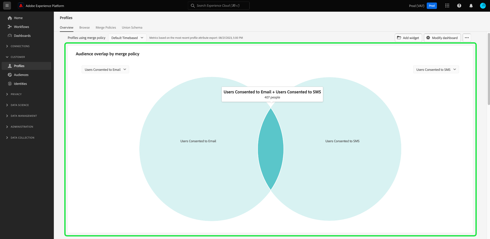

# Analys och spårning av samtycke

I dagens marknadsföringslandskap måste ni förstå och respektera kundernas önskemål om samtycke. Adobe Real-time Customer Data Platform ger marknadsförarna möjlighet att analysera kundernas samtycke för att bygga förtroende, följa sekretessregler och leverera mer personaliserade upplevelser.

Det här dokumentet innehåller information om hur du skapar en kontrollpanel för godkännande för olika användningsfall för marknadsföring för Real-Time CDP-data. Det handlar främst om hur man skapar en målgrupp med de attribut som passar ert företag bäst, och sedan får insikt genom att använda förkonfigurerade widgetar i Adobe Experience Platform användargränssnitt. Ett annat sätt att skapa en egen anpassad widget med den användardefinierade funktionen för instrumentpaneler visas också.

## Användningsfall {#use-cases}

De användningsfall som behandlas i den här handboken är samtyckettrender och sammandragsöverlappning.

- **Konventionstrender** spårar hur användarens samtycke har utvecklats över tid. Genom att analysera ändringar i medgivandeinställningarna kan marknadsförarna planera och köra kampanjer som anpassar sig till de ändringar som görs i användarinställningarna. Ni kanske till exempel vill köra riktade utbildningskampanjer, öppenhets- och förtroendekampanjer eller stimulanskampanjer för att få till stånd samtycke. Ni kan också korrelera kampanjer som kan ha påverkat samtycke negativt för att proaktivt minska frekvensen för dessa kampanjer.
- **Samtyckesöverlappning** använder överlappningen mellan olika kanaler för samtycke för att leverera enhetliga personaliserade meddelanden i flera kanaler för kunder som har gått med på flera kanaler. Marknadsförarna kan prioritera och tilldela resurser till vissa kanaler där ett högre grad av samtycke och personaliserade meddelanden kan få genklang hos kunderna och generera högre svarsfrekvenser.

<!-- ## Build a consent dashboard {#build-a-consent-dashboard} -->

## Skapa godkända målgrupper {#create-consent-audiences}

Om du vill skapa en kontrollpanel för samtycke måste du först skapa en målgrupp med alla profiler som har gett sitt samtycke till att kontakta. Om du vill navigera till Real-time Customer Data Platform Segment Builder väljer du **[!UICONTROL Audiences]** i den vänstra navigeringen i plattformsgränssnittet. På menyn [!UICONTROL Customer] -fliken i [!UICONTROL Audiences] kontrollpanel, välja **[!UICONTROL Create audience]** längst upp till höger i vyn och sedan **[!UICONTROL Build rules]**.

<!-- Update screenshot below to include Create audience -->s

![The [!UICONTROL Audiences] kontrollpanel med [!UICONTROL Customer], [!UICONTROL Audiences]och [!UICONTROL Create segment] markerad.](../images/insights-use-cases/consent-analysis/create-audience.png)

Segmentbyggaren visas. Nästa, välj **[!UICONTROL XDM Individual Profile]** bland de tillgängliga alternativen. Mer information om [arbetsyta för regelbyggaren](../../segmentation/ui/segment-builder.md#rule-builder-canvas).

![Segment Builder med [!UICONTROL XDM Individual Profile] attributmappen är markerad.](../images/insights-use-cases/consent-analysis/xdm-individual-profile.png)

Leta upp dina medgivandeattribut bland de tillgängliga alternativen. Välj **[!UICONTROL Consents and Preferences]**.

>[!NOTE]
>
>Om du har behållit ditt användargodkännande i ett annat attribut än det som rekommenderas av Adobe måste du välja dessa attribut i stället för de som visas nedan.

Mer information finns på [hantering av samtycke vid segmentering](../../segmentation/consents.md#handling-consent-in-segmentation) dokumentation.

![Segment Builder med [!UICONTROL Consent and Preferences] attributmappen är markerad.](../images/insights-use-cases/consent-analysis/consent-and-preferences.png)

De olika alternativen för samtycke och inställningar visas. I och med att den här demonstrationen fokuserar på samtycke till kontakt via olika marknadsföringskanaler väljer du **[!UICONTROL Marketing Preferences]**.

![Segment Builder med [!UICONTROL Marketing Preferences] mappen är markerad.](../images/insights-use-cases/consent-analysis/marketing-preferences.png)

Listan med marknadsföringsinställningar visas. I det här exemplet fokuserar du på e-post, SMS och samtal, men du kan även skapa insikter för andra kombinationer eller för alla alternativ. Utför följande steg för att skapa en målgrupp för varje kanal.

Om du vill börja konfigurera en målgrupp väljer du **[!UICONTROL Receive SMS]** / **[!UICONTROL Receive email]** / **[!UICONTROL Receive calls]**.

The [!UICONTROL Subscriptions] visas. Välj och dra **[!UICONTROL Choice Value]** till mittrutan och välj sedan önskat värde i listrutan. I det här fallet väljer du **Ja (delta)**. Ange sedan målgruppen efter företagets behov och en användarvänlig beskrivning.

>[!NOTE]
>
>Det finns en mjuk gräns för hur många målgrupper du bör skapa. Mer information finns i [dokumentation om segmenteringsskyddsutkast](https://experienceleague.adobe.com/docs/experience-platform/profile/guardrails.html?lang=en#segmentation-guardrails).

![The [!UICONTROL Choice Value] attributet med [!UICONTROL Yes (opt-in)] det värde som markeras i segmentbyggaren. Namnet på och beskrivningen av målgruppen markeras också.](../images/insights-use-cases/consent-analysis/choice-value.png)

När du har skapat de målgrupper du behöver listas de i [!UICONTROL Audiences] [!UICONTROL Browse] -fliken.

>[!NOTE]
>
>När du skapar en målgrupp måste du vänta på att gruppsegmenteringsjobbet ska slutföras innan data är tillgängliga för att börja bygga din kontrollpanel för samtycke. Gruppsegmentering beskriver processen att flytta alla dina profildata samtidigt genom segmentdefinitionerna för att skapa motsvarande målgrupper. När målgruppen har skapats sparas den och lagras så att du kan exportera och använda den. Batchsegment utvärderas automatiskt var 24:e timme.

## Förvärva insikter {#consume-insights}

Adobe har skapat olika insikter som automatiskt är tillgängliga för dig i panelerna Profiler, Publiker och Destinationer. Alla målgrupper du skapar kan sedan automatiskt användas med dessa förkonfigurerade insikter. I dokumentationen för standardwidgeten finns en lista med de insikter som finns i [Profiler](../guides/profiles.md#standard-widgets), [Målgrupper](../guides/audiences.md#standard-widgets)och [Destinationer](../guides/destinations.md) instrumentpaneler.

## Målgruppsöverlappning {#audience-overlap}

Lägg till [!UICONTROL Audience overlap by merge policy] till din profilkontrollpanel och välj önskade målgrupper i listrutorna. I dokumentationen finns instruktioner om hur du lägger till en widget på instrumentpanelen i [*Målgruppsöverlappning efter sammanfogningspolicy*](../guides/profiles.md#audience-overlap-by-merge-policy) om du vill ha mer information om insikterna.

<!-- Image needs updating to night mode -->

Du kan visa överlappningen mellan alla målgrupper där användare har samtyckt till att ta emot samtal över alla andra målgrupper, med rapporten om publiköverlappning på kontrollpanelen Publiker. Om du vill visa överlappningen mellan olika grupper av medgivande går du först till [!UICONTROL Audiences] [!UICONTROL Overview] -fliken. Därifrån kan du lägga till [!UICONTROL Audience overlap report] widgeten till kontrollpanelen Publiker. När widgeten har skapats väljer du **[!UICONTROL User consented to calls]** från översikten över publiken i listrutan längst upp på sidan. Nästa, välj **[!UICONTROL View more]** i rapportwidgeten för publiköverlappning för att se upp till 50 av de översta överlappningarna och upp till 50 av de minsta överlappningarna för det valda segmentet.

<!-- Image needs updating to night mode -->

Dialogrutan för publiköverlappningsrapport utökas för att visa ytterligare data om överlappande målgrupper.

<!-- Image needs updating to night mode -->

## Målgruppsstorlekstrender {#audience-size-trends}

När ni skapar en målgrupp som bygger på samtycke trender automatiskt upp till 12 månader efter det datum ni skapade målgruppen. Om du vill ha en fullt funktionell trend för kundens samtycke lägger du till följande widgetar i [!UICONTROL Segments] [!UICONTROL Overview] sida. Dessa insikter är ett kraftfullt sätt att spåra hur ditt samtycke förändras över tid. De korrelerar till och med med med kampanjer som ni kör parallellt och som kan påverka samtycke positivt eller negativt. De beskrivningar som finns för dessa widgetar gäller för ett fall där samtycke ges.

- [Trend för målgruppsstorlek](../guides/audiences.md#audience-size-trend): Den här widgeten är ett sätt att spåra hur ditt respektive samtycke har ändrats över tid.
- [Förändring av målgruppsstorlek](../guides/audiences.md#audience-size-change-trend): Den här widgeten spårar hur kundens samtycke har ändrats dagligen. Om antalet kunders samtycke till exempel har minskat med 100 000 kan du se hur förändringen har skett dagligen.
- [Målgruppsstorlekstrend efter identitet](../guides/audiences.md#audience-size-trend-by-identity): Med den här widgeten kan du spåra hur ditt respektive samtycke har ändrats över tid, men ytterligare filtreras efter en viss identitet, till exempel ett e-postmeddelande.

<!-- Image needs updating to night mode -->

## Kontrollpanel för publiköversikt {#audiences-overview-dashboard}

När du har skapat en målgrupp som arbetar med samtycke, till exempel&quot;Användare som har samtyckt till SMS&quot;, kan du visa viktig personlig information om din målgrupp genom att lägga till lämpliga widgetar på kontrollpanelen Publiköversikt. Navigera till [!UICONTROL Audiences] [!UICONTROL Overview] och lägga till de widgetar du valt från widgetbiblioteket. Alla widgetar som läggs till i din vy av kontrollpanelen kan storleksändras och flyttas med [!UICONTROL Modify dashboard] -funktion. Den personaliserade vyn kan innehålla insikter som trenden över tid (upp till 12 månader), överlappningen med andra målgrupper och målgruppens identitetssammansättning. En exempelvy visas nedan.

## Användardefinierade kontrollpaneler {#usr-defined-dashboards}

Du kan också bygga ut egna widgetar med användardefinierade instrumentpaneler. När du skapar en egen widget får du fullständig kontroll över typen av widget, tillsammans med flexibilitet att lägga till filter och mycket annat, direkt i Adobe Real-Time CDP.

Om du t.ex. vill skapa en trend för flera olika grupper av samtycke i samma diagram så att du med tiden kan se hur var och en av dina inställningar för samtycke har ändrats. Den här typen av visualisering är möjlig med användardefinierade kontrollpaneler med minimala steg och en engångskonfiguration. Först väljer du **[!UICONTROL Dashboards]** i den vänstra navigeringen. The [!UICONTROL Dashboards] visas. Välj sedan **[!UICONTROL Create dashboard]**. Fullständiga anvisningar om hur man [skapa en kontrollpanel och anpassad widget](../user-defined-dashboards.md) finns i handboken för användardefinierade kontrollpaneler.

När du [välj datamodell](../user-defined-dashboards.md#select-data-model) i widgetdispositionen väljer du `CDPInsights` följt av **[!UICONTROL Next]**. The [!UICONTROL Select table] visas.

I nästa vy visas en lista med tillgängliga tabeller i den vänstra listen. Markera `adwh_fact_profile_by_segment_and_namespace_trendlines`.

Utför stegen nedan när widgetens disposition har fyllts i med data från den tabell du har valt:

- [Sök [!UICONTROL Attributes]](../user-defined-dashboards.md#add-filter-attributes) for `[!UICONTROL date]`använder du ikonen + för att lägga till `[!UICONTROL date]` till X-axeln i listrutan.
  
- Sök [!UICONTROL Attributes] for `[!UICONTROL count_of_profiles]`använder du ikonen + för att lägga till `[!UICONTROL count_of_profiles]` på Y-axeln i listrutan.
- Välj `...` (ellipser) i [!UICONTROL Y-axis] välj sedan [!UICONTROL SUM] sammanställningsfunktion på den nedrullningsbara menyn.
  
- Välj [!UICONTROL Marks] och ändra diagramtypen till [!UICONTROL Line].
- Sök [!UICONTROL Attributes] för `[!UICONTROL segment_name]`använder du ikonen + för att lägga till `segment_name` som [!UICONTROL Filter] i listrutan. The [!UICONTROL Filter: Segment_name] visas. Välj målgrupper som skapats tidigare och som hör till samtycke. I detta exempel väljer du **[!UICONTROL Users Consented to Calls]**, **[!UICONTROL Users Consented to SMS]** och **[!UICONTROL Users Consented to Email]**, följt av **[!UICONTROL Apply]**.
- Sök [!UICONTROL Attributes] for `[!UICONTROL segment_name]`markerar du ikonen + för att lägga till `segment_name` som [!UICONTROL Color] i listrutan.
- Öppna [den [!UICONTROL Properties] panel](../user-defined-dashboards.md#widget-properties) och tillhandahålla lämpliga [!UICONTROL Widget title] och [!UICONTROL Axis label].
  
- Välj **[!UICONTROL Save and close]** för att bekräfta inställningarna.

>[!TIP]
>
>Du kan nu ändra storlek på eller flytta widgeten till önskad storlek och position innan du sparar kontrollpanelen.

Bilden nedan visar hur den färdiga widgeten visas och andra anpassade insikter. Mer information om vilka typer av widgetar som kan skapas finns i [dokumentation om datamodell](../cdp-insights-data-model.md).

<!-- The diagram shows straight lines due to a lack of data, however in your environment the trends will reflect the actual changes over time. -->

## Spåra policyer för samtycke {#consent-policies}

Instrumentpaneler för samtycke som du skapar fångar upp **Endast distribution av samtycke och förmånsattribut**.

>[!NOTE]
>
>För kunder som **Adobe Healthcare Shield** eller **Adobe Privacy &amp; Security Shield**, dessa instrumentpaneler **inte** återspegla all spårning av medgivandepolicyer. Tillgänglig spårning omfattar antalet profiler som skapats, aktiverats och påverkan på målgruppsmedlemskapet.

## Nästa steg

Genom att läsa det här dokumentet har du lärt dig hur du bygger kontrollpaneler för en heltäckande bild av dina kunders önskemål om samtycke med hjälp av Real-Time CDP insikter. Det här dokumentet visar hur Real-Time CDP ger en robust lösning för dagens sekretessinriktade landskap där insamling, segmentering, analys och personaliserade marknadsföringskampanjer baserade på medgivandedata är avgörande för marknadsförarna.
