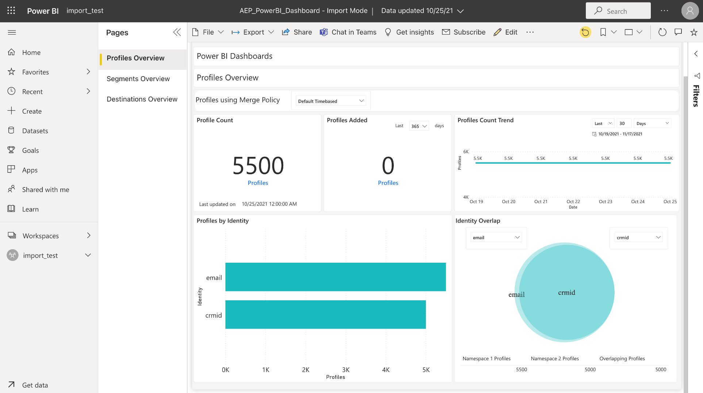

# Power BI-rapportmallar för instrumentpaneler

Med rapportmallsfunktionen i Power BI kan du skapa övertygande rapporter med data från Adobe Experience Platform. Den smidiga installationsprocessen installerar automatiskt standardwidgetar för kundprofil, segmentering och mål i realtid. Installationen kopplar även Power BI till dina datamodeller så att du enkelt kan anpassa och utöka rapportmallarna. Dessa rapporter kan delas av hela organisationen utan att mottagarna behöver autentiseringsuppgifter för din organisation på Platform.

Det här dokumentet innehåller anvisningar om hur du ansluter Adobe Experience Platform till Power BI-programmet och använder rapportmallar för att dela viktiga plattformsdata med externa användare.

## Komma igång

Innan du fortsätter med den här självstudiekursen bör du ha god förståelse för [schemakomposition](../../xdm/schema/composition.md) i Experience Platform och hur attribut inkluderas i kundprofilen i realtid via [unionsschemat](../../xdm/schema/composition.md#union).

För att installera integreringen av Power BI-programmet måste användarna först ha fått följande plattformsbehörigheter:

- Hantera frågor
- Hantera sandlådor

Läs dokumentationen för [åtkomstkontrollen](../../access-control/home.md) om du vill lära dig hur du tilldelar dessa behörigheter.

Du måste också ha ett Power BI-konto för att kunna följa den här självstudiekursen. Om du vill skapa ett konto går du till [Power BIETS hemsida](https://powerbi.microsoft.com/en-us/) och följer registreringsprocessen. Användare för det här Power BI-kontot måste även aktivera inställningen **Skapa arbetsyta** i sina Power BI-inställningar. Den här inställningen finns i klientinställningarna för Power BI-administratörsportalen. Om ditt konto tillhandahålls av din klientorganisation eller arbetsgivare, kontaktar du respektive administratör för att aktivera den här inställningen.

>[!NOTE]
>
>Om du vill att fliken Kontrollpaneler ska visas i den vänstra navigeringen i plattformsgränssnittet, och att vyn Instrumentpanelsinventering ska visas, måste du ha tillgång till någon av kontrollpanelerna Profil, Segmentering eller Destination som en del av din plattformslicens.

## Installera programintegrering för Power BI

I plattformsgränssnittet väljer du **[!UICONTROL Dashboards]** i den vänstra navigeringen för att öppna arbetsytan i [!UICONTROL Dashboards]. Fliken [!UICONTROL Browse] visar en lista över tillgängliga instrumentpanelsvyer. Mer information om hur du visar tillgängliga instrumentpaneler finns i [lagerdokumentationen](../inventory.md).

Välj sedan fliken **[!UICONTROL Integrations]**. Integreringssidan för Power BI-programmet visas. Här väljer du **[!UICONTROL Install]** för att påbörja installationen.

>[!NOTE]
>
>Knappen [!UICONTROL Install] är inaktiverad om du inte har både behörighet för att hantera frågetjänster och hantera sandlådor.

### Ange autentiseringsuppgifter

Det första steget i installationsprocessen är att ange autentiseringsuppgifter som inte upphör att gälla för integrering av Power BI-program. Det finns två tillgängliga alternativ för att tillhandahålla dessa: [[!UICONTROL Create new credentials]](#create-new-credentials) eller [[!UICONTROL Use existing credentials]](#use-existing-credentials). Välj lämplig växel för att fortsätta.

#### Skapa nya autentiseringsuppgifter {#create-new-credentials}

Det finns två obligatoriska fält när nya autentiseringsuppgifter genereras: [!UICONTROL Name] och [!UICONTROL Assigned to]. Fältet [!UICONTROL Assigned to] är relaterat till den e-postadress som är associerad med ditt Power BI-konto.

>[!IMPORTANT]
>
>Om du vill skapa autentiseringsuppgifter som inte förfaller måste du ha vissa behörigheter och roller tilldelade. Behörigheterna som krävs är Hantera sandlådor och Hantera integrering av frågetjänster. Rollerna som krävs är Adobe Experience Platform admin- och utvecklarroller. Läs dokumentationen för [åtkomstkontrollen](../../access-control/home.md) om du vill lära dig hur du tilldelar dessa behörigheter.

Mer information om hur du genererar autentiseringsuppgifter för frågetjänsten som inte upphör att gälla finns i handboken [för icke-förfallande autentiseringsuppgifter](../../query-service/ui/credentials.md#non-expiring-credentials).

När du har genererat icke-förfallande autentiseringsuppgifter för första gången hämtas en JSON-fil till den datorn. Den här JSON-filen kan sedan delas med andra användare som autentiseringsuppgifter för att slutföra installationsprocessen.

#### Använd befintliga autentiseringsuppgifter {#use-existing-credentials}

En JSON-autentiseringsfil kan också överföras för att validera. Dessa JSON-filer som innehåller autentiseringsuppgifter som inte upphör att gälla hämtas till den lokala datorn som används när en autentiseringsuppgift som inte upphör att gälla skapas.

>[!IMPORTANT]
>
>Användaren måste ha tilldelats en autentiseringsuppgift för att kunna använda en befintlig referens som inte förfaller. Om användaren inte har tilldelats någon autentiseringsuppgift och inte kan skapa en ny med Adobe Admin Console, kan användaren inte fortsätta med installationsprocessen.

Välj **[!UICONTROL Upload credential file]** och välj sedan den JSON-fil som ska överföras i den dialogruta som visas.

När du har angett inloggningsuppgifterna som inte upphör att gälla valideras de automatiskt av Platform. Ett bekräftelsemeddelande visas när valideringen har slutförts. Välj **[!UICONTROL Next]** om du vill granska medgivandeavtalet för Power BI-programmet.

### Ge medgivande

Medgivande visas. Välj **[!UICONTROL Review consent]** om du vill öppna ett nytt fönster med information om de behörigheter som krävs för att Power BI ska få tillgång till och använda dina data enligt användarvillkoren och sekretesspolicyn.

Välj **[!UICONTROL Accept]** om du vill ge Power BI behörighet att komma åt och använda dina plattformsdata.

>[!NOTE]
>
>Om du avslutar installationsprocessen någon gång innan du ger ditt medgivande kommer Power BI-programintegreringen inte att installeras i instrumentpanelsinventeringen.

Efter att ha gett sitt samtycke installeras rapportmallen automatiskt i Power BIET-miljön som en del av installationsprocessen. Power BI använder sedan de icke-förfallande autentiseringsuppgifterna för att få åtkomst till Platform, sekventiellt köra alla SQL-frågor och fylla i rapportmallen med returnerade data.

Välj **[!UICONTROL Finish]** om du vill återgå till instrumentpanelsinventeringen.

Nu när rapportmallen för Power BI är installerad visas den i listan över tillgängliga instrumentpaneler på fliken [!UICONTROL Browse]. Välj **[!UICONTROL Power BI]** i listan för att gå till Power BIET-miljön.

>[!IMPORTANT]
>
>Power BI-administratörer måste se till att användarna har behörighet att visa dessa instrumentpaneler i Power BI-miljön.

## Power BI, arbetsyta

När du har loggat in på [arbetsytan för Power BI](https://dxt.powerbi.com) är rapportmallar tillgängliga för alla tjänster som du har åtkomst till. Rapportmallarna innehåller profiler, segment och målkontrollpaneler **endast** om de har motsvarande visningsbehörigheter.

Standardwidgetar från profiler, segment och mål är som standard tillgängliga i Power BI-mallrapporter.

>[!NOTE]
>
>Du måste ha redigeringsbehörighet aktiverad för en viss instrumentpanel för att den instrumentpanelen ska kunna installeras i Power BI-miljön.

När en kontrollpanel har installerats i Power BI visas rapportmallar som standard för alla användare. Om du vill begränsa åtkomsten till rapportmallar måste du se till att inaktivera åtkomsten för användarna i fråga inifrån Power BIET-miljön.

## Anpassa rapportmallen för Power BI

Genom att använda anpassade widgetar kan du lägga till anpassade attribut i din datamodell för att förbättra rapportmallarna från Power BI.

>[!NOTE]
>
>Vilka attribut du kan använda för anpassade widgetar beror på vad som är tillgängligt i unionsschemat. Om du vill lära dig hur du visar och utforskar unionens scheman till förmån för dina anpassade widgetar kan du läsa användargränssnittsguiden för [unionens schema](../../profile/ui/union-schema.md).

### Skapa en anpassad widget

Anpassade widgetar skapas via widgetbiblioteket. En introduktion till funktionen och självstudiekursen [för att skapa en anpassad widget](../customize/custom-widgets.md) finns i [Översikt över widgetbiblioteket](../customize/widget-library.md).

>[!IMPORTANT]
>
>De nya anpassade widgetarna synkroniseras **inte** automatiskt mellan Adobe Experience Platform-kontrollpaneler och rapportmallarna för Power BI. Alla anpassade widgetar som skapas i plattformsgränssnittet måste återskapas manuellt i Power BI-miljön.

### Återskapa din anpassade widget i Power BI-miljön

När kontrollpanelen har rätt mått och attribut i anpassade widgetar kan du ändra rapportmallen som visas i Power BI-miljön. I [Power BI-dokumentationen](https://docs.microsoft.com/en-us/power-bi/) finns mer information om hur du redigerar en rapport via dess användargränssnitt.

## Ta bort integrering med Power BI-program

Om du vill ta bort instrumentpanelen går du till instrumentpanelens inventering och väljer borttagningsikonen () bredvid instrumentpanelens namn.

>[!NOTE]
>
>Det är bara den användare som installerade Power BI-kontrollpanelen som kan ta bort integreringen från plattformens användargränssnitt.

En bekräftelsepover visas. Välj **[!UICONTROL Delete]** för att bekräfta processen.

>[!IMPORTANT]
>
>Om du tar bort Power BI-kontrollpanelen från plattformsgränssnittet tas **inte** rapportmallarna som finns i Power BIET bort. Om du vill ta bort all information som finns i rapportmallarna för Power BI måste du logga in på ditt Power BI-konto och ta bort rapportmallarna från den miljön. När den har tagits bort kan användaren installera om Power BI-kontrollpanelen genom att följa samma installationsanvisningar som beskrivs ovan.

## Nästa steg

Genom att läsa det här dokumentet får du en bättre förståelse för hur Power BI-rapportmallar kan integreras i plattformen för att dela övertygande datainsikter från era profiler, segment eller målpaneler. Se [översikten över anpassning av kontrollpanelen](../customize/overview.md) om du vill veta mer om hur du anpassar dina kontrollpaneler.
