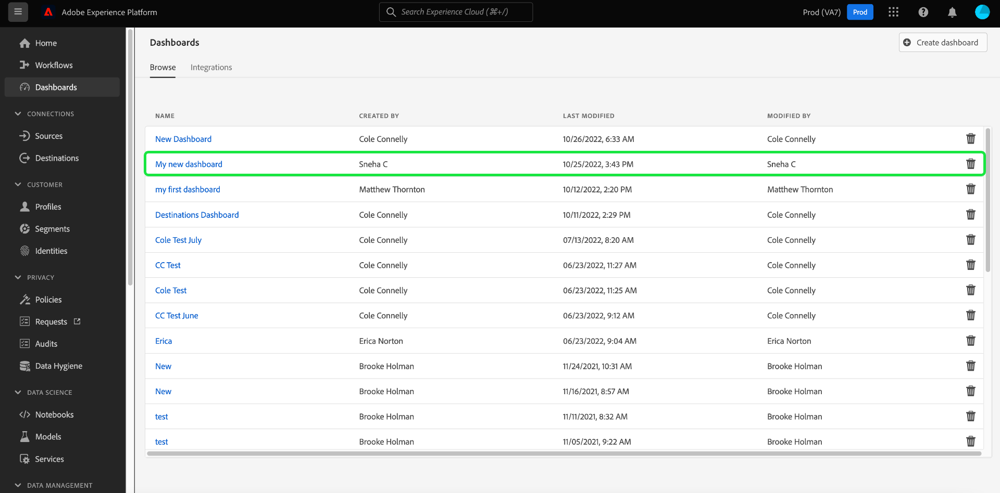

# Visa konfigurerade instrumentpaneler

Om din organisation har flera tillgängliga kontrollpaneler i Adobe Experience Platform kan du granska kontrollpanelens lager i användargränssnittet.

Om du vill visa de instrumentpaneler som din organisation har konfigurerat väljer du **[!UICONTROL Dashboards]** i den vänstra navigeringen och väljer sedan fliken **[!UICONTROL Browse]**.

En lista över alla instrumentpaneler som är tillgängliga på din Experience Platform-instans visas på fliken [!UICONTROL Browse]. Detta inkluderar integrerade kontrollpaneler som skapats av organisationen och som har konfigurerats via tredjepartsprogram.

Du kan visa en enskild kontrollpanel genom att välja namnet på kontrollpanelen i listan.

När du väljer det här alternativet öppnas instrumentpanelen antingen i Experience Platform-gränssnittet eller i en helt integrerad programarbetsyta där du måste logga in med de nödvändiga inloggningsuppgifterna.

## Skapa anpassade instrumentpaneler

Med Adobe Experience Platform Dashboards kan ni skapa och hantera anpassade kontrollpaneler där ni kan skapa, lägga till och redigera anpassade widgetar för att visualisera viktiga nyckeltal som är relevanta för organisationen. I handboken [för användardefinierade kontrollpaneler](./standard-dashboards.md) finns fullständiga anvisningar om hur du skapar och konfigurerar anpassade kontrollpaneler.
