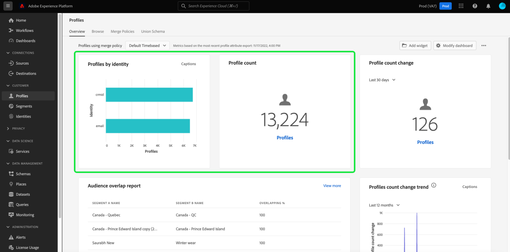

# (Beta) Ändra instrumentpaneler {#modify-dashboards}

>[!IMPORTANT]
>
>Instrumentpanelsfunktionen är för närvarande i betaversion och är inte tillgänglig för alla användare. Dokumentationen och funktionaliteten kan komma att ändras.

I Adobe Experience Platform användargränssnitt kan du visa och interagera med organisationens data via flera kontrollpaneler. Standardwidgetar och standardmått som visas på kontrollpanelerna kan justeras på en enskild användarnivå för att visa önskade data och widgetar som kan skapas och delas mellan användare i samma organisation.

Den här guiden innehåller stegvisa instruktioner för hur instrumentpanelsdata visas på kontrollpanelerna [!UICONTROL Profiles], [!UICONTROL Segments] och [!UICONTROL Destinations] i plattformsgränssnittet.

>[!NOTE]
>
>Widgetarna som visas på kontrollpanelen för licensanvändning kan inte anpassas. Mer information om den här unika kontrollpanelen finns i dokumentationen [för kontrollpanelen för licensanvändning](guides/license-usage.md).

## Komma igång

Från en kontrollpanel (till exempel kontrollpanelen [!UICONTROL Profiles]) kan du välja **[!UICONTROL Modify dashboard]** för att ändra storlek på och ordna om befintliga widgetar.

## Ordna om widgetar

När du har valt att ändra kontrollpanelen kan du ändra ordningen på widgetarna genom att markera widgetens rubrik och dra och släppa widgetarna i önskad ordning. I det här exemplet flyttas widgeten **[!UICONTROL Profiles by identity namespace]** till den översta raden och widgeten [!UICONTROL Profile Count] visas nu på den andra raden.

## Ändra storlek på widgetar

Du kan också ändra storlek på en widget genom att markera vinkelsymbolen i det nedre högra hörnet av widgeten (`⌟`) och dra widgeten till önskad storlek. I det här exemplet ändras storleken på **[!UICONTROL Profiles by identity namespace]**-widgeten så att den fyller hela den översta raden och de andra widgetarna flyttas automatiskt till den andra raden. Observera hur den vågräta axeln justeras för att ge mer detaljerade steg när widgeten blir större.

>[!NOTE]
>
>När widgetarna anpassas i storlek flyttas de omgivande widgetarna dynamiskt. Detta kan medföra att vissa widgetar flyttas till ytterligare rader, vilket kräver att du rullar för att se alla widgetar.

## Spara uppdateringar av instrumentpanelen

När du har flyttat och ändrat storlek på widgetar väljer du **[!UICONTROL Save]** för att spara ändringarna och återgå till huvudinstrumentpanelsvyn. Om du inte vill behålla ändringarna väljer du **[!UICONTROL Cancel]** för att återställa instrumentpanelen och återgå till huvudinstrumentpanelsvyn.

## Widget-bibliotek

Förutom att ändra storlek och ordna om widgetar kan du i kontrollpanelerna [!UICONTROL Profiles] och [!UICONTROL Segments] välja fler widgetar att visa eller skapa widgetar med **[!UICONTROL Widget library]**.

Stegvisa instruktioner om hur du får åtkomst till och arbetar med [!UICONTROL Widget library] finns i [widgetens bibliotekshandbok](widget-library.md).

## Nästa steg

När du har läst det här dokumentet har du lärt dig hur du använder funktionen för att ändra ordning på och ändra storlek på widgetar för att anpassa instrumentpanelsvyn. Läs [widgetbibliotekshandboken](widget-library.md) om du vill lära dig hur du skapar och lägger till widgetar på dina instrumentpaneler.
