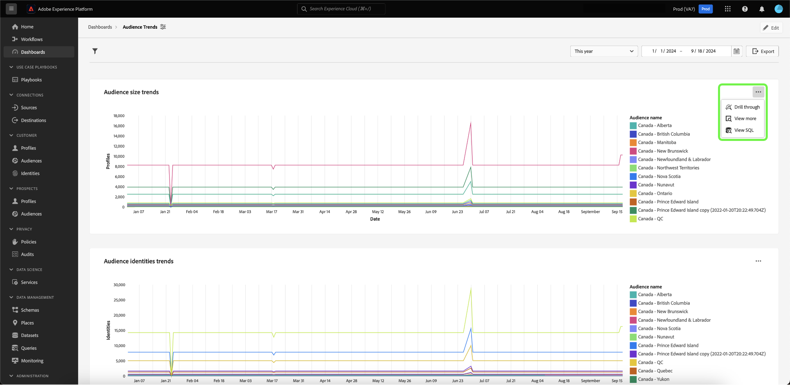

# Detaljgranska {#drill-through}

Detaljgranskning underlättar dataanalys på flera nivåer genom att göra det enkelt att navigera mellan diagram och nya kontrollpaneler. Den här funktionen gör det enkelt att gå över från översikter på hög nivå till djupgående rapporter när du studerar trender, kundbeteende, operativa indikatorer med mera, så att du alltid har det sammanhang du behöver.

Systemet ser till att den analys du påbörjar smidigt fortsätter genom hela arbetsytan genom att automatiskt skicka globala filter och datumintervallfilter från källinstrumentpanelerna till målinstrumentpanelerna. För att underlätta navigeringen mellan olika lager i studien tillåter systemet borrning på flera nivåer.

## Skapa en genomgång {#create-drill-through}

Om du vill skapa en genomgång väljer du först **[!UICONTROL Edit]** i instrumentpanelsvyn.

Markera ellipsen i diagrammet som du vill gå igenom och välj sedan **[!UICONTROL Edit]**.

Använd växlingsknappen på panelen [!UICONTROL Properties] för att aktivera **[!UICONTROL Enable drill through]** och använd sedan listrutan för att välja **[!UICONTROL Target dashboard]**. Kontrollera att växlingsknappen för **[!UICONTROL Filter pass-through]** är aktiverad och välj sedan **[!UICONTROL Save and close]**.

>[!INFO]
>
>Upprepa stegen ovan för målkontrollpanelen för att konfigurera en detaljnivå på flera nivåer.

## Visa en genomgång {#view-drill-through}

Om du vill visa en genomgång väljer du ellipser i diagrammet från instrumentpanelsvyn och sedan **[!UICONTROL Drill through]**.

Detaljnivån på målkontrollpanelen visas. Du kan upprepa det här steget om du har flera nivåers detaljnivåer.

>[!NOTE]
>
>Alla filter som tillämpas på källkontrollpanelen skickas till målkontrollpanelen. Datumfilter och globala filter är dock inaktiverade på underordnade instrumentpaneler.

## Ta bort en genomgång {#remove-drill-through}

Om du vill ta bort en fördjupning väljer du först **[!UICONTROL Edit]** i instrumentpanelsvyn.

Markera ellipsen i diagrammet som du vill ta bort en fördjupning genom och välj sedan **[!UICONTROL Edit]**.

På panelen [!UICONTROL Properties] markerar du växlingsknappen för att inaktivera **[!UICONTROL Enable drill through]** och väljer sedan **[!UICONTROL Save and close]**.

![Panelen Diagramegenskaper med växlingen inaktiverad för [!UICONTROL Enable drill through] markerad.](../images/sql-insights-query-pro-mode/drill-through-disable.png)

## Nästa steg

När du har läst det här dokumentet vet du nu hur du skapar en genomgång för din instrumentpanel. Du kan också lära dig hur du genererar diagram från befintliga datamodeller i Adobe Experience Platform-gränssnittet med hjälp av [guiden för guidat designläge](../standard-dashboards.md).
