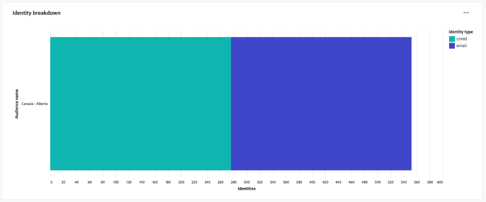

# Målgruppsidentitetsöverlappningar

Analysera identitetsöverlappningar för valda målgrupper med kontrollpanelen [!UICONTROL Audience Identity Overlaps]. Ni kan använda insikter om hur olika identiteter inom en målgrupp relaterar till varandra för att optimera stygsstrategier, minska redundansen och förbättra kundsegmenteringens precision. Utveckla effektiva strategier för målinriktning och effektivisera kundinteraktionen med en förbättrad förståelse för hur identitetstyperna överlappar varandra.

## Filtrera målgrupper {#filter-audiences}

Använd anpassade filter för riktad analys av specifika målgrupper och identitetstyper för att säkerställa att de data som presenteras överensstämmer med era analysmål. Starta analysen genom att välja filterikonen ().

Dialogrutan **[!UICONTROL Filters]** visas. I den här vyn väljer du de globala filtren för att konfigurera målgruppen, sammanfogningsprincipen och identiteterna för jämförelse. Välj inställningar för analys i listrutan för varje avsnitt

1. Välj en **[!UICONTROL Audience]**: Välj det målgruppssegment som du vill analysera (till exempel **Kanada - Alberta**).
2. Ange en **[!UICONTROL Merge Policy]**: Definiera sammanfogningspolicyn som anger hur identiteter kombineras över den valda målgruppen (i exempelskärmbilden är principen **Standardtidsbaserad** vald).
3. Välj en **[!UICONTROL Identity A]** och **[!UICONTROL &#x200B; Identity B]** för jämförelse&#x200B;**: Välj de två identitetstyperna som ska jämföras. I exemplet har &#x200B;** Identitet A **&#x200B; valts som &quot;crmId&quot; och &#x200B;** Identitet B** har valts som &quot;e-post&quot;.
4. **Ange ett datumintervall**: Välj ett fördefinierat intervall som Today eller ange start- och slutdatum manuellt med hjälp av kalenderfälten.

>[!TIP]
>
>Om du vill ta bort alla egna globala filter väljer du **[!UICONTROL Clear all]** i dialogrutan [!UICONTROL Filters]. Om du vill ta bort ett enda filter markerar du [!UICONTROL X] till höger om filternamnet.

När du har valt filter väljer du **[!UICONTROL Apply]** för att uppdatera instrumentpanelen.

## Tillgängliga instrumentpanelsinsikter {#available-insights}

Kontrollpanelen **Överlappning av publikidentiteter** innehåller flera visualiseringar och tabelldata som hjälper dig att förstå identitetsöverlappningar och -trender inom din målgrupp.

### Målgruppsidentitetsöverlappningar {#overlaps-table}

Tabellen **[!UICONTROL Audience Identity Overlaps]** visar identitetsöverlappningar baserat på de valda filtren. Använd den här informationen för att bedöma överlappningen mellan olika identitetstyper och förstå hur effektiva identiteter är. Tabellen nedan förklarar varje kolumn i detalj:

| Kolumnnamn | Beskrivning |
|-----------------|-------------------------------|
| **[!UICONTROL Audience Name]** | Namnet på den målgrupp som analyseras. Den här kolumnen identifierar vilket målgruppssegment som är under granskning för att säkerställa att insikterna fokuseras på den avsedda målgruppen. |
| **[!UICONTROL Identity A]** och **[!UICONTROL Identity B]** | Identiteterna som jämförs (till exempel `crmId` och `email`). Genom att veta vilka identitetstyper som jämförs kan ni identifiera vilka strategier för identitetsupplösning som bidrar till att publiken överlappar varandra och optimera dessa relationer. |
| **[!UICONTROL Overlap Count]** | Antalet profiler där båda identiteterna finns. Det här måttet ger insikter om omfattningen av identitetsöverlappning inom målgruppen. Denna information är avgörande för att man ska kunna utvärdera hur effektivt flera identiteter löses in i enhetliga profiler, vilket i sin tur kan förbättra inriktnings- och personaliseringsstrategier. |
| **[!UICONTROL Identity A Count]** | Det totala antalet profiler i den valda målgruppen som innehåller **ID:t A**. Använd den här informationen för att förstå förekomsten av den primära identitetstypen inom målgruppen och bedöma dess roll i överlappningsanalysen. |

### Uppdelning efter identitet {#identity-breakdown}

Diagrammet **[!UICONTROL Identity Breakdown]** visar den relativa sammansättningen av identiteter inom den valda målgruppen. X-axeln representerar det totala antalet identiteter inom den valda målgruppen, medan Y-axeln representerar det målgruppsnamn som analyseras. Använd den här visualiseringen för att förstå förekomsten av varje identitetstyp och utvärdera effekten av er strategi för identitetshantering. Diagrammet skiljer mellan olika identitetstyper med hjälp av distinkta färger, vilket ger en snabb översikt av hur identiteter fördelas mellan olika målgrupper.

>[!TIP]
>
>Håll pekaren över kolumnerna för att se antalet profiler för varje identitetstyp.

### Målgruppsidentitetstrender {#audience-identity-trends}

Diagrammet **[!UICONTROL Audience Identity Trends]** ger insikter om hur det totala antalet identiteter har ändrats över tid. X-axeln representerar det datumintervall som analyseras, medan Y-axeln representerar det totala antalet identiteter per målgrupp. Använd det här måttet för att spåra identitetstillväxt, utvärdera stabilitet och mäta effektiviteten i pågående åtgärder för identitetshantering.

>[!TIP]
>
>Håll pekaren över ett datum i diagrammet för att se det totala antalet identiteter för publiken på ett visst datum.

## Exportera insikter {#export-insights}

När du har analyserat identitetsöverlappningar kan du exportera data för offlineanalys eller rapportering. Om du vill exportera dina data väljer du **[!UICONTROL Export]** längst upp till höger i tabellen. Dialogrutan Skriv ut PDF öppnas så att du kan spara visualiserade data som PDF eller skriva ut dem.

Kontrollpanelen **Identitetöverlappning** ger viktiga insikter i hur olika identiteter korsar de valda målgrupperna. Genom att utnyttja dessa insikter kan du förfina strategierna för identitetssammanfogning, minska redundansen och se till att målgruppssegmenteringen är mer exakt och effektiv.

## Nästa steg

När du har läst det här dokumentet har du lärt dig att få värdefulla insikter i identitetsöverlappningar för utvalda målgrupper med hjälp av **Audience Identity Overlaps**-instrumentpanelen. Om du vill få en ännu bättre förståelse för målgruppssegmentering och identitetshantering kan du utforska andra Data Distiller-mallar som ger dig omfattande insikter. Se användargränssnittsguiderna [Publiktrender](./trends.md), [Publikjämförelse](./comparison.md) och [Avancerade målgrupper överlappar](./overlaps.md) för att fortsätta förbättra dina strategier för inriktning och engagemang.

