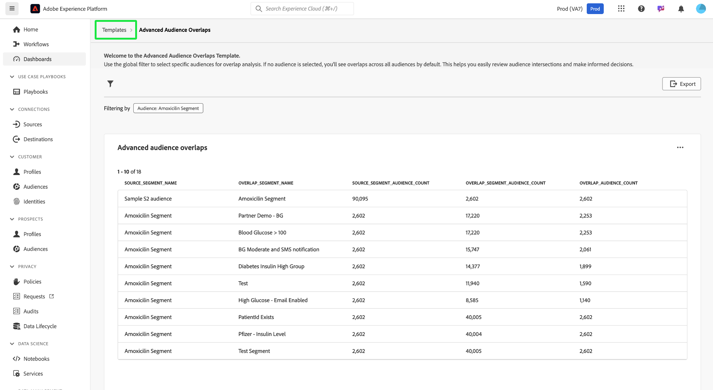

# Avancerade målgruppsöverlappningar

Få värdefulla insikter för att optimera målgruppssegmenteringen och målinriktningsstrategierna genom att analysera hur olika målgruppssegment korsar kontrollpanelen [!UICONTROL Advanced Audience Overlaps]. Granska tabellmätvärdena för att identifiera överlappningar, förfina segmenteringen och minska redundanta meddelanden. I slutändan kan ni använda dessa insikter för att skapa mer målinriktade kampanjer och effektiva marknadsföringssatsningar. På den här kontrollpanelen kan ni granska målgruppssnitt, använda filter och utföra detaljerad överlappningsanalys för att fatta datadrivna beslut och förbättra engagemangsresultaten.

## Filtrera målgrupper {#filter-audiences}

Om du vill filtrera specifika målgrupper för överlappningsanalys väljer du filterikonen () för att öppna dialogrutan [!UICONTROL Filter]. Härifrån kan du lägga till eller ta bort målgrupper från överlappningsmallen för att förfina analysen.

Dialogrutan [!UICONTROL Filters] visas. Om du vill välja en målgrupp för överlappningsanalys väljer du ett målgruppsnamn i listrutan **[!UICONTROL Audience]**. Namnet på den målgrupp du lägger till visas med en tagg under listrutan. När du har lagt till X kan du markera det efter deras namn för att ta bort dem. Om du vill ta bort alla använda filter väljer du **[!UICONTROL Clear all]**.

## Använda filter {#applied-filters}

När ett filter har använts ([!UICONTROL Amoxicilin Segment] i skärmbildsexemplet) begränsas de visade målgruppsdata. Eventuella ytterligare målgrupper som du väljer att lägga till visas bredvid taggen [!UICONTROL Filtering by] ovanför diagrammet [!UICONTROL Advanced Audience overlaps].

## Avancerad målgruppsöverlappningstabell {#advanced-audience-overlaps-table}

Huvudavsnittet på kontrollpanelen visar tabellen [!UICONTROL Advanced Audience Overlaps], som innehåller en detaljerad jämförelse av målgruppsöverlappningar mellan olika segment. Tabellkolumnerna är följande:

| Kolumnnamn | Beskrivning |
|------------------------------------|----------------------------------------------------------------------------------------------|
| **[!UICONTROL Source_Segment_Name]** | Den ursprungliga målgrupp som analyseras (till exempel&quot;Amoxicilin Segment&quot;). |
| **[!UICONTROL Overlap_Segment_Name]** | Den målgrupp vars överlappningar jämförs med (t.ex. &quot;Blood Glukos > 100&quot;). |
| **[!UICONTROL Source_Segment_Audience_Count]** | Det totala antalet profiler för källmålgruppen. |
| **[!UICONTROL Overlap_Segment_Audience_Count]** | Storleken på den överlappande målgruppen, som varierar beroende på överlappningen. |
| **[!UICONTROL Overlap_Audience_Count]** | Storleken på den faktiska överlappande målgruppen mellan källan och överlappande målgrupper. |

{style="table-layout:auto"}

## Exportera insikter {#export-insights}

När ni har filtrerat och analyserat målgrupperna kan ni exportera data för vidare offlineanalys eller rapportering. Om du vill exportera dina insikter väljer du **[!UICONTROL Export]** längst upp till höger i tabellen. Dialogrutan Skriv ut PDF öppnas så att du kan spara data som PDF eller skriva ut dem.

Om du vill återgå till översikten [!UICONTROL Template] väljer du **[!UICONTROL Templates]**.

## Nästa steg

När du har läst det här dokumentet har du lärt dig att analysera målgruppsskärningar och fatta datadrivna beslut med kontrollpanelen **[!UICONTROL Advanced Audience Overlaps]**. Om du vill optimera era strategier för målgruppssegmentering och målinriktning ytterligare kan du utforska andra Data Distiller-mallar som ger värdefulla insikter. Se [Målgruppstrender](./trends.md), [Målgruppsjämförelse](./comparison.md) och [Målgruppsidentitetsöverlappningar](./identity-overlaps.md) för att fortsätta förbättra målgruppsenhetens engagemang och segmentering.

