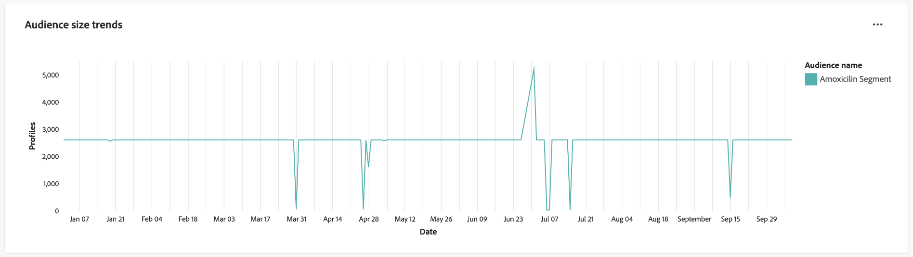
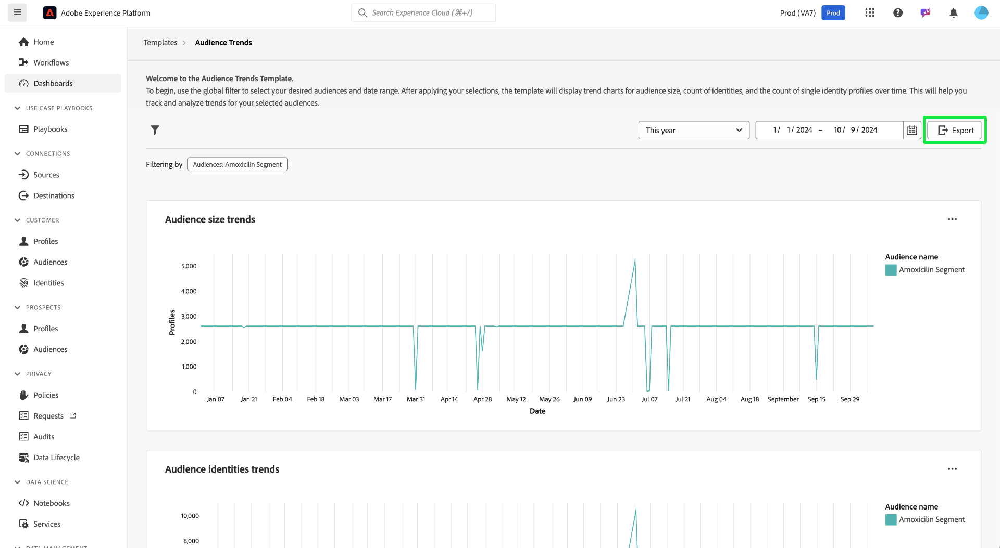

# Målgruppstrender

Analysera hur era målgrupper förändras över tid med visualiseringar av nyckeltal på kontrollpanelen [!UICONTROL Audience Trends]. Den här kontrollpanelen hjälper er att spåra trender som målgruppstillväxt, antalet identiteter och antalet enskilda identitetsprofiler, och ger er möjlighet att fatta datadrivna beslut. Genom att analysera dessa mätvärden kan marknadsförarna optimera strategier för målinriktning, förbättra målgruppsengagemanget och förfina sina segmenteringsinsatser för mer effektiva kampanjer.

## Filtrera målgrupper {#filter-audiences}

Börja analysen genom att använda det globala filtret för att välja de specifika målgrupperna och det datumintervall som du vill analysera. Välj filterikonen () för att öppna dialogrutan **[!UICONTROL Filter]** där du kan:

1. **Välj en målgrupp**: Välj den målgrupp som du vill analysera (i skärmbilden har **Amoxicillin**-målgruppen valts).
1. **Ange ett datumintervall**: Välj ett fördefinierat intervall i listrutan eller välj start- och slutdatum manuellt med hjälp av kalenderfälten.

När du har ställt in dina filter väljer du **[!UICONTROL Apply]** för att uppdatera instrumentpanelen. De filter du valt används och fokuserade insikter om utvalda målgrupper under en viss tidsperiod visas. Dina anpassade filter ser till att data är relevanta för dina analysmål.

## Tillgängliga trenddiagram för målgrupper {#available-charts}

Det finns tre huvuddiagram som hjälper er att förstå målgruppsmått över tid. För varje diagram kan du markera ellipsen (`...`) i det övre högra hörnet följt av [!UICONTROL View more] om du vill visa ett tabellformat för resultaten eller hämta data som en CSV-fil om du vill visa dem i ett kalkylblad. Mer information finns i [Visa mer guide](../view-more.md).

>[!TIP]
>
>Du kan hovra över ett visst datum i ett diagram om du vill visa antalet enskilda profiler i en dialogruta.

### Målgruppsstorlekstrender {#audience-size-trends}

Diagrammet **[!UICONTROL Audience size trends]** visar antalet profiler inom den valda målgruppen över tiden. Det hjälper till att spåra målgruppstillväxt eller -minskning. Du kan använda det här diagrammet för att övervaka hur engagemanget fungerar och förstå förändringar i målgruppens storlek.

### Målgruppsidentitetstrender {#audience-identities-trends}

Diagrammet **[!UICONTROL Audience identities trends]** ger insikter om det totala antalet identiteter inom målgruppssegmentet. Använd det här diagrammet för att förstå hur unika identiteter bidrar till målgruppens totala storlek. Det ger en indikation på målgruppens stabilitet och engagemang.

### Storlekstrender för en enda identitet {#single-identity-audience-size-trends}

Diagrammet **[!UICONTROL Single identity audience size trends]** visar antalet målgruppsmedlemmar med endast en identitet. Denna mätmetod är värdefull för att förstå målgruppens sammansättning, särskilt när det gäller identitetsskillnader, och hjälper till att mäta effekten av åtgärder för att sätta ihop identiteter.

## Exportera insikter {#export-insights}

När du har analyserat mätvärdena och tillämpat relevanta filter kan du exportera data för vidare offlineanalys eller rapportering. Om du vill göra det väljer du **[!UICONTROL Export]** längst upp till höger i tabellen. Dialogrutan Skriv ut PDF visas. I den dialogrutan kan du spara visualiserade data som PDF eller skriva ut dem.

## Nästa steg

När du har läst det här dokumentet har du lärt dig att få värdefulla insikter om målgruppsbeteenden med tiden från kontrollpanelen **Målgruppstrender**. Om du vill veta mer om andra Distiller-mallar för data som kan hjälpa dig att fatta välgrundade beslut, optimera segmentering och förbättra engagemangsstrategier kan du läsa användargränssnittshandböckerna för [målgruppsjämförelsen](./comparison.md), [målgruppsidentitetsöverlappningar](./identity-overlaps.md) och [Avancerade målgruppsöverlappningar](./overlaps.md) .
