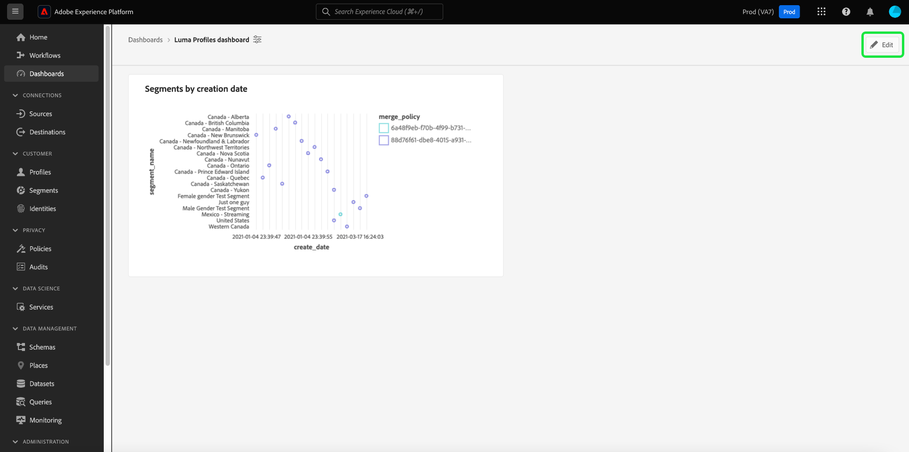

# Standardinstrumentpaneler

Använd Adobe Experience Platform Dashboards för att få bättre insikter och anpassa visualiseringen via funktionen Dashboards. Använd den här funktionen för att skapa och hantera anpassade kontrollpaneler där du kan skapa, lägga till och redigera anpassade widgetar för att visualisera viktiga nyckeltal som är relevanta för organisationen.

<!-- Getting started / permissions section commented out for Beta. This will be necessary after GA only

## Getting started

To view dashboards in Adobe Experience Platform you must have the appropriate permissions enabled. Please read the [dashboards permissions documentation](./permissions.md#available-permissions) to learn how to grant users the ability to view, edit, and update Experience Platform dashboards using Adobe Admin Console. If you do not have administrator privileges for your organization, contact your product administrator to obtain the required permissions. -->

## Skapa en anpassad kontrollpanel

Om du vill skapa en anpassad kontrollpanel navigerar du först till instrumentpanelens lager. Välj **[!UICONTROL Dashboards]** i den vänstra navigeringen i Experience Platform-gränssnittet följt av **[!UICONTROL Create dashboard]**.

Innan du lägger till en anpassad kontrollpanel är kontrollpanelernas lager tomt och en&quot;Inga kontrollpaneler hittades&quot; visas. meddelande. När du har skapat en kontrollpanel visas alla kontrollpaneler i kontrollpanelens lager.

<!-- >[!NOTE]
>
>To edit an existing dashboard, select the dashboard name from the inventory list followed by the pencil icon ()
>{width="100" zoomable="yes"} -->

Dialogrutan [!UICONTROL Create dashboard] visas. Ange ett användarvänligt, beskrivande namn för den samling widgetar som du vill skapa och välj **[!UICONTROL Save]**.

Användare som har köpt Data Distiller SKU kan använda anpassade SQL-frågor för att skapa sina insikter. Mer information om det här arbetsflödet finns i [frågans översikt över proffsläget](./sql-insights-query-pro-mode/overview.md).

Den nya tomma kontrollpanelen visas med ditt valda namn i vyns övre vänstra hörn.

## Skapa en widget {#create-widget}

>[!CONTEXTUALHELP]
>id="platform_dashboards_udd_maxwidgets"
>title="Maximalt antal widgetar"
>abstract="Instrumentpanelstjänsten stöder upp till tio widgetar. När du har lagt till tio widgetar på din instrumentpanel är alternativet [!UICONTROL Add new widget] inaktiverat och visas i grått."

I den nya instrumentpanelsvyn väljer du **[!UICONTROL Add new widget]** för att börja skapa widgeten.

>[!IMPORTANT]
>
>Varje kontrollpanel stöder upp till tio widgetar. När du har lagt till tio widgetar på din instrumentpanel är alternativet [!UICONTROL Add new widget] inaktiverat och visas i grått.

### Widget Composer

Arbetsytan för widgetens disposition visas. Välj sedan **[!UICONTROL Select data]** för att välja den datamodell från vilken du vill lägga till attribut till dina widgetar.

#### Välj datamodell {#select-data-model}

Dialogrutan [!UICONTROL Select data model] visas. Välj en datamodell i den vänstra kolumnen om du vill visa en förhandsvisningslista över alla tillgängliga tabeller. Den förkonfigurerade datamodellen för Real-Time Customer Data Platform har namnet [!UICONTROL CDPInsights].

>[!TIP]
>
>Välj informationsikonen () om du vill visa det fullständiga datamodellnamnet om det är för långt att visa i dataraden.

Förhandsvisningslistan innehåller information om tabellerna i datamodellen. Tabellen nedan innehåller beskrivningar av kolumnfälten och deras potentiella värden.

| Kolumnfält | Beskrivning |
|---|---|
| [!UICONTROL Title] | Tabellens namn. |
| [!UICONTROL Table type] | Tabelltyp. Möjliga typer är: `fact`, `dimension` och `none`. |
| [!UICONTROL Records] | Antalet poster som är associerade med den valda tabellen. |
| [!UICONTROL Lookups] | Antalet tabeller som är kopplade till den valda tabellen. |
| [!UICONTROL Attributes] | Antalet attribut för den valda tabellen. |

Välj **[!UICONTROL Next]** för att bekräfta ditt val av datamodell. I nästa vy visas en lista med tillgängliga tabeller i den vänstra listen. Välj en tabell om du vill visa en omfattande beskrivning av data i den valda tabellen.

### Fyll i widget {#populate-widget}

Panelen [!UICONTROL Preview] innehåller flikar för [!UICONTROL Sample records] och [!UICONTROL Attributes]. Fliken [!UICONTROL Sample records] innehåller en delmängd av posterna från den markerade tabellen i en tabellvy. Fliken [!UICONTROL Attributes] innehåller attributnamnet, datatypen och källtabellen för alla attribut som är associerade med den valda tabellen.

Välj en tabell i listan som är tillgänglig i den vänstra listen för att tillhandahålla data för din widget och välj **[!UICONTROL Select]** för att återgå till widgetens disposition.

Widgetdispositionen är nu ifylld med data från den tabell du valt.

Datamodellen och den markerade tabellen visas högst upp i den vänstra listen, och de attribut som är tillgängliga för att skapa widgeten visas i kolumnen [!UICONTROL Attributes]. Du kan använda sökfältet för att söka efter attribut i stället för att bläddra i listan, eller ändra den valda datamodellen genom att välja pennikonen () i den vänstra listen.

#### Lägg till och filtrera attribut {#add-and-filter-attributes}

Välj ikonen Lägg till () bredvid ett attributnamn för att lägga till ett attribut i din widget. I listrutan som visas kan du lägga till ett attribut som X-axel, Y-axel, färg eller filter för widgeten. Med attributet [!UICONTROL Color] kan du differentiera resultatet av X- och Y-axelmarkeringarna baserat på färg. Det gör du genom att dela upp resultaten i olika färger baserat på deras komposition i ett tredje attribut.

>[!TIP]
>
>Om du vill vända placeringen av X- och Y-axeln markerar du upp- och nedpilen () om du vill ändra deras disposition.

Om du vill ändra diagramtyp eller diagram för din widget markerar du listrutan [!UICONTROL Marks] och väljer bland de tillgängliga alternativen. Du kan välja mellan staplar, punkter, fästpunkter, linjer och ytor. När du har valt det här alternativet genereras en förhandsvisningsbild av widgetens aktuella inställningar.

Genom att lägga till ett attribut som ett filter kan du välja vilka värden som ska inkluderas eller exkluderas från widgeten. När du har lagt till ett filter från attributlistan visas dialogrutan [!UICONTROL Filter] där du kan markera eller avmarkera värden med hjälp av deras kryssruta.

#### Filtrera bort historiska data {#filter-historical-data}

Om du vill filtrera bort historiska data från insikter som genererats av din widget lägger du till attributet `date_key` som ett filter och väljer **[!UICONTROL Recent date]** följt av **[!UICONTROL Apply]**. Det här filtret ser till att de data som används för att härleda insikter hämtas från den senaste ögonblicksbilden av systemet.

![Dialogrutan [!UICONTROL Filter: date_key] med [!UICONTROL Recent date] och [!UICONTROL Apply] markerade.](./images/standard-dashboards/recent-date.png)

Du kan också skapa en egen punkt för att filtrera data efter. Välj **[!UICONTROL Select dates]** om du vill utöka dialogrutan med en lista över tillgängliga datum. Använd kryssrutan **[!UICONTROL Select all]** om du vill aktivera eller inaktivera alla tillgängliga alternativ, eller markera kryssrutan för varje dag individuellt. Slutligen väljer du **[!UICONTROL Apply]** för att bekräfta dina val.

>[!NOTE]
>
>Om attributet `date_key` redan har lagts till som ett filter väljer du ellipsen följt av **[!UICONTROL Edit]** i listrutan för att ändra filterperioden.

![Dialogrutan [!UICONTROL Filter: date_key] med kryssrutor för enskilda dagar är både markerad och avmarkerad.](./images/standard-dashboards/select-dates.png)

### Widget-egenskaper

Välj egenskapsikonen () till höger för att öppna egenskapspanelen. Ange ett namn för widgeten i textfältet [!UICONTROL Widget title] på panelen [!UICONTROL Properties].

På panelen för widgegenskaper kan du redigera flera aspekter av widgeten. Du har fullständig kontroll för att redigera platsen för widgetens förklaring. Om du vill flytta teckenförklaringen markerar du listrutan [!UICONTROL Legend placement] och väljer önskad plats i listan med tillgängliga alternativ. Du kan också byta namn på etiketten som är kopplad till teckenförklaringen och X- eller Y-axeln genom att ange ett nytt namn i textfältet [!UICONTROL Legend title] respektive textfältet [!UICONTROL Axis label].

#### Spara din widget {#save-widget}

När du sparar i widgetens disposition sparas widgeten lokalt på din instrumentpanel. Om du vill spara ditt arbete och återuppta det senare väljer du **[!UICONTROL Save]**. En bockikon under widgetens namn anger att widgeten har sparats. När du är nöjd med din widget kan du också välja **[!UICONTROL Save and close]** för att göra widgeten tillgänglig för alla andra användare med åtkomst till din instrumentpanel. Välj **[!UICONTROL Cancel]** om du vill avbryta ditt arbete och återgå till din anpassade instrumentpanel.

>[!TIP]
>
>Välj egenskapsikonen () bredvid instrumentpanelens namn för att se information om hur den skapades. Du kan ändra namnet på kontrollpanelen i den dialogruta som visas.

Du kan ordna om widgetar och ändra storlek på dem i den här arbetsytan. Välj **[!UICONTROL Save]** om du vill bevara instrumentpanelens namn och konfigurerade layout.

För att säkerställa att varje fråga för en Adobe Real-Time Customer Data Platform insights-instrumentpanel har tillräckligt med resurser för att kunna köras effektivt, spårar API:t resursanvändningen genom att tilldela varje fråga kortplatser för samtidig användning. Systemet kan bearbeta upp till fyra samtidiga frågor, och därför är fyra samtidiga frågeplatser tillgängliga vid en given tidpunkt. Frågor placeras i en kö baserat på kortplatser för samtidig användning och väntar sedan i kön tills det finns tillräckligt med kortplatser för samtidig användning.

### Redigera, duplicera eller ta bort en widget {#duplicate}

När du har skapat en widget kan du redigera, duplicera eller ta bort hela widgetar från den anpassade instrumentpanelen.

>[!TIP]
>
>Om du vill växla mellan dina befintliga anpassade kontrollpaneler väljer du Kontrollpaneler i det vänstra navigeringsfältet och sedan instrumentpanelens namn i lagerlistan.

Välj pennikonen () längst upp till höger på din anpassade instrumentpanel för att gå till redigeringsläget.

Markera sedan ellipserna i det övre högra hörnet av widgeten som du vill redigera, kopiera eller ta bort. Välj lämplig åtgärd i listrutan.

>[!NOTE]
>
>Med duplicering kan du anpassa attributen för en insikt för att skapa en unik widget utan att behöva börja från början. Om du duplicerar en widget visas den på din anpassade kontrollpanel. Du kan sedan välja ellipserna för din nya widget, följt av **[!UICONTROL Edit]**, för att anpassa dina insikter.

## Nästa steg och ytterligare resurser

Genom att läsa det här dokumentet får du en bättre förståelse för hur du skapar en anpassad kontrollpanel och hur du skapar, redigerar och uppdaterar anpassade widgetar för den instrumentpanelen.

Om du vill identifiera tillgängliga förkonfigurerade mått och visualiseringar för kontrollpanelerna [profiler](./guides/profiles.md#standard-widgets), [segment](./guides/audiences.md#standard-widgets) och [mål](./guides/destinations.md#standard-widgets) kan du läsa listan med standardwidgetar i deras respektive dokumentation.

Titta på följande video för att få en bättre förståelse för kontrollpaneler i Experience Platform:

>[!VIDEO](https://video.tv.adobe.com/v/3409637?quality=12&learn=on)
