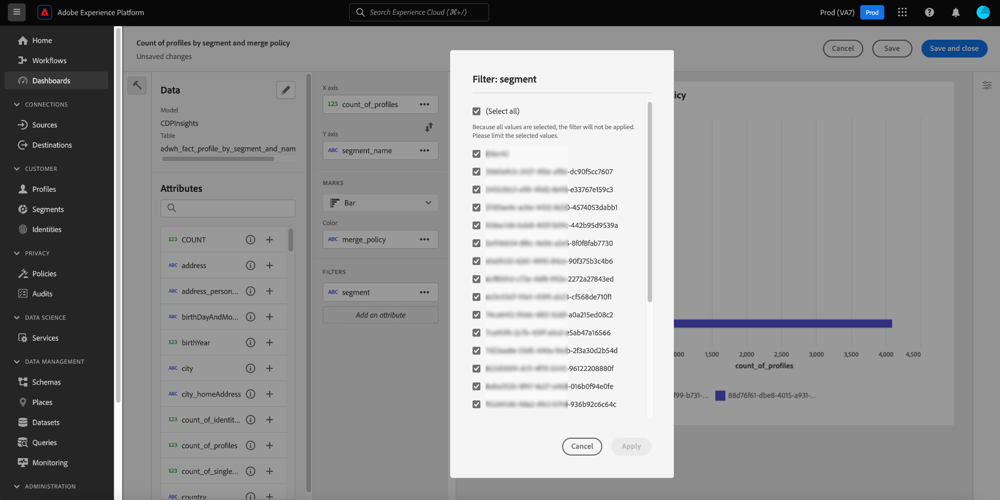
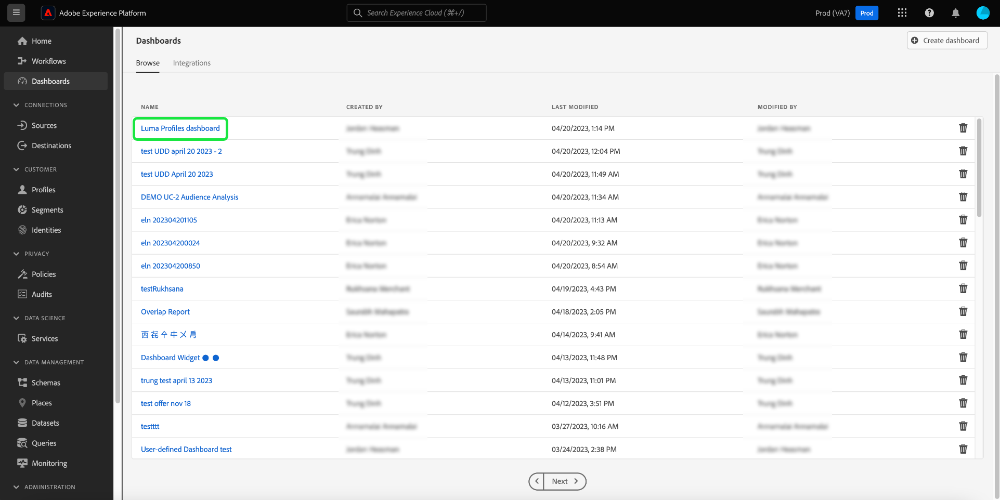

# Användardefinierade kontrollpaneler

Adobe Experience Platform Dashboards hjälper er att få insikter och anpassa visualisering med den användardefinierade funktionen för kontrollpaneler. Med den här funktionen kan du skapa och hantera anpassade kontrollpaneler där du kan skapa, lägga till och redigera anpassade widgetar för att visualisera viktiga nyckeltal som är relevanta för organisationen.

<!-- Getting started / permissions section commented out for Beta. This will be necessary after GA only

## Getting started

To view dashboards in Adobe Experience Platform you must have the appropriate permissions enabled. Please read the [dashboards permissions documentation](./permissions.md#available-permissions) to learn how to grant users the ability to view, edit, and update Experience Platform dashboards using Adobe Admin Console. If you do not have administrator privileges for your organization, contact your product administrator to obtain the required permissions. -->

## Skapa en anpassad kontrollpanel

Om du vill skapa en anpassad kontrollpanel navigerar du först till instrumentpanelens lager. Välj **[!UICONTROL Dashboards]** från vänster navigering i plattformsgränssnittet följt av **[!UICONTROL Create dashboard]**.

Innan du lägger till en anpassad kontrollpanel är kontrollpanelernas lager tomt och en&quot;Inga kontrollpaneler hittades&quot; visas. meddelande. När du har skapat en kontrollpanel visas alla dina användardefinierade kontrollpaneler i kontrollpanelens lager.

>[!NOTE]
>
>Om du vill redigera en befintlig kontrollpanel väljer du instrumentpanelens namn i lagerlistan följt av pennikonen ()

The [!UICONTROL Create dashboard] visas. Ange ett användarvänligt, beskrivande namn för den samling widgetar som du vill skapa och välj **[!UICONTROL Save]**.

Den nya tomma kontrollpanelen visas med ditt valda namn i vyns övre vänstra hörn.

## Skapa en widget {#create-widget}

>[!CONTEXTUALHELP]
>id="platform_dashboards_udd_maxwidgets"
>title="Maximalt antal widgetar"
>abstract="Användardefinierade kontrollpaneler har stöd för upp till tio widgetar. När du har lagt till tio widgetar på din instrumentpanel visas [!UICONTROL Add new widget] är inaktiverat och visas som grått."

Välj **[!UICONTROL Add new widget]** för att börja skapa widgeten.

>[!IMPORTANT]
>
>Användardefinierade kontrollpaneler har stöd för upp till tio widgetar. När du har lagt till tio widgetar på din instrumentpanel visas [!UICONTROL Add new widget] är inaktiverat och visas som grått.

### Widget Composer

Arbetsytan för widgetens disposition visas. Nästa, välj **[!UICONTROL Select data]** för att välja den datamodell från vilken du vill lägga till attribut till dina widgetar.

#### Välj datamodell {#select-data-model}

The [!UICONTROL Select data model] visas. Välj en datamodell i den vänstra kolumnen om du vill visa en förhandsvisningslista över alla tillgängliga tabeller. Den förkonfigurerade datamodellen för Real-time Customer Data Platform har ett namn [!UICONTROL CDPInsights].

>[!TIP]
>
>Välj informationsikonen () för att se det fullständiga datamodellnamnet om det är för långt att visa i dataraden.

Förhandsvisningslistan innehåller information om tabellerna i datamodellen. Tabellen nedan innehåller beskrivningar av kolumnfälten och deras potentiella värden.

| Kolumnfält | Beskrivning |
|---|---|
| [!UICONTROL Title] | Tabellens namn. |
| [!UICONTROL Table type] | Tabelltyp. Möjliga typer är: `fact`, `dimension`och `none`. |
| [!UICONTROL Records] | Antalet poster som är associerade med den valda tabellen. |
| [!UICONTROL Lookups] | Antalet tabeller som är kopplade till den valda tabellen. |
| [!UICONTROL Attributes] | Antalet attribut för den valda tabellen. |

Välj **[!UICONTROL Next]** för att bekräfta ditt val av datamodell. I nästa vy visas en lista med tillgängliga tabeller i den vänstra listen. Välj en tabell om du vill visa en omfattande beskrivning av data i den valda tabellen.

### Fyll i widget {#populate-widget}

The [!UICONTROL Preview] panelen innehåller flikar för [!UICONTROL Sample records] och [!UICONTROL Attributes]. The [!UICONTROL Sample records] -fliken innehåller en delmängd av posterna från den markerade tabellen i en tabellvy. The [!UICONTROL Attributes] -fliken innehåller attributnamnet, datatypen och källtabellen för alla attribut som är associerade med den valda tabellen.

Välj en tabell från listan som är tillgänglig i den vänstra listen för att ange data för din widget och välj **[!UICONTROL Select]** för att gå tillbaka till widgetens disposition.

Widgetdispositionen är nu ifylld med data från den tabell du valt.

Datamodellen och den markerade tabellen visas längst upp i den vänstra listen, och de attribut som är tillgängliga för att skapa widgeten visas i [!UICONTROL Attributes] kolumn. Du kan använda sökfältet för att söka efter attribut i stället för att bläddra i listan, eller ändra den valda datamodellen genom att välja pennikonen () i den vänstra listen.

#### Lägg till och filtrera attribut {#add-and-filter-attributes}

Välj ikonen Lägg till () bredvid ett attributnamn för att lägga till ett attribut i widgeten. I listrutan som visas kan du lägga till ett attribut som X-axel, Y-axel, färg eller filter för widgeten. The [!UICONTROL Color] Med -attribut kan du differentiera resultatet för X- och Y-axelmarkeringarna baserat på färg. Det gör du genom att dela upp resultaten i olika färger baserat på deras komposition i ett tredje attribut.

>[!TIP]
>
>Om du vill vända X- och Y-axelns placering, markerar du upp- och nedpilen () för att ändra deras arrangemang.

Om du vill ändra diagramtyp eller diagram för din widget väljer du [!UICONTROL Marks] och välj bland de tillgängliga alternativen. Du kan välja mellan staplar, punkter, fästpunkter, linjer och ytor. När du har valt det här alternativet genereras en förhandsvisningsbild av widgetens aktuella inställningar.

Genom att lägga till ett attribut som ett filter kan du välja vilka värden som ska inkluderas eller exkluderas från widgeten. När du har lagt till ett filter från attributlistan visas [!UICONTROL Filter] visas där du kan markera eller avmarkera värden med hjälp av deras kryssruta.

#### Filtrera bort historiska data {#filter-historical-data}

Lägg till `date_key` attribut som ett filter och markera **[!UICONTROL Recent date]** följt av **[!UICONTROL Apply]**. Det här filtret ser till att de data som används för att härleda insikter hämtas från den senaste ögonblicksbilden av systemet.

![The [!UICONTROL Filter: date_key] dialogruta med [!UICONTROL Recent date] och [!UICONTROL Apply] markerad.](./images/user-defined-dashboards/recent-date.png)

Du kan också skapa en egen punkt för att filtrera data efter. Välj **[!UICONTROL Select dates]** för att utöka dialogrutan med en lista över tillgängliga datum. Använd **[!UICONTROL Select all]** om du vill aktivera eller inaktivera alla tillgängliga alternativ, eller markera kryssrutan för varje dag för sig. Äntligen väljer du **[!UICONTROL Apply]** för att bekräfta dina val.

>[!NOTE]
>
>Om `date_key` -attributet har redan lagts till som ett filter, markera ellipsen följt av **[!UICONTROL Edit]** i listrutan för att ändra filterperioden.

![The [!UICONTROL Filter: date_key] med individuella dagkryssrutor både markerade och avmarkerade.](./images/user-defined-dashboards/select-dates.png)

### Widget-egenskaper

Välj egenskapsikonen () i den högra listen för att öppna egenskapspanelen. I [!UICONTROL Properties] anger du ett namn för widgeten på panelen [!UICONTROL Widget title] textfält.

På panelen för widgegenskaper kan du redigera flera aspekter av widgeten. Du har fullständig kontroll för att redigera platsen för widgetens förklaring. Om du vill flytta teckenförklaringen väljer du [!UICONTROL Legend placement] och välj en plats i listan med tillgängliga alternativ. Du kan också byta namn på etiketten som är kopplad till teckenförklaringen och X- eller Y-axeln genom att ange ett nytt namn i [!UICONTROL Legend title] textfält, eller [!UICONTROL Axis label] textfält.

#### Spara din widget {#save-widget}

När du sparar i widgetens disposition sparas widgeten lokalt på din instrumentpanel. Om du vill spara ditt arbete och återuppta det vid ett senare tillfälle väljer du **[!UICONTROL Save]**. En bockikon under widgetens namn anger att widgeten har sparats. När du är nöjd med widgeten kan du också välja **[!UICONTROL Save and close]** för att göra widgeten tillgänglig för alla andra användare med tillgång till din instrumentpanel. Välj **[!UICONTROL Cancel]** om du vill avbryta ditt arbete och återgå till din anpassade kontrollpanel.

>[!TIP]
>
>Välj egenskapsikonen () bredvid instrumentpanelens namn för att se information om hur den har skapats. Du kan ändra namnet på kontrollpanelen i den dialogruta som visas.

Du kan ordna om widgetar och ändra storlek på dem i den här arbetsytan. Välj **[!UICONTROL Save]** för att bevara instrumentpanelens namn och konfigurerade layout.

För att säkerställa att varje fråga för en Adobe Real-time Customer Data Platform insights-instrumentpanel har tillräckligt med resurser för att kunna köras effektivt, spårar API:t resursanvändningen genom att tilldela varje fråga kortplatser för samtidig användning. Systemet kan bearbeta upp till fyra samtidiga frågor, och därför är fyra samtidiga frågeplatser tillgängliga vid en given tidpunkt. Frågor placeras i en kö baserat på kortplatser för samtidig användning och väntar sedan i kön tills det finns tillräckligt med kortplatser för samtidig användning.

### Duplicera en widget

När du har skapat en widget kan du duplicera hela widgeten och anpassa dess attribut för att skapa en unik widget utan att behöva börja från början. Om du vill duplicera en widget navigerar du först till instrumentpanelsinventeringen. Välj sedan instrumentpanelens namn i lagerlistan. Din anpassade kontrollpanel visas.

Välj pennikonen () längst upp till höger på din anpassade kontrollpanel för att gå till redigeringsläget.

Sedan markerar du ellipserna i det övre högra hörnet i widgeten som du vill kopiera, följt av **[!UICONTROL Duplicate]** i listan med tillgängliga alternativ.

En dubblettwidget visas på den användardefinierade kontrollpanelen. Markera ellipserna för den nya widgeten, följt av **[!UICONTROL Edit]**, för att anpassa din nya widget.

## Nästa steg och ytterligare resurser

Genom att läsa det här dokumentet får du en bättre förståelse för hur du skapar en anpassad kontrollpanel och hur du skapar, redigerar och uppdaterar anpassade widgetar för den instrumentpanelen.

Identifiera tillgängliga förkonfigurerade mått och visualiseringar för [profiler](./guides/profiles.md#standard-widgets), [segment](./guides/audiences.md#standard-widgets)och [mål](./guides/destinations.md#standard-widgets) på kontrollpaneler, se listan över standardwidgetar i deras respektive dokumentation.

Titta på följande video för att få en bättre förståelse för användardefinierade instrumentpaneler i Experience Platform:

>[!VIDEO](https://video.tv.adobe.com/v/3409637?quality=12&learn=on)
