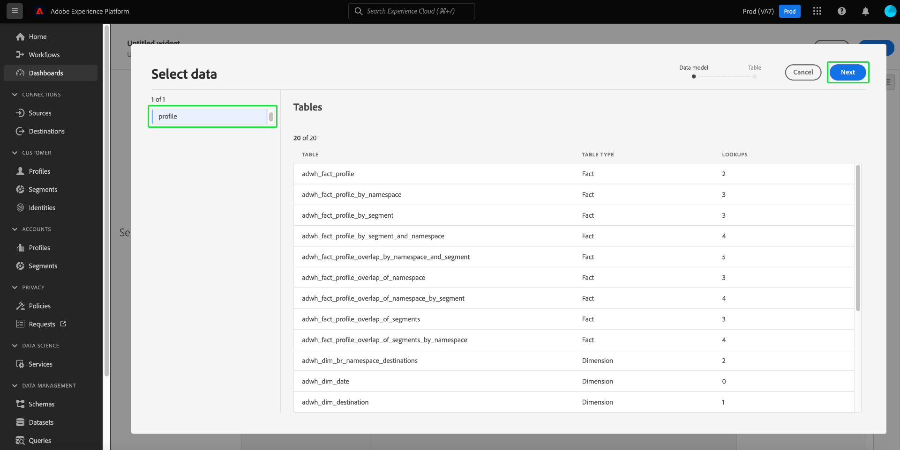

# Användardefinierade kontrollpaneler

Adobe Experience Platform Dashboards hjälper er att få insikter och anpassa visualisering med den användardefinierade funktionen för kontrollpaneler. Med den här funktionen kan du skapa och hantera anpassade kontrollpaneler där du kan skapa, lägga till och redigera anpassade widgetar för att visualisera viktiga nyckeltal som är relevanta för organisationen.

<!-- Getting started / permissions section commented out for Beta. This will be necessary after GA only

## Getting started

To view dashboards in Adobe Experience Platform you must have the appropriate permissions enabled. Please read the [dashboards permissions documentation](./permissions.md#available-permissions) to learn how to grant users the ability to view, edit, and update Experience Platform dashboards using Adobe Admin Console. If you do not have administrator privileges for your organization, contact your product administrator to obtain the required permissions. -->

## Skapa anpassade instrumentpaneler

Om du vill skapa en anpassad kontrollpanel navigerar du först till instrumentpanelens lager. Välj **[!UICONTROL Dashboards]** från vänster navigering i plattformsgränssnittet följt av **[!UICONTROL Create dashboard]**.

Innan du lägger till en anpassad kontrollpanel är kontrollpanelernas lager tomt och en&quot;Inga kontrollpaneler hittades&quot; visas. meddelande. När du har skapat en kontrollpanel visas alla dina användardefinierade kontrollpaneler i kontrollpanelens lager.

The [!UICONTROL Create dashboard] visas. Ange ett användarvänligt, beskrivande namn för den samling widgetar som du vill skapa och välj **[!UICONTROL Save]**.

Den nya tomma kontrollpanelen visas med ditt valda namn i vyns övre vänstra hörn.

## Skapa en widget {#create-widget}

>[!CONTEXTUALHELP]
>id="platform_dashboards_udd_maxwidgets"
>title="Maximalt antal widgetar"
>abstract="Användardefinierade kontrollpaneler har stöd för upp till tio widgetar. När du har lagt till tio widgetar på din instrumentpanel visas [!UICONTROL Add new widget] är inaktiverat och visas som grått."

Välj **[!UICONTROL Add new widget]** för att börja skapa widgeten.

>[!IMPORTANT]
>
>Användardefinierade kontrollpaneler har stöd för upp till tio widgetar. När du har lagt till tio widgetar på din instrumentpanel visas [!UICONTROL Add new widget] är inaktiverat och visas som grått.

### Widget Composer

Arbetsytan för widgetens disposition visas. Nästa, välj **[!UICONTROL Select data]** för att välja den datamodell från vilken du vill lägga till attribut till dina widgetar.

The [!UICONTROL Select data] visas. Välj en datamodell i den vänstra kolumnen om du vill visa en förhandsvisningslista över alla tillgängliga tabeller.

>[!NOTE]
>
>Användardefinierade kontrollpaneler har för närvarande bara stöd för profildatamodellen. Fler alternativ stöds.

Förhandsvisningslistan innehåller information om tabellerna i datamodellen. Tabellen nedan innehåller beskrivningar av kolumnfälten och deras potentiella värden.

| Kolumnfält | Beskrivning |
|---|---|
| [!UICONTROL Title] | Tabellens namn. |
| [!UICONTROL Table type] | Tabelltyp. Möjliga typer är: `fact`, `dimension`och `none`. |
| [!UICONTROL Lookups] | Antalet tabeller som är kopplade till den valda tabellen. |

Välj **[!UICONTROL Next]** för att bekräfta ditt val av datamodell. I nästa vy visas en lista med tillgängliga tabeller i den vänstra listen. Välj en tabell om du vill visa en omfattande beskrivning av data i den valda tabellen.

The [!UICONTROL Preview] panelen innehåller flikar för [!UICONTROL Sample records] och [!UICONTROL Attributes]. The [!UICONTROL Sample records] -fliken innehåller en delmängd av posterna från den markerade tabellen i en tabellvy. The [!UICONTROL Attributes] -fliken innehåller attributnamnet, datatypen och källtabellen för alla attribut som är associerade med den valda tabellen.

Välj en tabell från listan som är tillgänglig i den vänstra listen för att tillhandahålla data för din widget och välj **[!UICONTROL Select]** för att gå tillbaka till widgetens disposition.

Widgetdispositionen är nu ifylld med data från den tabell du valt.

Datamodellen och den markerade tabellen visas längst upp i den vänstra listen, och de attribut som är tillgängliga för att skapa widgeten visas i kolumnen Attribut.

>[!TIP]
>
>Du kan ändra den valda datamodellen genom att välja pennikonen () i den vänstra listen.

Välj ikonen Lägg till (./images/user-defined-dashboards/add-icon.png) bredvid ett attributnamn för att lägga till ett attribut i antingen X- eller Y-axeln.

Välj sedan diagramtyp på menyn [!UICONTROL Marks] listruta för att generera en förhandsvisningsbild av widgetens aktuella inställningar. I [!UICONTROL Properties] till höger på skärmen anger du ett namn för widgeten i [!UICONTROL Widget title] textfält.

När du är nöjd med widgeten väljer du **[!UICONTROL Save]**. En bockikon under widgetens namn anger att widgeten har sparats.

>[!NOTE]
>
>När du sparar i widgetens disposition sparas widgeten lokalt på din instrumentpanel. Om du avslutar instrumentpanelsredigeraren utan att spara instrumentpanelen sparas inte widgeten på instrumentpanelen.

Välj **[!UICONTROL Cancel]** för att återgå till din anpassade kontrollpanel.

>[!TIP]
>
>Välj inställningsikonen bredvid instrumentpanelens namn för att visa information om hur den har skapats. Du kan ändra namnet på kontrollpanelen i den dialogruta som visas.

Du kan ordna om widgetar och ändra storlek på dem i den här arbetsytan. Välj **[!UICONTROL Save]** för att bevara instrumentpanelens namn och konfigurerade layout.

För att säkerställa att varje fråga för en Real-time Customer Data Platform insights-instrumentpanel har tillräckligt med resurser för att kunna köras effektivt, spårar API:t resursanvändningen genom att tilldela varje fråga kortplatser för samtidig användning. Systemet kan bearbeta upp till fyra samtidiga frågor, och därför är fyra samtidiga frågeplatser tillgängliga vid en given tidpunkt. Frågor placeras i en kö baserat på kortplatser för samtidig användning och väntar sedan i kön tills det finns tillräckligt med kortplatser för samtidig användning.

## Nästa steg

Genom att läsa det här dokumentet får du en bättre förståelse för hur du skapar en anpassad kontrollpanel och hur du skapar, redigerar och uppdaterar anpassade widgetar för den instrumentpanelen.

Identifiera tillgängliga förkonfigurerade mått och visualiseringar för [profiler](./guides/profiles.md#standard-widgets), [segment](./guides/segments.md#standard-widgets)och [mål](./guides/destinations.md#standard-widgets) på kontrollpaneler, se listan över standardwidgetar i deras respektive dokumentation.
