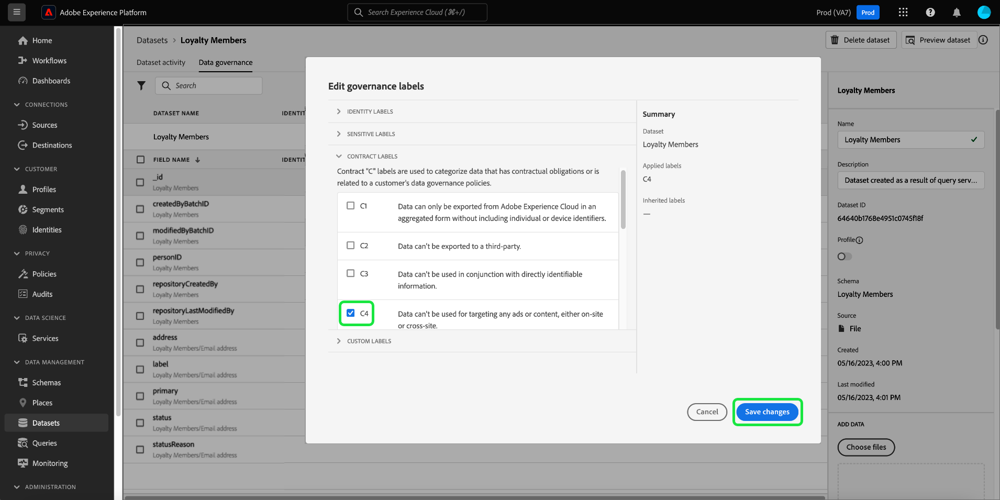

# Handbok för datastyrning från början till slut

För att kunna styra vilka marknadsföringsåtgärder som kan utföras på vissa datauppsättningar och fält i Adobe Experience Platform måste du ställa in följande:

1. [Använd etiketter](#labels) till schemafälten eller hela datauppsättningar, vars användning du vill begränsa.
1. [Konfigurera och aktivera policyer för datastyrning](#policy) som avgör vilka typer av märkta data som kan användas för vissa marknadsföringsåtgärder.
1. [Använd marknadsföringsåtgärder på era destinationer](#destinations) ange vilka policyer som gäller för data som skickas till dessa destinationer.

När du är klar med att konfigurera etiketter, styrningsprinciper och marknadsföringsåtgärder kan du [testa din policytillämpning](#test) för att säkerställa att den fungerar som förväntat.

Den här guiden går igenom hela processen med att konfigurera och verkställa en datastyrningspolicy i användargränssnittet för plattformen. Mer detaljerad information om funktionerna som används i den här handboken finns i översiktsdokumentationen för följande ämnen:

* [Adobe Experience Platform datastyrning](./home.md)
* [Dataanvändningsetiketter](./labels/overview.md)
* [Dataanvändningspolicyer](./policies/overview.md)
* [Politiska åtgärder](./enforcement/overview.md)

>[!NOTE]
>
>Den här guiden fokuserar på hur du ställer in och tillämpar regler för hur data används eller aktiveras i Experience Platform. Om du försöker begränsa **åtkomst** för vissa plattformsanvändare inom organisationen, se handboken från början till slut på [attributbaserad åtkomstkontroll](../access-control/abac/end-to-end-guide.md) i stället. Attributbaserad åtkomstkontroll använder också etiketter och principer, men för ett annat användningssätt än för datastyrning.

## Använd etiketter {#labels}

>[!IMPORTANT]
>
>Etiketter kan inte längre användas på enskilda fält på datauppsättningsnivå. Det här arbetsflödet har ersatts med etiketter på schemanivå. Du kan dock fortfarande märka en hel datauppsättning med etiketter. Etiketter som tidigare använts på enskilda datauppsättningsfält stöds fortfarande i plattformsgränssnittet fram till den 31 maj 2024. För att etiketterna ska vara enhetliga i alla scheman måste du migrera alla etiketter som tidigare har kopplats till fält på datauppsättningsnivå till schemanivån under det kommande året. Se avsnittet om [migrera tidigare använda etiketter](#migrate-labels) för instruktioner om hur man gör detta.

Du kan [använda etiketter i ett schema](#schema-labels) så att alla datauppsättningar som baseras på det schemat ärver samma etiketter. På så sätt kan ni hantera etiketterna för datastyrning, samtycke och åtkomstkontroll på ett och samma ställe. Genom att tillämpa begränsningar för dataanvändning på schemanivå sprids effekten nedåt till alla datauppsättningar som baseras på det schemat. Etiketter som används på schemafältnivå stöder användningsfall för datastyrning och kan upptäckas på arbetsytan Datamängder [!UICONTROL Data Governance] under [!UICONTROL Field Name] kolumn som skrivskyddade etiketter.

Om det finns en viss datauppsättning som du vill använda begränsningar för dataanvändning på kan du [tillämpa etiketter direkt på den datauppsättningen](#dataset-labels) eller specifika fält i den datauppsättningen.

Du kan också [använda etiketter i ett schema](#schema-labels) så att alla datauppsättningar som baseras på det schemat ärver samma etiketter.

>[!NOTE]
>
>Mer information om olika etiketter för dataanvändning och deras avsedda användning finns i [referens till etiketter för dataanvändning](./labels/reference.md). Om de tillgängliga kärnetiketterna inte täcker alla dina önskade användningsfall kan du [definiera egna etiketter](./labels/user-guide.md#manage-custom-labels) också.

### Tillämpa etiketter på en hel datauppsättning {#dataset-labels}

Välj **[!UICONTROL Datasets]** i den vänstra navigeringen markerar du namnet på datauppsättningen som du vill använda etiketter på. Du kan också använda sökfältet för att begränsa listan med visade datauppsättningar.

Informationsvyn för datauppsättningen visas. Välj **[!UICONTROL Data governance]** om du vill visa en lista över datauppsättningens fält och eventuella etiketter som redan har tillämpats på dem. Markera pennikonen om du vill redigera datauppsättningsrubrikerna.

The [!UICONTROL Edit governance labels] visas. Välj lämplig styrningsetikett och välj **[!UICONTROL Save]**.

### Tillämpa etiketter på ett schema {#schema-labels}

Välj **[!UICONTROL Schemas]** i den vänstra navigeringen väljer du det schema som du vill lägga till etiketter i från listan.

>[!TIP]
>
>Om du är osäker på vilket schema som gäller för en viss datauppsättning väljer du **[!UICONTROL Datasets]** i den vänstra navigeringen markerar du länken under **[!UICONTROL Schema]** -kolumn för den önskade datauppsättningen. Markera schemanamnet i den port som visas för att öppna schemat i Schemaredigeraren.
>
>

Schemats struktur visas i Schemaredigeraren. Här väljer du **[!UICONTROL Labels]** om du vill visa en listvy över schemats fält och de etiketter som redan har tillämpats på dem. Markera kryssrutorna intill de fält som du vill lägga till etiketter i och markera sedan **[!UICONTROL Apply access and data governance labels]** i rätt spår.

>[!NOTE]
>
>Om du vill lägga till etiketter i alla fält i schemat väljer du pennikonen på den översta raden.
>
>

The [!UICONTROL Apply access and data governance labels] visas. Markera etiketterna som du vill använda i det valda schemafältet. När du är klar väljer du **[!UICONTROL Save]**.

Följ stegen ovan för att tillämpa etiketter på olika fält (eller olika scheman) efter behov. När du är klar kan du fortsätta till nästa steg i [aktivera policyer för datastyrning](#policy).

### Migrera etiketter som tidigare använts på datauppsättningsnivå {#migrate-labels}

Välj **[!UICONTROL Dataset]** i den vänstra navigeringen markerar du namnet på datauppsättningen som du vill migrera etiketter från. Du kan också använda sökfältet för att begränsa listan med visade datauppsättningar.

Informationsvyn för datauppsättningen visas. Välj **[!UICONTROL Data governance]** om du vill visa en lista över datauppsättningens fält och eventuella etiketter som redan har tillämpats på dem. Markera ikonen för att avbryta bredvid etiketter som du vill ta bort från ett fält. En bekräftelsedialogruta visas. Välj [!UICONTROL Remove label] för att bekräfta dina val.

När du har tagit bort etiketten från datauppsättningsfältet går du till Schemaredigeraren och lägger till etiketten i schemat. Instruktioner om hur du gör detta finns i [avsnitt om att använda etiketter i ett schema](#schema-labels).

>[!TIP]
>
>Du kan välja schemanamnet i den högra listen, följt av länken i dialogrutan som visas för att navigera till rätt schema.
>

När du har migrerat de nödvändiga etiketterna kontrollerar du att du har rätt [datastyrningsprinciper har aktiverats](#policy).

## Aktivera policyer för datastyrning {#policy}

När du har använt etiketter på dina scheman och/eller datauppsättningar kan du skapa regler för datastyrning som begränsar de marknadsföringsåtgärder som vissa etiketter kan användas för.

Välj **[!UICONTROL Policies]** i den vänstra navigeringen för att visa en lista över principer som definieras av Adobe samt eventuella egna policyer som tidigare skapats av organisationen.

Varje etikett har en tillhörande grundprincip som, när den är aktiverad, tillämpar lämpliga aktiveringsbegränsningar på alla data som innehåller etiketten. Om du vill aktivera en huvudprincip väljer du den i listan och väljer sedan **[!UICONTROL Policy status]** växla till **[!UICONTROL Enabled]**.

Om de tillgängliga grundreglerna inte täcker alla dina användningsfall (till exempel när du använder anpassade etiketter som du har definierat under din organisation) kan du definiera en anpassad profil i stället. Från **[!UICONTROL Policies]** arbetsyta, välja **[!UICONTROL Create policy]**.

![Bild som visar [!UICONTROL Create policy] som markeras i användargränssnittet](./images/e2e/create-policy.png)

En pover visas och du uppmanas att välja vilken typ av profil du vill skapa. Välj **[!UICONTROL Data governance policy]** väljer **[!UICONTROL Continue]**.

![Bild som visar [!UICONTROL Data governance policy] alternativ markeras](./images/e2e/governance-policy.png)

På nästa skärm kan du **[!UICONTROL Name]** och valfria **[!UICONTROL Description]** för profilen. I tabellen nedan markerar du de etiketter som du vill att profilen ska kontrollera. Detta är med andra ord de etiketter som policyn kommer att förhindra från att användas för de marknadsföringsåtgärder som du anger i nästa steg.

Om du markerar flera etiketter kan du använda alternativen i den högra listen för att avgöra om alla etiketter måste finnas för att principen ska kunna tillämpa användningsbegränsningar, eller om bara en av etiketterna behöver finnas. När du är klar väljer du **[!UICONTROL Next]**.

På nästa skärm väljer du de marknadsföringsåtgärder som den här principen ska begränsa de etiketter som du tidigare valt från att användas. Välj **[!UICONTROL Next]** för att fortsätta.

I den sista skärmen visas en sammanfattning av principens detaljer och de åtgärder som den kommer att begränsa för vilka etiketter. Välj **[!UICONTROL Finish]** för att skapa profilen.

Principen skapas, men är inställd på [!UICONTROL Disabled] som standard. Välj profilen i listan och ange **[!UICONTROL Policy status]** växla till **[!UICONTROL Enabled]** för att aktivera profilen.

Följ stegen ovan för att skapa och aktivera de profiler du behöver innan du går vidare till nästa steg.

## Hantera marknadsföringsåtgärder för destinationer {#destinations}

För att dina aktiverade profiler ska kunna avgöra vilka data som kan aktiveras för ett mål måste du tilldela specifika marknadsföringsåtgärder till det målet.

Ta till exempel en aktiverad princip som förhindrar att data som innehåller en `C2` etikett som används för marknadsföringsåtgärden &quot;[!UICONTROL Export to Third Party]&quot;. När data aktiveras till ett mål kontrollerar profilen vilka marknadsföringsåtgärder som finns på målet. If &quot;[!UICONTROL Export to Third Party]&quot; finns, försöker aktivera data med `C2` label resulterar i en principöverträdelse. If &quot;[!UICONTROL Export to Third Party]&quot; finns inte, principen används inte för målet och data med `C2` etiketter kan aktiveras fritt.

När [ansluta ett mål i användargränssnittet](../destinations/ui/connect-destination.md), **[!UICONTROL Governance]** kan du i arbetsflödet välja de marknadsföringsåtgärder som gäller för det här målet, vilket i slutändan avgör vilka datastyrningsprinciper som används för målet.

## Testa policytillämpning {#test}

När ni har märkt era data, aktiverade datastyrningsprinciper och tilldelat era destinationer marknadsföringsåtgärder kan ni testa om era policyer används som förväntat.

Om du ställer in allt korrekt, när du försöker aktivera data som begränsas av dina regler, nekas aktiveringen automatiskt och ett meddelande om policyöverträdelse visas med detaljerad information om vad som orsakade överträdelsen.

Visa dokumentet på [automatisk policytillämpning](./enforcement/auto-enforcement.md) om du vill ha mer information om hur du tolkar meddelanden om policyöverträdelser.

## Nästa steg

I den här guiden beskrivs de steg som krävs för att konfigurera och tillämpa policyer för datastyrning i era aktiveringsarbetsflöden. Mer detaljerad information om komponenterna för datastyrning i den här handboken finns i följande dokumentation:

* [Dataanvändningsetiketter](./labels/overview.md)
* [Dataanvändningspolicyer](./policies/overview.md)
* [Politiska åtgärder](./enforcement/overview.md)
