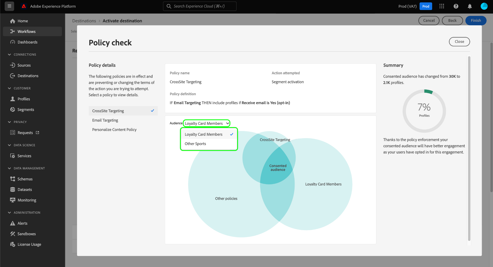

# Automatisk policytillämpning

Dataanvändningsetiketter och -profiler är tillgängliga för alla Adobe Experience Platform-användare. Definiera dataanvändningspolicyer och använd etiketter för dataanvändning för att säkerställa att känsliga, identifierbara eller avtalsbaserade data hanteras korrekt. Dessa åtgärder hjälper er att tillämpa organisationens regler för datastyrning på hur data kan nås, bearbetas, lagras och delas.

För att skydda organisationen från potentiella risker och förpliktelser tillämpar Platform automatiskt användarprofiler om något brott inträffar när målgrupper aktiveras till destinationer.

>[!IMPORTANT]
>
>Policy för samtycke och automatisk tillämpning av samtyckespolicy är endast tillgängligt för organisationer som har köpt **Adobe Healthcare Shield** eller **Adobe Privacy &amp; Security Shield**.

I det här dokumentet fokuseras på att genomföra regler för datastyrning och samtycke. Mer information om åtkomstkontrollprinciper finns i dokumentationen om [attributbaserad åtkomstkontroll](../../access-control/abac/overview.md).

## Förutsättningar

Den här handboken kräver en fungerande förståelse av de plattformstjänster som används i automatisk tillämpning. Läs följande dokumentation om du vill veta mer innan du fortsätter med den här guiden:

* [Adobe Experience Platform datastyrning](../home.md): Det ramverk som Platform använder för att driva igenom efterlevnad av regler för dataanvändning genom användning av etiketter och policyer.
* [Kundprofil i realtid](../../profile/home.md): Ger en enhetlig konsumentprofil i realtid baserad på aggregerade data från flera källor.
* [Adobe Experience Platform segmenteringstjänst](../../segmentation/home.md): Segmenteringsmotorn i [!DNL Platform] används för att skapa målgrupper utifrån era kundprofiler utifrån kundbeteenden och attribut.
* [Destinationer](../../destinations/home.md): Destinationer är färdiga integreringar med vanliga applikationer som möjliggör smidig aktivering av data från Platform för flerkanalskampanjer, e-postkampanjer, riktad reklam med mera.

## Tvingande flöde {#flow}

I följande diagram visas hur policytillämpning integreras i dataflödet för målgruppsaktivering:

När en målgrupp aktiveras första gången [!DNL Policy Service] kontroller av tillämpliga policyer grundade på följande faktorer:

* De dataanvändningsetiketter som används för fält och datauppsättningar inom den målgrupp som ska aktiveras.
* Destinationens marknadsföringssyfte.
* De profiler som har samtyckt till att inkluderas i målgruppsaktiveringen, baserat på dina konfigurerade medgivandeprinciper.

>[!NOTE]
>
>Om det finns dataanvändningsetiketter som bara har tillämpats på vissa fält i en datamängd (i stället för hela datamängden), tillämpas dessa fältetiketter endast under följande förhållanden:
>
>* Fälten används i målgruppen.
>* Fälten konfigureras som projicerade attribut för målmålet.

## Datalinje {#lineage}

Datalindelningen spelar en viktig roll när det gäller hur policyer tillämpas i plattformen. I allmänhet avser datalinjen ursprunget för en datauppsättning och vad som händer med den (eller där den flyttas) över tiden.

När det gäller datastyrning gör länkning det möjligt för dataanvändningsetiketter att sprida information från scheman till tjänster i senare led som förbrukar deras data, som kundprofil i realtid och destinationer. Detta gör det möjligt att utvärdera och tillämpa principer vid flera viktiga punkter i dataöverföringen via Platform och ger kontext till datakonsumenterna om varför en policyöverträdelse inträffade.

I Experience Platform berörs den politiska kontrollen av följande:

1. Data hämtas till plattformen och lagras i **datauppsättningar**.
1. Kundprofiler identifieras och konstrueras utifrån dessa datauppsättningar genom att sammanfoga datafragment enligt **sammanfogningsprincip**.
1. Profilgrupper delas in i **målgrupper** baserat på gemensamma attribut.
1. Målgrupperna är aktiva nedåt **mål**.

Varje steg i ovanstående tidslinje representerar en enhet som kan bidra till policytillämpning, enligt tabellen nedan:

| Datalindelningsfas | Roll vid policytillämpning |
| --- | --- |
| Datauppsättning | Datauppsättningar innehåller dataanvändningsetiketter (som används på schemafältnivå eller på hela datauppsättningsnivå) som definierar vilka användningsfall som hela datauppsättningen eller specifika fält kan användas för. Policyöverträdelser inträffar om en datauppsättning eller ett fält som innehåller vissa etiketter används i ett syfte som en princip begränsar.  Alla medgivandeattribut som samlas in från dina kunder lagras också i datauppsättningar. Om du har tillgång till policyer för samtycke, kommer profiler som inte uppfyller kraven för attributet för samtycke i dina policyer att uteslutas från målgrupper som är aktiverade till en destination. |
| Kopplingsprincip | Sammanslagningsprinciper är de regler som används i Platform för att avgöra hur data ska prioriteras när fragment från flera datauppsättningar sammanfogas. Principöverträdelser inträffar om sammanfogningsprinciperna har konfigurerats så att datauppsättningar med begränsade etiketter aktiveras till ett mål. Se [sammanfogningsprinciper - översikt](../../profile/merge-policies/overview.md) för mer information. |
| Målgrupp | Segmenteringsregler definierar vilka attribut som ska inkluderas från kundprofiler. Beroende på vilka fält en segmentdefinition innehåller ärver målgruppen användningsetiketter som används för dessa fält. Policyöverträdelser inträffar om du aktiverar en målgrupp vars ärvda etiketter begränsas av målmålets tillämpliga policyer, baserat på dess användningsfall för marknadsföring. |
| Mål | När man skapar en destination kan man definiera en marknadsföringsåtgärd (kallas ibland för ett marknadsföringsfall). Det här användningsexemplet korrelerar till en marknadsföringsåtgärd enligt definitionen i en policy. Det innebär att den marknadsföringsåtgärd som du definierar för ett mål avgör vilka dataanvändningsprinciper och profiler för samtycke som gäller för det målet.  Policyöverträdelser för dataanvändning inträffar om du aktiverar en målgrupp vars användningsetiketter är begränsade för målmålets marknadsföringsåtgärd.  (Beta) När en målgrupp aktiveras exkluderas alla profiler som inte innehåller de obligatoriska medgivandeattributen för marknadsföringsåtgärden (som definieras i er samtyckespolicy) från den aktiva målgruppen. |

>[!IMPORTANT]
>
>En del dataanvändningsprinciper kan ange två eller flera etiketter med en AND-relation. En policy kan till exempel begränsa en marknadsföringsåtgärd om etiketter `C1` OCH `C2` finns båda, men begränsar inte samma åtgärd om bara en av etiketterna finns.
>
>När det gäller automatisk verkställighet anser datastyrningsramverket inte att aktivering av separata målgrupper till en destination är en kombination av data. Därför är exemplet `C1 AND C2` principen är **NOT** framtvingas om dessa etiketter ingår i separata målgrupper. I stället tillämpas den här principen endast när båda etiketterna finns i samma målgrupp vid aktiveringen.

När policyöverträdelser inträffar ger de resulterande meddelandena som visas i användargränssnittet användbara verktyg för att utforska det datalinje som bidrar till att lösa problemet. Mer information finns i nästa avsnitt.

## Policytvingande meddelanden {#enforcement}

Avsnitten nedan beskriver olika policyefterlevnadsmeddelanden som visas i plattformsgränssnittet:

* [Policyöverträdelse för dataanvändning](#data-usage-violation)
* [Principutvärdering av samtycke](#consent-policy-evaluation)

### Policyöverträdelse för dataanvändning {#data-usage-violation}

Om en principöverträdelse inträffar från försök att aktivera en målgrupp (eller [göra ändringar i en redan aktiverad publik](#policy-enforcement-for-activated-audiences)) förhindras åtgärden och en pover visas som indikerar att en eller flera profiler har överträtts. När en överträdelse har utlösts **[!UICONTROL Save]** knappen är inaktiverad för den entitet som du ändrar tills rätt komponenter har uppdaterats för att uppfylla dataanvändningsprinciperna.

Välj en principöverträdelse i poverarens vänstra kolumn för att visa information om den överträdelsen.

Överträdelsemeddelandet innehåller en sammanfattning av den princip som överträtts, inklusive villkoren som principen är konfigurerad att kontrollera, den specifika åtgärd som utlöste överträdelsen och en lista med möjliga lösningar på problemet.

Ett datalinjediagram visas nedanför sammanfattningen av överträdelser, vilket gör att du kan se vilka datauppsättningar, sammanfogningsprinciper, målgrupper och mål som berördes av överträdelsen. Enheten som du håller på att ändra markeras i diagrammet, vilket anger vilken punkt i flödet som orsakar att överträdelsen inträffar. Du kan välja ett enhetsnamn i diagrammet för att öppna informationssidan för den aktuella entiteten.

Du kan också använda **[!UICONTROL Filter]** ikon () för att filtrera de visade enheterna efter kategori. Minst två kategorier måste väljas för att data ska kunna visas.

Välj **[!UICONTROL List view]** för att visa datalinjen som en lista. Om du vill växla tillbaka till det visuella diagrammet väljer du **[!UICONTROL Path view]**.

### Principutvärdering av samtycke {#consent-policy-evaluation}

När du aktiverar en målgrupp kan du se hur [medgivandeprinciper](../policies/user-guide.md#consent-policy) påverkar olika procentandelar av profiler som ingår i aktiveringen.

>[!NOTE]
>
>Samtyckesregler är endast tillgängliga för organisationer som har köpt Adobe Healthcare Shield eller Adobe Privacy &amp; Security Shield.

#### Policyförbättringar för samtycke för betalmedia {#consent-policy-enhancement}

Förbättrad tillämpning av samtyckespolicy på [batch](../../destinations/destination-types.md#file-based) och [direktuppspelning](../../destinations/destination-types.md#streaming-destinations) destinationer inklusive betalmediaaktiveringar har gjorts. Den här förbättringen är tillgänglig för kunder som har skölden för skydd av privatlivet och säkerheten och hälso- och sjukvården, och tar aktivt bort profiler från batch- och strömningsdestinationer när medgivandestatusen ändras. Det garanterar också att ändringar av samtycke sprids omedelbart så att rätt målgrupp alltid målgruppsanpassas.

Dessa förbättringar ger större förtroende för er marknadsföringsstrategi eftersom det eliminerar behovet av att marknadsförare manuellt lägger till medgivandeattribut i sina segmentuttryck. Detta garanterar att inga profiler oavsiktligt riktas mot marknadsföringsupplevelser när samtycke har återkallats eller inte längre är kvalificerade för en samtyckespolicy. De policyer för godkännande av marknadsföring som anger regler för hur samtycke eller inställningsdata ska hanteras i olika arbetsflöden för marknadsföring, tillämpas nu automatiskt i arbetsflöden för aktivering i efterföljande lösningar.

>[!NOTE]
>
>Den här förbättringen resulterar inte i några gränssnittsändringar.

#### Utvärdering före aktivering

När du har kommit till **[!UICONTROL Review]** steg när [aktivera ett mål](../../destinations/ui/activation-overview.md), markera **[!UICONTROL View applied policies]**.

En dialogruta för policykontroll visas som visar en förhandsgranskning av hur dina medgivandeprinciper påverkar den godkända målgruppen för de aktiverade målgrupperna.

Dialogrutan visar den godkända publiken för en målgrupp i taget. Om du vill visa principutvärderingen för en annan målgrupp använder du listrutan ovanför diagrammet och väljer en i listan.

Använd den vänstra listen för att växla mellan tillämpliga medgivandeprinciper för den valda publiken. Profiler som inte är markerade visas i[!UICONTROL Other policies]i diagrammet.

I diagrammet visas överlappningen mellan tre profilgrupper:

1. Profiler som uppfyller kraven för den valda målgruppen
1. Profiler som är kvalificerade för den valda medgivandeprincipen
1. Profiler som omfattas av andra tillämpliga medgivandepolicyer för målgruppen (kallas&quot;[!UICONTROL Other policies]&quot; i diagrammet)

De profiler som är kvalificerade för alla tre av de ovanstående grupperna representerar den godkända målgruppen, som sammanfattas i rätt spår.

Håll pekaren över en av målgrupperna i diagrammet för att visa antalet profiler som det innehåller.

Den godkända publiken representeras av den centrala överlappningen i diagrammet och kan markeras som i andra avsnitt.

#### Flödeskörning

När data aktiveras till ett mål visar flödeskörningsinformationen antalet identiteter som har uteslutits på grund av aktiva medgivandeprinciper.

## Politiska åtgärder för aktiverade målgrupper {#policy-enforcement-for-activated-audiences}

Politiska åtgärder tillämpas fortfarande på målgrupper efter det att de har aktiverats och begränsar eventuella ändringar av en målgrupp eller dess mål som skulle leda till en överträdelse av policyn. På grund av hur [datalinje](#lineage) fungerar i policytillämpning, kan någon av följande åtgärder utlösa en överträdelse:

* Uppdaterar dataanvändningsetiketter
* Ändra datauppsättningar för en målgrupp
* Föränderliga målgruppspredikat
* Ändra målkonfigurationer

Om någon av ovanstående åtgärder utlöser en överträdelse förhindras den åtgärden från att sparas och ett meddelande om policyöverträdelse visas, vilket säkerställer att de aktiverade målgrupperna fortsätter att följa dataanvändningsprinciperna när de ändras.

## Nästa steg

Det här dokumentet beskriver hur automatisk tillämpning av regler fungerar i Experience Platform. Anvisningar om hur du programmässigt integrerar policytillämpning i dina program med API-anrop finns i handboken [API-baserad tillämpning](./api-enforcement.md).
