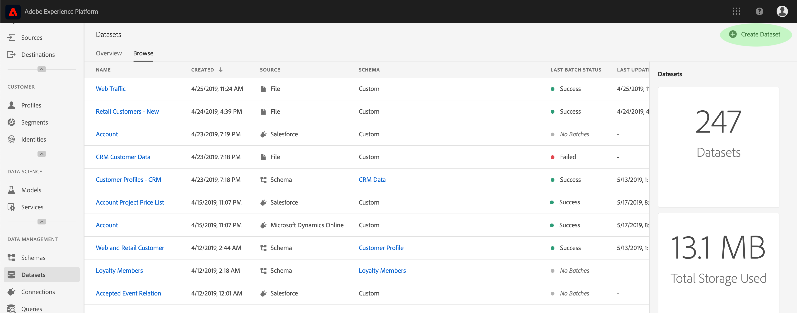
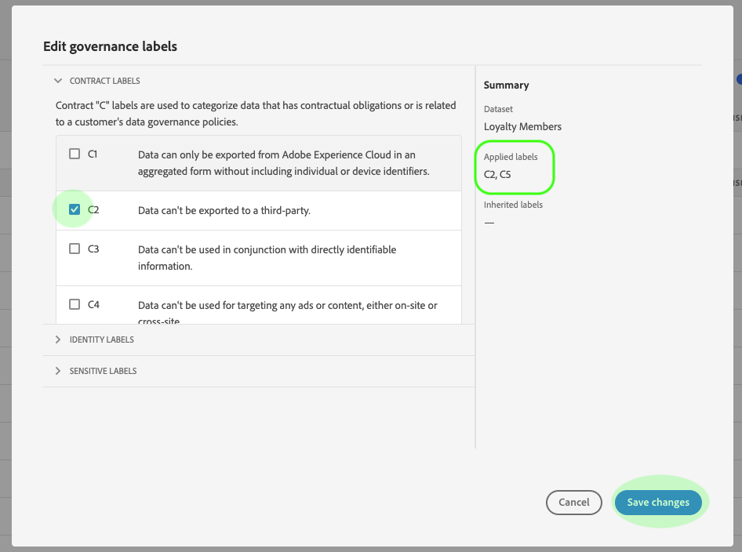

# Användarhandbok för etiketter för dataanvändning

Den här användarhandboken innehåller steg för att arbeta med dataanvändningsetiketter (kallas även DULE-etiketter) i [!DNL Experience Platform] användargränssnittet. Innan du använder guiden bör du läsa översikten över [datastyrning](../home.md) för en mer robust introduktion till DULE-ramverket.

## Hantera dataanvändningsetiketter på datauppsättningsnivå

För att kunna hantera dataanvändningsetiketter på datauppsättningsnivå måste du välja en befintlig datauppsättning eller skapa en ny. När du har loggat in i Adobe Experience Platform väljer du **[!UICONTROL Datasets]** i den vänstra navigeringen för att öppna arbetsytan _Datauppsättningar_ . På den här sidan visas alla skapade datauppsättningar som tillhör din organisation, tillsammans med användbar information om varje datauppsättning.

I nästa avsnitt beskrivs hur du skapar en ny datauppsättning som du kan använda etiketter på. Om du vill redigera etiketter för en befintlig datauppsättning, markerar du datauppsättningen i listan och går vidare till att [lägga till etiketter för dataanvändning i datauppsättningen](#add-labels).

### Skapa en ny datauppsättning

>[!NOTE]
>
>I det här exemplet skapas en datauppsättning med ett förkonfigurerat [!DNL Experience Data Model] (XDM) schema. Mer information om XDM-scheman finns i [XDM-systemöversikten](../../xdm/home.md) och [grunderna för schemakomposition](../../xdm/schema/composition.md).

Om du vill skapa en ny datauppsättning klickar du **[!UICONTROL Create Dataset]** i det övre högra hörnet av _[!UICONTROL Datasets]_arbetsytan.

Skärmen visas _[!UICONTROL Create Dataset]_. Klicka här **[!UICONTROL Create Dataset from Schema]**.

Skärmen visas _[!UICONTROL Select Schema]_, där alla tillgängliga scheman som du kan använda för att skapa en datauppsättning visas. Klicka på alternativknappen bredvid ett schema för att markera det. I avsnittet till höger visas ytterligare information om det valda schemat_[!UICONTROL Schemas]_ . När du har valt ett schema klickar du på **[!UICONTROL Next]**.

Skärmen _Konfigurera datauppsättning_ visas. Ange ett **namn** (obligatoriskt) och en **beskrivning** (valfritt, men rekommenderas) för den nya datauppsättningen och klicka sedan på **[!UICONTROL Finish]**.

Sidan visas och _[!UICONTROL Dataset Activity]_innehåller information om den nya datauppsättningen. I det här exemplet heter datauppsättningen&quot;Förmånsmedlemmar&quot;, vilket innebär att den översta navigeringen visar_ Datauppsättningar > Förmånsmedlemmar _.

### Lägg till dataanvändningsetiketter i datauppsättningen {#add-labels}

När du har skapat en ny datauppsättning eller valt en befintlig datauppsättning i listan på _[!UICONTROL Datasets]_arbetsytan klickar du på&#x200B;**[!UICONTROL Data Governance]**för att öppna_[!UICONTROL Data Governance]_ arbetsytan. På arbetsytan kan du hantera dataanvändningsetiketter på datauppsättningsnivå och fältnivå.

Om du vill redigera dataanvändningsetiketter på datauppsättningsnivå börjar du med att klicka på pennikonen bredvid datauppsättningsnamnet.

Dialogrutan _[!UICONTROL Edit Governance Labels]_öppnas. I dialogrutan markerar du rutorna bredvid de etiketter du vill använda på datauppsättningen. Kom ihåg att dessa etiketter ärvs av alla fält i datauppsättningen. Rubriken uppdateras när du markerar varje ruta och visar de etiketter du har valt._[!UICONTROL Applied Labels]_ När du har markerat etiketterna klickar du på **[!UICONTROL Save Changes]**.

 

Arbetsytan visas igen och visar de etiketter som du har använt på datauppsättningsnivå. _[!UICONTROL Data Governance]_Du kan också se att etiketterna ärvs ned till vart och ett av fälten i datauppsättningen.

Observera att ett&quot;x&quot; visas bredvid etiketterna på datauppsättningsnivå, vilket gör att du kan ta bort etiketterna. De ärvda etiketterna bredvid varje fält har inte något &quot;x&quot; bredvid sig och visas&quot;nedtonade&quot; utan möjlighet att ta bort eller redigera. Detta beror på att **ärvda fält är skrivskyddade**, vilket innebär att de inte kan tas bort på fältnivån.

Alternativet är **[!UICONTROL Show Inherited Labels]** aktiverat som standard, vilket gör att du kan se alla etiketter som ärvts ned från datauppsättningen till dess fält. Om du växlar av inaktiveringen döljs alla ärvda etiketter i datauppsättningen.

## Hantera dataanvändningsetiketter på datamängdsfältnivå

Genom att fortsätta arbetsflödet för att [lägga till och redigera dataanvändningsetiketter på datauppsättningsnivå](#add-labels)kan du även hantera fältetiketter på _[!UICONTROL Data Governance]_arbetsytan för den datauppsättningen.

Om du vill använda dataanvändningsetiketter på ett enskilt fält markerar du kryssrutan bredvid fältnamnet och klickar sedan på **[!UICONTROL Edit Governance Labels]**.

Dialogrutan _[!UICONTROL Edit Governance Labels]_visas. I dialogrutan visas rubriker med markerade fält, tillämpade etiketter och ärvda etiketter. Observera att de ärvda etiketterna (C2 och C5) är nedtonade i dialogrutan. De är skrivskyddade etiketter som ärvs från datauppsättningsnivån och kan därför bara redigeras på datauppsättningsnivå.

 

Välj etiketter på fältnivå genom att klicka i kryssrutan bredvid varje etikett som du vill använda. När du väljer etiketter uppdateras sidhuvudet och _[!UICONTROL Applied Labels]_visar etiketter som används i fälten som visas i_[!UICONTROL Selected Fields]_ sidhuvudet. När du har valt etiketter på fältnivå klickar du på **[!UICONTROL Save Changes]**.

 

Arbetsytan visas igen, där de markerade fältetiketterna visas på raden bredvid fältnamnet. _[!UICONTROL Data Governance]_Observera att fältnivåetiketten har ett &quot;x&quot; bredvid sig, vilket gör att du kan ta bort etiketten.

Du kan upprepa de här stegen om du vill fortsätta lägga till och redigera etiketter på fältnivå för ytterligare fält, inklusive markera flera fält för att använda etiketter på fältnivå samtidigt.

Det är viktigt att komma ihåg att arv endast flyttas från den översta nivån nedåt (datamängd → fält), vilket innebär att etiketter som används på fältnivå inte sprids till andra fält eller datamängder.

## Hantera anpassade etiketter

Du kan skapa egna anpassade användningsetiketter på arbetsytan i *[!UICONTROL Policies]* [!DNL Experience Platform] användargränssnittet. Klicka **[!UICONTROL Policies]** i den vänstra navigeringen och klicka sedan för **[!UICONTROL Labels]** att visa en lista med befintliga etiketter. Klicka här **[!UICONTROL Create label]**.

Dialogrutan *[!UICONTROL Create label]* visas. Här anger du följande information för den nya etiketten:

* **[!UICONTROL Identifier]**: En unik identifierare för etiketten. Detta värde används för uppslagsändamål och bör därför vara kort och koncist.
* **[!UICONTROL Name]**: Ett visningsnamn för etiketten.
* **[!UICONTROL Description]**: (Valfritt) En beskrivning av etiketten som ger ytterligare kontext.

När du är klar klickar du på **[!UICONTROL Create]**.

Dialogrutan stängs och den nya anpassade etiketten visas i listan under *[!UICONTROL Labels]* fliken.

Etiketten kan nu väljas under *[!UICONTROL Custom Labels]* redigering av användningsetiketter för datauppsättningar och fält, eller när du skapar dataanvändningsprinciper.

 

## Nästa steg

Nu när du har lagt till etiketter för dataanvändning på data- och fältnivå kan du börja importera data till [!DNL Experience Platform]. Om du vill veta mer kan du börja med att läsa [dokumentationen](../../ingestion/home.md)för dataöverföring.

Nu kan du även definiera dataanvändningsprinciper baserat på de etiketter du har använt. Mer information finns i översikten över [dataanvändningsprinciper](../policies/overview.md).

## Ytterligare resurser

Följande video är avsedd att ge dig bättre förståelse för [!DNL Data Governance]och ger en översikt över hur du använder etiketter i en datauppsättning och i enskilda fält.

>[!VIDEO](https://video.tv.adobe.com/v/29709?quality=12&enable10seconds=on&speedcontrol=on)
