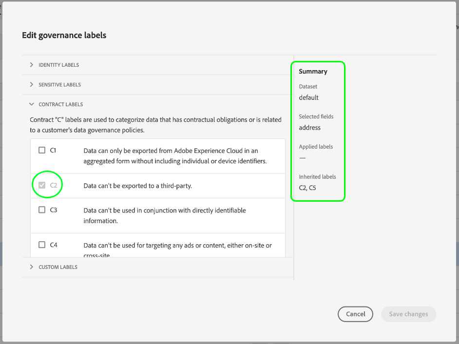

# Hantera etiketter för dataanvändning i användargränssnittet

Den här användarhandboken innehåller steg för att arbeta med dataanvändningsetiketter i [!DNL Experience Platform]-användargränssnittet. Innan du använder guiden bör du läsa [[!DNL Data Governance] översikten](../home.md) för en mer robust introduktion till [!DNL Data Governance]-ramverket.

## Hantera etiketter på datauppsättningsnivå

För att kunna hantera dataanvändningsetiketter på datauppsättningsnivå måste du välja en befintlig datauppsättning eller skapa en ny. När du har loggat in på Adobe Experience Platform väljer du **[!UICONTROL Datasets]** i den vänstra navigeringen för att öppna arbetsytan **[!UICONTROL Datasets]**. På den här sidan visas alla skapade datauppsättningar som tillhör din organisation, tillsammans med användbar information om varje datauppsättning.

I nästa avsnitt beskrivs hur du skapar en ny datauppsättning som du kan använda etiketter på. Om du vill redigera etiketter för en befintlig datauppsättning markerar du datauppsättningen i listan och går vidare till [att lägga till dataanvändningsetiketter i datauppsättningen](#add-labels).

### Skapa en ny datauppsättning

>[!NOTE]
>
>I det här exemplet skapas en datauppsättning med ett förkonfigurerat [!DNL Experience Data Model]-schema (XDM). Mer information om XDM-scheman finns i [XDM-systemöversikt](../../xdm/home.md) och [grunder för schemakomposition](../../xdm/schema/composition.md).

Om du vill skapa en ny datauppsättning väljer du **[!UICONTROL Create Dataset]** i det övre högra hörnet av arbetsytan **[!UICONTROL Datasets]**.

Skärmen **[!UICONTROL Create Dataset]** visas. Välj **[!UICONTROL Create Dataset from Schema]** härifrån.

Skärmen **[!UICONTROL Select Schema]** visas med alla tillgängliga scheman som du kan använda för att skapa en datauppsättning. Markera alternativknappen bredvid ett schema för att markera det. Avsnittet **[!UICONTROL Schemas]** till höger visar ytterligare information om det valda schemat. När du har valt ett schema väljer du **[!UICONTROL Next]**.

Skärmen **[!UICONTROL Configure Dataset]** visas. Ange ett namn (obligatoriskt) och en beskrivning (valfritt, men rekommenderas) för den nya datauppsättningen och välj sedan **[!UICONTROL Finish]**.

Sidan **[!UICONTROL Dataset Activity]** visas med information om den nya datauppsättningen. I det här exemplet heter datauppsättningen&quot;Förmånsmedlemmar&quot;, och den översta navigeringen visar **Datauppsättningar > Förmånsmedlemmar**.

### Lägg till dataanvändningsetiketter i datauppsättningen {#add-labels}

När du har skapat en ny datauppsättning eller valt en befintlig datauppsättning i listan på arbetsytan **[!UICONTROL Datasets]** väljer du **[!UICONTROL Data Governance]** för att öppna arbetsytan **[!UICONTROL Data Governance]**. På arbetsytan kan du hantera dataanvändningsetiketter på datauppsättningsnivå och fältnivå.

Om du vill redigera dataanvändningsetiketter på datauppsättningsnivå börjar du med att välja pennikonen bredvid datauppsättningsnamnet.

Dialogrutan **[!UICONTROL Edit Governance Labels]** öppnas. I dialogrutan markerar du rutorna bredvid de etiketter du vill använda på datauppsättningen. Kom ihåg att dessa etiketter ärvs av alla fält i datauppsättningen. Rubriken **[!UICONTROL Applied Labels]** uppdateras när du markerar varje ruta och visar de etiketter du har valt. När du har valt de önskade etiketterna väljer du **[!UICONTROL Save Changes]**.

 

Arbetsytan **[!UICONTROL Data Governance]** visas igen med etiketter som du har använt på datauppsättningsnivå. Du kan också se att etiketterna ärvs ned till vart och ett av fälten i datauppsättningen.

Observera att ett&quot;x&quot; visas bredvid etiketterna på datauppsättningsnivå, vilket gör att du kan ta bort etiketterna. De ärvda etiketterna bredvid varje fält har inte något &quot;x&quot; bredvid sig och visas&quot;nedtonade&quot; utan möjlighet att ta bort eller redigera. Detta beror på att **ärvda fält är skrivskyddade**, vilket innebär att de inte kan tas bort på fältnivån.

Alternativet **[!UICONTROL Show Inherited Labels]** är aktiverat som standard, vilket gör att du kan se alla etiketter som ärvts ned från datauppsättningen till dess fält. Om du växlar av inaktiveringen döljs alla ärvda etiketter i datauppsättningen.

## Hantera etiketter på fältnivå

Om du fortsätter arbetsflödet för [att lägga till och redigera dataanvändningsetiketter på datauppsättningsnivå](#add-labels) kan du även hantera fältetiketter på arbetsytan **[!UICONTROL Data Governance]** för den datauppsättningen.

Om du vill använda dataanvändningsetiketter på ett enskilt fält markerar du kryssrutan bredvid fältnamnet och väljer sedan **[!UICONTROL Edit Governance Labels]**.

Dialogrutan **[!UICONTROL Edit Governance Labels]** visas. I dialogrutan visas rubriker med markerade fält, tillämpade etiketter och ärvda etiketter. Observera att de ärvda etiketterna (C2 och C5) är nedtonade i dialogrutan. De är skrivskyddade etiketter som ärvs från datauppsättningsnivån och kan därför bara redigeras på datauppsättningsnivå.

 

Välj etiketter på fältnivå genom att markera kryssrutan bredvid varje etikett som du vill använda. När du väljer etiketter uppdateras rubriken **[!UICONTROL Applied Labels]** så att etiketter som används i fälten som visas i rubriken **[!UICONTROL Selected Fields]** visas. När du har valt etiketter på fältnivå väljer du **[!UICONTROL Save Changes]**.

 

Arbetsytan **[!UICONTROL Data Governance]** visas igen, vilket nu visar de markerade fältetiketterna i raden bredvid fältnamnet. Observera att fältnivåetiketten har ett &quot;x&quot; bredvid sig, vilket gör att du kan ta bort etiketten.

Du kan upprepa de här stegen om du vill fortsätta lägga till och redigera etiketter på fältnivå för ytterligare fält, inklusive markera flera fält för att använda etiketter på fältnivå samtidigt.

Det är viktigt att komma ihåg att arv endast flyttas från den översta nivån nedåt (datamängd → fält), vilket innebär att etiketter som används på fältnivå inte sprids till andra fält eller datamängder.

## Hantera anpassade etiketter

Du kan skapa egna anpassade användningsetiketter på arbetsytan **[!UICONTROL Policies]** i gränssnittet för [!DNL Experience Platform]. Välj **[!UICONTROL Policies]** i den vänstra navigeringen och välj sedan **[!UICONTROL Labels]** för att visa en lista över befintliga etiketter. Välj **[!UICONTROL Create label]** härifrån.

Dialogrutan **[!UICONTROL Create label]** visas. Här anger du följande information för den nya etiketten:

* **[!UICONTROL Identifier]**: En unik identifierare för etiketten. Detta värde används för uppslagsändamål och bör därför vara kort och koncist.
* **[!UICONTROL Name]**: Ett visningsnamn för etiketten.
* **[!UICONTROL Description]**: (Valfritt) En beskrivning av etiketten som ger ytterligare kontext.

När du är klar väljer du **[!UICONTROL Create]**.

Dialogrutan stängs och den nya anpassade etiketten visas i listan under fliken **[!UICONTROL Labels]**.

Etiketten kan nu väljas under **[!UICONTROL Custom Labels]** när du redigerar användningsetiketter för datauppsättningar och fält, eller när du skapar dataanvändningsprinciper.

 

## Nästa steg

Nu när du har lagt till etiketter för dataanvändning på data- och fältnivå kan du börja importera data till [!DNL Experience Platform]. Om du vill veta mer börjar du med att läsa [dokumentationen om datafrågor](../../ingestion/home.md).

Nu kan du även definiera dataanvändningsprinciper baserat på de etiketter du har använt. Mer information finns i översikten över [dataanvändningsprinciper](../policies/overview.md).

## Ytterligare resurser

Följande video är avsedd att ge stöd för din förståelse av [!DNL Data Governance] och visar hur du använder etiketter på en datamängd och enskilda fält.

>[!VIDEO](https://video.tv.adobe.com/v/29709?quality=12&enable10seconds=on&speedcontrol=on)
