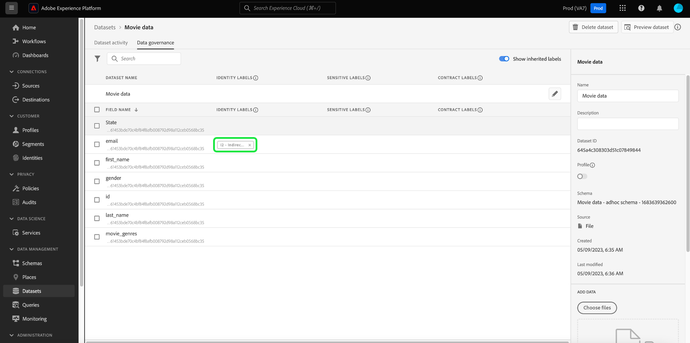

# Hantera etiketter för dataanvändning i användargränssnittet {#user-guide}

>[!CONTEXTUALHELP]
>id="platform_privacyConsole_dataGovernance_description"
>title="Styrd dataanvändning i Experience Platform"
>abstract="<h2>Beskrivning</h2>
Med ramverket för datastyrning i Experience Platform kan ni märka attribut och scheman enligt dataanvändningsbegränsningar och skapa policyer som identifierar och följer dessa begränsningar för specifika marknadsföringsåtgärder.
"

Den här användarhandboken innehåller steg för att arbeta med dataanvändningsetiketter i användargränssnittet för [!DNL Experience Platform].

## Hantera etiketter {#manage-labels}

Om du vill använda etiketter på dina data behöver du behörigheten **[!UICONTROL Manage Usage Labels]** för användning i standardproduktionssandlådan prod. Om du vill skapa en anpassad etikett måste du även ha administratörsbehörighet för produktprofilen. Varje organisation har bara en lista över tillämpliga etiketter. Du **kan inte** ta bort etiketter. I stället kan du ta bort dem från de datauppsättningar eller fält som de tillämpas på.

Mer information om hur du tilldelar en behörighet finns i guiden [Konfigurera behörigheter](https://experienceleague.adobe.com/docs/platform-learn/getting-started-for-data-architects-and-data-engineers/configure-permissions.html) eller i [åtkomstkontrollsöversikten](../../access-control/home.md) . Kontakta din organisations administratör om du inte har tillgång till Admin Console för din organisation.

## Hantera etiketter på schemanivå

Du kan lägga till etiketter direkt i ett eller flera scheman inom det schemat. Alla fält som används på schemanivå sprids till alla datauppsättningar som baseras på det schemat.

>[!NOTE]
>
>Om dina dataanvändningsprinciper skapades innan du gav fältet en etikett kan du stöta på en dialogruta om brott mot styrningsprinciper när du tillämpar etiketter på det nya schemat. Den här dialogrutan anger att användningen av den här etiketten bryter mot en befintlig användarprofil. Använd datalänksdiagrammet för att förstå vilka andra konfigurationsändringar som behöver göras innan du kan lägga till etiketten i schemafältet.
>
>
>
>Mer information om policyöverträdelser finns i [dokumentationen om brott mot dataanvändningsprincipen](../enforcement/auto-enforcement.md#data-usage-violation).

För att kunna hantera dataanvändningsetiketter på schemanivå måste du välja ett befintligt schema eller skapa ett nytt. När du har loggat in på Adobe Experience Platform väljer du **[!UICONTROL Schemas]** i den vänstra navigeringen för att öppna arbetsytan i **[!UICONTROL Schemas]**. På den här sidan visas alla scheman som du har skapat och användbar information om varje schema.

I nästa avsnitt beskrivs hur du skapar ett nytt schema som du kan använda etiketter på. Om du vill redigera etiketter för ett befintligt schema väljer du schemat i listan och går sedan vidare till [lägger till dataanvändningsetiketter i schemat](#add-labels).

### Skapa ett nytt schema

Om du vill skapa ett nytt schema väljer du **[!UICONTROL Create schema]** i det övre högra hörnet av arbetsytan i **[!UICONTROL Schemas]**. Fullständiga anvisningar finns i guiden [Skapa ett schema med Schemaredigeraren](../../xdm/tutorials/create-schema-ui.md#create). Du kan också [skapa ett schema med API:t ](../../xdm/tutorials/create-schema-api.md) för schemaregister om det behövs.

### Lägga till dataanvändningsetiketter i ett schema {#add-labels-to-schema}

När du har skapat ett nytt schema, eller valt ett befintligt schema från listan på fliken [!UICONTROL Browse] på arbetsytan i [!UICONTROL Schemas], väljer du ett fält från schemat i Schemaredigeraren. Välj **[!UICONTROL Apply Access and Data Governance Labels]** i sidofältet [!UICONTROL Field properties].

En dialogruta visas där du kan använda och hantera dataanvändningsetiketter på schemanivå och fältnivå. I XDM-självstudiekursen finns fullständiga anvisningar om [hur du lägger till eller redigerar dataanvändningsetiketter för XDM-scheman](../../xdm/tutorials/labels.md#select-schema-field).

### Lägga till etiketter för dataanvändning i en viss datauppsättning {#add-labels-to-dataset}

>[!CONTEXTUALHELP]
>id="platform_privacyConsole_dataGovernance_instructions"
>title="Instruktioner"
>abstract="<ol><li>Välj <a href="https://experienceleague.adobe.com/docs/experience-platform/data-governance/labels/user-guide.html">Datauppsättningar</a> i den vänstra navigeringen och markera sedan den datauppsättning vars data du vill begränsa.</li><li>Välj fliken <b>Datastyrning</b> i informationsvyn för datauppsättningen.</li><li>Markera de datauppsättningsfält som du vill begränsa och välj sedan <b>Redigera styrningsetiketter</b> för att etikettera data baserat på användningsbegränsningar.</li><li>När du har etiketterat dina data väljer du <a href="https://experienceleague.adobe.com/docs/experience-platform/data-governance/policies/overview.html">Profiler</a> i den vänstra navigeringen och sedan <b>Skapa profil</b>.</li><li>Välj om du vill skapa en <a href="https://experienceleague.adobe.com/docs/experience-platform/data-governance/policies/user-guide.html#create-governance-policy">datastyrningsprincip</a> och sedan de dataanvändningsetiketter som principen ska gälla för.</li><li>Välj de marknadsföringsåtgärder som profilen nekar för alla data som innehåller dessa etiketter. När profilen har skapats markerar du den i listan och aktiverar den med hjälp av växlingsknappen till höger.</li><li>För varje aktiverad princip förhindrar Experience Platform att data som innehåller de angivna etiketterna används för definierade marknadsföringsåtgärder. Detta görs automatiskt när du försöker aktivera märkta data till ett mål med associerade marknadsföringsåtgärder (användningsfall).</li></ol>"

>[!IMPORTANT]
>
>Etiketter kan inte längre användas på fält på datauppsättningsnivå. Det här arbetsflödet har ersatts med etiketter på schemanivå. Etiketter som tidigare använts på datauppsättningens objektnivå stöds fortfarande i Experience Platform-gränssnittet fram till den 31 maj 2024. För att etiketterna ska vara enhetliga i alla scheman måste du migrera alla etiketter som tidigare har kopplats till fält på datauppsättningsnivå till schemanivån under det kommande året. I dokumentationen finns instruktioner om [hur du migrerar tidigare använda etiketter från datauppsättningen till schemanivån](../e2e.md#migrate-labels).

Etiketter kan användas på hela datauppsättningen från fliken **[!UICONTROL Data Governance]** på arbetsytan **[!UICONTROL Datasets]**. På arbetsytan kan du hantera dataanvändningsetiketter på datauppsättningsnivå.

![Fliken [!UICONTROL Data Governance] i arbetsytan [!UICONTROL Datasets] med datastyrning markerad.](../images/labels/dataset-governance.png)

Om du vill redigera dataanvändningsetiketter på datauppsättningsnivå börjar du med att välja pennikonen () i raden med datauppsättningsnamnet.

![Fliken [!UICONTROL Data Governance] på arbetsytan [!UICONTROL Datasets] med ikonen för redigeringspenna markerad.](../images/labels/dataset-level-edit.png)

Dialogrutan **[!UICONTROL Edit Governance Labels]** öppnas. I dialogrutan markerar du rutorna bredvid de etiketter du vill använda på datauppsättningen. Kom ihåg att dessa etiketter ärvs av alla fält i datauppsättningen. Rubriken **[!UICONTROL Applied Labels]** uppdateras när du markerar varje ruta och visar de etiketter du har valt. Välj **[!UICONTROL Save Changes]** när du har valt de önskade etiketterna.

Arbetsytan **[!UICONTROL Data Governance]** visas igen och visar etiketterna som du har använt på datauppsättningsnivå i den första raden i tabellen. Du kan också se etiketterna, som anges med enskilda kort, som ärvs ned till vart och ett av fälten i datauppsättningen.

![Fliken [!UICONTROL Data Governance] på arbetsytan [!UICONTROL Datasets] med tillämpade etiketter på datauppsättningsnivå och ärvda etiketter i datauppsättningsfält markerade.](../images/labels/applied-dataset-labels.png)

### Ta bort etiketter från en datauppsättning {#remove-labels-from-a-dataset}

Etiketter som läggs till på datauppsättningsnivå har &quot;x&quot; bredvid kortet. På så sätt kan du ta bort etiketterna från hela datauppsättningen. Ärvda etiketter bredvid varje fält saknar&quot;x&quot; och visas&quot;nedtonade&quot;. Dessa **ärvda etiketter är skrivskyddade**, vilket innebär att de inte kan tas bort eller redigeras på fältnivå.

<!-- ## View labels at the dataset field level {#view-labels-at-dataset-field-level} -->

<!-- To view labels inherited by the dataset from the schema level, select **[!UICONTROL Datasets]** to navigate to the datasets workspace and select the relevant dataset from the list. 

Next, select the **[!UICONTROL Data Governance]** tab to show the labels that have been applied to the dataset. You can also see that the labels are inherited down to each of the fields within the dataset.

The inherited labels beside each field do not have an "x" next to them and appear "greyed out" with no ability to remove or edit. This is because **inherited fields are read-only**, meaning they cannot be removed at the field level. -->

<!--Beleive can cut above here  -->

Växeln **[!UICONTROL Show Inherited Labels]** är aktiverad som standard, vilket gör att du kan se alla etiketter som ärvts ned från schemat till dess fält. Om du växlar av inaktiveringen döljs alla ärvda etiketter i datauppsättningen.

<!-- Labels applied to the dataset appear in read-only form within the **[!UICONTROL Data Governance]** view for that dataset. 

 -->

>[!NOTE]
>
>Etiketter som tillämpades innan funktionen för datauppsättningsetiketter var föråldrad kan tas bort från datauppsättningen genom att hitta den relevanta datauppsättningen och välja ikonen för att avbryta på etiketten.
>
>I dokumentationen finns instruktioner om [hur du migrerar tidigare använda etiketter från datauppsättningen till schemanivån](../e2e.md#migrate-labels).

## Hantera anpassade etiketter {#manage-custom-labels}

>[!CONTEXTUALHELP]
>id="platform_governance_createlabels"
>title="Skapa etiketter"
>abstract="Med etiketter kan du kategorisera datauppsättningar och fält enligt de användarprofiler som gäller för dessa data. Experience Platform har en standarduppsättning med etiketter som du kan använda, men du kan också skapa anpassade etiketter som är specifika för din organisation."

Du kan skapa egna anpassade användningsetiketter på arbetsytan **[!UICONTROL Policies]** i användargränssnittet i [!DNL Experience Platform]. Välj **[!UICONTROL Policies]** i den vänstra navigeringen och välj sedan **[!UICONTROL Labels]** för att visa en lista över befintliga etiketter. Välj **[!UICONTROL Create label]** härifrån.

Dialogrutan **[!UICONTROL Create label]** visas. Här anger du följande information för den nya etiketten:

* **[!UICONTROL Name]**: En unik identifierare för etiketten. Detta värde används för uppslagsändamål och bör därför vara kort och koncist.
* **[!UICONTROL Friendly name]**: Ett visningsnamn för etiketten.
* **[!UICONTROL Description]**: (Valfritt) En beskrivning av etiketten för att ge ytterligare kontext.

När du är klar väljer du **[!UICONTROL Create]**.

Dialogrutan stängs och den nya anpassade etiketten visas i listan på fliken **[!UICONTROL Labels]**.

Etiketten kan nu väljas under **[!UICONTROL Custom Labels]** när du redigerar användningsetiketter för datauppsättningar och fält, eller när du skapar dataanvändningsprinciper.

## Nästa steg

Nu när du har lagt till etiketter för dataanvändning på data- och fältnivå kan du börja importera data till [!DNL Experience Platform]. Om du vill ha mer information börjar du med att läsa [dokumentationen för dataöverföring](../../ingestion/home.md).

Nu kan du även definiera dataanvändningsprinciper baserat på de etiketter du har använt. Mer information finns i översikten över [dataanvändningsprinciper](../policies/overview.md).

<!-- The workflow of this video is now outdated. This can be enabled once the video has been updated

## Additional resources

The following video is intended to support your understanding of Data Governance, and outlines how to apply labels to a dataset and individual fields.

>[!VIDEO](https://video.tv.adobe.com/v/29709?quality=12&enable10seconds=on&speedcontrol=on) -->
