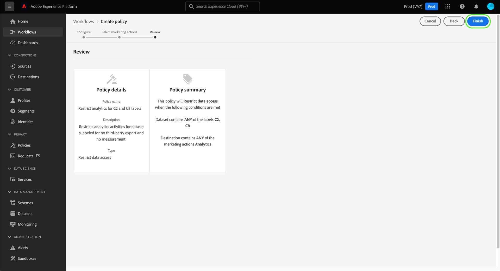
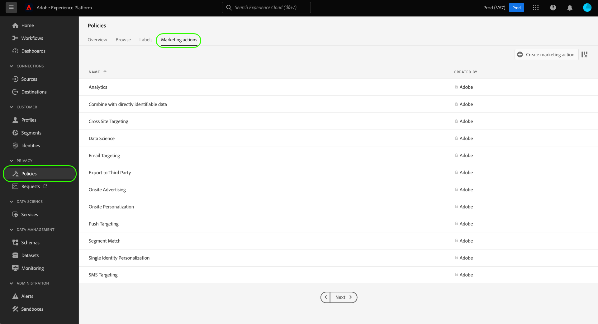

# Användarhandbok för dataanvändningsprinciper

Adobe Experience Platform [!DNL Data Governance] har ett användargränssnitt där du kan skapa och hantera dataanvändningsprinciper. Det här dokumentet innehåller en översikt över de åtgärder du kan utföra på arbetsytan _Profiler_ i [!DNL Experience Platform] användargränssnittet.

>[!IMPORTANT]
>
>Alla dataanvändningsprinciper (inklusive huvudprinciper som tillhandahålls av Adobe) inaktiveras som standard. För att en enskild princip ska kunna användas för verkställighet måste du manuellt aktivera den principen. I avsnittet [Aktivera profiler](#enable) finns mer information om hur du gör detta i användargränssnittet.

## Förutsättningar

Handboken kräver en fungerande förståelse av följande [!DNL Experience Platform] begrepp:

- [!DNL Data Governance](../home.md)
- [Dataanvändningspolicyer](./overview.md)

## Visa dataanvändningspolicyer {#view-policies}

Öppna arbetsytan genom [!DNL Experience Platform] att klicka i **[!UICONTROL Policies]** användargränssnittet. *[!UICONTROL Policies]* . På fliken **[!UICONTROL Browse]** kan du se en lista över tillgängliga profiler, inklusive tillhörande etiketter, marknadsföringsåtgärder och status.

Klicka på en listad profil för att visa dess beskrivning och typ. Om du väljer en anpassad profil visas ytterligare kontroller för att redigera, ta bort eller [aktivera/inaktivera profilen](#enable).

## Skapa en anpassad dataanvändningsprincip {#create-policy}

Om du vill skapa en ny anpassad dataanvändningsprincip klickar du **[!UICONTROL Create policy]** i det övre högra hörnet av **[!UICONTROL Browse]** fliken på *[!UICONTROL Policies]* arbetsytan.

Arbetsflödet *[!UICONTROL Create policy]* visas. Börja med att ange ett namn och en beskrivning för den nya principen.

Välj sedan de dataanvändningsetiketter som profilen ska baseras på. När du väljer flera etiketter kan du välja om informationen ska innehålla alla etiketter eller bara en av dem för att profilen ska kunna användas. Klicka **[!UICONTROL Next]** när du är klar.

Steget *[!UICONTROL Select marketing actions]* visas. Välj lämpliga marknadsföringsåtgärder i listan och klicka sedan på **[!UICONTROL Next]** för att fortsätta.

>[!NOTE]
>
>När man väljer flera marknadsföringsåtgärder tolkas de som en &quot;OR&quot;-regel. Med andra ord gäller policyn om _någon_ av de valda marknadsföringsåtgärderna utförs.

Steget visas så att du kan granska informationen om den nya profilen innan du skapar den. *[!UICONTROL Review]* När du är nöjd klickar du på **[!UICONTROL Finish]** för att skapa profilen.

Fliken visas igen, där den nya principen visas med statusen Utkast. *[!UICONTROL Browse]* Om du vill aktivera profilen går du till nästa avsnitt.

## Aktivera eller inaktivera en dataanvändningsprincip {#enable}

Alla dataanvändningsprinciper (inklusive huvudprinciper som tillhandahålls av Adobe) inaktiveras som standard. För att en enskild princip ska kunna användas måste du manuellt aktivera den principen via API:t eller användargränssnittet.

Du kan aktivera eller inaktivera profiler på *[!UICONTROL Browse]* fliken på *[!UICONTROL Policies]* arbetsytan. Välj en anpassad profil i listan för att visa informationen till höger. Under *[!UICONTROL Status]* markerar du knappen för att aktivera eller inaktivera profilen.

## Visa marknadsföringsaktiviteter {#view-marketing-actions}

På **[!UICONTROL Policies]** arbetsytan väljer du **[!UICONTROL Marketing actions]** fliken för att visa en lista över tillgängliga marknadsföringsåtgärder som definierats av Adobe och din egen organisation.

## Skapa en marknadsföringsåtgärd {#create-marketing-action}

Om du vill skapa en ny anpassad marknadsföringsåtgärd klickar du **[!UICONTROL Create marketing action]** i det övre högra hörnet av **[!UICONTROL Marketing actions]** fliken på *[!UICONTROL Policies]* arbetsytan.

Dialogrutan *[!UICONTROL Create marketing action]* visas. Ange ett namn och en beskrivning för marknadsföringsåtgärden och klicka sedan på **[!UICONTROL Create]**.

Den nyligen skapade åtgärden visas på *[!UICONTROL Marketing actions]* fliken. Du kan nu använda marknadsföringsåtgärden när du [skapar nya dataanvändningspolicyer](#create-policy).

## Redigera eller ta bort en marknadsföringsåtgärd {#edit-delete-marketing-action}

>[!NOTE]
>
>Endast anpassade marknadsföringsåtgärder som definieras av din organisation kan redigeras. Marknadsföringsåtgärder som definieras av Adobe kan inte ändras eller tas bort.

På **[!UICONTROL Policies]** arbetsytan väljer du **[!UICONTROL Marketing actions]** fliken för att visa en lista över tillgängliga marknadsföringsåtgärder som definierats av Adobe och din egen organisation. Välj en anpassad marknadsföringsåtgärd i listan och använd sedan fälten i den högra delen för att redigera information om marknadsföringsåtgärden.

Om marknadsföringsåtgärden inte används av någon befintlig användarprofil kan du ta bort den genom att klicka på **[!UICONTROL Delete marketing action]**.

>[!NOTE]
>
>Om du försöker ta bort en marknadsföringsåtgärd som används av en befintlig princip visas ett felmeddelande som anger att borttagningsförsöket misslyckades.

## Nästa steg

Det här dokumentet innehåller en översikt över hur du hanterar dataanvändningsprinciper i [!DNL Experience Platform] användargränssnittet. Anvisningar om hur du hanterar principer med DULE Policy API finns i [utvecklarhandboken](../api/getting-started.md). Mer information om hur du tillämpar dataanvändningsprinciper finns i [policyefterlevnadsöversikten](../enforcement/overview.md).

I följande video visas hur du arbetar med användarprofiler i [!DNL Experience Platform] användargränssnittet:

>[!VIDEO](https://video.tv.adobe.com/v/32977?quality=12&learn=on)