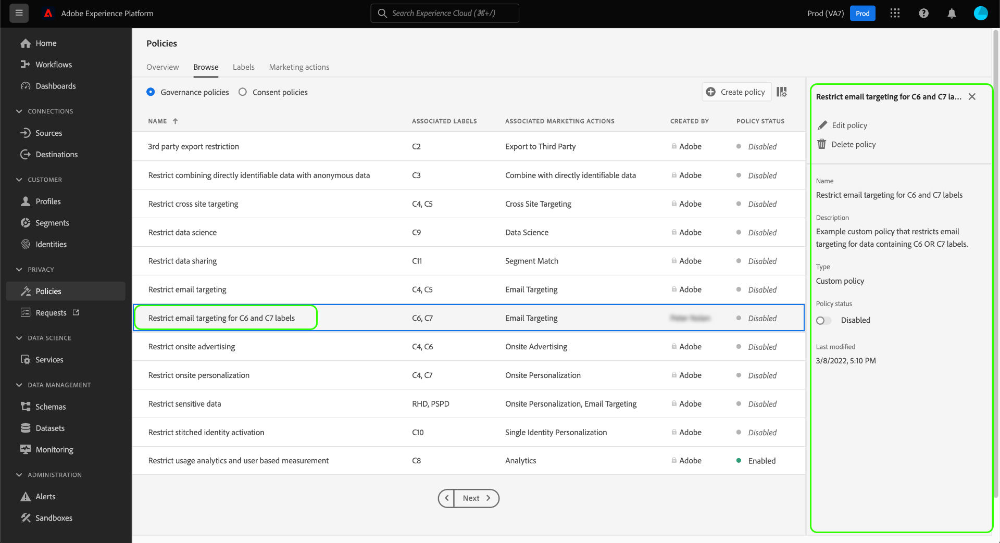

# Användarhandbok för dataanvändningsprinciper

Adobe Experience Platform [!DNL Data Governance] har ett användargränssnitt där du kan skapa och hantera dataanvändningsprinciper. Det här dokumentet innehåller en översikt över de åtgärder du kan utföra i arbetsytan **Profiler** i [!DNL Experience Platform]-användargränssnittet.

>[!IMPORTANT]
>
>Alla dataanvändningsprinciper (inklusive huvudprinciper som tillhandahålls av Adobe) inaktiveras som standard. För att en enskild princip ska kunna användas för verkställighet måste du manuellt aktivera den principen. I avsnittet [Aktivera profiler](#enable) finns anvisningar om hur du gör detta i användargränssnittet.

## Förutsättningar

Handboken kräver en fungerande förståelse av följande [!DNL Experience Platform]-koncept:

- [[!DNL Data Governance]](../home.md)
- [Dataanvändningspolicyer](./overview.md)

## Visa dataanvändningsprinciper {#view-policies}

I gränssnittet [!DNL Experience Platform] väljer du **[!UICONTROL Policies]** för att öppna arbetsytan **[!UICONTROL Policies]**. På fliken **[!UICONTROL Browse]** kan du se en lista över tillgängliga profiler, inklusive tillhörande etiketter, marknadsföringsåtgärder och status.

Välj en listad profil för att visa dess beskrivning och typ. Om en anpassad profil väljs visas ytterligare kontroller för att redigera, ta bort eller [aktivera/inaktivera profilen](#enable).

## Skapa en anpassad dataanvändningsprincip {#create-policy}

Om du vill skapa en ny anpassad dataanvändningsprincip väljer du **[!UICONTROL Create policy]** i det övre högra hörnet på fliken **[!UICONTROL Browse]** på arbetsytan **[!UICONTROL Policies]**.

Arbetsflödet **[!UICONTROL Create policy]** visas. Börja med att ange ett namn och en beskrivning för den nya principen.

Välj sedan de dataanvändningsetiketter som profilen ska baseras på. När du väljer flera etiketter kan du välja om informationen ska innehålla alla etiketter eller bara en av dem för att profilen ska kunna användas. Välj **[!UICONTROL Next]** när du är klar.

**[!UICONTROL Select marketing actions]**-steget visas. Välj lämpliga marknadsföringsåtgärder i listan och välj sedan **[!UICONTROL Next]** för att fortsätta.

>[!NOTE]
>
>När man väljer flera marknadsföringsåtgärder tolkas de som en &quot;OR&quot;-regel. Med andra ord gäller policyn om **någon** av de valda marknadsföringsåtgärderna utförs.

Steget **[!UICONTROL Review]** visas, så att du kan granska informationen om den nya profilen innan du skapar den. När du är nöjd väljer du **[!UICONTROL Finish]** för att skapa profilen.

Fliken **[!UICONTROL Browse]** visas igen, där den nya principen visas med statusen Utkast. Om du vill aktivera profilen går du till nästa avsnitt.

## Aktivera eller inaktivera en dataanvändningsprincip {#enable}

Alla dataanvändningsprinciper (inklusive huvudprinciper som tillhandahålls av Adobe) inaktiveras som standard. För att en enskild princip ska kunna användas måste du manuellt aktivera den principen via API:t eller användargränssnittet.

Du kan aktivera eller inaktivera profiler från fliken **[!UICONTROL Browse]** på arbetsytan **[!UICONTROL Policies]**. Välj en anpassad profil i listan för att visa informationen till höger. Under **[!UICONTROL Status]** väljer du växlingsknappen för att aktivera eller inaktivera profilen.

## Visa marknadsföringsåtgärder {#view-marketing-actions}

På arbetsytan **[!UICONTROL Policies]** väljer du fliken **[!UICONTROL Marketing actions]** för att visa en lista över tillgängliga marknadsföringsåtgärder som definieras av Adobe och din egen organisation.

## Skapa en marknadsföringsåtgärd {#create-marketing-action}

Om du vill skapa en ny anpassad marknadsföringsåtgärd väljer du **[!UICONTROL Create marketing action]** i det övre högra hörnet på fliken **[!UICONTROL Marketing actions]** på arbetsytan **[!UICONTROL Policies]**.

Dialogrutan **[!UICONTROL Create marketing action]** visas. Ange ett namn och en beskrivning för marknadsföringsåtgärden och välj sedan **[!UICONTROL Create]**.

Den nyligen skapade åtgärden visas på fliken **[!UICONTROL Marketing actions]**. Du kan nu använda marknadsföringsåtgärden när [du skapar nya dataanvändningsprinciper](#create-policy).

## Redigera eller ta bort en marknadsföringsåtgärd {#edit-delete-marketing-action}

>[!NOTE]
>
>Endast anpassade marknadsföringsåtgärder som definieras av din organisation kan redigeras. Marknadsföringsåtgärder som definieras av Adobe kan inte ändras eller tas bort.

På arbetsytan **[!UICONTROL Policies]** väljer du fliken **[!UICONTROL Marketing actions]** för att visa en lista över tillgängliga marknadsföringsåtgärder som definieras av Adobe och din egen organisation. Välj en anpassad marknadsföringsåtgärd i listan och använd sedan fälten i den högra delen för att redigera information om marknadsföringsåtgärden.

Om marknadsföringsåtgärden inte används av någon befintlig användarprofil kan du ta bort den genom att välja **[!UICONTROL Delete marketing action]**.

>[!NOTE]
>
>Om du försöker ta bort en marknadsföringsåtgärd som används av en befintlig princip visas ett felmeddelande som anger att borttagningsförsöket misslyckades.

## Nästa steg

Det här dokumentet innehåller en översikt över hur du hanterar dataanvändningsprinciper i [!DNL Experience Platform]-gränssnittet. Anvisningar om hur du hanterar principer med [!DNL Policy Service API] finns i [utvecklarhandboken](../api/getting-started.md). Mer information om hur du tillämpar dataanvändningsprinciper finns i [policyefterlevnadsöversikten](../enforcement/overview.md).

I följande video visas hur du arbetar med användarprofiler i användargränssnittet för [!DNL Experience Platform]:

>[!VIDEO](https://video.tv.adobe.com/v/32977?quality=12&learn=on)