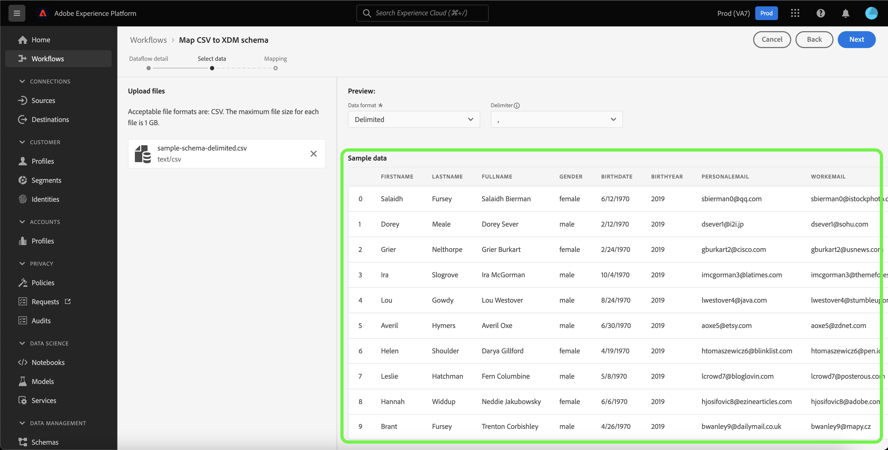
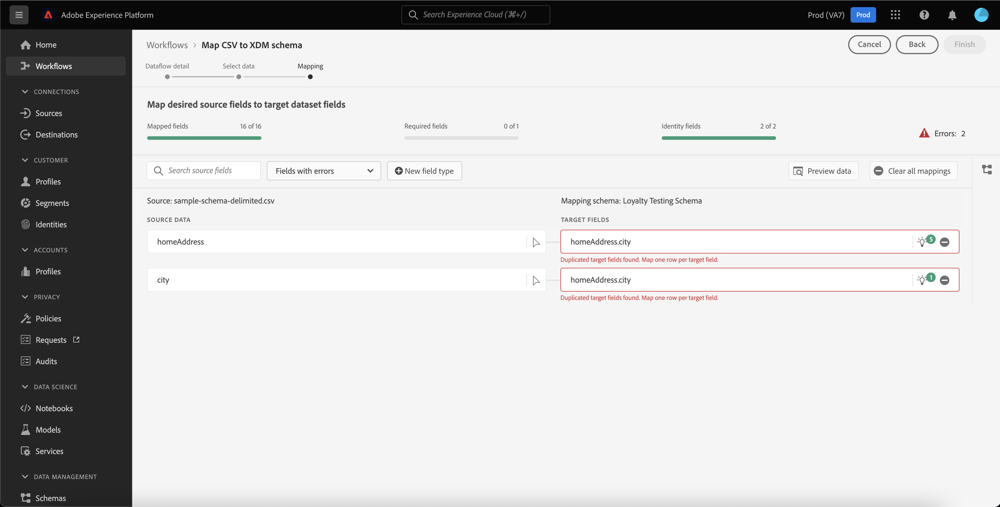
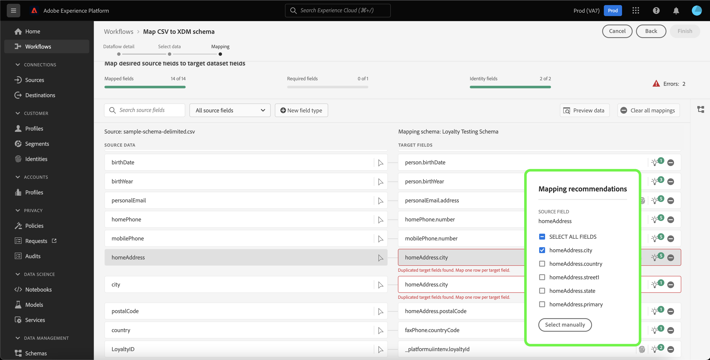

# Användargränssnittshandbok för dataprep

Det här dokumentet innehåller anvisningar om hur du använder förinställningsfunktioner för data i Adobe Experience Platform-användargränssnittet för att mappa CSV-filer till ett XDM-schema.

## Komma igång

Den här självstudiekursen kräver en fungerande förståelse av följande plattformskomponenter:

* [[!DNL Experience Data Model (XDM)] System](../../xdm/home.md): Det standardiserade ramverk som Platform använder för att organisera kundupplevelsedata.
   * [Grunderna för schemakomposition](../../xdm/schema/composition.md): Lär dig mer om de grundläggande byggstenarna i XDM-scheman, inklusive viktiga principer och bästa praxis när det gäller schemakomposition.
   * [Schemaredigeraren, genomgång](../../xdm/tutorials/create-schema-ui.md): Lär dig hur du skapar anpassade scheman med hjälp av gränssnittet för Schemaredigeraren.
* [Identitetstjänst](../../identity-service/home.md): Få en bättre bild av enskilda kunder och deras beteende genom att skapa en bro mellan identiteter på olika enheter och system.
* [[!DNL Real-time Customer Profile]](../../profile/home.md): Ger en enhetlig konsumentprofil i realtid baserad på aggregerade data från flera källor.
* [Källor](../../sources/home.md): Experience Platform tillåter att data kan hämtas från olika källor samtidigt som du kan strukturera, märka och förbättra inkommande data med hjälp av plattformstjänster.

## Dataflödesdetaljer

>[!TIP]
>
>Du kan komma åt dataflödesdetaljer genom att välja valfri källa från källkatalogen. Mer information finns i [källöversikt](../../sources/home.md).

Innan du kan mappa dina CSV-data till ett XDM-schema måste du först upprätta information om dataflödet.

The [!UICONTROL Dataflow detail] kan du välja om du vill importera dina CSV-data till en befintlig måldatauppsättning eller till en ny måldatauppsättning. En befintlig datauppsättning levereras med ett fördefinierat målschema som du kan mappa dina data till, medan en ny datauppsättning kräver att du väljer ett befintligt schema, eller skapar ett nytt schema, för att mappa dina data till.

### Använd en befintlig måldatamängd

Om du vill importera dina CSV-data till en befintlig datauppsättning väljer du **[!UICONTROL Existing dataset]**. Du kan antingen hämta en befintlig datauppsättning med [!UICONTROL Advanced search] eller genom att bläddra igenom listan med befintliga datauppsättningar i listrutan.

Ange ett namn för dataflödet och en valfri beskrivning när du har valt en datauppsättning.

Under den här processen kan du även aktivera [!UICONTROL Error diagnostics] och [!UICONTROL Partial ingestion]. [!UICONTROL Error diagnostics] möjliggör detaljerad generering av felmeddelanden för alla felaktiga poster som inträffar i dataflödet, medan [!UICONTROL Partial ingestion] gör att du kan importera data som innehåller fel, upp till ett visst tröskelvärde som du manuellt anger. Se [partiell batchingång - översikt](../../ingestion/batch-ingestion/partial.md) för mer information.

### Använd en ny måldatamängd

Om du vill importera dina CSV-data till en ny datauppsättning väljer du **[!UICONTROL New dataset]** och ange sedan ett namn och en valfri beskrivning för utdatauppsättningen. Välj sedan ett schema att mappa till med [!UICONTROL Advanced search] eller genom att bläddra igenom listan med befintliga scheman i listrutan.

När du har valt ett schema anger du ett namn för dataflödet och en valfri beskrivning och använder sedan [!UICONTROL Error diagnostics] och [!UICONTROL Partial ingestion] inställningar som du vill använda för dataflödet. När du är klar väljer du **[!UICONTROL Next]**.

## Välj data

The [!UICONTROL Select data] visas med ett gränssnitt där du kan överföra dina lokala filer och förhandsgranska deras struktur och innehåll. Välj **[!UICONTROL Choose files]** för att överföra en CSV-fil från ditt lokala system. Du kan också dra och släppa CSV-filen som du vill överföra till [!UICONTROL Drag and drop files] -panelen.

>[!TIP]
>
>Endast CSV-filer stöds för närvarande av lokal filöverföring. Den största filstorleken för varje fil är 1 GB.

När filen har överförts uppdateras förhandsvisningsgränssnittet för att visa filens innehåll och struktur.

Beroende på vilken fil du har kan du välja en kolumnavgränsare, t.ex. tabbar, kommatecken, rör eller en anpassad kolumnavgränsare för källdata. Välj **[!UICONTROL Delimiter]** och välj sedan lämplig avgränsare på menyn.

När du är klar väljer du **[!UICONTROL Next]**.

## Mappning

The **[!UICONTROL mapping]** I finns ett omfattande verktyg för att mappa källfält från källschemat till rätt mål-XDM-fält i målschemat.

### Mappningsgränssnittet {#mapping-interface}

Mappningsgränssnittet innehåller en kontrollpanel som ger information om hälsotillståndet för mappningsfälten i det aktuella inmatningsarbetsflödet. På kontrollpanelen visas följande information om mappningsfälten:

| Egenskap | Beskrivning |
| --- | --- |
| [!UICONTROL Mapped fields] | Visar det totala antalet källfält som har mappats till ett mål-XDM-fält, oavsett fel. |
| [!UICONTROL Required fields] | Visar antalet obligatoriska mappningsfält. |
| [!UICONTROL Identity fields] | Visar det totala antalet mappningsfält som definierats som identitet. Mappningsfälten representeras av en fingeravtrycksikon. |
| [!UICONTROL Errors] | Visar antalet felaktiga mappningsfält. |

Mappningsgränssnittet innehåller också en panel med alternativ som du kan välja mellan för att bättre interagera eller filtrera genom mappningsfälten.

Om du vill söka efter en viss mappningsuppsättning väljer du **[!UICONTROL Search source fields]** och ange namnet på de källdata som du vill isolera.

Välj **[!UICONTROL All source fields]** om du vill se en listruta med filteralternativ för att begränsa visningen av mappningsgränssnittet bättre.

Filtreringsalternativen är:

| Källfält | Beskrivning |
| --- | --- |
| [!UICONTROL All source fields] | Det här alternativet visar alla källfält i källschemat. Det här alternativet visas som standard. |
| [!UICONTROL Required fields] | Med det här alternativet filtreras källschemat så att endast de fält som krävs för att slutföra mappningen visas. |
| [!UICONTROL Identity fields] | Med det här alternativet filtreras källschemat så att endast fält som är markerade som Identitet visas. |
| [!UICONTROL Mapped fields] | Med det här alternativet filtreras källschemat så att endast de fält som redan har mappats visas. |
| [!UICONTROL Unmapped fields] | Med det här alternativet filtreras källschemat så att endast de fält som ännu inte har mappats visas. |
| [!UICONTROL Fields with recommendation] | Med det här alternativet filtreras källschemat så att endast de fält som innehåller mappningsrekommendationer visas. |

Välj **[!UICONTROL Fields with errors]** om du vill visa alla mappningsfält med fel.

En isolerad vy med felaktiga mappningsfält visas, där du kan åtgärda fel med hjälp av intelligenta mappningsrekommendationer eller genom det manuella mappningsträdet.

### Lägg till en ny fälttyp

Du kan lägga till ett nytt mappningsfält eller ett beräknat fält genom att välja **[!UICONTROL New field type]**.

#### Nytt mappningsfält

Om du vill lägga till ett nytt mappningsfält väljer du **[!UICONTROL New field type]** och sedan markera **[!UICONTROL Add new field]** i listrutan som visas.

Välj sedan det källfält som du vill lägga till i källschematrädet som visas och välj sedan **[!UICONTROL Select]**.

Mappningsgränssnittet uppdateras med det valda källfältet och ett tomt målfält. Välj **[!UICONTROL Map target field]** för att börja mappa det nya källfältet till rätt mål-XDM-fält.

Ett interaktivt målschematräd visas, så att du manuellt kan gå igenom målschemat och hitta rätt mål-XDM-fält för källfältet.

När du är klar väljer du schemaikonen för att stänga målschemagränssnittet.

#### Beräknade fält {#calculated-fields}

Beräknade fält tillåter att värden skapas baserat på attributen i indatabladet. Dessa värden kan sedan tilldelas attribut i målschemat och ges ett namn och en beskrivning som gör det enklare att referera till. Beräknade fält får innehålla högst 4 096 tecken.

Om du vill skapa ett beräkningsfält väljer du **[!UICONTROL New field type]** och sedan markera **[!UICONTROL Add calculated field]**

The **[!UICONTROL Create calculated field]** visas. Den vänstra dialogrutan innehåller de fält, funktioner och operatorer som stöds i beräkningsfält. Välj en av flikarna för att börja lägga till funktioner, fält eller operatorer i uttrycksredigeraren.

| Tabb | Beskrivning |
| --- | ----------- |
| [!UICONTROL Function] | På fliken Funktioner visas de funktioner som är tillgängliga för att omforma data. Om du vill veta mer om funktionerna som du kan använda i beräkningsfält kan du läsa guiden på [använda funktioner för dataförberedelse (Mapper)](../functions.md). |
| [!UICONTROL Field] | Fliken Fält visar de fält och attribut som är tillgängliga i källschemat. |
| [!UICONTROL Operator] | På fliken Operatorer visas de operatorer som är tillgängliga för att omforma data. |

Du kan lägga till fält, funktioner och operatorer manuellt med uttrycksredigeraren i mitten. Välj redigeraren för att börja skapa ett uttryck. När du är klar väljer du **[!UICONTROL Save]** för att fortsätta.

### Importera mappning {#import}

Du kan återanvända mappningen av ett befintligt dataflöde för att minska den manuella konfigurationstiden för dataimporten och begränsa antalet misstag. Välj **[!UICONTROL Import mapping]** för att återanvända en befintlig mappning.

The [!UICONTROL Import mapping] visas så att du får en lista över de dataflöden du kan välja mellan.

Välj förhandsgranskningsikonen om du vill förhandsgranska mappningen av det dataflöde du valde.

I förhandsgranskningsfönstret kan du granska befintlig mappning innan du importerar till dataflödet. När du har verifierat mappningen kan du välja **[!UICONTROL Back]** om du vill återgå till listan med dataflöden och inspektera en annan uppsättning mappningar, eller så kan du välja **[!UICONTROL Select]** för att fortsätta.

Du kan också välja den mappning som du vill importera i listan i fönstret med dataflöden. Markera det dataflöde som innehåller den mappning som du vill importera och välj sedan **[!UICONTROL Select]** för att fortsätta.

Gränssnittet uppdateras med den mappning som du importerade.

>[!NOTE]
>
>Alla befintliga mappningsuppsättningar som du anger eller ML-mappningsrekommendationer för ersätts av mappningen som du importerade från ett befintligt dataflöde.

Välj **[!UICONTROL Preview data]** för att se mappningsresultat på upp till 100 rader med exempeldata från den valda datauppsättningen.

Under förhandsgranskningen prioriteras identitetskolumnen som det första fältet, eftersom det är den nyckelinformation som krävs vid validering av mappningsresultat. När du är klar väljer du **[!UICONTROL Close]**.

Om du vill ta bort alla mappningsfält väljer du **[!UICONTROL Clear all mappings]**.

### Använda mappningsgränssnittet

Plattformen ger automatiskt intelligenta rekommendationer för automatiskt mappade fält baserat på det målschema eller den datamängd du valt. Du kan justera mappningsreglerna manuellt så att de passar dina användningsfall eller åtgärda eventuella dubblerade mappningsfält för att ta bort eventuella fel.

Välj den glödlampikon i målfältet som du vill justera.

The [!UICONTROL Mapping recommendations] popup-panelen visas med en lista över rekommenderade målfält som kan mappas till ett visst källfält. Som standard tillämpas den första rekommendationen automatiskt.

Ibland finns det mer än en rekommendation för källschemat. När detta inträffar visas den mest framträdande rekommendationen på mappningskortet, följt av en ikon som innehåller antalet ytterligare rekommendationer som är tillgängliga. Om du väljer glödlampsikonen visas en lista med ytterligare rekommendationer. Du kan välja en av de alternativa rekommendationerna genom att markera kryssrutan bredvid den rekommendation du vill mappa till i stället.

Härifrån kan du ändra det valda målfältet för att åtgärda ett fel eller matcha ditt användningsfall.

Du kan också välja **[!UICONTROL Select manually]** om du vill använda det interaktiva schemamappningsträdet manuellt.

Gränssnittet för målschemamappning visas i samma vy som mappningsfälten, vilket gör att du kan ändra mappningspar på samma skärm. Välj det målfält som passar ditt användningssätt eller korrigerar felen.

När du är klar väljer du **[!UICONTROL Finish]** för att fortsätta.

## Nästa steg

Genom att läsa det här dokumentet har du mappat en CSV-fil till ett mål-XDM-schema med mappningsgränssnittet i plattformsgränssnittet. Mer information finns i följande dokument:

* [Översikt över datapreflight](../home.md)
* [Översikt över källor](../../sources/home.md)
* [Övervaka källornas dataflöden i användargränssnittet](../../dataflows/ui/monitor-sources.md)
