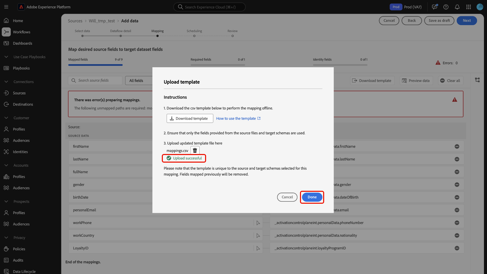

# Användargränssnittshandbok för dataprep

Läs den här vägledningen när du vill lära dig hur du använder [dataprep](../home.md)-mappningsfunktioner i Adobe Experience Platform-användargränssnittet för att mappa CSV-filer till ett [XDM-schema (Experience Data Model)](../../xdm/home.md).

## Kom igång

Den här självstudiekursen kräver en fungerande förståelse av följande Experience Platform-komponenter:

* [[!DNL Experience Data Model (XDM)] System](../../xdm/home.md): Det standardiserade ramverk som Experience Platform använder för att ordna kundupplevelsedata.
   * [Grundläggande om schemakomposition](../../xdm/schema/composition.md): Lär dig mer om grundstenarna i XDM-scheman, inklusive nyckelprinciper och bästa metoder för schemakomposition.
   * [Schemaredigeraren, självstudiekurs](../../xdm/tutorials/create-schema-ui.md): Lär dig hur du skapar anpassade scheman med hjälp av gränssnittet för Schemaredigeraren.
* [Identitetstjänst](../../identity-service/home.md): Få en bättre bild av enskilda kunder och deras beteende genom att skapa en bro mellan identiteter på olika enheter och system.
* [[!DNL Real-Time Customer Profile]](../../profile/home.md): Tillhandahåller en enhetlig konsumentprofil i realtid baserad på aggregerade data från flera källor.
* [Källor](../../sources/home.md): Med Experience Platform kan data hämtas från olika källor samtidigt som du kan strukturera, etikettera och förbättra inkommande data med hjälp av Experience Platform tjänster.

## Få åtkomst till mappningsgränssnittet i användargränssnittet

Du kan komma åt mappningsgränssnittet i användargränssnittet via två olika vägar.

1. I Experience Platform-gränssnittet väljer du **[!UICONTROL Workflows]** i den vänstra navigeringen och sedan **[!UICONTROL Map CSV to XDM schema]**. Ange sedan information om dataflödet och välj de data som du vill importera. När du är klar dirigeras du till mappningsgränssnittet där du kan konfigurera mappningen mellan källdata och ett XDM-schema.
2. Du kan även komma åt mappningsgränssnittet via källarbetsytan.

## Mappa CSV-filer till ett XDM-schema

Använd mappningsgränssnittet och den omfattande verktygslåda som det innehåller för att mappa datafält från källschemat till rätt mål-XDM-fält i målschemat.

### Mappningsgränssnittet {#mapping-interface}

Mer information om hälsotillståndet för mappningsfälten i samband med arbetsflödet för inhämtning finns på kontrollpanelen högst upp i gränssnittet. På kontrollpanelen visas följande information om mappningsfälten:

| Egenskap | Beskrivning |
| --- | --- |
| [!UICONTROL Mapped fields] | Visar det totala antalet källfält som har mappats till ett mål-XDM-fält, oavsett fel. |
| [!UICONTROL Required fields] | Visar antalet obligatoriska mappningsfält. |
| [!UICONTROL Identity fields] | Visar det totala antalet mappningsfält som definierats som identitet. Mappningsfälten representeras av en fingeravtrycksikon. |
| [!UICONTROL Errors] | Visar antalet felaktiga mappningsfält. |

{style="table-layout:auto"}

Sedan kan du använda alternativen i sidhuvudet för att bättre interagera eller filtrera genom mappningsfälten.

| Alternativ | Beskrivning |
| --- | --- |
| [!UICONTROL Search source fields] | Använd sökfältet för att navigera till ett specifikt källfält. |
| [!UICONTROL All fields] | Välj **[!UICONTROL All fields]** om du vill visa en listruta med alternativ för att filtrera mappningarna efter. De tillgängliga filteralternativen är:<ul><li>**[!UICONTROL Required fields]**: Filtrerar gränssnittet så att endast fält som krävs för att slutföra arbetsflödet visas.</li><li> **[!UICONTROL Identity fields]**: Filtrerar gränssnittet så att endast fält som är markerade som identiteter visas.</li><li>**[!UICONTROL Mapped fields]**: Filtrerar gränssnittet så att endast fält som redan har mappats visas.</li><li>**[!UICONTROL Unmapped fields]**: Filtrerar gränssnittet så att endast fält som ännu inte har mappats visas.</li><li>**[!UICONTROL Fields with errors]**: Filtrerar gränssnittet så att endast fält med fel visas.</li></ul> |
| [!UICONTROL New field type] | Välj **[!UICONTROL New field type]** om du vill lägga till ett nytt fält eller ett beräknat fält. Mer information finns i avsnittet om att [lägga till en ny fälttyp](#add-a-new-field-type). |
| [!UICONTROL Import mappings] | Välj **[!UICONTROL Import mappings]** om du vill importera mappningar från en befintlig fil eller ett befintligt dataflöde. Mer information finns i avsnittet [Importera mappningar](#import-mapping). |
| [!UICONTROL Validate] | Välj **[!UICONTROL Validate]** om du vill söka efter fel i dina mappningar. |
| [!UICONTROL Download template] | Välj **[!UICONTROL Download template]** om du vill exportera och hämta en CSV-fil med dina mappningar. |
| [!UICONTROL Preview data] | Välj **[!UICONTROL Preview data]** om du vill använda förhandsgranskningspanelen och inspektera strukturen och innehållet i källdatauppsättningen. |
| [!UICONTROL Clear all] | Välj **[!UICONTROL Clear all]** om du vill ta bort alla mappningar i gränssnittet. |

{style="table-layout:auto"}

### Lägg till en ny fälttyp {#add-a-new-field-type}

Du kan lägga till ett nytt mappningsfält eller ett beräknat fält genom att välja **[!UICONTROL New field type]**.

#### Nytt mappningsfält

Om du vill lägga till ett nytt mappningsfält väljer du **[!UICONTROL New field type]** och sedan **[!UICONTROL Add new field]** i listrutan som visas.

Välj sedan det källfält som du vill lägga till i källschematrädet som visas och välj **[!UICONTROL Select]**.

Mappningsgränssnittet uppdateras med det valda källfältet och ett tomt målfält. Välj **[!UICONTROL Map target field]** om du vill börja mappa det nya källfältet till rätt mål-XDM-fält.

Ett interaktivt målschematräd visas, så att du manuellt kan gå igenom målschemat och hitta rätt mål-XDM-fält för källfältet.

#### Beräknade fält {#calculated-fields}

Beräknade fält tillåter att värden skapas baserat på attributen i indatabladet. Dessa värden kan sedan tilldelas attribut i målschemat och ges ett namn och en beskrivning som gör det enklare att referera till. Beräknade fält får innehålla högst 4 096 tecken.

Om du vill skapa ett beräknat fält väljer du **[!UICONTROL New field type]** och sedan **[!UICONTROL Add calculated field]**

Fönstret **[!UICONTROL Create calculated field]** visas. Använd gränssnittet för att mata in beräkningsfält och se dialogrutan till vänster för fält, funktioner och operatorer som stöds.

| Tabb | Beskrivning |
| --- | ----------- |
| [!UICONTROL Function] | På fliken Funktioner visas de funktioner som är tillgängliga för att omforma data. Om du vill veta mer om de funktioner du kan använda i beräknade fält kan du läsa guiden för [med hjälp av datapersonfunktioner (Mapper)](../functions.md). |
| [!UICONTROL Field] | Fliken Fält visar de fält och attribut som är tillgängliga i källschemat. |
| [!UICONTROL Operator] | På fliken Operatorer visas de operatorer som är tillgängliga för att omforma data. |

Du kan lägga till fält, funktioner och operatorer manuellt med uttrycksredigeraren i mitten. Välj redigeraren för att börja skapa ett uttryck. När du är klar väljer du **[!UICONTROL Save]** för att fortsätta.

### Importera mappning {#import-mapping}

Du kan minska den manuella konfigurationstiden för dataöverföringsprocessen och begränsa antalet misstag genom att använda importmappningsfunktionen för dataprep. Du kan importera mappningar från ett befintligt flöde eller från en exporterad fil.

>[!BEGINTABS]

>[!TAB Importera mappning från flöde]

Om du har flera dataflöden som baseras på liknande källfiler och målscheman kan du importera befintliga mappningar och återanvända dem för nya dataflöden.

Om du vill importera mappning från ett befintligt dataflöde väljer du **[!UICONTROL Import mappings]** och sedan **[!UICONTROL Import mapping from flow]**.

Använd sedan popup-fönstret för att hitta det dataflöde som du vill importera mappningen till. Under det här steget kan du även använda sökfunktionen för att isolera ett specifikt dataflöde och hämta dess mappningar. När du är klar väljer du **[!UICONTROL Select]**.

>[!TAB Importera mappning från fil]

I vissa fall kan du behöva implementera ett stort antal mappningar för dina data. Du kan göra detta manuellt med mappningsgränssnittet, men du kan också exportera mappningsmallen och konfigurera mappningarna i ett offlinekalkylblad för att spara tid och undvika användartimeout på Experience Platform.

Om du vill importera mappning från en exporterad fil väljer du **[!UICONTROL Import mappings]** och sedan **[!UICONTROL Import mapping from file]**.

Använd sedan fönstret [!UICONTROL Upload template] för att hämta en CSV-kopia av dina mappningar. Du kan sedan konfigurera dina mappningar lokalt på enheten med hjälp av programvara som stöder redigering av CSV-filtyper. Under det här steget måste du se till att du bara använder de fält som finns i källfilen och målschemat.

+++Markera för att visa ett exempel på en exporterad mappningsfil

+++

När du är klar väljer du **[!UICONTROL Upload file]** och markerar den uppdaterade CSV-filen med dina mappningar. Låt systemet bearbeta en kort stund och välj sedan **[!UICONTROL Done]**.

>[!ENDTABS]

När mappningarna är klara kan du nu välja **[!UICONTROL Finish]** och fortsätta till nästa steg för att slutföra dataflödet.

## Nästa steg

Nu kan du mappa en CSV-fil till ett mål-XDM-schema med mappningsgränssnittet i Experience Platform-gränssnittet. Mer information finns i följande dokument:

* [Översikt över datapreflight](../home.md)
* [Översikt över källor](../../sources/home.md)
* [Övervaka källornas dataflöden i användargränssnittet](../../dataflows/ui/monitor-sources.md)
