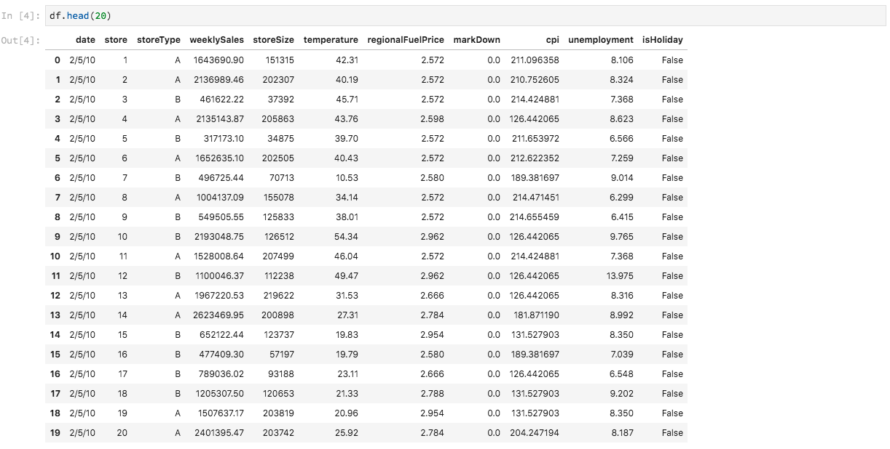

# Analysera dina data med bärbara datorer

I den här självstudiekursen fokuseras på hur du använder Jupyter-anteckningsböcker, som är byggda i Data Science Workspace, för att få tillgång till, utforska och visualisera dina data. I slutet av den här självstudiekursen bör du känna till några av de funktioner som Jupyter Notebooks erbjuder för att bättre förstå dina data.

Följande koncept har introducerats:

- **[!DNL JupyterLab]:** [[!DNL JupyterLab]](https://blog.jupyter.org/jupyterlab-is-ready-for-users-5a6f039b8906) är nästa generations webbaserade gränssnitt för Project Jupyter, som är nära integrerat i  [!DNL Adobe Experience Platform].
- **Grupper:** Datauppsättningar består av grupper. En batch är en uppsättning data som samlats in under en tidsperiod och som bearbetas tillsammans som en enda enhet. Nya grupper skapas när data läggs till i en datauppsättning.
- **SDK för dataåtkomst (inaktuellt):SDK** för dataåtkomst är nu inaktuellt. Använd guiden [[!DNL Platform SDK]](../authoring/platform-sdk.md).

## Utforska anteckningsböcker i Data Science Workspace

I det här avsnittet utforskas data som tidigare har importerats till försäljningsschemat.

Med Data Science Workspace kan användare skapa [!DNL Jupyter Notebooks] via [!DNL JupyterLab]-plattformen där de kan skapa och redigera maskininlärningsarbetsflöden. [!DNL JupyterLab] är ett verktyg för samarbete mellan server och klient som gör att användare kan redigera anteckningsboksdokument via en webbläsare. De här anteckningsböckerna kan innehålla både körbar kod och RTF-element. För våra syften kommer vi att använda Markdown för analysbeskrivning och körbar [!DNL Python]-kod för att utföra datautforskande och -analys.

### Välj arbetsyta

När vi startar [!DNL JupyterLab] visas ett webbaserat gränssnitt för Jupyter-anteckningsböcker. Beroende på vilken typ av anteckningsbok vi väljer startas en motsvarande kärna.

När vi jämför vilken miljö vi ska använda måste vi ta hänsyn till varje tjänsts begränsningar. Om vi till exempel använder biblioteket [pandas](https://pandas.pydata.org/) med [!DNL Python] är RAM-gränsen 2 GB som vanlig användare. Även som kraftfull användare är vi begränsade till 20 GB RAM. Om du hanterar större beräkningar är det klokt att använda [!DNL Spark] som erbjuder 1,5 TB som delas med alla instanser av bärbara datorer.

Som standard fungerar Tensorflow-receptet i ett GPU-kluster och Python körs i ett CPU-kluster.

### Skapa en ny anteckningsbok

I [!DNL Adobe Experience Platform]-gränssnittet klickar du på fliken Datavetenskap på den översta menyn för att ta dig till arbetsytan Datavetenskap. På den här sidan klickar du på fliken [!DNL JupyterLab] som öppnar startprogrammet för [!DNL JupyterLab]. Du bör se en liknande sida.


I vår självstudiekurs kommer vi att använda [!DNL Python] 3 i Jupyter Notebook för att visa hur du kommer åt och utforskar data. På startsidan finns exempelanteckningsböcker. Vi kommer att använda recept för butiksförsäljning för [!DNL Python] 3.


Koden för butiksförsäljning är ett fristående exempel som använder samma datauppsättning för butiksförsäljning för att visa hur data kan utforskas och visualiseras i Jupyter Notebook. Dessutom går den bärbara datorn vidare i detalj med utbildning och verifiering. Mer information om den här specifika anteckningsboken finns i den här [genomgången](../walkthrough.md).

### Åtkomstdata

>[!NOTE]
>
>`data_access_sdk_python` är föråldrat och rekommenderas inte längre. Se självstudiekursen [Converting data access SDK to Platform SDK](../authoring/platform-sdk.md) för att konvertera koden. Samma steg nedan gäller fortfarande för den här självstudiekursen.

Vi går igenom åtkomsten till data internt från [!DNL Adobe Experience Platform] och externt. Vi kommer att använda biblioteket `data_access_sdk_python` för att komma åt interna data som datauppsättningar och XDM-scheman. För externa data kommer vi att använda pandabakteriet [!DNL Python].

#### Externa data

När butiksförsäljningsjournalen är öppen hittar du rubriken&quot;Läs in data&quot;. I följande [!DNL Python]-kod används pandas `DataFrame`-datastruktur och funktionen [read_csv()](https://pandas.pydata.org/pandas-docs/stable/generated/pandas.read_csv.html#pandas.read_csv) för att läsa CSV-filen som finns på [!DNL Github] i DataFrame:


Pandornas DataFrame-datastruktur är en tvådimensionell datastruktur med etiketter. För att snabbt se dimensionerna på våra data kan vi använda `df.shape`. Detta returnerar en tuppel som representerar dimensionaliteten för DataFrame:


Slutligen kan vi ta en titt på hur våra data ser ut. Vi kan använda `df.head(n)` för att visa de första `n` raderna i DataFrame:



#### [!DNL Experience Platform] data

Nu går vi igenom åtkomsten till [!DNL Experience Platform]-data.

##### Efter datauppsättnings-ID

I det här avsnittet använder vi datauppsättningen Detaljhandel, som är samma datauppsättning som används i exempelanteckningsboken för detaljhandelsförsäljning.

I vår Jupyter-anteckningsbok kan vi komma åt våra data från fliken **Data** till vänster. När du klickar på fliken visas en lista med datauppsättningar.


I katalogen Datasets kan vi nu se alla inkapslade datauppsättningar. Observera att det kan ta en minut att läsa in alla poster om din katalog är mycket ifylld med datauppsättningar.

Eftersom datauppsättningen är densamma vill vi ersätta inläsningsdata från föregående avsnitt som använder externa data. Markera kodblocket under **Läs in data** och tryck på **&#39;d&#39;** två gånger på tangentbordet. Se till att fokus ligger på blocket och inte på texten. Du kan trycka på **&#39;esc&#39;** för att undvika textfokus innan du trycker på **&#39;d&#39;** två gånger.

Nu kan vi högerklicka på datamängden `Retail-Training-<your-alias>` och välja alternativet Utforska data i anteckningsbok i listrutan. En körbar kodpost visas i anteckningsboken.

>[!TIP]
>
>Mer information om hur du konverterar koden finns i [[!DNL Platform SDK]](../authoring/platform-sdk.md)-guiden.

```PYTHON
from data_access_sdk_python.reader import DataSetReader
from datetime import date
reader = DataSetReader()
df = reader.load(data_set_id="xxxxxxxx", ims_org="xxxxxxxx@AdobeOrg")
df.head()
```

Om du arbetar med andra kärnor än [!DNL Python], gå till [den här sidan](https://github.com/adobe/acp-data-services-dsw-reference/wiki/Accessing-Data-on-the-Platform) för att komma åt data på [!DNL Adobe Experience Platform].

Om du väljer den körbara cellen och sedan trycker på uppspelningsknappen i verktygsfältet körs den körbara koden. Utdata för `head()` är en tabell med datamängdens nycklar som kolumner och de första n raderna i datamängden. `head()` använder ett heltalsargument för att ange hur många rader som ska skrivas ut. Som standard är detta 5.


Om du startar om kärnan och kör alla celler igen bör du få samma utdata som tidigare.


### Utforska era data

Nu när vi har tillgång till era data kan vi fokusera på själva data genom att använda statistik och visualisering. Den datauppsättning som vi använder är en detaljhandelsdatamängd som ger övrig information om 45 olika butiker en viss dag. Vissa egenskaper för en given `date` och `store` är följande:
- `storeType`
- `weeklySales`
- `storeSize`
- `temperature`
- `regionalFuelPrice`
- `markDown`
- `cpi`
- `unemployment`
- `isHoliday`

#### Statistisk sammanfattning

Vi kan använda pandabiblioteket [!DNL Python's] för att hämta datatypen för varje attribut. Utdata från följande anrop ger oss information om antalet poster och datatypen för var och en av kolumnerna:

```PYTHON
df.info()
```


Den här informationen är användbar eftersom du vet vilken datatyp varje kolumn har, så att vi kan veta hur vi ska behandla data.

Låt oss titta på den statistiska sammanfattningen. Endast de numeriska datatyperna visas, så `date`, `storeType` och `isHoliday` kommer inte att returneras:

```PYTHON
df.describe()
```


Här ser vi att det finns 6 435 förekomster för varje egenskap. Dessutom ges statistiska uppgifter som medelvärde, standardavvikelse (std), min, max och interkvartilter. Detta ger oss information om avvikelsen för data. I nästa avsnitt ska vi gå igenom visualisering som fungerar tillsammans med denna information för att ge oss en god förståelse för våra data.

Om du tittar på minimi- och maximivärdena för `store` ser vi att det finns 45 unika lagringsplatser som data representerar. Det finns också `storeTypes` som skiljer ut vad en butik är. Vi kan se distributionen av `storeTypes` genom att göra följande:


Det innebär att 22 butiker är `storeType` `A`, 17 är `storeType` `B` och 6 är `storeType` `C`.

#### Datavisualisering

Nu när vi känner till våra värden för dataramar vill vi komplettera detta med visualiseringar för att göra saker klarare och enklare att identifiera mönster. Diagram är också användbara när du vill förmedla resultat till en viss målgrupp. Några [!DNL Python]-bibliotek som är användbara för visualisering är:
- [Matplotlib](https://matplotlib.org/)
- [pandor](https://pandas.pydata.org/)
- [seaborn](https://seaborn.pydata.org/)
- [ggplot](https://ggplot2.tidyverse.org/)

I det här avsnittet går vi snabbt igenom några fördelar med att använda varje bibliotek.

[](https://matplotlib.org/) Matplotlibis det äldsta  [!DNL Python] visualiseringspaketet. Deras mål är att göra&quot;enkla saker enkla och hårda saker möjliga&quot;. Detta brukar vara sant eftersom paketet är extremt kraftfullt men också innehåller komplexitet. Det är inte alltid lätt att få en bra bild utan att behöva lägga en hel del tid och arbete på att göra det.

[Pandasis ](https://pandas.pydata.org/) används huvudsakligen för objektet DataFrame, som möjliggör datamanipulering med integrerad indexering. Pandor har dock även en inbyggd plottningsfunktion som är baserad på matplotlib.

[](https://seaborn.pydata.org/) seaborberar ett paket som byggs ovanpå matplotlib. Det främsta målet är att göra standarddiagram mer visuellt tilltalande och att förenkla skapandet av komplicerade diagram.

[Ett ](https://ggplot2.tidyverse.org/) paket som också är byggt ovanpå matplotlib. Den största skillnaden är dock att verktyget är en port för GPlot2 för R. På samma sätt som för sjömän är målet att förbättra för matplotlib. Användare som är bekanta med ggplot2 for R bör överväga det här biblioteket.


##### Univariata diagram

Univariata diagram är diagram av en enskild variabel. Ett vanligt univariat-diagram används för att visualisera dina data är lådan och morrplotten.

Med hjälp av våra butiksdata från tidigare kan vi generera låda och morrfack för var och en av de 45 butikerna och deras försäljning varje vecka. Ritytan genereras med funktionen `seaborn.boxplot`.


En låda och en löpyta används för att visa datafördelningen. De yttre raderna i ritytan visar de övre och nedre kvartilarna, medan rutan sträcker sig över interkvartilsintervallet. Linjen i rutan anger medianen. Alla datapunkter som är mer än 1,5 gånger den övre eller nedre kanten markeras som en cirkel. Dessa punkter betraktas som avvikelser.

##### Multivariata diagram

Multivariata diagram används för att se interaktionen mellan variabler. Med visualiseringen kan datavetare se om det finns några samband eller mönster mellan variablerna. Ett vanligt multivariatdiagram är en korrelationsmatris. Med en korrelationsmatris kvantifieras beroenden mellan flera variabler med korrelationskoefficienten.

Med samma butiksdatauppsättning kan vi generera en korrelationsmatris.


Observera diagonalen för 1 är nedåt i mitten. Detta visar att en variabel har en fullständig positiv korrelation när den jämförs med sig själv. Stark positiv korrelation kommer att ha en storlek närmare 1 medan svaga korrelationer kommer närmare 0. Negativ korrelation visas med en negativ koefficient som visar en omvänd trend.


## Nästa steg

Den här självstudiekursen gick igenom hur du skapar en ny Jupyter-anteckningsbok i arbetsytan Data Science och hur du får tillgång till data både externt och från [!DNL Adobe Experience Platform]. Vi gick igenom följande steg:
- Skapa en ny Jupyter-anteckningsbok
- Få tillgång till datauppsättningar och scheman
- Utforska datauppsättningar

Nu kan du gå vidare till [nästa avsnitt](../models-recipes/package-source-files-recipe.md) för att paketera ett recept och importera det till Data Science Workspace.