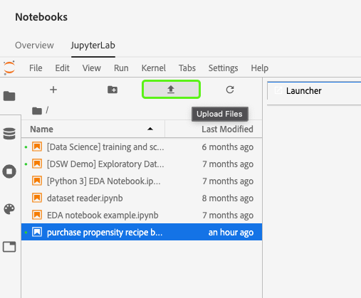
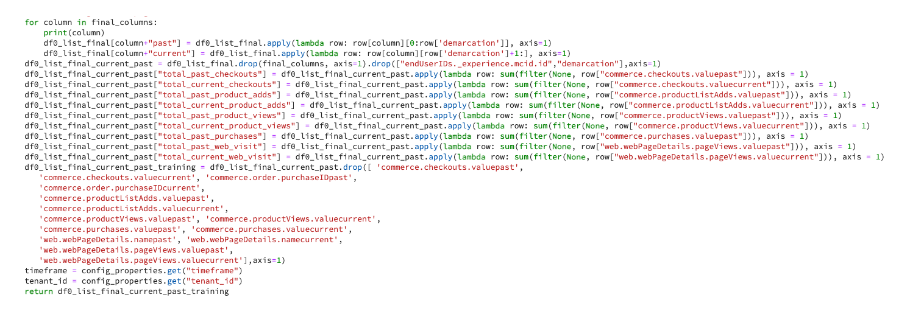

# Skapa en modell med JupyterLab Notebooks

>[!NOTE]
>
>Data Science Workspace finns inte längre att köpa.
>
>Denna dokumentation är avsedd för befintliga kunder med tidigare tillstånd till Data Science Workspace.

I den här självstudiekursen får du hjälp med att skapa en modell med hjälp av mallen för receptbyggaren för JupyterLab-anteckningsböcker.

## Nya koncept:

- **Mottagare:** Ett recept är en AdobeTerm för en modellspecifikation och är en behållare på den översta nivån som representerar en specifik maskininlärning, AI-algoritm eller ensemble för algoritmer, bearbetningslogik och konfiguration som krävs för att skapa och köra en utbildad modell.
- **Modell:** En modell är en instans av ett maskininlärningsrecept som har tränats med historiska data och konfigurationer för att lösa ett affärsärende.
- **Utbildning:** Utbildning är processen att lära sig mönster och insikter från märkta data.
- **Poäng:** Poäng är processen att generera insikter från data med hjälp av en tränad modell.

## Hämta de resurser som krävs {#assets}

Innan du fortsätter med den här självstudiekursen måste du skapa de scheman och datamängder som behövs. Besök självstudiekursen för [att skapa scheman och datauppsättningar för Luma-benägenhetsmodellen](../models-recipes/create-luma-data.md) för att hämta nödvändiga resurser och ställa in de nödvändiga resurserna.

## Kom igång med den bärbara datormiljön [!DNL JupyterLab]

Det går att skapa ett recept från början inom [!DNL Data Science Workspace]. Börja med att navigera till [Adobe Experience Platform](https://platform.adobe.com) och välj fliken **[!UICONTROL Notebooks]** till vänster. Om du vill skapa en ny anteckningsbok väljer du Recipe Builder-mallen i [!DNL JupyterLab Launcher].

Med anteckningsboken [!UICONTROL Recipe Builder] kan du köra utbildning och poängsättning inuti anteckningsboken. Detta ger dig flexibilitet att göra ändringar i deras `train()`- och `score()`-metoder mellan att köra experiment med utbildnings- och poängdata. När du är nöjd med resultatet av kursen och poängsättningen kan du skapa ett recept och dessutom publicera det som en modell med recept för att modellera funktionaliteten.

>[!NOTE]
>
>Anteckningsboken [!UICONTROL Recipe Builder] har stöd för att arbeta med alla filformat, men för närvarande har funktionen för att skapa recept bara stöd för [!DNL Python].


När du väljer anteckningsboken [!UICONTROL Recipe Builder] i startprogrammet öppnas anteckningsboken på en ny flik.

På den nya anteckningsboksfliken högst upp läses ett verktygsfält in som innehåller tre ytterligare åtgärder - **[!UICONTROL Train]**, **[!UICONTROL Score]** och **[!UICONTROL Create Recipe]**. De här ikonerna visas bara i anteckningsboken för [!UICONTROL Recipe Builder]. Mer information om de här åtgärderna finns [i avsnittet Utbildning och poängsättning](#training-and-scoring) när du har skapat din recept i anteckningsboken.


## Kom igång med anteckningsboken [!UICONTROL Recipe Builder]

I den angivna resursmappen finns en Luma-benägenhetsmodell `propensity_model.ipynb`. Använd alternativet för överföring av anteckningsbok i JupyterLab för att överföra den angivna modellen och öppna anteckningsboken.



Den återstående delen av den här självstudiekursen omfattar följande filer som är fördefinierade i bärbara datorer med benägenhetsmodellen:

- [Kravfil](#requirements-file)
- [Konfigurationsfiler](#configuration-files)
- [Utbilda datainläsare](#training-data-loader)
- [Inläsare av poängdata](#scoring-data-loader)
- [Pipeline-fil](#pipeline-file)
- [Utvärderarfil](#evaluator-file)
- [Data Saver-fil](#data-saver-file)

I följande videofilm förklaras den bärbara datorn med Luma-benägenhetsmodellen:

>[!VIDEO](https://video.tv.adobe.com/v/333570)

### Kravfil {#requirements-file}

Kravfilen används för att deklarera ytterligare bibliotek som du vill använda i modellen. Du kan ange versionsnumret om det finns ett beroende. Om du vill söka efter fler bibliotek går du till [anaconda.org](https://anaconda.org). Mer information om hur du formaterar kravfilen finns på [Conda](https://docs.conda.io/projects/conda/en/latest/user-guide/tasks/manage-environments.html#creating-an-environment-file-manually). Listan med de huvudbibliotek som redan används är:

```JSON
python=3.6.7
scikit-learn
pandas
numpy
data_access_sdk_python
```

>[!NOTE]
>
>Bibliotek eller specifika versioner som du lägger till kan vara inkompatibla med ovanstående bibliotek. Om du dessutom väljer att skapa en miljöfil manuellt, kan fältet `name` inte åsidosättas.

För bärbara Luma-benägenhetsmodeller behöver kraven inte uppdateras.

### Konfigurationsfiler {#configuration-files}

Konfigurationsfilerna, `training.conf` och `scoring.conf`, används för att ange de datauppsättningar som du vill använda för utbildning och bedömning samt för att lägga till hyperparametrar. Det finns olika konfigurationer för utbildning och poängsättning.

För att en modell ska kunna köra utbildning måste du ange `trainingDataSetId`, `ACP_DSW_TRAINING_XDM_SCHEMA` och `tenantId`. Dessutom måste du ange `scoringDataSetId`, `tenantId` och `scoringResultsDataSetId ` för att kunna göra en bedömning.

Om du vill hitta data- och schema-ID:n går du till fliken  i anteckningsböckerna i det vänstra navigeringsfältet (under mappikonen). Tre olika datauppsättnings-ID måste anges. `scoringResultsDataSetId` används för att lagra modellbedömningsresultaten och ska vara en tom datamängd. Dessa datauppsättningar gjordes tidigare i steget [Obligatoriska resurser](#assets).


Samma information finns på flikarna [Adobe Experience Platform](https://platform.adobe.com/) under **[Schema](https://platform.adobe.com/schema)** och **[Dataset](https://platform.adobe.com/dataset/overview)**.

När du är klar bör kursen och poängkonfigurationen se ut ungefär som på följande skärmbild:


Som standard ställs följande konfigurationsparametrar in åt dig när du utbildar och poängsätter data:

- `ML_FRAMEWORK_IMS_USER_CLIENT_ID`
- `ML_FRAMEWORK_IMS_TOKEN`
- `ML_FRAMEWORK_IMS_ML_TOKEN`
- `ML_FRAMEWORK_IMS_TENANT_ID`

## Förstå inläsaren av utbildningsdata {#training-data-loader}

Syftet med inläsaren av utbildningsdata är att instansiera data som används för att skapa maskininlärningsmodellen. Vanligtvis finns det två åtgärder som inläsaren av utbildningsdata utför:

- Läser in data från [!DNL Platform]
- Datagenerering och -teknik

I följande två avsnitt går det längre att läsa in data och förbereda data.

### Läser in data {#loading-data}

I det här steget används [pandabilden](https://pandas.pydata.org/pandas-docs/stable/generated/pandas.DataFrame.html). Data kan läsas in från filer i [!DNL Adobe Experience Platform] med [!DNL Platform] SDK (`platform_sdk`) eller från externa källor med pandas `read_csv()`- eller `read_json()`-funktioner.

- [[!DNL Platform SDK]](#platform-sdk)
- [Externa källor](#external-sources)

>[!NOTE]
>
>I Recipe Builder-anteckningsboken läses data in via datainläsaren `platform_sdk`.

### [!DNL Platform] SDK {#platform-sdk}

En ingående självstudiekurs om hur du använder datainläsaren `platform_sdk` finns i [Plattforms-SDK-guiden](../authoring/platform-sdk.md). Den här självstudiekursen innehåller information om autentisering av bygge, grundläggande läsning av data och grundläggande skrivande av data.

### Externa källor {#external-sources}

I det här avsnittet visas hur du importerar en JSON- eller CSV-fil till ett pandaobjekt. Officiell dokumentation från pandabiblioteket finns här:
- [read_csv](https://pandas.pydata.org/pandas-docs/stable/generated/pandas.read_csv.html)
- [read_json](https://pandas.pydata.org/pandas-docs/stable/generated/pandas.read_json.html)

Här följer ett exempel på hur du importerar en CSV-fil. Argumentet `data` är sökvägen till CSV-filen. Variabeln importerades från `configProperties` i det [föregående avsnittet](#configuration-files).

```PYTHON
df = pd.read_csv(data)
```

Du kan även importera från en JSON-fil. Argumentet `data` är sökvägen till CSV-filen. Variabeln importerades från `configProperties` i det [föregående avsnittet](#configuration-files).

```PYTHON
df = pd.read_json(data)
```

Nu finns dina data i dataframe-objektet och kan analyseras och ändras i [nästa avsnitt](#data-preparation-and-feature-engineering).

## Inläsningsfil för utbildningsdata

I det här exemplet läses data in med Platform SDK. Biblioteket kan importeras högst upp på sidan genom att inkludera raden:

`from platform_sdk.dataset_reader import DatasetReader`

Du kan sedan använda metoden `load()` för att hämta utbildningsdatauppsättningen från `trainingDataSetId` enligt konfigurationsfilen (`recipe.conf`).

```PYTHON
def load(config_properties):
    print("Training Data Load Start")

    #########################################
    # Load Data
    #########################################    
    client_context = get_client_context(config_properties)
    dataset_reader = DatasetReader(client_context, dataset_id=config_properties['trainingDataSetId'])
```

>[!NOTE]
>
>Som nämndes i avsnittet [Konfigurationsfil](#configuration-files) ställs följande konfigurationsparametrar in åt dig när du använder `client_context = get_client_context(config_properties)` för att komma åt data från Experience Platform:
> - `ML_FRAMEWORK_IMS_USER_CLIENT_ID`
> - `ML_FRAMEWORK_IMS_TOKEN`
> - `ML_FRAMEWORK_IMS_ML_TOKEN`
> - `ML_FRAMEWORK_IMS_TENANT_ID`

Nu när du har tillgång till dina data kan du börja med dataförberedelser och funktionskonstruktion.

### Datagenerering och -teknik {#data-preparation-and-feature-engineering}

När data har lästs in måste de rengöras och bli föremål för dataförberedelse. I det här exemplet är målet med modellen att förutsäga om en kund kommer att beställa en produkt eller inte. Eftersom modellen inte tittar på specifika produkter behöver du inte `productListItems` och därför tas kolumnen bort. Därefter tas ytterligare kolumner bort som bara innehåller ett eller två värden i en enda kolumn. När du utbildar en modell är det viktigt att bara behålla användbara data som kan hjälpa dig att förutsäga ditt mål.


När du har släppt onödiga data kan du börja med funktionskonstruktion. De demodata som används för det här exemplet innehåller ingen sessionsinformation. Normalt vill du ha data om aktuella och tidigare sessioner för en viss kund. På grund av brist på sessionsinformation härmar det här exemplet i stället aktuella och tidigare sessioner via reseavgränsning.


När avgränsningen är klar får data en etikett och en resa skapas.


Sedan skapas funktionerna och delas upp i tidigare och nuvarande. Eventuella kolumner som inte behövs tas bort, så att du får tillgång till både tidigare och nuvarande resor för Luma-kunder. Dessa resor innehåller information om t.ex. om en kund har köpt en artikel och den resa som de tog fram till köpet.



## Inläsare av poängdata {#scoring-data-loader}

Förfarandet för att läsa in data för bedömning liknar inläsning av utbildningsdata. Om du tittar närmare på koden ser du att allt är detsamma förutom `scoringDataSetId` i `dataset_reader`. Detta beror på att samma Luma-datakälla används för både utbildning och poängsättning.

Om du vill använda olika datafiler för utbildning och poängsättning är inläsaren för utbildning och poängsättning separat. Detta gör att du kan utföra ytterligare förbehandling, t.ex. mappa utbildningsdata till dina poängdata om det behövs.

## Pipeline-fil {#pipeline-file}

Filen `pipeline.py` innehåller logik för utbildning och poängsättning.

Syftet med kursen är att skapa en modell med hjälp av funktioner och etiketter i utbildningsdatauppsättningen. När du har valt en utbildningsmodell måste du anpassa dina x- och y-utbildningsdata till modellen så att funktionen returnerar den tränade modellen.

>[!NOTE]
> 
>Funktionerna avser den indatavariabel som används av maskininlärningsmodellen för att förutsäga etiketterna.


Funktionen `score()` ska innehålla resultatalgoritmen och returnera ett mått som anger hur framgångsrik modellen är. Funktionen `score()` använder resultatdatauppsättningsrubrikerna och den tränade modellen för att generera en uppsättning förutsedda funktioner. Dessa förväntade värden jämförs sedan med de faktiska funktionerna i poängdatauppsättningen. I det här exemplet använder funktionen `score()` den tränade modellen för att förutsäga funktioner med hjälp av etiketterna från bedömningsdatauppsättningen. De förväntade funktionerna returneras.


## Utvärderarfil {#evaluator-file}

Filen `evaluator.py` innehåller logik för hur du vill utvärdera ditt tränade recept och hur dina utbildningsdata ska delas upp.

### Dela datauppsättningen {#split-the-dataset}

Dataledningsfasen för utbildning kräver att datauppsättningen delas för utbildning och testning. Dessa `val`-data används implicit för att utvärdera modellen efter att den har tränats. Den här processen är skild från poängsättningen.

I det här avsnittet visas funktionen `split()` som läser in data till anteckningsboken och sedan rensar data genom att ta bort orelaterade kolumner i datauppsättningen. Därifrån kan du utföra funktionsteknologi, d.v.s. skapa ytterligare relevanta funktioner från befintliga råa funktioner i data.


### Utvärdera den utbildade modellen {#evaluate-the-trained-model}

Funktionen `evaluate()` utförs efter att modellen har tränats och returnerar ett mått som anger hur framgångsrik modellen är. Funktionen `evaluate()` använder testdatauppsättningsrubrikerna och den tränade modellen för att förutsäga en uppsättning funktioner. Dessa förväntade värden jämförs sedan med de faktiska funktionerna i testdatauppsättningen. I det här exemplet används `precision`, `recall`, `f1` och `accuracy`. Observera att funktionen returnerar ett `metric`-objekt som innehåller en matris med utvärderingsmått. Dessa mått används för att utvärdera hur väl den tränade modellen fungerar.


Om du lägger till `print(metric)` kan du visa mätresultaten.


## Data Saver-fil {#data-saver-file}

Filen `datasaver.py` innehåller funktionen `save()` och används för att spara din förutsägelse när du testar poängsättningen. Funktionen `save()` tar din förutsägelse och använder [!DNL Experience Platform Catalog] API:er, skriver data till den `scoringResultsDataSetId` du angav i filen `scoring.conf`. Du kan


## Utbildning och poäng {#training-and-scoring}

När du har gjort ändringar i din bärbara dator och vill utbilda ditt recept kan du välja de tillhörande knapparna högst upp i fältet för att skapa en träningskörning i cellen. När du väljer knappen visas en logg med kommandon och utdata från utbildningsskriptet i anteckningsboken (under cellen `evaluator.py`). Conda installerar först alla beroenden, sedan initieras kursen.

Observera att du måste genomföra en utbildning minst en gång innan du kan göra en poängsättning. Om du väljer knappen **[!UICONTROL Run Scoring]** får du poäng på den tränade modellen som skapades under träningen. Bedömningsskriptet visas under `datasaver.py`.

Om du vill se dolda utdata lägger du till `debug` i slutet av utdatacellen och kör om den i felsökningssyfte.


## Skapa ett recept {#create-recipe}

När du är klar med redigeringen av recept och nöjd med utbildnings-/poängutdata kan du skapa ett recept från anteckningsboken genom att välja **[!UICONTROL Create Recipe]** i det övre högra hörnet.


När du har valt **[!UICONTROL Create Recipe]** uppmanas du att ange ett receptnamn. Det här namnet representerar det faktiska receptet som skapades på [!DNL Platform].


När du har valt **[!UICONTROL Ok]** börjar processen att skapa recept. Detta kan ta en stund och en förloppsindikator visas i stället för knappen Skapa recept. När du är klar kan du välja knappen **[!UICONTROL View Recipes]** och gå till fliken **[!UICONTROL Recipes]** under **[!UICONTROL ML Models]**


>[!CAUTION]
>
> - Ta inte bort någon av filcellerna
> - Redigera inte raden `%%writefile` överst i filcellerna
> - Skapa inte recept i olika anteckningsböcker samtidigt

## Nästa steg {#next-steps}

Genom att slutföra den här självstudiekursen har du lärt dig att skapa en maskininlärningsmodell i anteckningsboken [!UICONTROL Recipe Builder]. Du har också lärt dig hur du använder anteckningsboken för att hämta arbetsflöden.

Om du vill fortsätta lära dig hur du arbetar med resurser i [!DNL Data Science Workspace] går du till listrutan [!DNL Data Science Workspace] recept och modeller.