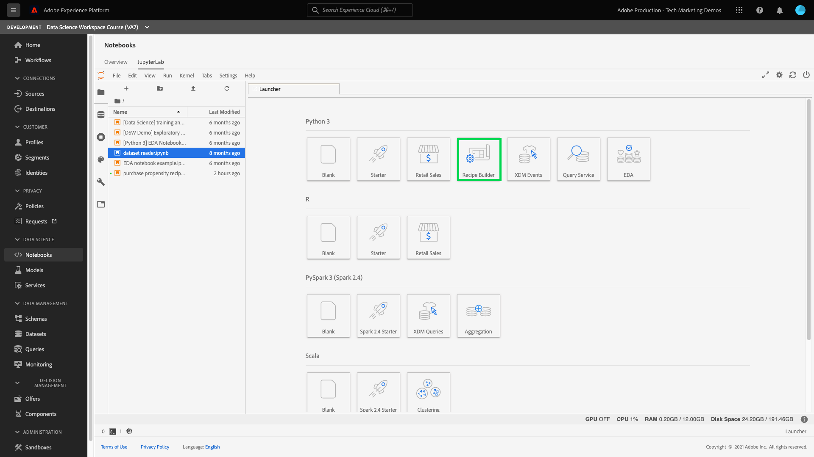

# Skapa ett recept med Jupyter Notebooks

Den här självstudiekursen går igenom två huvudavsnitt. Först skapar du en maskininlärningsmodell med hjälp av en mall i [!DNL JupyterLab Notebook]. Därefter ska du använda anteckningsboken för att hämta arbetsflödet inom [!DNL JupyterLab] för att skapa ett recept inom [!DNL Data Science Workspace].

## Nya koncept:

- **Recept:** Ett recept är en AdobeTerm för en modellspecifikation och är en behållare på den översta nivån som representerar en specifik maskininlärning, AI-algoritm eller ensemble för algoritmer, bearbetningslogik och konfiguration som krävs för att skapa och köra en tränad modell och därmed hjälpa till att lösa specifika affärsproblem.
- **Modell:** En modell är en instans av ett maskininlärningsrecept som har tränats med historiska data och konfigurationer för att lösa ett affärsärende.
- **Utbildning:** Utbildning är processen att lära sig mönster och insikter från märkta data.
- **Poäng:** Poängsättning är processen att generera insikter från data med hjälp av en tränad modell.

## Kom igång med [!DNL JupyterLab]-miljön för bärbara datorer

Du kan skapa ett recept från början inom [!DNL Data Science Workspace]. Börja med att navigera till [Adobe Experience Platform](https://platform.adobe.com) och klicka på fliken **[!UICONTROL Notebooks]** till vänster. Skapa en ny anteckningsbok genom att välja mallen Recipe Builder i [!DNL JupyterLab Launcher].

Med [!UICONTROL Recipe Builder]-anteckningsboken kan du köra utbildning och poängsättning inuti anteckningsboken. Detta ger dig flexibilitet att göra ändringar i metoderna `train()` och `score()` mellan att köra experiment med kurs- och poängdata. När du är nöjd med resultatet av kursen och poängsättningen kan du skapa ett recept som ska användas i [!DNL Data Science Workspace] med anteckningsboken för att hämta funktioner som är inbyggda i anteckningsboken i Recipe Builder.

>[!NOTE]
>
>Anteckningsboken Recipe Builder har stöd för att arbeta med alla filformat, men för närvarande har funktionen Skapa mottagare bara stöd för [!DNL Python].



När du klickar på anteckningsboken i Recipe Builder från startprogrammet öppnas anteckningsboken på fliken. Mallen som används i anteckningsboken är Python Retail Sales Forecasting Recipe, som också finns i [den här offentliga databasen](https://github.com/adobe/experience-platform-dsw-reference/tree/master/recipes/python/retail/)

Du kommer att märka att det finns ytterligare tre åtgärder i verktygsfältet: - **[!UICONTROL Train]**, **[!UICONTROL Score]** och **[!UICONTROL Create Recipe]**. De här ikonerna visas bara i [!UICONTROL Recipe Builder]-anteckningsboken. Mer information om de här åtgärderna kommer att behandlas [i avsnittet om utbildning och poängsättning](#training-and-scoring) när du har skapat din recept i anteckningsboken.


## Redigera filer

Om du vill redigera receptfilerna går du till den cell i Jupyter som motsvarar filsökvägen. Om du till exempel vill göra ändringar i `evaluator.py` söker du efter `%%writefile demo-recipe/evaluator.py`.

Börja göra nödvändiga ändringar i cellen och kör cellen när du är klar. Kommandot `%%writefile filename.py` skriver innehållet i cellen till `filename.py`. Du måste köra cellen manuellt för varje fil med ändringar.

>[!NOTE]
>
>Du bör köra cellerna manuellt när det är tillämpligt.

## Kom igång med anteckningsboken i Recipe Builder

Nu när du vet grunderna för [!DNL JupyterLab]-miljön för bärbara datorer kan du börja titta på de filer som utgör ett maskininlärningsmodellrecept. De filer vi ska prata om visas här:

- [Kravfil](#requirements-file)
- [Konfigurationsfiler](#configuration-files)
- [Utbilda datainläsare](#training-data-loader)
- [Inläsare av poängdata](#scoring-data-loader)
- [Pipeline-fil](#pipeline-file)
- [Utvärderarfil](#evaluator-file)
- [Data Saver-fil](#data-saver-file)

### Kravfil {#requirements-file}

Kravfilen används för att deklarera ytterligare bibliotek som du vill använda i receptet. Du kan ange versionsnumret om det finns ett beroende. Om du vill söka efter fler bibliotek går du till [anaconda.org](https://anaconda.org). Mer information om hur du formaterar kravfilen finns på [Conda](https://docs.conda.io/projects/conda/en/latest/user-guide/tasks/manage-environments.html#creating-an-environment-file-manually). Listan med de huvudbibliotek som redan används är:

```JSON
python=3.6.7
scikit-learn
pandas
numpy
data_access_sdk_python
```

>[!NOTE]
>
>Bibliotek eller specifika versioner som du lägger till kan vara inkompatibla med ovanstående bibliotek. Om du dessutom väljer att skapa en miljöfil manuellt kan inte fältet `name` åsidosättas.

### Konfigurationsfiler {#configuration-files}

Konfigurationsfilerna, `training.conf` och `scoring.conf`, används för att ange de datauppsättningar som du vill använda för utbildning och bedömning samt för att lägga till hyperparametrar. Det finns olika konfigurationer för utbildning och poängsättning.

Användarna måste fylla i följande variabler innan de kör utbildning och poängsättning:
- `trainingDataSetId`
- `ACP_DSW_TRAINING_XDM_SCHEMA`
- `scoringDataSetId`
- `ACP_DSW_SCORING_RESULTS_XDM_SCHEMA`
- `scoringResultsDataSetId`

Om du vill hitta data- och schema-ID:n går du till fliken Data i anteckningsböcker i det vänstra navigeringsfältet (under mappikonen).


Samma information finns på [Adobe Experience Platform](https://platform.adobe.com/) under flikarna **[Schema](https://platform.adobe.com/schema)** och **[Datauppsättningar](https://platform.adobe.com/dataset/overview)**.

Som standard ställs följande konfigurationsparametrar in åt dig när du använder data:

- `ML_FRAMEWORK_IMS_USER_CLIENT_ID`
- `ML_FRAMEWORK_IMS_TOKEN`
- `ML_FRAMEWORK_IMS_ML_TOKEN`
- `ML_FRAMEWORK_IMS_TENANT_ID`

## Utbilda datainläsare {#training-data-loader}

Syftet med inläsaren av utbildningsdata är att instansiera data som används för att skapa maskininlärningsmodellen. Vanligtvis finns det två åtgärder som inläsaren av utbildningsdata utför:
- Läs in data från [!DNL Platform]
- Datagenerering och -teknik

I följande två avsnitt går det längre att läsa in data och förbereda data.

### Läser in data {#loading-data}

I det här steget används [pandabilden](https://pandas.pydata.org/pandas-docs/stable/generated/pandas.DataFrame.html). Data kan läsas in från filer i [!DNL Adobe Experience Platform] med [!DNL Platform] SDK (`platform_sdk`) eller från externa källor med pandas `read_csv()` eller `read_json()`-funktioner.

- [[!DNL Platform SDK]](#platform-sdk)
- [Externa källor](#external-sources)

>[!NOTE]
>
>I Recipe Builder-anteckningsboken läses data in via datainläsaren `platform_sdk`.

### [!DNL Platform] SDK  {#platform-sdk}

En ingående självstudiekurs om hur du använder datainläsaren `platform_sdk` finns i [Plattforms-SDK-guiden](../authoring/platform-sdk.md). Den här självstudiekursen innehåller information om autentisering av bygge, grundläggande läsning av data och grundläggande skrivande av data.

### Externa källor {#external-sources}

I det här avsnittet visas hur du importerar en JSON- eller CSV-fil till ett pandaobjekt. Officiell dokumentation från pandabiblioteket finns här:
- [read_csv](https://pandas.pydata.org/pandas-docs/stable/generated/pandas.read_csv.html)
- [read_json](https://pandas.pydata.org/pandas-docs/stable/generated/pandas.read_json.html)

Här följer ett exempel på hur du importerar en CSV-fil. Argumentet `data` är sökvägen till CSV-filen. Variabeln importerades från `configProperties` i [föregående avsnitt](#configuration-files).

```PYTHON
df = pd.read_csv(data)
```

Du kan även importera från en JSON-fil. Argumentet `data` är sökvägen till CSV-filen. Variabeln importerades från `configProperties` i [föregående avsnitt](#configuration-files).

```PYTHON
df = pd.read_json(data)
```

Nu finns dina data i dataframe-objektet och kan analyseras och ändras i [nästa avsnitt](#data-preparation-and-feature-engineering).

### Från plattforms-SDK

Du kan läsa in data med hjälp av Platform SDK. Biblioteket kan importeras högst upp på sidan genom att inkludera raden:

`from platform_sdk.dataset_reader import DatasetReader`

Vi använder sedan metoden `load()` för att hämta utbildningsdatauppsättningen från `trainingDataSetId` som angetts i vår konfigurationsfil (`recipe.conf`).

```PYTHON
def load(config_properties):
    print("Training Data Load Start")

    #########################################
    # Load Data
    #########################################    
    client_context = get_client_context(config_properties)
    
    dataset_reader = DatasetReader(client_context, config_properties['trainingDataSetId'])
    
    timeframe = config_properties.get("timeframe")
    tenant_id = config_properties.get("tenant_id")
```

>[!NOTE]
>
>Som vi nämnt i [avsnittet Konfigurationsfil](#configuration-files) ställs följande konfigurationsparametrar in åt dig när du använder `client_context` för att komma åt data från Experience Platform:
> - `ML_FRAMEWORK_IMS_USER_CLIENT_ID`
> - `ML_FRAMEWORK_IMS_TOKEN`
> - `ML_FRAMEWORK_IMS_ML_TOKEN`
> - `ML_FRAMEWORK_IMS_TENANT_ID`


Nu när du har tillgång till dina data kan du börja med dataförberedelser och funktionskonstruktion.

### Datagenerering och funktionsteknik {#data-preparation-and-feature-engineering}

När data har lästs in förbereds de och delas sedan upp i datamängderna `train` och `val`. Exempelkod visas nedan:

```PYTHON
#########################################
# Data Preparation/Feature Engineering
#########################################
dataframe.date = pd.to_datetime(dataframe.date)
dataframe['week'] = dataframe.date.dt.week
dataframe['year'] = dataframe.date.dt.year

dataframe = pd.concat([dataframe, pd.get_dummies(dataframe['storeType'])], axis=1)
dataframe.drop('storeType', axis=1, inplace=True)
dataframe['isHoliday'] = dataframe['isHoliday'].astype(int)

dataframe['weeklySalesAhead'] = dataframe.shift(-45)['weeklySales']
dataframe['weeklySalesLag'] = dataframe.shift(45)['weeklySales']
dataframe['weeklySalesDiff'] = (dataframe['weeklySales'] - dataframe['weeklySalesLag']) / dataframe['weeklySalesLag']
dataframe.dropna(0, inplace=True)

dataframe = dataframe.set_index(dataframe.date)
dataframe.drop('date', axis=1, inplace=True) 
```

I det här exemplet görs fem saker med den ursprungliga datauppsättningen:
- lägg till `week`- och `year`-kolumner
- konvertera `storeType` till en indikatorvariabel
- konvertera `isHoliday` till en numerisk variabel
- offset `weeklySales` för att få framtida och föregående försäljningsvärde
- dela data efter datum till `train` och `val` datamängd

Först skapas `week`- och `year`-kolumner och den ursprungliga `date`-kolumnen konverteras till [!DNL Python] [datetime](https://pandas.pydata.org/pandas-docs/stable/generated/pandas.to_datetime.html). Vecka- och årtalsvärden extraheras från datetime-objektet.

Därefter konverteras `storeType` till tre kolumner som representerar de tre olika lagringstyperna (`A`, `B` och `C`). Var och en innehåller ett booleskt värde som anger att `storeType` är true. Kolumnen `storeType` kommer att tas bort.

På samma sätt ändrar `weeklySales` det booleska värdet `isHoliday` till en numerisk representation, en eller noll.

Dessa data delas mellan `train`- och `val`-datauppsättningen.

Funktionen `load()` ska slutföras med datamängden `train` och `val` som utdata.

### Inläsare för poängsättningsdata {#scoring-data-loader}

Proceduren för att läsa in data för poängsättning liknar den som används för att läsa in utbildningsdata i funktionen `split()`. Vi använder SDK för dataåtkomst för att läsa in data från `scoringDataSetId` som finns i vår `recipe.conf`-fil.

```PYTHON
def load(config_properties):

    print("Scoring Data Load Start")

    #########################################
    # Load Data
    #########################################
    client_context = get_client_context(config_properties)

    dataset_reader = DatasetReader(client_context, config_properties['scoringDataSetId'])
    timeframe = config_properties.get("timeframe")
    tenant_id = config_properties.get("tenant_id")
```

När du har läst in data färdigställs data och funktionen är klar.

```PYTHON
    #########################################
    # Data Preparation/Feature Engineering
    #########################################
    if '_id' in dataframe.columns:
        #Rename columns to strip tenantId
        dataframe = dataframe.rename(columns = lambda x : str(x)[str(x).find('.')+1:])
        #Drop id, eventType and timestamp
        dataframe.drop(['_id', 'eventType', 'timestamp'], axis=1, inplace=True)

    dataframe.date = pd.to_datetime(dataframe.date)
    dataframe['week'] = dataframe.date.dt.week
    dataframe['year'] = dataframe.date.dt.year

    dataframe = pd.concat([dataframe, pd.get_dummies(dataframe['storeType'])], axis=1)
    dataframe.drop('storeType', axis=1, inplace=True)
    dataframe['isHoliday'] = dataframe['isHoliday'].astype(int)

    dataframe['weeklySalesAhead'] = dataframe.shift(-45)['weeklySales']
    dataframe['weeklySalesLag'] = dataframe.shift(45)['weeklySales']
    dataframe['weeklySalesDiff'] = (dataframe['weeklySales'] - dataframe['weeklySalesLag']) / dataframe['weeklySalesLag']
    dataframe.dropna(0, inplace=True)

    dataframe = dataframe.set_index(dataframe.date)
    dataframe.drop('date', axis=1, inplace=True)

    print("Scoring Data Load Finish")

    return dataframe
```

Eftersom syftet med vår modell är att förutsäga framtida försäljning varje vecka, måste du skapa en poängsättningsdatauppsättning som används för att utvärdera hur väl modellens förutsägelse fungerar.

Den här Recipe Builder-anteckningsboken gör detta genom att kompensera för vår veckoförsäljning 7 dagar framåt. Observera att det finns mått för 45 butiker varje vecka så att du kan flytta `weeklySales`-värdena för 45 datauppsättningar framåt till en ny kolumn som heter `weeklySalesAhead`.

```PYTHON
df['weeklySalesAhead'] = df.shift(-45)['weeklySales']
```

På samma sätt kan du skapa en kolumn `weeklySalesLag` som har flyttats 45 bakåt. På så sätt kan du även beräkna skillnaden i veckoförsäljning och lagra dem i kolumn `weeklySalesDiff`.

```PYTHON
df['weeklySalesLag'] = df.shift(45)['weeklySales']
df['weeklySalesDiff'] = (df['weeklySales'] - df['weeklySalesLag']) / df['weeklySalesLag']
```

Eftersom du förskjuter `weeklySales`-datapunkterna 45 framåt och 45 datamängder bakåt för att skapa nya kolumner kommer den första och sista 45 datapunkterna att ha NaN-värden. Du kan ta bort dessa punkter från vår datauppsättning med funktionen `df.dropna()` som tar bort alla rader som har NaN-värden.

```PYTHON
df.dropna(0, inplace=True)
```

Funktionen `load()` i din inläsare för betygsdata ska slutföras med betygsdatamängden som utdata.

### Pipeline-fil {#pipeline-file}

Filen `pipeline.py` innehåller logik för utbildning och poängsättning.

### Utbildning {#training}

Syftet med kursen är att skapa en modell med hjälp av funktioner och etiketter i utbildningsdatauppsättningen.

>[!NOTE]
> 
>Funktionerna avser den indatavariabel som används av maskininlärningsmodellen för att förutsäga etiketterna.

Funktionen `train()` ska innehålla utbildningsmodellen och returnera den tränade modellen. Exempel på olika modeller finns i [scikit-learn user guide documentation](https://scikit-learn.org/stable/user_guide.html).

När du har valt en utbildningsmodell passar du in i dina x- och y-utbildningsdata efter modellen, och funktionen returnerar den tränade modellen. Ett exempel som visar detta är:

```PYTHON
def train(configProperties, data):

    print("Train Start")

    #########################################
    # Extract fields from configProperties
    #########################################
    learning_rate = float(configProperties['learning_rate'])
    n_estimators = int(configProperties['n_estimators'])
    max_depth = int(configProperties['max_depth'])


    #########################################
    # Fit model
    #########################################
    X_train = data.drop('weeklySalesAhead', axis=1).values
    y_train = data['weeklySalesAhead'].values

    seed = 1234
    model = GradientBoostingRegressor(learning_rate=learning_rate,
                                      n_estimators=n_estimators,
                                      max_depth=max_depth,
                                      random_state=seed)

    model.fit(X_train, y_train)

    print("Train Complete")

    return model
```

Observera att beroende på vilket program du använder så har du argument i funktionen `GradientBoostingRegressor()`. `xTrainingDataset` ska innehålla de funktioner som används i utbildningen och  `yTrainingDataset` ska innehålla etiketter.

### Poäng {#scoring}

Funktionen `score()` ska innehålla bedömningsalgoritmen och returnera ett mått som anger hur framgångsrik modellen är. Funktionen `score()` använder resultatdatauppsättningsrubrikerna och den tränade modellen för att generera en uppsättning förutsedda funktioner. Dessa förväntade värden jämförs sedan med de faktiska funktionerna i poängdatauppsättningen. I det här exemplet använder funktionen `score()` den tränade modellen för att förutsäga funktioner med hjälp av etiketterna från bedömningsdatauppsättningen. De förväntade funktionerna returneras.

```PYTHON
def score(configProperties, data, model):

    print("Score Start")

    X_test = data.drop('weeklySalesAhead', axis=1).values
    y_test = data['weeklySalesAhead'].values
    y_pred = model.predict(X_test)

    data['prediction'] = y_pred
    data = data[['store', 'prediction']].reset_index()
    data['date'] = data['date'].astype(str)

    print("Score Complete")

    return data
```

### Utvärderarfil {#evaluator-file}

Filen `evaluator.py` innehåller logik för hur du vill utvärdera ditt tränade recept och hur dina utbildningsdata ska delas upp. I exemplet med detaljhandel inkluderas logiken för att läsa in och förbereda utbildningsdata. Vi går igenom de två avsnitten nedan.

### Dela datauppsättningen {#split-the-dataset}

Dataledningsfasen för utbildning kräver att datauppsättningen delas för utbildning och testning. Dessa `val`-data används implicit för att utvärdera modellen efter att den har tränats. Den här processen är skild från poängsättningen.

I det här avsnittet visas funktionen `split()` som först läser in data till anteckningsboken och sedan rensar data genom att ta bort orelaterade kolumner i datauppsättningen. Därifrån kan du utföra funktionsteknologi, d.v.s. skapa ytterligare relevanta funktioner från befintliga råa funktioner i data. Ett exempel på den här processen visas nedan tillsammans med en förklaring.

Funktionen `split()` visas nedan. Den databildruta som anges i argumentet delas upp i variablerna `train` och `val` som ska returneras.

```PYTHON
def split(self, configProperties={}, dataframe=None):
    train_start = '2010-02-12'
    train_end = '2012-01-27'
    val_start = '2012-02-03'
    train = dataframe[train_start:train_end]
    val = dataframe[val_start:]

    return train, val
```

### Utvärdera den tränade modellen {#evaluate-the-trained-model}

Funktionen `evaluate()` utförs efter att modellen har tränats och returnerar ett mått som anger hur framgångsrik modellen är. Funktionen `evaluate()` använder testdatauppsättningsrubrikerna och den utbildade modellen för att förutsäga en uppsättning funktioner. Dessa förväntade värden jämförs sedan med de faktiska funktionerna i testdatauppsättningen. Vanliga bedömningsalgoritmer är:
- [Genomsnittligt absolut procentfel (MAPE)](https://en.wikipedia.org/wiki/Mean_absolute_percentage_error)
- [Medel absolut fel (MAE)](https://en.wikipedia.org/wiki/Mean_absolute_error)
- [RMSE (Root-ean-square error)](https://en.wikipedia.org/wiki/Root-mean-square_deviation)


Funktionen `evaluate()` i köpexemplet visas nedan:

```PYTHON
def evaluate(self, data=[], model={}, configProperties={}):
    print ("Evaluation evaluate triggered")
    val = data.drop('weeklySalesAhead', axis=1)
    y_pred = model.predict(val)
    y_actual = data['weeklySalesAhead'].values
    mape = np.mean(np.abs((y_actual - y_pred) / y_actual))
    mae = np.mean(np.abs(y_actual - y_pred))
    rmse = np.sqrt(np.mean((y_actual - y_pred) ** 2))

    metric = [{"name": "MAPE", "value": mape, "valueType": "double"},
                {"name": "MAE", "value": mae, "valueType": "double"},
                {"name": "RMSE", "value": rmse, "valueType": "double"}]

    return metric
```

Observera att funktionen returnerar ett `metric`-objekt som innehåller en array med utvärderingsmått. Dessa mätvärden kommer att användas för att utvärdera hur väl den utbildade modellen fungerar.

### Dataspararfil {#data-saver-file}

Filen `datasaver.py` innehåller funktionen `save()` för att spara förutsägelsen när poängsättningen testas. Funktionen `save()` tar din förutsägelse och använder [!DNL Experience Platform Catalog] API:er för att skriva data till `scoringResultsDataSetId` som du har angett i din `scoring.conf`-fil.

Exemplet som används i exempelreceptet för försäljning inom detaljhandeln visas här. Observera hur du använder biblioteket `DataSetWriter` för att skriva data till plattformen:

```PYTHON
from data_access_sdk_python.writer import DataSetWriter

def save(configProperties, prediction):
    print("Datasaver Start")
    print("Setting up Writer")

    catalog_url = "https://platform.adobe.io/data/foundation/catalog"
    ingestion_url = "https://platform.adobe.io/data/foundation/import"

    writer = DataSetWriter(catalog_url=catalog_url,
                           ingestion_url=ingestion_url,
                           client_id=configProperties['ML_FRAMEWORK_IMS_USER_CLIENT_ID'],
                           user_token=configProperties['ML_FRAMEWORK_IMS_TOKEN'],
                           service_token=configProperties['ML_FRAMEWORK_IMS_ML_TOKEN'])

    print("Writer Configured")

    writer.write(data_set_id=configProperties['scoringResultsDataSetId'],
                 dataframe=prediction,
                 ims_org=configProperties['ML_FRAMEWORK_IMS_TENANT_ID'])

    print("Write Done")
    print("Datasaver Finish")
    print(prediction)
```

## Utbildning och poängsättning {#training-and-scoring}

När du har gjort ändringar i din bärbara dator och vill utbilda ditt recept kan du klicka på de tillhörande knapparna högst upp i fältet för att skapa en utbildning i cellen. När du klickar på knappen visas en logg med kommandon och utdata från utbildningsskriptet i anteckningsboken (under cellen `evaluator.py`). Conda installerar först alla beroenden, sedan initieras kursen.

Observera att du måste genomföra en utbildning minst en gång innan du kan göra en poängsättning. Om du klickar på knappen **[!UICONTROL Run Scoring]** får du poäng på den tränade modell som skapades under träningen. Bedömningsskriptet visas under `datasaver.py`.

Om du vill se dolda utdata lägger du till `debug` i slutet av utdatacellen och kör om den i felsökningssyfte.

## Skapa recept {#create-recipe}

När du är klar med redigeringen av recept och nöjd med utbildnings-/poängsättningsresultatet kan du skapa ett recept från anteckningsboken genom att trycka på **[!UICONTROL Create Recipe]** i den övre högra navigeringen.


När du har tryckt på knappen uppmanas du att ange ett receptnamn. Det här namnet representerar det faktiska receptet som skapades [!DNL Platform].


När du trycker på **[!UICONTROL Ok]** kan du navigera till det nya receptet på [Adobe Experience Platform](https://platform.adobe.com/). Du kan klicka på knappen **[!UICONTROL View Recipes]** för att gå till fliken **[!UICONTROL Recipes]** under **[!UICONTROL ML Models]**


När processen är klar ser receptet ut ungefär så här:


>[!CAUTION]
>
> - Ta inte bort någon av filcellerna
> - Redigera inte raden `%%writefile` överst i filcellerna
> - Skapa inte recept i olika anteckningsböcker samtidigt


## Nästa steg {#next-steps}

Genom att slutföra den här självstudiekursen har du lärt dig att skapa en maskininlärningsmodell i anteckningsboken för Recipe Builder. Du har också lärt dig hur du använder anteckningsboken för att hämta arbetsflöden i anteckningsboken för att skapa ett recept i [!DNL Data Science Workspace].

Om du vill fortsätta lära dig hur du arbetar med resurser i [!DNL Data Science Workspace] går du till listrutan [!DNL Data Science Workspace] recept och modeller.

## Ytterligare resurser {#additional-resources}

Följande video har utformats för att ge stöd för din förståelse för att bygga och driftsätta modeller.

>[!VIDEO](https://video.tv.adobe.com/v/30575?quality=12&enable10seconds=on&speedcontrol=on)


