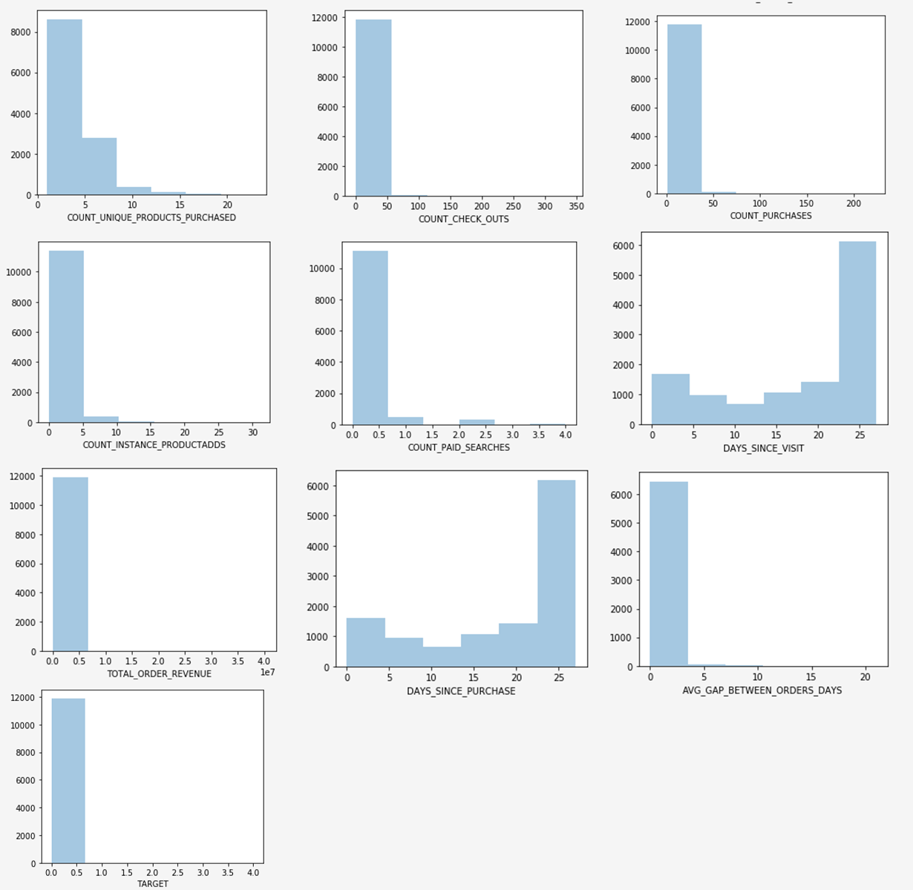

# Utforska webbaserade data för prediktiva modeller med EDA-anteckningsboken (exploratory data analysis)

EDA-anteckningsboken (exploratory data analysis) är utformad för att hjälpa dig att upptäcka mönster i data, kontrollera datasäkerheten och sammanfatta relevanta data för prediktiva modeller.

EDA-anteckningsboksexemplet optimerades med webbaserade data i åtanke och består av två delar. Del ett börjar med att använda frågetjänsten för att visa trender och ögonblicksbilder av data. Sedan, med ett mål i åtanke för en undersökande dataanalys, sammanställs data på profil- och besöksnivå.

Del två börjar med att utföra en beskrivande analys av aggregerade data med Python-bibliotek. Den här anteckningsboken visar visualiseringar som histogram, spridningsytor, rutor och en korrelationsmatris för att ta fram användbara insikter som används för att avgöra vilka funktioner som troligen är till störst hjälp för att förutsäga ett mål.

## Komma igång

Innan du läser den här guiden bör du läsa [[!DNL JupyterLab] användarhandboken](./overview.md) för att få en introduktion på hög nivå till [!DNL JupyterLab] och dess roll i Data Science Workspace. Om du dessutom använder egna data bör du läsa dokumentationen för [dataåtkomst i [!DNL Jupyterlab] anteckningsböcker](./access-notebook-data.md). Den här guiden innehåller viktig information om datagränser för bärbara datorer.

Den här anteckningsboken använder en datamängd med mellanvärden i form av Adobe Analytics Experience Events-data som finns i Analytics Analysis Workspace. Om du vill använda EDA-anteckningsboken måste du definiera datatabellen med följande värden: `target_table` och `target_table_id`. Alla datamängder med mellanvärden kan användas.

Följ stegen som beskrivs i avsnittet [skriv till en datauppsättning i avsnittet python](./access-notebook-data.md#write-python) i JupyterLab-dataåtkomstguiden för att hitta dessa värden. Datauppsättningsnamnet (`target_table`) finns i datauppsättningskatalogen. När du högerklickar på datauppsättningen för att utforska eller skriva data i en anteckningsbok, anges ett datauppsättnings-ID (`target_table_id`) i den körbara kodposten.

## Dataidentifiering

Det här avsnittet innehåller konfigurationssteg och exempelfrågor som används för att visa trender som &quot;de tio viktigaste städerna efter användaraktivitet&quot; eller &quot;de tio populäraste visade produkterna&quot;.

### Konfiguration av bibliotek

JupyterLab har stöd för flera bibliotek. Följande kod kan klistras in och köras i en kodcell för att samla in och installera alla nödvändiga paket som används i det här exemplet. Du kan använda ytterligare eller alternativa paket utanför det här exemplet för din egen dataanalys. Om du vill visa en lista över de paket som stöds kopierar och klistrar du in `!pip list --format=columns` i en ny cell.

```python
!pip install colorama
import chart_studio.plotly as py
import plotly.graph_objs as go
from plotly.offline import iplot
from scipy import stats
import numpy as np
import warnings
warnings.filterwarnings('ignore')
from scipy.stats import pearsonr
import matplotlib.pyplot as plt
from scipy.stats import pearsonr
import pandas as pd
import math
import re
import seaborn as sns
from datetime import datetime
import colorama
from colorama import Fore, Style
pd.set_option('display.max_columns', None)
pd.set_option('display.max_rows', None)
pd.set_option('display.width', 1000)
pd.set_option('display.expand_frame_repr', False)
pd.set_option('display.max_colwidth', -1)
```

### Anslut till Adobe Experience Platform [!DNL Query Service]

[!DNL JupyterLab] På Platform kan du använda SQL i en  [!DNL Python] anteckningsbok för att få åtkomst till data via  [frågetjänsten](https://www.adobe.com/go/query-service-home-en). Att få åtkomst till data via [!DNL Query Service] kan vara användbart för hantering av stora datamängder på grund av dess överlägsna körtider. Observera att det går att skicka frågor med [!DNL Query Service] i tio minuter.

Innan du använder [!DNL Query Service] i [!DNL JupyterLab] måste du ha en fungerande förståelse för [[!DNL Query Service] SQL-syntaxen](https://www.adobe.com/go/query-service-sql-syntax-en).

Om du vill använda frågetjänsten i JupyterLab måste du först skapa en anslutning mellan din fungerande Python-anteckningsbok och frågetjänsten. Detta kan du göra genom att köra följande cell.

```python
qs_connect()
```

### Definiera datamängden med mellanvärden för utforskande

För att kunna börja fråga och utforska data måste en datatabell med mellanvärden anges. Kopiera och ersätt värdena `table_name` och `table_id` med dina egna datatabellvärden.

```python
target_table = "table_name"
target_table_id = "table_id"
```

När cellen är klar ska den se ut ungefär som i följande exempel:

```python
target_table = "cross_industry_demo_midvalues"
target_table_id = "5f7c40ef488de5194ba0157a"
```

### Utforska datauppsättningen för tillgängliga datum

Med hjälp av cellen nedan kan du visa datumintervallet som omfattas av tabellen. Syftet med att utforska antalet dagar, första datum och sista datum är att underlätta valet av datumintervall för ytterligare analys.

```python
%%read_sql -c QS_CONNECTION
SELECT distinct Year(timestamp) as Year, Month(timestamp) as Month, count(distinct DAY(timestamp)) as Count_days, min(DAY(timestamp)) as First_date, max(DAY(timestamp)) as Last_date, count(timestamp) as Count_hits
from {target_table}
group by Month(timestamp), Year(timestamp)
order by Year, Month;
```

När du kör cellen skapas följande utdata:


### Konfigurera datum för datauppsättningsidentifiering

När de tillgängliga datumen för datamängdssökning har identifierats måste parametrarna nedan uppdateras. De datum som konfigureras i den här cellen används bara för dataidentifiering i form av frågor. Datumen uppdateras igen till lämpliga intervall för analys av experimentella data senare i den här guiden.

```python
target_year = "2020" ## The target year
target_month = "02" ## The target month
target_day = "(01,02,03)" ## The target days
```

### Identifiering av datauppsättning

När du har konfigurerat alla parametrar, startat [!DNL Query Service] och har ett datumintervall är du redo att börja läsa datarader. Du bör begränsa antalet rader som du läser.

```python
from platform_sdk.dataset_reader import DatasetReader
from datetime import date
dataset_reader = DatasetReader(PLATFORM_SDK_CLIENT_CONTEXT, dataset_id=target_table_id)
# If you do not see any data or would like to expand the default date range, change the following query
Table = dataset_reader.limit(5).read()
```

Använd följande cell för att visa antalet kolumner som är tillgängliga i datauppsättningen:

```python
print("\nNumber of columns:",len(Table.columns))
```

Använd följande cell för att visa datamängdens rader. I det här exemplet är antalet rader begränsat till fem.

```python
Table.head(5)
```


När du får en uppfattning om vilka data som finns i datauppsättningen kan det vara värdefullt att ytterligare dela upp datauppsättningen. I det här exemplet visas kolumnnamnen och datatyperna för var och en av kolumnerna, medan utdata används för att kontrollera om datatypen är korrekt eller inte.

```python
ColumnNames_Types = pd.DataFrame(Table.dtypes)
ColumnNames_Types = ColumnNames_Types.reset_index()
ColumnNames_Types.columns = ["Column_Name", "Data_Type"]
ColumnNames_Types
```


### Utforska datauppsättningens trend

Följande avsnitt innehåller fyra exempelfrågor som används för att utforska trender och mönster i data. Exemplen nedan är inte uttömmande men omfattar några av de vanligaste funktionerna.

**Antal aktiviteter per timme för en given dag**

Den här frågan analyserar antalet åtgärder och klickningar under dagen. Utdata representeras i form av en tabell som innehåller mått för antalet aktiviteter för varje timme på dagen.

```sql
%%read_sql query_2_df -c QS_CONNECTION

SELECT Substring(timestamp, 12, 2)                        AS Hour, 
       Count(enduserids._experience.aaid.id) AS Count 
FROM   {target_table}
WHERE  Year(timestamp) = {target_year} 
       AND Month(timestamp) = {target_month}  
       AND Day(timestamp) in {target_day}
GROUP  BY Hour
ORDER  BY Hour;
```


När frågan har bekräftats kan data presenteras i ett unikt ritythistogram för att bli tydligare.

```python
trace = go.Bar(
    x = query_2_df['Hour'],
    y = query_2_df['Count'],
    name = "Activity Count"
)

layout = go.Layout(
    title = 'Activity Count by Hour of Day',
    width = 1200,
    height = 600,
    xaxis = dict(title = 'Hour of Day'),
    yaxis = dict(title = 'Count')
)

fig = go.Figure(data = [trace], layout = layout)
iplot(fig)
```


**De 10 viktigaste visade sidorna för en viss dag**

Den här frågan analyserar vilka sidor som visas mest för en viss dag. Utdata representeras i form av en tabell som innehåller mått på sidnamnet och antalet sidvisningar.

```sql
%%read_sql query_4_df -c QS_CONNECTION

SELECT web.webpagedetails.name                 AS Page_Name, 
       Sum(web.webpagedetails.pageviews.value) AS Page_Views 
FROM   {target_table}
WHERE  Year(timestamp) = {target_year}
       AND Month(timestamp) = {target_month}
       AND Day(timestamp) in {target_day}
GROUP  BY web.webpagedetails.name 
ORDER  BY page_views DESC 
LIMIT  10;
```

När frågan har bekräftats kan data presenteras i ett unikt ritythistogram för att bli tydligare.

```python
trace = go.Bar(
    x = query_4_df['Page_Name'],
    y = query_4_df['Page_Views'],
    name = "Page Views"
)

layout = go.Layout(
    title = 'Top Ten Viewed Pages For a Given Day',
    width = 1000,
    height = 600,
    xaxis = dict(title = 'Page_Name'),
    yaxis = dict(title = 'Page_Views')
)

fig = go.Figure(data = [trace], layout = layout)
iplot(fig)
```


**De tio viktigaste städerna grupperade efter användaraktivitet**

Den här frågan analyserar vilka städer som data kommer från.

```sql
%%read_sql query_6_df -c QS_CONNECTION

SELECT concat(placeContext.geo.stateProvince, ' - ', placeContext.geo.city) AS state_city, 
       Count(timestamp)                                                     AS Count
FROM   {target_table}
WHERE  Year(timestamp) = {target_year}
       AND Month(timestamp) = {target_month}
       AND Day(timestamp) in {target_day}
GROUP  BY state_city
ORDER  BY Count DESC
LIMIT  10;
```

När frågan har bekräftats kan data presenteras i ett unikt ritythistogram för att bli tydligare.

```python
trace = go.Bar(
    x = query_6_df['state_city'],
    y = query_6_df['Count'],
    name = "Activity by City"
)

layout = go.Layout(
    title = 'Top Ten Cities by User Activity',
    width = 1200,
    height = 600,
    xaxis = dict(title = 'City'),
    yaxis = dict(title = 'Count')
)

fig = go.Figure(data = [trace], layout = layout)
iplot(fig)
```


**De tio vanligaste visade produkterna**

Den här frågan innehåller en lista över de tio mest visade produkterna. I exemplet nedan används funktionen `Explode()` för att returnera varje produkt i `productlistitems`-objektet till sin egen rad. På så sätt kan du göra en kapslad fråga för att sammanställa produktvyer för olika SKU:er.

```sql
%%read_sql query_7_df -c QS_CONNECTION

SELECT Product_List_Items.sku AS Product_SKU,
       Sum(Product_Views) AS Total_Product_Views
FROM  (SELECT Explode(productlistitems) AS Product_List_Items, 
              commerce.productviews.value   AS Product_Views 
       FROM   {target_table}
       WHERE  Year(timestamp) = {target_year}
              AND Month(timestamp) = {target_month}
              AND Day(timestamp) in {target_day}
              AND commerce.productviews.value IS NOT NULL) 
GROUP BY Product_SKU 
ORDER BY Total_Product_Views DESC
LIMIT  10;
```

När frågan har bekräftats kan data presenteras i ett unikt ritythistogram för att bli tydligare.

```python
trace = go.Bar(
    x = "SKU-" + query_7_df['Product_SKU'],
    y = query_7_df['Total_Product_Views'],
    name = "Product View"
)

layout = go.Layout(
    title = 'Top Ten Viewed Products',
    width = 1200,
    height = 600,
    xaxis = dict(title = 'SKU'),
    yaxis = dict(title = 'Product View Count')
)

fig = go.Figure(data = [trace], layout = layout)
iplot(fig)
```


När du har utforskat trender och mönster för data bör du ha en bra idé om vilka funktioner du vill bygga för att förutse ett mål. Genom att skissa igenom tabeller kan du snabbt framhäva formen på varje dataattribut, tydliga felutdrag och stora avvikelser i värdena och börja föreslå relationer mellan attributen.

## Förberedande dataanalys

Experimentell dataanalys används för att förfina er förståelse av data och bygga upp en intuition för övertygande frågor som kan användas som grund för er modellering.

När du är klar med dataidentifieringssteget har du utforskat data på händelsenivå med en del aggregeringar på händelse-, ort- eller användar-ID-nivå för att se trender för en dag. Även om dessa data är viktiga ger de ingen fullständig bild. Du förstår fortfarande inte vad som driver ett köp på din webbplats.

För att förstå detta måste ni samla in data på profil-/besökarnivå, definiera ett inköpsmål och tillämpa statistiska begrepp som korrelation, rutor och spridningspunkterna. Dessa metoder används för att jämföra aktivitetsmönster för köpare jämfört med icke-köpare i det förutsägelsefönster som du definierar.

Följande funktioner skapas och utforskas i det här avsnittet:

- `COUNT_UNIQUE_PRODUCTS_PURCHASED`: Antalet unika produkter som köpts.
- `COUNT_CHECK_OUTS`: Antal utcheckningar.
- `COUNT_PURCHASES`: Antal inköp.
- `COUNT_INSTANCE_PRODUCTADDS`: Antalet produkttilläggsinstanser.
- `NUMBER_VISITS` : Antalet besök.
- `COUNT_PAID_SEARCHES`: Antalet betalda sökningar.
- `DAYS_SINCE_VISIT`: Antalet dagar sedan det senaste besöket.
- `TOTAL_ORDER_REVENUE`: Den totala orderintäkten.
- `DAYS_SINCE_PURCHASE`: Antalet dagar sedan föregående köp.
- `AVG_GAP_BETWEEN_ORDERS_DAYS`: Genomsnittlig lucka mellan köp i dagar.
- `STATE_CITY`: Innehåller staten och staden.

Innan du fortsätter med din dataaggregering måste du definiera parametrarna för förutsägelsevariabeln som används i undersökande dataanalyser. Med andra ord, vad vill du ha av datavetenskapen? Vanliga parametrar är ett mål, en förutsägelseperiod och en analysperiod.

Om du använder EDA-anteckningsboken måste du ersätta värdena nedan innan du fortsätter.

```python
goal = "commerce.`order`.purchaseID" #### prediction variable
goal_column_type = "numerical" #### choose either "categorical" or "numerical"
prediction_window_day_start = "2020-01-01" #### YYYY-MM-DD
prediction_window_day_end = "2020-01-31" #### YYYY-MM-DD
analysis_period_day_start = "2020-02-01" #### YYYY-MM-DD
analysis_period_day_end = "2020-02-28" #### YYYY-MM-DD

### If the goal is a categorical goal then select threshold for the defining category and creating bins. 0 is no order placed, and 1 is at least one order placed:
threshold = 1
```

### Datasammanfogning för att skapa funktioner och mål

För att kunna börja utforska analyser måste du skapa ett mål på profilnivå, följt av att samla din datauppsättning. I det här exemplet finns två frågor. Den första frågan innehåller skapandet av ett mål. Den andra frågan måste uppdateras för att inkludera andra variabler än de som finns i den första frågan. Du kanske vill uppdatera `limit` för din fråga. Efter att ha utfört följande frågor är aggregerade data nu tillgängliga för utforskande.

```sql
%%read_sql target_df -d -c QS_CONNECTION

SELECT DISTINCT endUserIDs._experience.aaid.id                  AS ID,
       Count({goal})                                            AS TARGET
FROM   {target_table}
WHERE DATE(TIMESTAMP) BETWEEN '{prediction_window_day_start}' AND '{prediction_window_day_end}'
GROUP BY endUserIDs._experience.aaid.id;
```

```sql
%%read_sql agg_data -d -c QS_CONNECTION

SELECT z.*, z1.state_city as STATE_CITY
from
((SELECT y.*,a2.AVG_GAP_BETWEEN_ORDERS_DAYS as AVG_GAP_BETWEEN_ORDERS_DAYS
from
(select a1.*, f.DAYS_SINCE_PURCHASE as DAYS_SINCE_PURCHASE
from
(SELECT DISTINCT a.ID  AS ID,
COUNT(DISTINCT Product_Items.SKU) as COUNT_UNIQUE_PRODUCTS_PURCHASED,
COUNT(a.check_out) as COUNT_CHECK_OUTS,
COUNT(a.purchases) as COUNT_PURCHASES, 
COUNT(a.product_list_adds) as COUNT_INSTANCE_PRODUCTADDS,
sum(CASE WHEN a.search_paid = 'TRUE' THEN 1 ELSE 0 END) as COUNT_PAID_SEARCHES,
DATEDIFF('{analysis_period_day_end}', MAX(a.date_a)) as DAYS_SINCE_VISIT,
ROUND(SUM(Product_Items.priceTotal * Product_Items.quantity), 2) AS TOTAL_ORDER_REVENUE
from 
(SELECT endUserIDs._experience.aaid.id as ID,
commerce.`checkouts`.value as check_out,
commerce.`order`.purchaseID as purchases, 
commerce.`productListAdds`.value as product_list_adds,
search.isPaid as search_paid,
DATE(TIMESTAMP) as date_a,
Explode(productlistitems) AS Product_Items
from {target_table}
Where DATE(TIMESTAMP) BETWEEN '{analysis_period_day_start}' AND '{analysis_period_day_end}') as a
group by a.ID) as a1
left join 
(SELECT DISTINCT endUserIDs._experience.aaid.id as ID,
DATEDIFF('{analysis_period_day_end}', max(DATE(TIMESTAMP))) as DAYS_SINCE_PURCHASE
from {target_table}
where DATE(TIMESTAMP) BETWEEN '{analysis_period_day_start}' AND '{analysis_period_day_end}'
and commerce.`order`.purchaseid is not null
GROUP BY endUserIDs._experience.aaid.id) as f
on f.ID = a1.ID
where a1.COUNT_PURCHASES>0) as y
left join
(select ab.ID, avg(DATEDIFF(ab.ORDER_DATES, ab.PriorDate)) as AVG_GAP_BETWEEN_ORDERS_DAYS
from
(SELECT distinct endUserIDs._experience.aaid.id as ID, TO_DATE(DATE(TIMESTAMP)) as ORDER_DATES, 
TO_DATE(LAG(DATE(TIMESTAMP),1) OVER (PARTITION BY endUserIDs._experience.aaid.id ORDER BY DATE(TIMESTAMP))) as PriorDate
FROM {target_table}
where DATE(TIMESTAMP) BETWEEN '{analysis_period_day_start}' AND '{analysis_period_day_end}'
AND commerce.`order`.purchaseid is not null) AS ab
where ab.PriorDate is not null
GROUP BY ab.ID) as a2
on a2.ID = y.ID) z    
left join
(select t.ID, t.state_city from
(
SELECT DISTINCT endUserIDs._experience.aaid.id as ID,
concat(placeContext.geo.stateProvince, ' - ', placeContext.geo.city) as state_city, 
ROW_NUMBER() OVER(PARTITION BY endUserIDs._experience.aaid.id ORDER BY DATE(TIMESTAMP) DESC) AS ROWNUMBER
FROM   {target_table}
WHERE  DATE(TIMESTAMP) BETWEEN '{analysis_period_day_start}' AND '{analysis_period_day_end}') as t
where t.ROWNUMBER = 1) z1
on z.ID = z1.ID)
limit 500000;
```

### Slå samman funktionerna i den aggregerade datauppsättningen med ett mål

Följande cell används för att sammanfoga funktionerna i den aggregerade datauppsättningen som beskrivs i föregående exempel med ditt förutsägelsemål.

```python
Data = pd.merge(agg_data,target_df, on='ID',how='left')
Data['TARGET'].fillna(0, inplace=True)
```

De följande tre exempelcellerna används för att säkerställa att sammanfogningen lyckades.

`Data.shape` returnerar antalet kolumner följt av antalet rader, till exempel: (1913, 12).

```python
Data.shape
```

`Data.head(5)` returnerar en tabell med 5 rader data. Den returnerade tabellen innehåller alla 12 kolumner med aggregerade data mappade till ett profil-ID.

```python
Data.head(5)
```


Den här cellen skriver ut antalet unika profiler.

```python
print("Count of unique profiles :", (len(Data)))
```

### Identifiera saknade värden och avvikelser

När du har slutfört din datainsamling och sammanfogat den med ditt mål, måste du granska de data som ibland kallas för en datakontroll.

Denna process innebär att identifiera saknade värden och avvikelser. När problem identifieras är nästa uppgift att ta fram specifika strategier för hur de ska hanteras.

>[!NOTE]
>
>Under det här steget kan du upptäcka att värdena är skadade, vilket kan signalera ett fel i dataloggningsprocessen.

```python
Missing = pd.DataFrame(round(Data.isnull().sum()*100/len(Data),2))
Missing.columns =['Percentage_missing_values'] 
Missing['Features'] = Missing.index
```

Följande cell används för att visualisera de värden som saknas.

```python
trace = go.Bar(
    x = Missing['Features'],
    y = Missing['Percentage_missing_values'],
    name = "Percentage_missing_values")

layout = go.Layout(
    title = 'Missing values',
    width = 1200,
    height = 600,
    xaxis = dict(title = 'Features'),
    yaxis = dict(title = 'Percentage of missing values')
)

fig = go.Figure(data = [trace], layout = layout)
iplot(fig)
```


När du har upptäckt saknade värden är det viktigt att identifiera avvikelser. Parametrisk statistik som medelvärde, standardavvikelse och korrelation är mycket känslig för avvikelser. Dessutom bygger antagandena om vanliga statistiska förfaranden, t.ex. linjära regressioner, också på denna statistik. Det innebär att extremvärden kan skapa en enda analys.

I det här exemplet används interkvartilt intervall för att identifiera avvikelser. Interkvartilsintervall (IQR) är intervallet mellan den första och tredje kvartilen (25:e och 75:e percentilen). I det här exemplet samlas alla datapunkter som faller under antingen 1,5 gånger IQR under den 25:e percentilen, eller 1,5 gånger IQR över den 75:e percentilen. Värden som faller under någon av dessa definieras som en avvikelse i följande cell.

>[!TIP]
>
>För att korrigera avvikelser måste ni förstå vilken bransch ni arbetar i. Ibland kan man inte släppa en observation bara för att den är en outlier. Externa leverantörer kan vara berättigade observationer och är ofta de mest intressanta. Mer information om hur du släpper avvikelser finns i [valfritt datarensningssteg](#optional-data-clean).

```python
TARGET = Data.TARGET

Data_numerical = Data.select_dtypes(include=['float64', 'int64'])
Data_numerical.drop(['TARGET'],axis = 1,inplace = True)
Data_numerical1 = Data_numerical

for i in range(0,len(Data_numerical1.columns)):
    Q1 = Data_numerical1.iloc[:,i].quantile(0.25)
    Q3 = Data_numerical1.iloc[:,i].quantile(0.75)
    IQR = Q3 - Q1
    Data_numerical1.iloc[:,i] = np.where(Data_numerical1.iloc[:,i]<(Q1 - 1.5 * IQR),np.nan, np.where(Data_numerical1.iloc[:,i]>(Q3 + 1.5 * IQR),
                                                                                                    np.nan,Data_numerical1.iloc[:,i]))
    
Outlier = pd.DataFrame(round(Data_numerical1.isnull().sum()*100/len(Data),2))
Outlier.columns =['Percentage_outliers'] 
Outlier['Features'] = Outlier.index   
```

Som alltid är det viktigt att visualisera resultatet.

```python
trace = go.Bar(
    x = Outlier['Features'],
    y = Outlier['Percentage_outliers'],
    name = "Percentage_outlier")

layout = go.Layout(
    title = 'Outliers',
    width = 1200,
    height = 600,
    xaxis = dict(title = 'Features'),
    yaxis = dict(title = 'Percentage of outliers')
)

fig = go.Figure(data = [trace], layout = layout)
iplot(fig)
```


### Univariat-analys

När dina data har korrigerats för saknade värden och avvikelser, kan du påbörja analysen. Det finns tre typer av analyser: Univariat-, bivariat- och multivariatanalys. Univariate-analyser tar data, sammanfattar och hittar mönster i data med hjälp av enskilda variabelrelationer. Bivariatanalys undersöker mer än en variabel åt gången, medan multivariatanalys undersöker tre eller fler variabler åt gången.

I följande exempel skapas en tabell som visualiserar distributionen av funktionerna.

```python
Data_numerical = Data.select_dtypes(include=['float64', 'int64'])
distribution = pd.DataFrame([Data_numerical.count(),Data_numerical.mean(),Data_numerical.quantile(0), Data_numerical.quantile(0.01),
                             Data_numerical.quantile(0.05),Data_numerical.quantile(0.25), Data_numerical.quantile(0.5),
                        Data_numerical.quantile(0.75),  Data_numerical.quantile(0.95),Data_numerical.quantile(0.99), Data_numerical.max()])
distribution = distribution.T
distribution.columns = ['Count', 'Mean', 'Min', '1st_perc','5th_perc','25th_perc', '50th_perc','75th_perc','95th_perc','99th_perc','Max']
distribution
```


När du har distribuerat funktionerna kan du skapa visualiserade datamappningar med hjälp av en array. Följande celler används för att visualisera tabellen ovan med numeriska data.

```python
A = sns.palplot(sns.color_palette("Blues"))
```

```python
for column in Data_numerical.columns[0:]:
    plt.figure(figsize=(5, 4))
    plt.ticklabel_format(style='plain', axis='y')
    sns.distplot(Data_numerical[column], color = A, kde=False, bins=6, hist_kws={'alpha': 0.4});
```



### Kategoriserade data

Gruppering av kategoriserade data används för att förstå värdena i var och en av kolumnerna med aggregerade data och deras fördelning. I det här exemplet används de 10 främsta kategorierna för att hjälpa till att plotta distributionerna. Observera att det kan finnas tusentals unika värden i en kolumn. Du vill inte återge en rörig yta som gör den oläslig. Med affärsmålet i åtanke ger gruppering av data mer meningsfulla resultat.

```python
Data_categorical = Data.select_dtypes(include='object')
Data_categorical.drop(['ID'], axis = 1, inplace = True, errors = 'ignore')
```

```python
for column in Data_categorical.columns[0:]:
    if (len(Data_categorical[column].value_counts())>10):
        plt.figure(figsize=(12, 8))
        sns.countplot(x=column, data = Data_categorical, order = Data_categorical[column].value_counts().iloc[:10].index, palette="Set2");
    else:
        plt.figure(figsize=(12, 8))
        sns.countplot(x=column, data = Data_categorical, palette="Set2");
```


### Ta bort kolumner med endast ett distinkt värde

Kolumner som bara har ett värde lägger inte till någon information i analysen och kan tas bort.

```python
for col in Data.columns:
    if len(Data[col].unique()) == 1:
        if col == 'TARGET':
            print(Fore.RED + '\033[1m' + 'WARNING : TARGET HAS A SINGLE UNIQUE VALUE, ANY BIVARIATE ANALYSIS (NEXT STEP IN THIS NOTEBOOK) OR PREDICTION WILL BE MEANINGLESS' + Fore.RESET + '\x1b[21m')
        elif col == 'ID':
            print(Fore.RED + '\033[1m' + 'WARNING : THERE IS ONLY ONE PROFILE IN THE DATA, ANY BIVARIATE ANALYSIS (NEXT STEP IN THIS NOTEBOOK) OR PREDICTION WILL BE MEANINGLESS' + Fore.RESET + '\x1b[21m')
        else:
            print('Dropped column :',col)
            Data.drop(col,inplace=True,axis=1)
```

När du har tagit bort kolumner med ett värde kontrollerar du om det finns några fel i de återstående kolumnerna med kommandot `Data.columns` i en ny cell.

### Korrigera saknade värden

Följande avsnitt innehåller några exempel på hur du korrigerar saknade värden. Händelsen i ovanstående data är dock bara en kolumn som saknar ett värde, och exempelcellerna nedan korrigerar värden för alla datatyper. Bland dessa finns:

- Numeriska datatyper: ingång 0 eller max, om tillämpligt
- Kategoriserade datatyper: modal indatavärde

```python
#### Select only numerical data
Data_numerical = Data.select_dtypes(include=['float64', 'int64'])

#### For columns that contain days we impute max days of history for null values, for rest all we impute 0

# Imputing days with max days of history
Days_cols = [col for col in Data_numerical.columns if 'DAYS_' in col]
d1 = datetime.strptime(analysis_period_day_start, "%Y-%m-%d")
d2 = datetime.strptime(analysis_period_day_end, "%Y-%m-%d")
A = abs((d2 - d1).days)

for column in Days_cols:
    Data[column].fillna(A, inplace=True)

# Imputing 0
Data_numerical = Data.select_dtypes(include=['float64', 'int64'])
Missing_numerical = Data_numerical.columns[Data_numerical.isnull().any()].tolist()

for column in Missing_numerical:
    Data[column].fillna(0, inplace=True)
```

```python
#### Correct for missing values in categorical columns (Replace with mode)
Data_categorical = Data.select_dtypes(include='object')
Missing_cat = Data_categorical.columns[Data_categorical.isnull().any()].tolist() 
for column in Missing_cat:
    Data[column].fillna(Data[column].mode()[0], inplace=True)
```

När uppgifterna är klara är de klara för bivariatanalys.

### Bivariatanalys

Bivariata analyser används för att förstå relationen mellan två uppsättningar värden, som dina funktioner och en målvariabel. Eftersom olika ytor motsvarar kategoriserade och numeriska datatyper bör analysen göras separat för varje datatyp. Följande diagram rekommenderas för bivariatanalys:

- **Korrelation**: En korrelationskoefficient är måttet på styrkan av ett förhållande mellan två egenskaper. Korrelationen har värden mellan -1 och 1, där: 1 anger ett starkt positivt förhållande, -1 anger ett starkt negativt förhållande och resultatet noll anger inget förhållande alls.
- **Pair plot**: Pair-diagram är ett enkelt sätt att visualisera relationer mellan olika variabler. Den skapar en matris med relationer mellan varje variabel i data.
- **Heatmap**: Heatmaps är korrelationskoefficienten för alla variabler i datauppsättningen.
- **Rutor**: Kartongsområden är ett standardiserat sätt att visa datadistribution baserat på en femtalssammanfattning (minimum, first quartile (Q1), median, third quartile (Q3) och maximum).
- **Antal ritningar**: En antalsritning är som ett histogram eller ett stolpdiagram för vissa kategoriserade funktioner. Här visas antalet förekomster av ett objekt baserat på en viss typ av kategori.

För att förstå relationen mellan variabeln &#39;target&#39; och prediktorerna/funktionerna används diagram baserat på datatyper. För numeriska funktioner bör du använda en rutyta om &#39;target&#39;-variabeln är kategorisisk, samt en pairplot och heatmap om &#39;target&#39;-variabeln är numerisk.

För kategoriserade funktioner bör du använda en kontrast om variabeln &#39;target&#39; är kategorisisk, samt en rutcirkel om variabeln &#39;target&#39; är numerisk. Om du använder dessa metoder blir det lättare att förstå relationer. Dessa relationer kan ha formen av funktioner, eller prediktorer och ett mål.

**Numeriska prediktorer**

```python
if len(Data) == 1:
    print(Fore.RED + '\033[1m' + 'THERE IS ONLY ONE PROFILE IN THE DATA, BIVARIATE ANALYSIS IS NOT APPLICABLE, PLEASE INCLUDE AT LEAST ONE MORE PROFILE TO DO BIVARIATE ANALYSIS')
elif len(Data['TARGET'].unique()) == 1:
    print(Fore.RED + '\033[1m' + 'TARGET HAS A SINGLE UNIQUE VALUE, BIVARIATE ANALYSIS IS NOT APPLICABLE, PLEASE INCLUDE PROFILES WITH ATLEAST ONE DIFFERENT VALUE OF TARGET TO DO BIVARIATE ANALYSIS')
else:
    if (goal_column_type == "categorical"):
        TARGET_categorical = pd.DataFrame(np.where(TARGET>=threshold,"1","0"))
        TARGET_categorical.rename(columns={TARGET_categorical.columns[0]: "TARGET_categorical" }, inplace = True)
        Data_numerical = Data.select_dtypes(include=['float64', 'int64'])
        Data_numerical.drop(['TARGET'],inplace=True,axis=1)
        Data_numerical = pd.concat([Data_numerical, TARGET_categorical.astype(int)], axis = 1)
        ncols_for_charts = len(Data_numerical.columns)-1
        nrows_for_charts = math.ceil(ncols_for_charts/4)
        fig, axes = plt.subplots(nrows=nrows_for_charts, ncols=4, figsize=(18, 15))
        for idx, feat in enumerate(Data_numerical.columns[:-1]):
            ax = axes[int(idx // 4), idx % 4]
            sns.boxplot(x='TARGET_categorical', y=feat, data=Data_numerical, ax=ax)
            ax.set_xlabel('')
            ax.set_ylabel(feat)
            fig.tight_layout();
    else:
        Data_numerical = Data.select_dtypes(include=['float64', 'int64'])
        TARGET = pd.DataFrame(Data_numerical.TARGET)
        Data_numerical = Data.select_dtypes(include=['float64', 'int64'])
        Data_numerical.drop(['TARGET'],inplace=True,axis=1)
        Data_numerical = pd.concat([Data_numerical, TARGET.astype(int)], axis = 1)
        for i in Data_numerical.columns[:-1]:
            sns.pairplot(x_vars=i, y_vars=['TARGET'], data=Data_numerical, height = 4)
        f, ax = plt.subplots(figsize = (10,8))
        corr = Data_numerical.corr()
```

När du kör cellen skapas följande utdata:


**Kategoriprediktorer**

Följande exempel används för att rita och visa frekvensområden för de 10 översta kategorierna i varje kategoriisk variabel.

```python
if len(Data) == 1:
    print(Fore.RED + '\033[1m' + 'THERE IS ONLY ONE PROFILE IN THE DATA, BIVARIATE ANALYSIS IS NOT APPLICABLE, PLEASE INCLUDE AT LEAST ONE MORE PROFILE TO DO BIVARIATE ANALYSIS')
elif len(Data['TARGET'].unique()) == 1:
    print(Fore.RED + '\033[1m' + 'TARGET HAS A SINGLE UNIQUE VALUE, BIVARIATE ANALYSIS IS NOT APPLICABLE, PLEASE INCLUDE PROFILES WITH ATLEAST ONE DIFFERENT VALUE OF TARGET TO DO BIVARIATE ANALYSIS')
else:
    if (goal_column_type == "categorical"):
        TARGET_categorical = pd.DataFrame(np.where(TARGET>=threshold,"1","0"))
        TARGET_categorical.rename(columns={TARGET_categorical.columns[0]: "TARGET_categorical" }, inplace = True)
        Data_categorical = Data.select_dtypes(include='object')
        Data_categorical.drop(["ID"], axis =1, inplace = True)
        Cat_columns = Data_categorical
        Data_categorical = pd.concat([TARGET_categorical,Data_categorical], axis =1)
        for column in Cat_columns.columns:
            A = Data_categorical[column].value_counts().iloc[:10].index
            Data_categorical1 = Data_categorical[Data_categorical[column].isin(A)]
            plt.figure(figsize=(12, 8))
            sns.countplot(x="TARGET_categorical",hue=column, data = Data_categorical1, palette = 'Blues')
            plt.xlabel("GOAL")
            plt.ylabel("COUNT")
            plt.show();
    else:
        Data_categorical = Data.select_dtypes(include='object')
        Data_categorical.drop(["ID"], axis =1, inplace = True)
        Target = Data.TARGET
        Data_categorical = pd.concat([Data_categorical,Target], axis =1)
        for column in Data_categorical.columns[:-1]:
            A = Data_categorical[column].value_counts().iloc[:10].index
            Data_categorical1 = Data_categorical[Data_categorical[column].isin(A)]
            sns.catplot(x=column, y="TARGET", kind = "boxen", data =Data_categorical1, height=5, aspect=13/5);
```

När du kör cellen skapas följande utdata:


### Viktiga numeriska funktioner

Med hjälp av korrelationsanalys kan du skapa en lista med de tio viktigaste numeriska funktionerna. Dessa funktioner kan användas för att förutsäga målfunktionen. Den här listan kan användas som funktionslista när du börjar skapa en modell.

```python
if len(Data) == 1:
    print(Fore.RED + '\033[1m' + 'THERE IS ONLY ONE PROFILE IN THE DATA, BIVARIATE ANALYSIS IS NOT APPLICABLE, PLEASE INCLUDE AT LEAST ONE MORE PROFILE TO FIND IMPORTANT VARIABLES')
elif len(Data['TARGET'].unique()) == 1:
    print(Fore.RED + '\033[1m' + 'TARGET HAS A SINGLE UNIQUE VALUE, BIVARIATE ANALYSIS IS NOT APPLICABLE, PLEASE INCLUDE PROFILES WITH ATLEAST ONE DIFFERENT VALUE OF TARGET TO FIND IMPORTANT VARIABLES')
else:
    Data_numerical = Data.select_dtypes(include=['float64', 'int64'])
    Correlation = pd.DataFrame(Data_numerical.drop("TARGET", axis=1).apply(lambda x: x.corr(Data_numerical.TARGET)))
    Correlation['Corr_abs'] = abs(Correlation)
    Correlation = Correlation.sort_values(by = 'Corr_abs', ascending = False)
    Imp_features = pd.DataFrame(Correlation.index[0:10])
    Imp_features.rename(columns={0:'Important Feature'}, inplace=True)
    print(Imp_features)
```


### Exempel på insikter

Även om ni håller på att analysera era data är det inte ovanligt att få insikter. Följande exempel är en insikt som mappar det senaste och monetära värdet för en målhändelse.

```python
# Proxy for monetary value is TOTAL_ORDER_REVENUE and proxy for frequency is NUMBER_VISITS
if len(Data) == 1:
    print(Fore.RED + '\033[1m' + 'THERE IS ONLY ONE PROFILE IN THE DATA, INSIGHTS ANALYSIS IS NOT APPLICABLE, PLEASE INCLUDE AT LEAST ONE MORE PROFILE TO FIND IMPORTANT VARIABLES')
elif len(Data['TARGET'].unique()) == 1:
    print(Fore.RED + '\033[1m' + 'TARGET HAS A SINGLE UNIQUE VALUE, INSIGHTS ANALYSIS IS NOT APPLICABLE, PLEASE INCLUDE PROFILES WITH ATLEAST ONE DIFFERENT VALUE OF TARGET TO FIND IMPORTANT VARIABLES')
else:
    sns.lmplot("DAYS_SINCE_VISIT", "TOTAL_ORDER_REVENUE", Data, hue="TARGET", fit_reg=False);
```


## Valfritt datarensningssteg {#optional-data-clean}

För att korrigera avvikelser måste ni förstå vilken bransch ni arbetar i. Ibland kan man inte släppa en observation bara för att den är en outlier. Externa leverantörer kan vara berättigade observationer och är ofta de mest intressanta.

Mer information om avvikande värden och om de ska tas bort eller inte finns i den här posten från [analysfaktorn](https://www.theanalysisfactor.com/outliers-to-drop-or-not-to-drop/).

I följande exempel används celländpunkter och flyttal för datapunkter som är avvikande med [interkvartilsintervall](https://www.thoughtco.com/what-is-the-interquartile-range-rule-3126244).

```python
TARGET = Data.TARGET

Data_numerical = Data.select_dtypes(include=['float64', 'int64'])
Data_numerical.drop(['TARGET'],axis = 1,inplace = True)

for i in range(0,len(Data_numerical.columns)):
    Q1 = Data_numerical.iloc[:,i].quantile(0.25)
    Q3 = Data_numerical.iloc[:,i].quantile(0.75)
    IQR = Q3 - Q1
    Data_numerical.iloc[:,i] = np.where(Data_numerical.iloc[:,i]<(Q1 - 1.5 * IQR), (Q1 - 1.5 * IQR), np.where(Data_numerical.iloc[:,i]>(Q3 + 1.5 * IQR),
                                                                                                     (Q3 + 1.5 * IQR),Data_numerical.iloc[:,i]))
Data_categorical = Data.select_dtypes(include='object')
Data = pd.concat([Data_categorical, Data_numerical, TARGET], axis = 1)
```

## Nästa steg

När du är klar med den experimentella dataanalysen kan du börja skapa en modell. Du kan också använda de data och insikter du härlett för att skapa en instrumentpanel med verktyg som Power BI.

Adobe Experience Platform delar upp processen för att skapa en modell i två skilda steg, Recept (en modellinstans) och Models. Gå till dokumentationen för [hur du skapar ett recept i JupyerLab-anteckningsböcker](./create-a-recipe.md) när du vill börja skapa recept. Det här dokumentet innehåller information och exempel för att skapa, utbilda och betygsätta ett recept i [!DNL JupyterLab] bärbara datorer.
