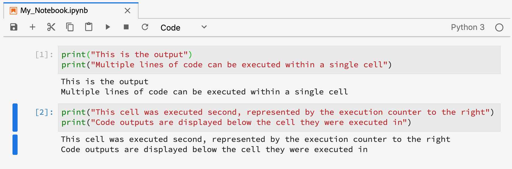

# Användarhandbok för JupyterLab

JupyterLab är ett webbaserat användargränssnitt för <a href="https://jupyter.org/" target="_blank">Project Jupyter</a> och är nära integrerat med Adobe Experience Platform. Den utgör en interaktiv utvecklingsmiljö där datavetare kan arbeta med Jupyters bärbara datorer, kod och data.

Det här dokumentet innehåller en översikt över JupyterLab och dess funktioner samt instruktioner om hur du utför vanliga åtgärder.

## JupyterLab om Experience Platform

Experience Platforms JupyterLab-integrering åtföljs av arkitektoniska förändringar, designöverväganden, anpassade tillägg till bärbara datorer, förinstallerade bibliotek och ett Adobe-temat gränssnitt.

I följande lista beskrivs några av funktionerna som är unika för JupyterLab på Platform:

| Funktion | Beskrivning |
| --- | --- |
| **Kernlar** | Kernels ger möjlighet att köra och granska kod i olika programmeringsspråk för bärbara datorer och andra JupyterLab-gränssnitt. Experience Platform har ytterligare kerrar som stöder utvecklingen i Python, R, PySpark och Spark. Mer information finns i avsnittet [Kernlar](#kernels) . |
| **Dataåtkomst** | Få tillgång till befintliga datauppsättningar direkt inifrån JupyterLab med fullt stöd för läs- och skrivfunktioner. |
| **Integrering av plattformstjänster** | Inbyggda integreringar gör att du kan använda andra plattformstjänster direkt från JupyterLab. En fullständig lista över integreringar som stöds finns i avsnittet om [integrering med andra plattformstjänster](#service-integration). |
| **Autentisering** | Förutom <a href="https://jupyter-notebook.readthedocs.io/en/latest/security.html" target="_blank">JupyterLab:s inbyggda säkerhetsmodell</a>krypteras och autentiseras all interaktion mellan programmet och Experience Platform, inklusive kommunikation från tjänst till tjänst i form av plattformar, via <a href="https://www.adobe.io/authentication/auth-methods.html" target="_blank">Adobe Identity Management System (IMS)</a>. |
| **Utvecklingsbibliotek** | I Experience Platform tillhandahåller JupyterLab förinstallerade bibliotek för Python, R och PySpark. En fullständig lista över bibliotek som stöds finns i [bilagan](#supported-libraries) . |
| **Bibliotekshanterare** | När de förinstallerade biblioteken saknas för dina behov kan ytterligare bibliotek installeras för Python och R, och lagras tillfälligt i isolerade behållare för att upprätthålla plattformens integritet och skydda dina data. Mer information finns i avsnittet [Kernlar](#kernels) . |

>[!NOTE] Ytterligare bibliotek är bara tillgängliga för den session där de installerades. Du måste installera om alla ytterligare bibliotek som du behöver när du startar nya sessioner.

## Integrering med andra plattformstjänster {#service-integration}

Standardisering och interoperabilitet är viktiga begrepp bakom Experience Platform. Integreringen av JupyterLab på Platform som en inbäddad IDE gör att den kan interagera med andra plattformstjänster, vilket gör att du kan utnyttja Platform fullt ut. Följande plattformstjänster är tillgängliga i JupyterLab:

* **Katalogtjänst:** Få tillgång till och utforska datauppsättningar med läs- och skrivfunktioner.
* **Frågetjänst:** Få åtkomst till och utforska datauppsättningar med SQL, vilket ger lägre dataåtkomstkostnader när du hanterar stora mängder data.
* **Sensei ML Framework:** Modellutveckling med möjlighet att träna och poängsätta data, liksom att skapa recept med ett enda klick.

>[!NOTE] Vissa integreringar av plattformstjänster på JupyterLab är begränsade till specifika kärnor. Mer information finns i avsnittet om [kernlar](#kernels) .

## Viktiga funktioner och vanliga åtgärder

Information om de viktigaste funktionerna i JupyterLab och anvisningar om hur du utför vanliga åtgärder finns i avsnitten nedan:

* [Åtkomst till JupyterLab](#access-jupyterlab)
* [Gränssnittet JupyterLab](#jupyterlab-interface)
* [Kodceller](#code-cells)
* [Kernlar](#kernels)
* [Kernel-sessioner](#kernel-sessions)
* [Körningsresurs för PySpark/Spark](#execution-resource)
* [Startprogram](#launcher)

### Åtkomst till JupyterLab {#access-jupyterlab}

I [Adobe Experience Platform](https://platform.adobe.com)väljer du **Anteckningsböcker** i den vänstra navigeringskolumnen. Ge JupyterLab lite tid att initiera helt.


### Gränssnittet JupyterLab {#jupyterlab-interface}

Gränssnittet JupyterLab består av en menyrad, ett fällbart sidofält och huvudarbetsytan som innehåller flikar med dokument och aktiviteter.

**Menyrad**

Menyraden högst upp i gränssnittet har menyer på översta nivån som visar åtgärder som är tillgängliga i JupyterLab med sina kortkommandon:

* **Fil:** Åtgärder för filer och kataloger
* **Redigera:** Åtgärder som rör redigering av dokument och andra aktiviteter
* **Visa:** Åtgärder som ändrar utseendet på JupyterLab
* **Kör:** Åtgärder för att köra kod i olika aktiviteter, t.ex. anteckningsböcker och kodkonsoler
* **Kernel:** Åtgärder för hantering av kärnor
* **Tabbar:** En lista över öppna dokument och aktiviteter
* **Inställningar:** Vanliga inställningar och en avancerad inställningsredigerare
* **Hjälp:** En lista med hjälplänkar för JupyterLab och kernel

**Vänster sidofält**

Den vänstra sidlisten innehåller klickbara flikar som ger tillgång till följande funktioner:

* **Filwebbläsare:** En lista över sparade anteckningsboksdokument och kataloger
* **Datautforskaren:** Bläddra bland, få tillgång till och utforska datauppsättningar och scheman
* **Löpande kärnor och terminaler:** En lista över aktiva kernel- och terminalsessioner med möjlighet att avsluta
* **Kommandon:** En lista med användbara kommandon
* **Cellkontroll:** En cellredigerare som ger tillgång till verktyg och metadata som är användbara när du ställer in en anteckningsbok för presentationsändamål
* **tabbar:** En lista med öppna flikar

Klicka på en flik för att visa dess funktioner, eller klicka på en utökad flik för att komprimera den vänstra sidopanelen så som visas nedan:


**Huvudarbetsyta**

På huvudarbetsytan i JupyterLab kan du ordna dokument och andra aktiviteter i flikpaneler som kan storleksändras eller delas upp. Dra en flik till mitten av en tabbpanel för att migrera fliken. Dela upp en panel genom att dra en flik till vänster, höger, överst eller nederst på panelen:


### Kodceller {#code-cells}

Kodceller är det primära innehållet i anteckningsböcker. De innehåller källkod på samma språk som anteckningsbokens associerade kärna och utdata som ett resultat av körningen av kodcellen. Ett körningsantal visas till höger om varje kodcell som representerar dess körningsordning.



Vanliga cellåtgärder beskrivs nedan:

* **Lägg till en cell:** Klicka på plustecknet (**+**) på anteckningsboksmenyn för att lägga till en tom cell. Nya celler placeras under den cell som interagerar med, eller i slutet av anteckningsboken om ingen viss cell är i fokus.

* **Flytta en cell:** Placera markören till höger om cellen som du vill flytta, klicka och dra sedan cellen till en ny plats. Om du flyttar en cell från en anteckningsbok till en annan kopieras cellen tillsammans med dess innehåll.

* **Kör en cell:** Klicka på den cell som du vill köra och klicka sedan på **uppspelningsikonen** (**▶**) på anteckningsbokens meny. En asterisk (**\***) visas i cellens körningsräknare när kärnan bearbetar körningen och ersätts med ett heltal vid slutförandet.

* **Ta bort en cell:** Klicka på cellen som du vill ta bort och klicka sedan på **saxikonen** .

### Kernlar {#kernels}

Anteckningsbokskärnor är språkspecifika datormotorer för bearbetning av bärbara datorer. Förutom Python har JupyterLab ytterligare språkstöd i R, PySpark och Spark. När du öppnar ett anteckningsboksdokument startas den tillhörande kärnan. När en anteckningsbokscell körs utför kärnan beräkningen och ger resultat som kan ta mycket processorkraft och minnesresurser i anspråk. Observera att allokerat minne inte frigörs förrän kärnan stängs av.

>[!IMPORTANT] JupyterLab Launcher har uppdaterats från Spark 2.3 till Spark 2.4. Spark- och PySpark-skärmar stöds inte längre i bärbara Spark 2.4-datorer.

Vissa funktioner är begränsade till särskilda kärnor enligt tabellen nedan:

| Kernel | Installationsstöd för bibliotek | Plattformsintegrering |
| :----: | :--------------------------: | :-------------------- |
| **Python** | Ja | <ul><li>Sensei ML Framework</li><li>Katalogtjänst</li><li>Frågetjänst</li></ul> |
| **R** | Ja | <ul><li>Sensei ML Framework</li><li>Katalogtjänst</li></ul> |
| **PySpark - borttagen** | Nej | <ul><li>Sensei ML Framework</li><li>Katalogtjänst</li></ul> |
| **Spark - borttagen** | Nej | <ul><li>Sensei ML Framework</li><li>Katalogtjänst</li></ul> |
| **Scala** | Nej | <ul><li>Sensei ML Framework</li><li>Katalogtjänst</li></ul> |

### Kernel-sessioner {#kernel-sessions}

Varje aktiv anteckningsbok eller aktivitet på JupyterLab använder en kernel-session. Alla aktiva sessioner kan hittas genom att expandera fliken **Löpande terminaler och kerrar** från vänster sidofält. Den bärbara datorns typ och tillstånd för kärnan kan identifieras genom att man observerar den övre högra delen av gränssnittet. I diagrammet nedan är anteckningsbokens tillhörande kärna **Python 3** och det aktuella läget representeras av en grå cirkel till höger. En ihålig cirkel innebär en inaktiv kärna och en fylld cirkel betyder en upptagen kärna.


Om kärnan är avstängd eller inaktiv under en längre tid, så **Ingen kernel!** med en fylld cirkel visas. Aktivera en kärna genom att klicka på kernelstatusen och välja lämplig kerneltyp enligt nedan:


### Körningsresurs för PySpark/Spark {#execution-resource}

>[!IMPORTANT]
>I och med övergången från Spark 2.3 till Spark 2.4 är både Spark- och PySpark-kernlarna föråldrade.
>
>Nya bärbara PySpark 3 (Spark 2.4) använder Python3 Kernel. I guiden om hur du konverterar [Pyspark 3 (Spark 2.3) till PySpark 3 (Spark 2.4)](../recipe-notebook-migration.md) finns en djupgående självstudiekurs om hur du uppdaterar dina befintliga bärbara datorer.
>
>Nya Spark-anteckningsböcker bör använda Scala-kernel. I guiden om hur du konverterar [Spark 2.3 till Scala (Spark 2.4)](../recipe-notebook-migration.md) finns en djupgående självstudiekurs om hur du uppdaterar dina befintliga bärbara datorer.

Med PySpark- och Spark-kernel kan du konfigurera Spark-klusterresurser i din PySpark- eller Spark-anteckningsbok med hjälp av konfigurationskommandot (`%%configure`) och tillhandahålla en lista med konfigurationer. Helst definieras dessa konfigurationer innan Spark-programmet initieras. Om du ändrar konfigurationerna medan Spark-programmet är aktivt krävs en extra force-flagga efter kommandot (`%%configure -f`) som startar om programmet för att ändringarna ska tillämpas, vilket visas nedan:

>[!CAUTION]
>Med bärbara datorer av typen PySpark 3 (Spark 2.4) och Scala (Spark 2.4) stöds inte längre sparkmagic- `%%` . Följande åtgärder kan inte längre användas:
* `%%help`
* `%%info`
* `%%cleanup`
* `%%delete`
* `%%configure`
* `%%local`

```python
%%configure -f 
{
    "numExecutors": 10,
    "executorMemory": "8G",
    "executorCores":4,
    "driverMemory":"2G",
    "driverCores":2,
    "conf": {
        "spark.cores.max": "40"
    }
}
```

Alla konfigurerbara egenskaper visas i tabellen nedan:

| Egenskap | Beskrivning | Typ |
| :------- | :---------- | :-----:|
| sort | Sessionstypen (obligatoriskt) | `session kind`_ |
| proxyUser | Användaren som personifierar som kör den här sessionen (till exempel bob) | string |
| jars | Filer som ska placeras på java `classpath` | lista med sökvägar |
| pyFiles | Filer som ska placeras på `PYTHONPATH` | lista med sökvägar |
| filer | Filer som ska placeras i körarens arbetskatalog | lista med sökvägar |
| driverMemory | Minne för drivrutin i megabyte eller gigabyte (t.ex. 1000M, 2G) | string |
| driverCores | Antal kärnor som används av drivrutinen (endast YARN-läge) | int |
| exutorMemory | Minne för exekvering i megabyte eller gigabyte (till exempel 1000M, 2G) | string |
| exutorCores | Antal kärnor som används av köraren | int |
| numExecutors | Antal körare (endast YARN-läge) | int |
| arkiv | Arkiv som ska dekomprimeras i körarens arbetskatalog (endast YARN-läge) | lista med sökvägar |
| kö | YARN-kön som ska skickas till (endast YARN-läge) | string |
| name | Programmets namn | string |
| conf | Spark-konfigurationsegenskap | Karta över nyckel=val |

### Startprogram {#launcher}

[//]: # (Talk about the different Notebooks, introduce that certain starter notebooks are limited to particular kernels)

Med den anpassade *startguiden* får du användbara anteckningsboksmallar för de olika paneler som stöds så att du snabbt kan komma igång, bland annat:

| Mall | Beskrivning |
| --- | --- |
| Tom | En tom anteckningsboksfil. |
| Starter | En förfylld anteckningsbok som visar datautforskandet med exempeldata. |
| Detaljhandel | En förfylld anteckningsbok med information om <a href="https://adobe.ly/2wOgO3L" target="_blank">butiksförsäljningsmottagare</a> med exempeldata. |
| Recipe Builder | En anteckningsboksmall för att skapa ett recept i JupyterLab. Den är förfylld med kod och kommentarer som demonstrerar och beskriver processen att skapa recept. I den <a href="https://www.adobe.com/go/data-science-create-recipe-notebook-tutorial-en" target="_blank">bärbara datorn finns självstudiekurser</a> om du vill se en detaljerad genomgång. |
| Frågetjänst | En förfylld anteckningsbok som visar användningen av frågetjänsten direkt i JupyterLab med medföljande exempelarbetsflöden som analyserar data i stor skala. |
| XDM-händelser | En förfylld anteckningsbok som visar datautforskande av Experience Event-data efter värde, med fokus på gemensamma funktioner i datastrukturen. |
| XDM-frågor | En förfylld anteckningsbok som visar exempel på affärsfrågor om Experience Event-data. |
| Aggregering | En förfylld anteckningsbok som visar exempel på arbetsflöden för att samla stora mängder data i mindre, hanterbara segment. |
| Klustring | En förfylld anteckningsbok som demonstrerar maskininlärningsmodelleringsprocessen från början till slut med hjälp av klusteralgoritmer. |

Vissa mallar för bärbara datorer är begränsade till vissa kärnor. Malltillgängligheten för varje kärna mappas i följande tabell:

<table>
    <tr>
        <td></td>
        <th><strong>Tom</strong></th>
        <th><strong>Starter</strong></th>
        <th><strong>Detaljhandel</strong></th>
        <th><strong>Recipe Builder</strong></th>
        <th><strong>Frågetjänst</strong></th>
        <th><strong>XDM-händelser</strong></th>
        <th><strong>XDM-frågor</strong></th>
        <th><strong>Aggregering</strong></th>
        <th><strong>Klustring</strong></th>
    </tr>
    <tr>
        <th><strong>Python</strong></th>
        <td >ja</td>
        <td >ja</td>
        <td >ja</td>
        <td >ja</td>
        <td >ja</td>
        <td >ja</td>
        <td >no</td>
        <td >no</td>
        <td >no</td>
    </tr>
    <tr>
        <th ><strong>R</strong></th>
        <td >ja</td>
        <td >ja</td>
        <td >ja</td>
        <td >no</td>
        <td >no</td>
        <td >no</td>
        <td >no</td>
        <td >no</td>
        <td >no</td>
    </tr>
    <tr>
        <th  ><strong>PySpark 3 (Spark 2.3 - utgått)</strong></th>
        <td >ja</td>
        <td >ja</td>
        <td >no</td>
        <td >no</td>
        <td >no</td>
        <td >no</td>
        <td >ja</td>
        <td >ja</td>
        <td >no</td>
    </tr>
    <tr>
        <th ><strong>Spark (Spark 2.3 - utgått)</strong></th>
        <td >ja</td>
        <td >ja</td>
        <td >no</td>
        <td >no</td>
        <td >no</td>
        <td >no</td>
        <td >no</td>
        <td >no</td>
        <td >ja</td>
    </tr>
      <tr>
        <th  ><strong>PySpark 3 (Spark 2.4)</strong></th>
        <td >no</td>
        <td >ja</td>
        <td >no</td>
        <td >no</td>
        <td >no</td>
        <td >no</td>
        <td >ja</td>
        <td >ja</td>
        <td >no</td>
    </tr>
    <tr>
        <th ><strong>Scala</strong></th>
        <td >ja</td>
        <td >ja</td>
        <td >no</td>
        <td >no</td>
        <td >no</td>
        <td >no</td>
        <td >no</td>
        <td >no</td>
        <td >ja</td>
    </tr>
</table>

Om du vill öppna en ny *startprogram* klickar du på **Arkiv > Ny startfunktion**. Du kan också utöka **filläsaren** från vänster sidofält och klicka på plustecknet (**+**):


## Få åtkomst till plattformsdata med bärbara datorer

Varje kärna som stöds har inbyggda funktioner som gör att du kan läsa plattformsdata från en datamängd i en anteckningsbok. Stöd för sidnumrering av data är dock begränsat till bärbara datorer från Python och R.

### Läs från en datauppsättning i Python/R

Med Python- och R-anteckningsböcker kan du numrera data när du använder datauppsättningar. Exempelkod för att läsa data med och utan sidnumrering visas nedan.

[//]: # (In the following samples, the first step is currently required but once the SDK is complete, users are no longer required to explicitly define client_context)

#### Läs från en datauppsättning i Python/R utan sidnumrering

Om du kör följande kod läses hela datauppsättningen. Om körningen lyckas sparas data som en Pandas-dataram som refereras av variabeln `df`.

```python
# Python

client_context = PLATFORM_SDK_CLIENT_CONTEXT
from platform_sdk.dataset_reader import DatasetReader
dataset_reader = DatasetReader(client_context, "{DATASET_ID}")
df = dataset_reader.read()
df.head()
```

```R
# R

library(reticulate)
use_python("/usr/local/bin/ipython")
psdk <- import("platform_sdk")
py_run_file("../.ipython/profile_default/startup/platform_sdk_context.py")
client_context <- py$PLATFORM_SDK_CLIENT_CONTEXT
DatasetReader <- psdk$dataset_reader$DatasetReader
dataset_reader <- DatasetReader(client_context, "{DATASET_ID}") 
df <- dataset_reader$read() 
df
```

* `{DATASET_ID}`: Den unika identiteten för den datauppsättning som ska användas

#### Läs från en datauppsättning i Python/R med sidnumrering

Om du kör följande kod läses data från den angivna datauppsättningen. Sidnumrering uppnås genom att data begränsas och förskjuts genom funktionerna `limit()` respektive `offset()` . Begränsande data avser det maximala antalet datapunkter som ska läsas, medan förskjutning avser antalet datapunkter som ska hoppas över före läsning av data. Om läsåtgärden körs utan fel sparas data som en Pandas-dataram som variabeln refererar till `df`.

```python
# Python

client_context = PLATFORM_SDK_CLIENT_CONTEXT
from platform_sdk.dataset_reader import DatasetReader

dataset_reader = DatasetReader(client_context, "{DATASET_ID}")
df = dataset_reader.limit(100).offset(10).read()
```

```R
# R

library(reticulate)
use_python("/usr/local/bin/ipython")
psdk <- import("platform_sdk")
py_run_file("../.ipython/profile_default/startup/platform_sdk_context.py")
client_context <- py$PLATFORM_SDK_CLIENT_CONTEXT

DatasetReader <- psdk$dataset_reader$DatasetReader
dataset_reader <- DatasetReader(client_context, "{DATASET_ID}") 
df <- dataset_reader$limit(100L)$offset(10L)$read() 
```

* `{DATASET_ID}`: Den unika identiteten för den datauppsättning som ska användas

### Läs från en datauppsättning i PySpark/Spark/Scala

>[!IMPORTANT]
>I och med övergången från Spark 2.3 till Spark 2.4 är både Spark- och PySpark-kernlarna föråldrade.
>
>Nya bärbara PySpark 3 (Spark 2.4) använder Python3 Kernel. Se guiden för konvertering av [Pyspark 3 (Spark 2.3) till PySpark 3 (Spark 2.4)](../recipe-notebook-migration.md) om du vill konvertera befintlig Spark 2.3-kod. Nya bärbara datorer bör följa [exemplet på PySpark 3 (Spark 2.4)](#pyspark2.4) nedan.
>
>Nya Spark-anteckningsböcker bör använda Scala-kernel. Se guiden för konvertering av [Spark 2.3 till Scala (Spark 2.4)](../recipe-notebook-migration.md) om du vill konvertera befintlig Spark 2.3-kod. Nya bärbara datorer bör följa [Scala-exemplet (Spark 2.4)](#spark2.4) nedan.

Med en aktiv PySpark- eller Spark-anteckningsbok öppen utökar du fliken **Datautforskaren** från vänster sidofält och dubbelklickar på **Datamängder** för att visa en lista över tillgängliga datauppsättningar. Högerklicka på den datauppsättning som du vill få åtkomst till och klicka på **Utforska data i anteckningsbok**. Följande kodceller genereras:

#### PySpark (Spark 2.3 - utgått)

```python
# PySpark 3 (Spark 2.3 - deprecated)

pd0 = spark.read.format("com.adobe.platform.dataset").\
    option('orgId', "YOUR_IMS_ORG_ID@AdobeOrg").\
    load("{DATASET_ID}")
pd0.describe()
pd0.show(10, False)
```

#### PySpark (Spark 2.4) {#pyspark2.4}

I och med introduktionen av Spark 2.4 medföljer [`%dataset`](#magic) anpassad magi.

```python
# PySpark 3 (Spark 2.4)

%dataset read --datasetId {DATASET_ID} --dataFrame pd0
pd0.describe()
pd0.show(10, False)
```

#### Spark (Spark 2.3 - utgått)

```scala
// Spark (Spark 2.3 - deprecated)

import com.adobe.platform.dataset.DataSetOptions
val dataFrame = spark.read.
    format("com.adobe.platform.dataset").
    option(DataSetOptions.orgId, "YOUR_IMS_ORG_ID@AdobeOrg").
    load("{DATASET_ID}")
dataFrame.printSchema()
dataFrame.show()
```

#### Scala (Spark 2.4) {#spark2.4}

```scala
// Scala (Spark 2.4)

// initialize the session
import org.apache.spark.sql.{Dataset, SparkSession}
val spark = SparkSession.builder().master("local").getOrCreate()

val dataFrame = spark.read.format("com.adobe.platform.query")
    .option("user-token", sys.env("PYDASDK_IMS_USER_TOKEN"))
    .option("ims-org", sys.env("IMS_ORG_ID"))
    .option("api-key", sys.env("PYDASDK_IMS_CLIENT_ID"))
    .option("service-token", sys.env("PYDASDK_IMS_SERVICE_TOKEN"))
    .option("mode", "batch")
    .option("dataset-id", "{DATASET_ID}")
    .load()
dataFrame.printSchema()
dataFrame.show()
```

>[!TIP]
>I Scala kan du använda `sys.env()` för att deklarera och returnera ett värde inifrån `option`.

### Använda %dataset-magi i PySpark 3 (Spark 2.4) bärbara datorer {#magic}

I och med introduktionen av Spark 2.4 tillhandahålls `%dataset` anpassad magi för användning i nya bärbara datorer med PySpark 3 (Spark 2.4) (Python 3 kernel).

**Användning**

`%dataset {action} --datasetId {id} --dataFrame {df}`

**Beskrivning**

Ett anpassat kommando för datavetenskap och arbetsytemagi för att läsa eller skriva en datauppsättning från en Python-anteckningsbok (Python 3-kärna).

* **{action}**: Den typ av åtgärd som ska utföras på datauppsättningen. Två åtgärder är tillgängliga,&quot;read&quot; eller&quot;write&quot;.
* **—datasetId {id}**: Används för att ange ID för datauppsättningen som ska läsas eller skrivas. Detta är ett obligatoriskt argument.
* **—dataFrame {df}**: Pandornas dataram. Detta är ett obligatoriskt argument.
   * När åtgärden är &quot;read&quot; är {df} variabeln där resultaten av datauppläsningsåtgärden är tillgängliga.
   * När åtgärden är&quot;write&quot;, skrivs den här dataramen {df} till datauppsättningen.
* **—mode (valfritt)**: Tillåtna parametrar är&quot;batch&quot; och&quot;interactive&quot;. Som standard är läget inställt på &quot;interaktiv&quot;. Vi rekommenderar att du använder gruppläge när du läser stora mängder data.

**Exempel**

* **Läs exempel**: `%dataset read --datasetId 5e68141134492718af974841 --dataFrame pd0`
* **Exempel** på skrivning: `%dataset write --datasetId 5e68141134492718af974842 --dataFrame pd0`

### Fråga data med hjälp av frågetjänsten i Python

Med JupyterLab on Platform kan du använda SQL i en Python-anteckningsbok för att få åtkomst till data via <a href="https://www.adobe.com/go/query-service-home-en" target="_blank">Adobe Experience Platform Query Service</a>. Att få åtkomst till data via frågetjänsten kan vara användbart för att hantera stora datamängder på grund av dess överlägsna körtider. Observera att frågedata med hjälp av frågetjänsten har en bearbetningstid på tio minuter.

Innan du använder frågetjänsten i JupyterLab bör du kontrollera att du har en fungerande förståelse för SQL-syntaxen <a href="https://www.adobe.com/go/query-service-sql-syntax-en" target="_blank">för</a>frågetjänsten.

Om du frågar data med hjälp av frågetjänsten måste du ange namnet på måldatauppsättningen. Du kan generera de nödvändiga kodcellerna genom att söka efter den önskade datauppsättningen med **Data Explorer**. Högerklicka på datauppsättningslistan och klicka på **Fråga data i anteckningsbok** för att generera följande två kodceller i anteckningsboken:


Om du vill använda frågetjänsten i JupyterLab måste du först skapa en anslutning mellan din fungerande Python-anteckningsbok och frågetjänsten. Detta kan du göra genom att köra den första genererade cellen.

```python
qs_connect()
```

I den andra genererade cellen måste den första raden definieras före SQL-frågan. Som standard definierar den genererade cellen en valfri variabel (`df0`) som sparar frågeresultatet som en Pandas-dataram. <br>Argumentet `-c QS_CONNECTION` är obligatoriskt och anger att kerneln ska köra SQL-frågan mot frågetjänsten. En lista med ytterligare argument finns i [bilagan](#optional-sql-flags-for-query-service) .

```python
%%read_sql df0 -c QS_CONNECTION
SELECT *
FROM name_of_the_dataset
LIMIT 10
/* Querying table "name_of_the_dataset" (datasetId: {DATASET_ID})*/
```

Python-variabler kan refereras direkt i en SQL-fråga med hjälp av strängformaterad syntax och genom att variabler omsluts med klammerparenteser (`{}`), vilket visas i följande exempel:

```python
table_name = 'name_of_the_dataset'
table_columns = ','.join(['col_1','col_2','col_3'])
```

```python
%%read_sql demo -c QS_CONNECTION
SELECT {table_columns}
FROM {table_name}
```

### Filtrera ExperienceEvent-data i Python/R

För att få tillgång till och filtrera en ExperienceEvent-datauppsättning i en Python- eller R-anteckningsbok måste du ange ID:t för datauppsättningen (`{DATASET_ID}`) tillsammans med filterreglerna som definierar ett specifikt tidsintervall med hjälp av logiska operatorer. När ett tidsintervall definieras, ignoreras alla angivna sidnumreringar och hela datauppsättningen beaktas.

En lista med filtreringsoperatorer beskrivs nedan:

* `eq()`: Lika med
* `gt()`: Större än
* `ge()`: Större än eller lika med
* `lt()`: Mindre än
* `le()`: Mindre än eller lika med
* `And()`: Logiskt AND-operator
* `Or()`: Logiskt OR-operator

Följande celler filtrerar en ExperienceEvent-datauppsättning till data som finns exklusivt mellan 1 januari 2019 och 31 december 2019.

```python
# Python

client_context = PLATFORM_SDK_CLIENT_CONTEXT
from platform_sdk.dataset_reader import DatasetReader

dataset_reader = DatasetReader(client_context, "{DATASET_ID}")
df = dataset_reader.\
    where(dataset_reader["timestamp"].gt("2019-01-01 00:00:00").\
    And(dataset_reader["timestamp"].lt("2019-12-31 23:59:59"))\
).read()
```

```R
# R

library(reticulate)
use_python("/usr/local/bin/ipython")
psdk <- import("platform_sdk")
py_run_file("../.ipython/profile_default/startup/platform_sdk_context.py")
client_context <- py$PLATFORM_SDK_CLIENT_CONTEXT

DatasetReader <- psdk$dataset_reader$DatasetReader
dataset_reader <- DatasetReader(client_context, "{DATASET_ID}") 
df <- dataset_reader$
    where(dataset_reader["timestamp"]$gt("2019-01-01 00:00:00")$
    And(dataset_reader["timestamp"]$lt("2019-12-31 23:59:59"))
)$read()
```

### Filtrera ExperienceEvent-data i PySpark/Spark

>[!IMPORTANT]
>I och med övergången från Spark 2.3 till Spark 2.4 är både Spark- och PySpark-kernlarna föråldrade.
>
>Nya bärbara PySpark 3 (Spark 2.4) använder Python3 Kernel. Mer information om hur du konverterar befintlig kod finns i guiden Konvertera [Pyspark 3 (Spark 2.3) till PySpark 3 (Spark 2.4)](../recipe-notebook-migration.md) . Om du skapar en ny PySpark-anteckningsbok använder du [exemplet PySpark 3 (spark 2.4)](#pyspark3-spark2.4) för att filtrera ExperienceEvent-data.
>
>Nya Spark-anteckningsböcker bör använda Scala-kernel. Mer information om hur du konverterar befintlig kod finns i guiden Konvertera [Spark 2.3 till Scala (Spark 2.4)](../recipe-notebook-migration.md) . Om du skapar en ny Spark-anteckningsbok använder du [Scala-exemplet (spark 2.4)](#scala-spark) för att filtrera ExperienceEvent-data.

Om du vill komma åt och filtrera en ExperienceEvent-datauppsättning i en PySpark- eller Spark-anteckningsbok måste du ange datamängdens identitet (`{DATASET_ID}`), organisationens IMS-identitet och filterreglerna som definierar ett visst tidsintervall. Ett filtertidsintervall definieras med funktionen `spark.sql()`där funktionsparametern är en SQL-frågesträng.

Följande celler filtrerar en ExperienceEvent-datauppsättning till data som finns exklusivt mellan 1 januari 2019 och 31 december 2019.

#### PySpark 3 (Spark 2.3 - utgått)

```python
# PySpark 3 (Spark 2.3 - deprecated)

pd = spark.read.format("com.adobe.platform.dataset").\
    option("orgId", "YOUR_IMS_ORG_ID@AdobeOrg").\
    load("{DATASET_ID}")

pd.createOrReplaceTempView("event")
timepd = spark.sql("""
    SELECT *
    FROM event
    WHERE timestamp > CAST('2019-01-01 00:00:00.0' AS TIMESTAMP)
    AND timestamp < CAST('2019-12-31 23:59:59.9' AS TIMESTAMP)
""")
```

#### PySpark 3 (Spark 2.4) {#pyspark3-spark2.4}

```python
# PySpark 3 (Spark 2.4)

from pyspark.sql import SparkSession
spark = SparkSession.builder.getOrCreate()

%dataset read --datasetId {DATASET_ID} --dataFrame df

df.createOrReplaceTempView("event")
timepd = spark.sql("""
    SELECT *
    FROM event
    WHERE timestamp > CAST('2019-01-01 00:00:00.0' AS TIMESTAMP)
    AND timestamp < CAST('2019-12-31 23:59:59.9' AS TIMESTAMP)
""")
timepd.show()
```

#### Spark (Spark 2.3 - utgått)

```scala
// Spark (Spark 2.3 - deprecated)

import com.adobe.platform.dataset.DataSetOptions
val dataFrame = spark.read.
    format("com.adobe.platform.dataset").
    option(DataSetOptions.orgId, "YOUR_IMS_ORG_ID@AdobeOrg").
    load("{DATASET_ID}")

dataFrame.createOrReplaceTempView("event")
val timedf = spark.sql("""
    SELECT * 
    FROM event 
    WHERE timestamp > CAST('2019-01-01 00:00:00.0' AS TIMESTAMP)
    AND timestamp < CAST('2019-12-31 23:59:59.9' AS TIMESTAMP)
""")
```

#### Scala (Spark 2.4) {#scala-spark}

```scala
// Spark (Spark 2.4)

// Turn off extra logging
import org.apache.log4j.{Level, Logger}
Logger.getLogger("org").setLevel(Level.OFF)
Logger.getLogger("com").setLevel(Level.OFF)

import org.apache.spark.sql.{Dataset, SparkSession}
val spark = org.apache.spark.sql.SparkSession.builder().appName("Notebook")
  .master("local")
  .getOrCreate()

// Stage Exploratory
val dataSetId: String = "{DATASET_ID}"
val orgId: String = sys.env("IMS_ORG_ID")
val clientId: String = sys.env("PYDASDK_IMS_CLIENT_ID")
val userToken: String = sys.env("PYDASDK_IMS_USER_TOKEN")
val serviceToken: String = sys.env("PYDASDK_IMS_SERVICE_TOKEN")
val mode: String = "batch"

var df = spark.read.format("com.adobe.platform.query")
  .option("user-token", userToken)
  .option("ims-org", orgId)
  .option("api-key", clientId)
  .option("mode", mode)
  .option("dataset-id", dataSetId)
  .option("service-token", serviceToken)
  .load()
df.createOrReplaceTempView("event")
val timedf = spark.sql("""
    SELECT * 
    FROM event 
    WHERE timestamp > CAST('2019-01-01 00:00:00.0' AS TIMESTAMP)
    AND timestamp < CAST('2019-12-31 23:59:59.9' AS TIMESTAMP)
""")
timedf.show()
```

>[!TIP]
>I Scala kan du använda `sys.env()` för att deklarera och returnera ett värde inifrån `option`. Detta eliminerar behovet av att definiera variabler om du vet att de bara kommer att användas en gång. Följande exempel tar `val userToken` från exemplet ovan och deklarerar det textbundet `option` som ett alternativ:
> 
```scala
> .option("user-token", sys.env("PYDASDK_IMS_USER_TOKEN"))
> ```

## Bibliotek som stöds {#supported-libraries}

### Python / R

| Bibliotek | Version |
| :------ | :------ |
| anteckningsbok | 6.0.0 |
| förfrågningar | 2.22.0 |
| platt | 4.0.0 |
| folium | 0.10.0 |
| ipywidgets | 7.5.1 |
| bokeh | 1.3.1 |
| gensim | 3.7.3 |
| ipyparallel | 0.5.2 |
| jq | 1.6 |
| kart | 2.2.4 |
| nltk | 3.2.5 |
| pandor | 0.22.0 |
| pandasql | 0.7.3 |
| kudde | 6.0.0 |
| scikit-image | 0.15.0 |
| scikit-learn | 0.21.3 |
| scipy | 1.3.0 |
| klippa | 1.3.0 |
| seaborn | 0.9.0 |
| statsmodels | 0.10.1 |
| elastisk | 5.1.0.17 |
| ggplot | 0.11.5 |
| py-xgboost | 0.90 |
| opencv | 3.4.1 |
| pyspark | 2.4.3 |
| pytorch | 1.0.1 |
| wxpython | 4.0.6 |
| färgolover | 0.3.0 |
| geopandon | 0.5.1 |
| pyshp | 2.1.0 |
| formlig | 1.6.4 |
| rpy2 | 2.9.4 |
| r-essentials | 3.6 |
| r-aruler | 1.6_3 |
| r-fpc | 2.2_3 |
| r-e1071 | 1.7_2 |
| r-gam | 1.16.1 |
| r-gbm | 2.1.5 |
| r-ggthemes | 4.2.0 |
| r-ggvis | 0.4.4 |
| r-igraph | 1.2.4.1 |
| r-leaps | 3.0 |
| r-manipulera | 1.0.1 |
| r-rocr | 1.0_7 |
| r-rmysql | 0.10.17 |
| r-rodbc | 1.3_15 |
| r-rsqlite | 2.1.2 |
| r-stan | 2.19.2 |
| r-sqldf | 0.4_11 |
| r-överlevnad | 2.44_1.1 |
| r-zoo | 1.8_6 |
| r-stringdist | 0.9.5.2 |
| r-quadprog | 1.5_7 |
| r-rjson | 0.2.20 |
| r-prognos | 8.7 |
| r-rsolnp | 1.16 |
| r-retikera | 1.12 |
| r-mlr | 2.14.0 |
| r-viridis | 0.5.1 |
| r-korrplot | 0.84 |
| r-fnn | 1.1.3 |
| r-lubridate | 1.7.4 |
| r-randomforest | 4.6_14 |
| r-tidyverse | 1.2.1 |
| r-tree | 1.0_39 |
| pymongo | 3.8.0 |
| pipa | 0.14.1 |
| boto3 | 1.9.199 |
| ipyvolume | 0.5.2 |
| fastparquet | 0.3.2 |
| python-snappy | 0.5.4 |
| ipywebrtc | 0.5.0 |
| jupyter_client | 5.3.1 |
| wordcloud | 1.5.0 |
| graphviz | 2.40.1 |
| python-graphviz | 0.11.1 |
| azure-storage | 0.36.0 |
| jupyterlab | 1.0.4 |
| pandor_ml | 0.6.1 |
| tensorflow-gpu | 1.14.0 |
| nodejs | 12.3.0 |
| mock | 3.0.5 |
| ipympl | 0.3.3 |
| fonts-anacond | 1.0 |
| psycopg2 | 2.8.3 |
| näsa | 1.3.7 |
| autovizwidget | 0.12.9 |
| altair | 3.1.0 |
| vega_datasets | 0.7.0 |
| pappersmaskin | 1.0.1 |
| sql_magic | 0.0.4 |
| iso3166 | 1.0 |
| nbimportör | 0.3.1 |

### PySpark

| Bibliotek | Version |
| :------ | :------ |
| förfrågningar | 2.18.4 |
| gensim | 2.3.0 |
| kart | 2.0.6 |
| nltk | 3.2.4 |
| pandor | 0.20.1 |
| pandasql | 0.7.3 |
| kudde | 5.3.0 |
| scikit-image | 0.13.0 |
| scikit-learn | 0.19.0 |
| scipy | 0.19.1 |
| klippa | 1.3.3 |
| statsmodels | 0.8.0 |
| elastisk | 4.0.30.44 |
| py-xgboost | 0.60 |
| opencv | 3.1.0 |
| pipa | 0.8.0 |
| boto3 | 1.5.18 |
| azure-storage-blob | 1.4.0 |
| python | 3.6.7 |
| mkl-rt | 11.1 |

## Valfria SQL-flaggor för frågetjänsten {#optional-sql-flags-for-query-service}

Den här tabellen visar de valfria SQL-flaggor som kan användas för frågetjänsten.

| **Flagga** | **Beskrivning** |
| --- | --- |
| `-h`, `--help` | Visa hjälpmeddelandet och avsluta. |
| `-n`, `--notify` | Växla alternativ för att meddela frågeresultat. |
| `-a`, `--async` | Om du använder den här flaggan körs frågan asynkront och kerneln kan frigöras medan frågan körs. Var försiktig när du tilldelar frågeresultat till variabler eftersom de kan vara odefinierade om frågan inte är fullständig. |
| `-d`, `--display` | Om du använder den här flaggan kan du inte visa resultat. |

