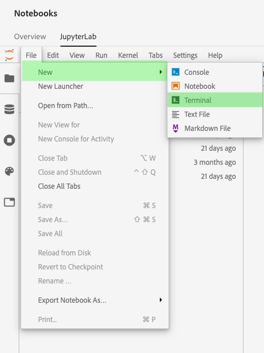

# Samarbeta i [!DNL JupyterLab] med [!DNL Git]

[!DNL Git] är ett distribuerat versionshanteringssystem för att spåra ändringar i källkod under programvaruutveckling. Git är förinstallerat i [!DNL Data Science Workspace JupyterLab]-miljön.

## Förutsättningar

>[!NOTE]
>
> Den Git-server du tänker använda måste vara tillgänglig via Internet.

Miljön [!DNL Data Science Workspace JupyterLab] är en hostingmiljö som inte används i företagets brandvägg, och därför måste den Git-server som du ansluter till vara tillgänglig från det offentliga Internet. Detta kan vara en offentlig eller privat databas på [GitHub](https://github.com/) eller en annan instans av en [!DNL Git]-server som du har valt att vara värd för själv.

## Anslut [!DNL Git] till [!DNL Data Science Workspace JupyterLab Notebooks]-miljön

Börja med att starta [!DNL Adobe Experience Platform] och navigera till [[!DNL JupyterLabs Notebooks]](https://platform.adobe.com/notebooks/jupyterLab)-miljön.

I [!DNL JupyterLab] väljer du **[!UICONTROL File]** och håller sedan markören över **[!UICONTROL New]**. Välj **[!UICONTROL Terminal]** i listrutan som visas.

Gå sedan till arbetsytan i *Terminal* med följande kommando: `cd my-workspace`.

>[!TIP]
>
> Om du vill visa en lista med tillgängliga Git-kommandon skickar du kommandot: `git -help` i terminalen.

Sedan klonar du den databas du vill använda med kommandot `git clone`. Klona projektet med en `https://`-URL i stället för `ssh://`.

**Exempel**:

`git clone https://github.com/adobe/experience-platform-dsw-reference.git`

>[!NOTE]
>
> För att utföra skrivåtgärder (`git push` till exempel) måste följande konfigurationskommandon köras för varje ny session. Observera också att eventuella push-kommandon kräver ett användarnamn och lösenord.
>
>`git config --global user.email "you@example.com"`
>
>`git config --global user.name "Your Name"`

## Nästa steg

När du är klar med kloningen av din databas kan du använda Git på samma sätt som du brukar göra på din lokala dator för att samarbeta med andra på bärbara datorer. Mer information om vad du kan göra i [!DNL JupyterLab] finns i [[!DNL JupyterLab user guide]](./overview.md).
