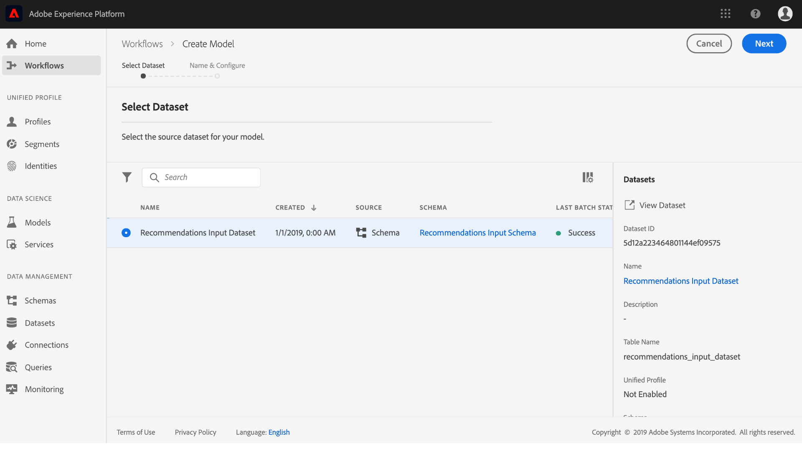
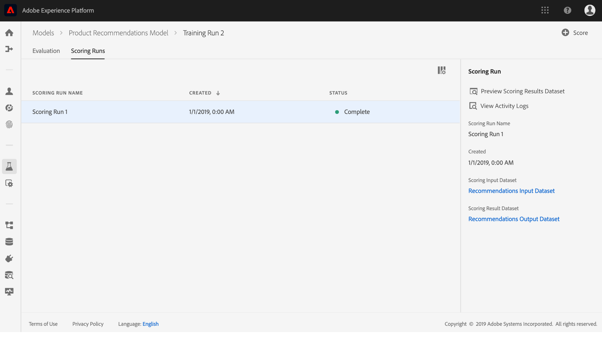

# Skapa och publicera en maskininlärningsmodell

Anta att du äger en webbutik. När era kunder handlar på er webbplats vill ni ge dem skräddarsydda produktrekommendationer för att visa upp en mängd andra produkter som ert företag erbjuder. Under webbplatsens hela existens har ni kontinuerligt samlat in kunddata och vill på något sätt använda dessa data för att generera personaliserade produktrekommendationer.

[!DNL Adobe Experience Platform] [!DNL Data Science Workspace] ger möjlighet att uppnå dina mål med den färdiga  [produkten Recommendations Recipe](../pre-built-recipes/product-recommendations.md). Följ den här självstudiekursen för att se hur du kan få tillgång till och förstå dina detaljhandelsdata, skapa och optimera en maskininlärningsmodell och generera insikter i [!DNL Data Science Workspace].

I den här självstudien visas arbetsflödet i [!DNL Data Science Workspace] och följande steg beskrivs för att skapa en maskininlärningsmodell:

1. [Förbered data](#prepare-your-data)
2. [Skapa din modell](#author-your-model)
3. [Utbilda och utvärdera din modell](#train-and-evaluate-your-model)
4. [Använd din modell](#operationalize-your-model)

## Komma igång

Innan du startar den här självstudiekursen måste du ha följande krav:

* Åtkomst till [!DNL Adobe Experience Platform]. Om du inte har tillgång till en IMS-organisation i [!DNL Experience Platform], ska du tala med systemadministratören innan du fortsätter.

* Aktivera resurser. Kontakta din kontorepresentant om du vill ha tillgång till följande artiklar.
   * Recommendations Recipe
   * Recommendations Input Dataset
   * Recommendations Input Schema
   * Recommendations Output Dataset
   * Recommendations Output Schema
   * Golden Data Set postValues
   * Golden Data Set Schema

* Hämta de tre obligatoriska [!DNL Jupyter Notebook]-filerna från [Adobe public [!DNL Git] databasen](https://github.com/adobe/experience-platform-dsw-reference/tree/master/Summit/2019/resources/Notebooks-Thurs). Dessa används för att demonstrera [!DNL JupyterLab]-arbetsflödet i [!DNL Data Science Workspace].

* En fungerande förståelse för följande viktiga begrepp som används i den här självstudiekursen:
   * [[!DNL Experience Data Model]](../../xdm/home.md): Den standardiseringsinsats som Adobe ledde till för att definiera standardscheman som  [!DNL Profile] och ExperienceEvent för Customer Experience Management.
   * Datauppsättningar: En lagrings- och hanteringskonstruktion för faktiska data. En fysisk instansierad instans av ett [XDM-schema](../../xdm/schema/field-dictionary.md).
   * Grupper: Datauppsättningar består av grupper. En batch är en uppsättning data som samlats in under en tidsperiod och som bearbetas tillsammans som en enda enhet.
   * [!DNL JupyterLab]:  [[!DNL JupyterLab]](https://blog.jupyter.org/jupyterlab-is-ready-for-users-5a6f039b8906) är ett webbaserat gränssnitt för Project med öppen källkod  [!DNL Jupyter] som är nära integrerat i  [!DNL Experience Platform].

## Förbered dina data {#prepare-your-data}

Om du vill skapa en maskininlärningsmodell som gör personaliserade produktrekommendationer till dina kunder måste du analysera tidigare kundköp på din webbplats. I det här avsnittet beskrivs hur dessa data hämtas till [!DNL Platform] till [!DNL Adobe Analytics] och hur dessa data omvandlas till en funktionsuppsättning som kan användas av maskininlärningsmodellen.

### Utforska data och förstå scheman

1. Logga in på [Adobe Experience Platform](https://platform.adobe.com/) och klicka på **[!UICONTROL Datasets]** för att visa alla befintliga datauppsättningar och välja den datauppsättning som du vill utforska. I det här fallet [!DNL Analytics]-datauppsättningen **Golden Data Set postValues**.
   
2. Välj **[!UICONTROL Preview Dataset]** nära det övre högra hörnet för att undersöka exempelposter och klicka sedan på **[!UICONTROL Close]**.
   
3. Välj länken under Schema i den högra listen för att visa schemat för datauppsättningen och gå sedan tillbaka till sidan med datauppsättningsinformation.&quot;
   

De andra datauppsättningarna har fyllts i i automatiskt med grupper för förhandsgranskning. Du kan visa dessa datauppsättningar genom att upprepa stegen ovan.

| Namn på datauppsättning | Schema | Beskrivning |
| ----- | ----- | ----- |
| Golden Data Set postValues | Schema för Gyllene datauppsättning | [!DNL Analytics] källdata från webbplatsen |
| Recommendations Input Dataset | Recommendations Input Schema | [!DNL Analytics]-data omvandlas till en utbildningsdatamängd med hjälp av en funktionspipeline. Dessa data används för att utbilda Recommendations produktmaskininlärningsmodell. `itemid` och  `userid` motsvarar en produkt som kunden köpt. |
| Recommendations Output Dataset | Recommendations Output Schema | Den datauppsättning som bedömningsresultat lagras för innehåller en lista med rekommenderade produkter för varje kund. |

## Skapa din modell {#author-your-model}

Den andra komponenten i [!DNL Data Science Workspace]-livscykeln omfattar utveckling av recept och modeller. Produktens Recommendations Recept är utformat för att generera produktrekommendationer i stor skala genom att använda tidigare inköpsdata och maskininlärning.

Recept är grunden för en modell eftersom de innehåller maskininlärningsalgoritmer och logik som utformats för att lösa specifika problem. Viktigast av allt är att Recipes ger er möjlighet att demokratisera maskininlärningen i hela organisationen så att andra användare kan komma åt en modell för olika användningsområden utan att behöva skriva någon kod.

### Utforska Recommendations Recept

1. I [!DNL Adobe Experience Platform] navigerar du till **[!UICONTROL Models]** från den vänstra navigeringskolumnen och klickar sedan på **[!UICONTROL Recipes]** överst för att visa en lista över tillgängliga recept för din organisation.
   
2. Leta reda på och öppna den angivna **[!UICONTROL Recommendations Recipe]** genom att klicka på dess namn.
   
3. Klicka på **[!UICONTROL Recommendations Input Schema]** i den högra listen för att visa schemat som används för receptet. Schemafälten [!UICONTROL itemId] och [!UICONTROL userId] motsvarar en produkt som kunden köpt ([!UICONTROL interactionType]) vid en viss tidpunkt ([!UICONTROL timestamp]). Följ samma steg för att granska fälten för **[!UICONTROL Recommendations Output Schema]**.
   

Du har nu granskat de in- och utdatamodeller som krävs av Product Recommendations Recipe. Du kan nu fortsätta till nästa avsnitt för att ta reda på hur du skapar, utbildar och utvärderar en Recommendations-produktmodell.

## Utbildning och utvärdering av din modell {#train-and-evaluate-your-model}

Nu när dina data har förberetts och receptet är klart att användas kan du skapa, utbilda och utvärdera din maskininlärningsmodell.

### Skapa en modell

En modell är en instans av en Recept som gör att du kan utbilda och poängsätta med data i stor skala.

1. I [!DNL Adobe Experience Platform] navigerar du till **[!UICONTROL Models]** från den vänstra navigeringskolumnen och klickar sedan på **[!UICONTROL Recipes]** överst på sidan för att visa en lista över alla tillgängliga recept för din organisation.
   
2. Leta reda på och öppna den angivna **[!UICONTROL Recommendations Recipe]** genom att klicka på dess namn och ange mottagarens översiktssida. Klicka på **[!UICONTROL Create a Model]** antingen från mitten (om det inte finns några modeller) eller från det övre högra hörnet på sidan Receptöversikt.
   
3. En lista över tillgängliga indatauppsättningar för utbildning visas. Välj **[!UICONTROL Recommendations Input Dataset]** och klicka på **[!UICONTROL Next]**.
   
4. Ange ett namn för modellen, till exempel&quot;Product Recommendations Model&quot;. Tillgängliga konfigurationer för modellen visas med inställningar för modellens standardutbildnings- och bedömningsbeteenden. Inga ändringar behövs eftersom dessa konfigurationer är specifika för din organisation. Granska konfigurationerna och klicka på **[!UICONTROL Finish]**.
   
5. Modellen har nu skapats och sidan *Översikt* för modellen visas i en ny utbildningskörning. En utbildningskörning genereras som standard när en modell skapas.
   

Du kan välja att vänta tills kursen är klar eller fortsätta att skapa en ny utbildning i följande avsnitt.

### Utbilda modellen med anpassade hyperparametrar

1. På sidan **Modellöversikt** klickar du på **[!UICONTROL Train]** uppe till höger för att skapa en ny utbildning. Välj samma indatauppsättning som du använde när du skapade modellen och klicka på **[!UICONTROL Next]**.
   
2. Sidan **Konfiguration** visas. Här kan du konfigurera kursens [!UICONTROL num_recommendations]-värde, som även kallas hyperparameter. En utbildad och optimerad modell använder de bästa hyperparametrarna baserat på resultatet av kursen.

   Det går inte att lära sig hyperparametrar, och de måste därför tilldelas innan utbildning kan genomföras. Justering av hyperparametrar kan ändra noggrannheten för utbildningsmodellen. Eftersom det är en iterativ process att optimera en modell kan det krävas flera kurser innan en tillfredsställande utvärdering kan göras.

   >[!TIP]
   >
   >Ange **[!UICONTROL num_recommendations]** till 10.

   
3. Ytterligare en datapunkt visas i modellutvärderingsschemat när den nya kursen är klar, vilket kan ta upp till flera minuter.
   

### Utvärdera modellen

Varje gång en utbildning har slutförts kan du se de resulterande utvärderingsvärdena för att avgöra hur bra modellen har fungerat.

1. Granska utvärderingsstatistiken (Precision och Recall) för varje avslutad utbildning genom att klicka på utbildningskörningen.
2. Utforska informationen för varje mätvärde. Ju högre dessa värden är, desto bättre utfördes modellerna.
   
3. Du kan se datauppsättningen, schemat och konfigurationsparametrarna som används för varje utbildningskörning på rätt spår.
4. Gå tillbaka till modellsidan och identifiera den utbildning som fungerar bäst genom att observera deras utvärderingsvärden.

## Använd modellen {#operationalize-your-model}

Det sista steget i arbetsflödet för datavetenskap är att driftsätta din modell för att få poäng och ta del av insikter från ert datalager.

### Score and generate insights

1. På sidan *Översikt* för produktrekommendationsmodellen klickar du på namnet på den utbildning som ger bäst resultat, med de högsta värdena för återkallande och precision.
2. Klicka på **[!UICONTROL Score]** högst upp till höger på informationssidan för utbildningskörningen.
3. Välj **[!UICONTROL Recommendations Input Dataset]** som betygsindatauppsättning, som är samma datamängd som du använde när du skapade modellen och körde dess utbildning. Klicka sedan på **[!UICONTROL Next]**.
   
4. Välj **[!UICONTROL Recommendations Output Dataset]** som resultatdatauppsättning. Bedömningsresultaten kommer att lagras i den här datauppsättningen som en batch.
   
5. Granska poängkonfigurationerna. Dessa parametrar innehåller de in- och utdatamängder som valdes tidigare tillsammans med lämpliga scheman. Klicka på **[!UICONTROL Finish]** för att påbörja poängkörningen. Körningen kan ta flera minuter.
   

### Visa poängsatta insikter

När poängsättningen är klar kan du förhandsgranska resultatet och se de insikter som genereras.

1. Klicka på den färdiga poängkörningen på sidan för resultaträkning och klicka sedan på **[!UICONTROL Preview Scoring Results Dataset]** till höger.
   
2. I förhandsgranskningstabellen innehåller varje rad produktrekommendationer för en viss kund, märkta [!UICONTROL recommendations] respektive [!UICONTROL userId]. Eftersom hyperparametern [!UICONTROL num_recommendations] var inställd på 10 i exempelskärmbilderna, kan varje rad med rekommendationer innehålla upp till 10 produktidentiteter avgränsade med ett nummertecken (#).
   

## Nästa steg {#next-steps}

Klart! Du har skapat produktrekommendationer!

I den här självstudiekursen introducerades arbetsflödet för [!DNL Data Science Workspace], som visar hur obearbetade data kan göras till användbar information via maskininlärning. Om du vill veta mer om hur du använder [!DNL Data Science Workspace] fortsätter du till nästa guide [som skapar försäljningsschemat och datauppsättningen](./create-retails-sales-dataset.md).