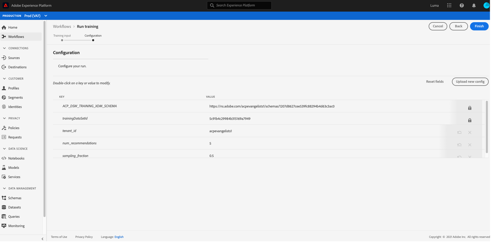
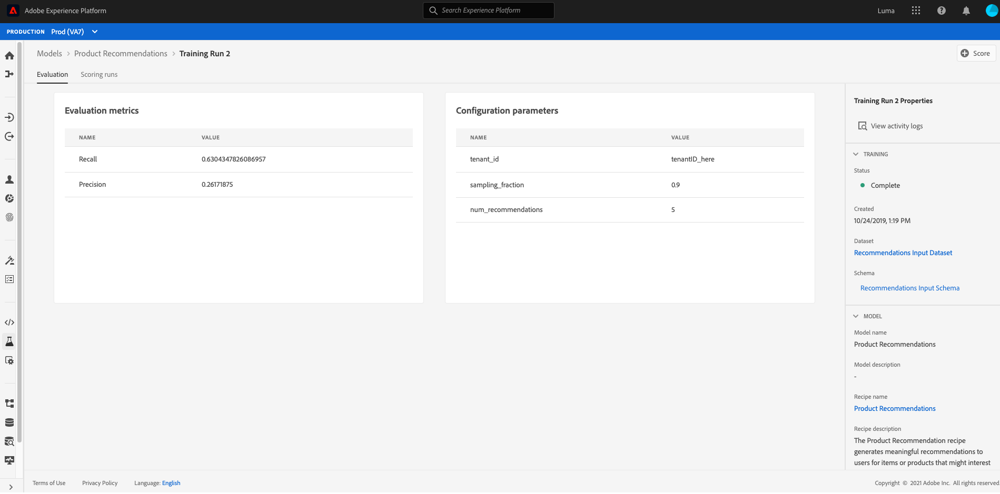

# Skapa och publicera en maskininlärningsmodell

Anta att du äger en webbutik. När era kunder handlar på er webbplats vill ni ge dem skräddarsydda produktrekommendationer för att visa upp en mängd andra produkter som ert företag erbjuder. Under webbplatsens hela existens har ni kontinuerligt samlat in kunddata och vill på något sätt använda dessa data för att generera personaliserade produktrekommendationer.

[!DNL Adobe Experience Platform] [!DNL Data Science Workspace] ger möjlighet att uppnå dina mål med den färdiga  [produkten Recommendations Recipe](../pre-built-recipes/product-recommendations.md). Följ den här självstudiekursen för att se hur du kan få tillgång till och förstå dina detaljhandelsdata, skapa och optimera en maskininlärningsmodell och generera insikter i [!DNL Data Science Workspace].

I den här självstudien visas arbetsflödet i [!DNL Data Science Workspace] och följande steg beskrivs för att skapa en maskininlärningsmodell:

1. [Förbered data](#prepare-your-data)
2. [Skapa din modell](#author-your-model)
3. [Utbilda och utvärdera din modell](#train-and-evaluate-your-model)
4. [Använd din modell](#operationalize-your-model)

## Komma igång

Innan du startar den här självstudiekursen måste du ha följande krav:

- Åtkomst till [!DNL Adobe Experience Platform]. Om du inte har tillgång till en IMS-organisation i [!DNL Experience Platform], ska du tala med systemadministratören innan du fortsätter.

- Aktivera resurser. Kontakta din kontorepresentant om du vill ha tillgång till följande artiklar.
   - Recommendations Recipe
   - Recommendations Input Dataset
   - Recommendations Input Schema
   - Recommendations Output Dataset
   - Recommendations Output Schema
   - Golden Data Set postValues
   - Golden Data Set Schema

- Hämta de tre obligatoriska [!DNL Jupyter Notebook]-filerna från [Adobe public [!DNL Git] databasen](https://github.com/adobe/experience-platform-dsw-reference/tree/master/Summit/2019/resources/Notebooks-Thurs). Dessa används för att demonstrera [!DNL JupyterLab]-arbetsflödet i [!DNL Data Science Workspace].

En fungerande förståelse för följande viktiga begrepp som används i den här självstudiekursen:
- [[!DNL Experience Data Model]](../../xdm/home.md): Den standardiseringsinsats som Adobe ledde till för att definiera standardscheman som  [!DNL Profile] och ExperienceEvent för Customer Experience Management.
- Datauppsättningar: En lagrings- och hanteringskonstruktion för faktiska data. En fysisk instansierad instans av ett [XDM-schema](../../xdm/schema/field-dictionary.md).
- Grupper: Datauppsättningar består av grupper. En batch är en uppsättning data som samlats in under en tidsperiod och som bearbetas tillsammans som en enda enhet.
- [!DNL JupyterLab]:  [[!DNL JupyterLab]](https://blog.jupyter.org/jupyterlab-is-ready-for-users-5a6f039b8906) är ett webbaserat gränssnitt för Project med öppen källkod  [!DNL Jupyter] som är nära integrerat i  [!DNL Experience Platform].

## Förbered dina data {#prepare-your-data}

Om du vill skapa en maskininlärningsmodell som gör personaliserade produktrekommendationer till dina kunder måste du analysera tidigare kundköp på din webbplats. I det här avsnittet beskrivs hur dessa data hämtas till [!DNL Platform] till [!DNL Adobe Analytics] och hur dessa data omvandlas till en funktionsuppsättning som kan användas av maskininlärningsmodellen.

### Utforska data och förstå scheman

Logga in på [Adobe Experience Platform](https://platform.adobe.com/) och välj **[!UICONTROL Datasets]** om du vill visa alla befintliga datauppsättningar och välja den datauppsättning som du vill utforska. I det här fallet [!DNL Analytics]-datauppsättningen **Golden Data Set postValues**.

Sidan för datauppsättningsaktivitet öppnas med information om datauppsättningen. Du kan välja **[!UICONTROL Preview Dataset]** nära det övre högra hörnet för att undersöka exempelposter. Du kan även visa schemat för den valda datauppsättningen. Markera schemalänken i den högra listen. Om du väljer länken under **[!UICONTROL schema name]** öppnas schemat på en ny flik.

De andra datauppsättningarna har fyllts i i automatiskt med grupper för förhandsgranskning. Du kan visa dessa datauppsättningar genom att upprepa stegen ovan.

| Namn på datauppsättning | Schema | Beskrivning |
| ----- | ----- | ----- |
| Golden Data Set postValues | Schema för Gyllene datauppsättning | [!DNL Analytics] källdata från webbplatsen |
| Recommendations Input Dataset | Recommendations Input Schema | [!DNL Analytics]-data omvandlas till en utbildningsdatamängd med hjälp av en funktionspipeline. Dessa data används för att utbilda Recommendations produktmaskininlärningsmodell. `itemid` och  `userid` motsvarar en produkt som kunden köpt. |
| Recommendations Output Dataset | Recommendations Output Schema | Den datauppsättning som bedömningsresultat lagras för innehåller en lista med rekommenderade produkter för varje kund. |

## Skapa din modell {#author-your-model}

Den andra komponenten i [!DNL Data Science Workspace]-livscykeln omfattar utveckling av recept och modeller. Produktens Recommendations Recept är utformat för att generera produktrekommendationer i stor skala genom att använda tidigare inköpsdata och maskininlärning.

Recept är grunden för en modell eftersom de innehåller maskininlärningsalgoritmer och logik som utformats för att lösa specifika problem. Viktigast av allt är att Recipes ger er möjlighet att demokratisera maskininlärningen i hela organisationen så att andra användare kan komma åt en modell för olika användningsområden utan att behöva skriva någon kod.

### Utforska Recommendations Recept

I Experience Platform navigerar du till **[!UICONTROL Models]** från den vänstra navigeringskolumnen och väljer sedan **[!UICONTROL Recipes]** i den översta navigeringen för att visa en lista över tillgängliga recept för din organisation.

Leta reda på och öppna den angivna **[!UICONTROL Recommendations Recipe]** genom att välja dess namn. Sidan Översikt över mottagare visas.

Välj sedan **[!UICONTROL Recommendations Input Schema]** i den högra listen för att visa schemat som används för receptet. Schemafälten [!UICONTROL itemId] och [!UICONTROL userId] motsvarar en produkt som kunden köpt ([!UICONTROL interactionType]) vid en viss tidpunkt ([!UICONTROL timestamp]). Följ samma steg för att granska fälten för **[!UICONTROL Recommendations Output Schema]**.

Du har nu granskat de in- och utdatamodeller som krävs av Product Recommendations Recipe. Fortsätt till nästa avsnitt för att lära dig hur du skapar, utbilda och utvärderar en Recommendations-produktmodell.

## Utbildning och utvärdering av din modell {#train-and-evaluate-your-model}

Nu när dina data har förberetts och receptet är klart kan du skapa, utbilda och utvärdera din maskininlärningsmodell.

### Skapa en modell

En modell är en instans av en Recept som gör att du kan utbilda och poängsätta med data i stor skala.

I Experience Platform går du till **[!UICONTROL Models]** från den vänstra navigeringskolumnen och väljer **[!UICONTROL Recipes]** i den övre navigeringen. Här visas en lista med tillgängliga recept för din organisation.Välj recept på produktrekommendationer.

Välj **[!UICONTROL Create Model]** på receptsidan.

Arbetsflödet för att skapa modell börjar med att välja ett recept. Markera **[!UICONTROL Recommendations Recipe]** och välj sedan **[!UICONTROL Next]** i det övre högra hörnet.

Ange sedan ett modellnamn. Tillgängliga konfigurationer för modellen visas med inställningar för modellens standardutbildnings- och bedömningsbeteenden. Granska konfigurationerna och välj **[!UICONTROL Finish]**.

Du dirigeras om en översiktssida för dina modeller med en ny utbildning. En utbildningskörning genereras som standard när en modell skapas.

Du kan välja att vänta tills kursen är klar eller fortsätta att skapa en ny utbildning i följande avsnitt.

### Utbilda modellen med anpassade hyperparametrar

På sidan **Modellöversikt** väljer du **[!UICONTROL Train]** uppe till höger för att skapa en ny utbildning. Välj samma indatauppsättning som du använde när du skapade modellen och välj **[!UICONTROL Next]**.

Sidan **[!UICONTROL Configuration]** visas. Här kan du konfigurera kursen `num_recommendations`-värde, som också kallas hyperparameter. En utbildad och optimerad modell kommer att använda de hyperparametrar som ger bäst resultat baserat på resultatet av kursen.

Det går inte att lära sig hyperparametrar, och de måste därför tilldelas innan utbildning kan genomföras. Justering av hyperparametrar kan ändra den tränade modellens exakthet. Eftersom det är en iterativ process att optimera en modell kan det krävas flera kurser innan en tillfredsställande utvärdering kan göras.

>[!TIP]
>
>Ange `num_recommendations` till 10.

Ytterligare datapunkter visas i modellutvärderingsdiagrammet. Det kan ta upp till flera minuter innan det här visas när en körning är klar.

### Utvärdera modellen

Varje gång en utbildning har slutförts kan du se de resulterande utvärderingsvärdena för att avgöra hur bra modellen har fungerat.

Om du vill granska utvärderingsstatistik (Precision och Recall) för varje avslutad utbildningskurs väljer du utbildningskörningen.

Du kan utforska informationen för varje utvärderingsmått. Ju högre dessa värden är, desto bättre utfördes modellen.

Du kan se datauppsättningen, schemat och konfigurationsparametrarna som används för varje utbildningskörning på rätt spår. Gå tillbaka till modellsidan och identifiera den utbildning som fungerar bäst genom att observera deras utvärderingsvärden.

## Använd modellen {#operationalize-your-model}

Det sista steget i arbetsflödet för datavetenskap är att driftsätta din modell för att få poäng och ta del av insikter från ert datalager.

### Score and generate insights

På sidan Översikt över produktrekommendationsmodellen väljer du namnet på den utbildning som körs bäst, med de högsta värdena för återkallande och precision.

Välj sedan **[!UICONTROL Score]** längst upp till höger på informationssidan för utbildningskörningen.

Sedan väljer du **[!UICONTROL Recommendations Input Dataset]** som betygsindatauppsättning, som är samma datamängd som du använde när du skapade modellen och körde kursen. Välj sedan **[!UICONTROL Next]**.

När du har fått din indatauppsättning väljer du **[!UICONTROL Recommendations Output Dataset]** som resultatdatauppsättning. Bedömningsresultat lagras i den här datauppsättningen som en batch.

Granska slutligen poängkonfigurationerna. Dessa parametrar innehåller de in- och utdatamängder du valde tidigare tillsammans med lämpliga scheman. Välj **[!UICONTROL Finish]** för att börja poängsättningen. Körningen kan ta flera minuter.

### Visa poängsatta insikter

När poängsättningen är klar kan du förhandsgranska resultatet och se de insikter som genereras.

På sidan för betygskörning väljer du den färdiga poängkörningen och sedan **[!UICONTROL Preview Scoring Results Dataset]** på den högra listen.

I förhandsgranskningstabellen innehåller varje rad produktrekommendationer för en viss kund, märkta [!UICONTROL recommendations] respektive [!UICONTROL userId]. Eftersom hyperparametern [!UICONTROL num_recommendations] var inställd på 10 i exempelskärmbilderna, kan varje rad med rekommendationer innehålla upp till 10 produktidentiteter avgränsade med ett nummertecken (#).

## Nästa steg {#next-steps}

I den här självstudiekursen introducerades arbetsflödet för [!DNL Data Science Workspace], som visar hur obearbetade data kan göras till användbar information via maskininlärning. Om du vill veta mer om hur du använder [!DNL Data Science Workspace] fortsätter du till nästa guide [som skapar försäljningsschemat och datauppsättningen](./create-retails-sales-dataset.md).