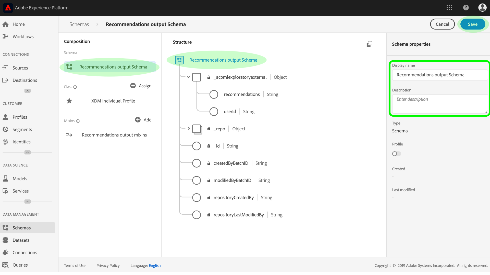

# Berika [!DNL Real-time Customer Profile] med maskininlärningsinsikter

[!DNL Adobe Experience Platform] [!DNL Data Science Workspace] innehåller verktyg och resurser för att skapa, utvärdera och använda maskininlärningsmodeller för att generera dataprognoser och insikter. När maskininlärningsinsikter hämtas in i en [!DNL Profile]aktiverad datauppsättning, hämtas samma data också in som [!DNL Profile] poster som sedan kan segmenteras i deluppsättningar av relaterade element med hjälp av [!DNL Experience Platform Segmentation Service].

I det här dokumentet finns en stegvis självstudiekurs som berikar dig [!DNL Real-time Customer Profile] med maskininlärningsinsikter. Stegen är indelade i följande avsnitt:

1. [Skapa ett utdatamaterial och en datauppsättning](#create-an-output-schema-and-dataset)
2. [Konfigurera ett utdataschema och en datauppsättning](#configure-an-output-schema-and-dataset)
3. [Skapa segment med segmentverktyget](#create-segments-using-the-segment-builder)

## Komma igång

Den här självstudiekursen kräver en fungerande förståelse av de olika aspekterna av [!DNL Adobe Experience Platform] att hämta in [!DNL Profile] data och skapa segment. Innan du börjar med den här självstudiekursen bör du läsa dokumentationen för följande tjänster:

* [[!DNL Real-time Customer Profile]](../../rtcdp/overview.md): Ger en enhetlig konsumentprofil i realtid baserad på aggregerade data från flera källor.
* [[!DNL Identity Service]](../../identity-service/home.md): Möjliggör [!DNL Real-time Customer Profile] genom att överbrygga identiteter från olika datakällor som hämtas in till Platform.
* [[!DNL Experience Data Model (XDM)]](../../xdm/home.md): Det standardiserade ramverk som Platform använder för att organisera kundupplevelsedata.

Förutom de ovannämnda dokumenten rekommenderar vi att du även granskar följande handledningar för scheman och schemaläggningsprogrammet:

* [Grundläggande om schemakomposition](../../xdm/schema/composition.md): Beskriver XDM-scheman, byggstenar, principer och bästa praxis för dispositionsscheman som ska användas i [!DNL Experience Platform].
* [Schemaredigeraren, genomgång](../../xdm/tutorials/create-schema-ui.md): Innehåller detaljerade anvisningar om hur du skapar scheman med Schemaredigeraren i [!DNL Experience Platform].

## Skapa ett utdatamaterial och en datauppsättning {#create-an-output-schema-and-dataset}

Det första steget mot att berika [!DNL Real-time Customer Profile] med poängsättningsinsikter är att veta vilket objekt i verkligheten (till exempel en person) som era data definierar. Genom att förstå era data kan ni beskriva och utforma en struktur som betyder för era data, ungefär som att utforma en relationsdatabas.

Dispositionen av ett schema börjar med att tilldela en klass. Klasser definierar de beteendeaspekter av data som schemat ska innehålla (post- eller tidsserie). Det här avsnittet innehåller grundläggande instruktioner om hur du skapar ett schema med schemaverktyget. En mer ingående självstudiekurs finns i självstudiekursen om hur du [skapar ett schema med Schemaredigeraren](../../xdm/tutorials/create-schema-ui.md).

1. I Adobe Experience Platform klickar du på **[!UICONTROL Schema]** fliken för att öppna schemaläsaren. Klicka **[!UICONTROL Create Schema]** för att öppna **Schemaredigeraren**där du interaktivt kan skapa scheman.
   

2. I fönstret **Disposition** klickar du **[!UICONTROL Assign]** för att bläddra bland de tillgängliga klasserna.
   * Om du vill tilldela en befintlig klass klickar du på och markerar den önskade klassen och klickar sedan på **[!UICONTROL Assign Class]**.
      

   * Om du vill skapa en anpassad klass klickar du på **[!UICONTROL Create New Class]** i mitten av webbläsarfönstret. Ange ett klassnamn, en beskrivning och välj klassens beteende. Klicka **[!UICONTROL Assign Class]** när du är klar.
      

   Nu bör schemats struktur innehålla några klassfält och du är redo att tilldela mixins. En blandning är en grupp med ett eller flera fält som beskriver ett visst koncept.

3. I **dispositionsfönstret** klickar du **[!UICONTROL Add]** i underavsnittet **Blandningar** .
   * Om du vill tilldela en befintlig blandning klickar du på och markerar den önskade blandningen och klickar sedan på **[!UICONTROL Add Mixin]**. Till skillnad från klasser kan flera blandningar tilldelas till ett enda schema så länge det är lämpligt.
      

   * Om du vill skapa en ny mixin klickar du på den **[!UICONTROL Create New Mixin]** som finns i mitten av webbläsarfönstret. Ange ett namn och en beskrivning för mixinen och klicka sedan **[!UICONTROL Assign Mixin]** när du är klar.
      

   * Om du vill lägga till blandningsfält klickar du på namnet på blandningen i *kompositionsfönstret* . Du kan sedan lägga till blandade fält genom att klicka **[!UICONTROL Add Field]** i *strukturfönstret* . Se till att du anger blandningsegenskaper i enlighet med detta.
      

4. När du är klar med att skapa schemat klickar du på fältet på den översta nivån i schemat i fönstret *Struktur* för att visa schemats egenskaper i det högra egenskapsfönstret. Ange ett namn och en beskrivning och klicka på **[!UICONTROL Save]** för att skapa schemat.
   

5. Skapa en utdatamängd med ditt nya schema genom att klicka **[!UICONTROL Datasets]** från den vänstra navigeringskolumnen och sedan klicka på **[!UICONTROL Create dataset]**. På nästa skärm väljer du **[!UICONTROL Create dataset from schema]**.
   

6. Använd schemaläsaren för att söka efter och markera det nya schemat och klicka sedan på **[!UICONTROL Next]**.
   

7. Ange ett namn och en valfri beskrivning och klicka sedan på **[!UICONTROL Finish]** för att skapa datauppsättningen.
   

Nu när du har skapat en utdataschemauppsättning kan du fortsätta till nästa avsnitt för att konfigurera och aktivera dem för profilanrikning.

## Konfigurera ett utdataschema och en datauppsättning {#configure-an-output-schema-and-dataset}

Innan du kan aktivera en datauppsättning för [!DNL Profile]måste du konfigurera datauppsättningens schema så att det har ett primärt identitetsfält och sedan aktivera schemat för [!DNL Profile]. Om du vill skapa och aktivera ett nytt schema kan du gå till självstudiekursen om hur du [skapar ett schema med Schemaredigeraren](../../xdm/tutorials/create-schema-ui.md). Följ annars instruktionerna nedan för att aktivera ett befintligt schema och en befintlig datauppsättning.

1. I Adobe Experience Platform använder du schemaläsaren för att hitta det utdataschema som du vill aktivera [!DNL Profile] och klickar på dess namn för att visa dess komposition.
   

2. Expandera schemastrukturen och hitta ett lämpligt fält som ska anges som primär identifierare. Klicka på det önskade fältet för att visa dess egenskaper.
   

3. Ange fältet som primär identitet genom att aktivera fältets **[!UICONTROL Identity]** egenskap, **[!UICONTROL Primary Identity]** egenskap och sedan välja en lämplig **[!UICONTROL Identity Namespace]** egenskap. Klicka **[!UICONTROL Apply]** när du har gjort ändringarna.
   

4. Klicka på det översta nivåobjektet i schemastrukturen för att visa schemaegenskaperna och aktivera schemat för profilen genom att växla **[!UICONTROL Profile]** . Klicka **[!UICONTROL Save]** för att slutföra dina ändringar. Datauppsättningen som skapades med det här schemat kan nu aktiveras för profilen.
   

5. Använd datauppsättningens webbläsare för att hitta den datauppsättning som du vill aktivera [!DNL Profile] och klicka på dess namn för att komma åt informationen.
   

6. Aktivera datauppsättningen för [!DNL Profile] genom att växla den **[!UICONTROL Profile]** växel som finns i rätt informationskolumn.
   

När data hämtas in till en [!DNL Profile]aktiverad datauppsättning, hämtas samma data även som [!DNL Profile] poster. Nu när ditt schema och din datauppsättning har förberetts kan du generera data i datauppsättningen genom att utföra poängkörningar med en lämplig modell, och fortsätta med den här självstudiekursen för att skapa insikter med hjälp av Segment Builder.

## Skapa segment med segmentverktyget {#create-segments-using-the-segment-builder}

Nu när ni har genererat och inhämtat insikter i era [!DNL Profile]aktiverade datauppsättningar kan ni hantera dessa data genom att identifiera deluppsättningar av relaterade element med hjälp av segmentbyggaren. Följ stegen nedan för att skapa egna segment.

1. I Adobe Experience Platform klickar du på **[!UICONTROL Segments]** fliken följt av **[!UICONTROL Create Segment]** för att öppna Segment Builder.
   

2. I segmentbyggaren ger den vänstra listen tillgång till segmentens kärnbyggstenar: attribut, händelser och befintliga segment. Varje byggsten visas på sin egen flik. Välj den klass som det [!DNL Profile]aktiverade schemat omfattar och bläddra sedan efter byggstenarna för ditt segment.
   

3. Dra och släpp byggstenar på regelbyggarens arbetsyta, fyll i dem genom att ange jämförande satser.
   

4. När du skapar ett segment kan du förhandsgranska det uppskattade segmentresultatet genom att observera panelen *Segmentegenskaper* .
   

5. Välj ett lämpligt **[!UICONTROL Merge Policy]** segment, ange ett namn och en valfri beskrivning och klicka sedan på **[!UICONTROL Save]** för att slutföra det nya segmentet.
   

## Nästa steg {#next-steps}

I det här dokumentet gick du igenom de steg som krävs för att aktivera ett schema och en datauppsättning för [!DNL Profile]och demonstrerade kortfattat arbetsflödet för att skapa insiktssegment med hjälp av segmentbyggaren. Mer information om segment och segmentbyggaren finns i Översikt över [segmenteringstjänsten](../../segmentation/home.md).