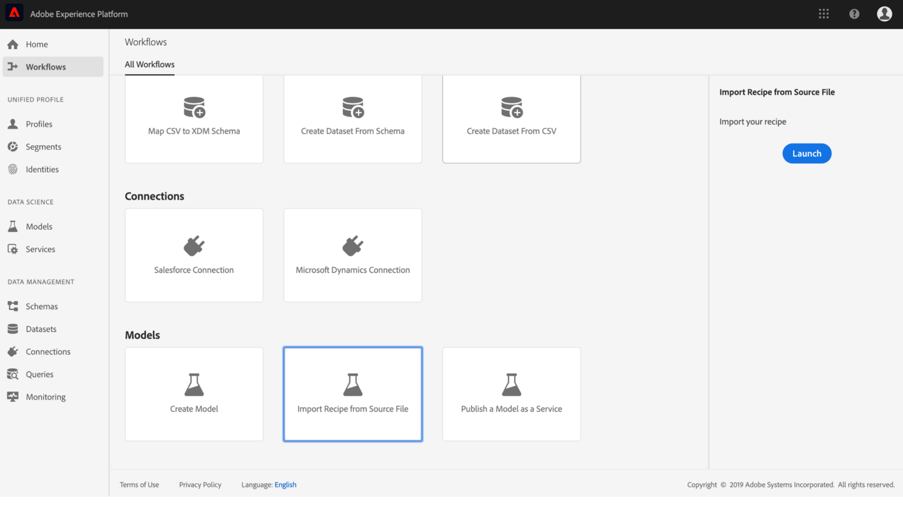

# Importera ett paketerat recept (UI)

I den här självstudiekursen får du information om hur du konfigurerar och importerar ett paketerat recept med hjälp av det angivna exemplet på detaljhandelsförsäljning. I slutet av den här självstudiekursen är du redo att skapa, utbilda och utvärdera en modell i Adobe Experience Platform Data Science Workspace.

## Förutsättningar

Den här självstudiekursen kräver ett paketerat recept i form av antingen en Docker-bild-URL eller en binär fil. Mer information finns i självstudiekursen om hur du [paketerar källfiler i en Recept](./package-source-files-recipe.md) .

## Arbetsflöde för användargränssnitt

För import av ett paketerat recept till Data Science Workspace krävs särskilda receptkonfigurationer, som kompileras till en enda JSON-fil (JavaScript Object Notation). Kompileringen av receptkonfigurationer kallas **konfigurationsfilen**. Ett paketerat recept med en viss uppsättning konfigurationer kallas en **recept-instans**. Ett recept kan användas för att skapa många receptinstanser i arbetsytan Data Science.

Arbetsflödet för att importera ett paketrecept består av följande steg:
- [Konfigurera ett recept](#configure)
- [Importera binärt recept - PySpark](#pyspark)
- [Importera binärt recept - Scala Spark](#scala)
- [Importera Docker-baserat recept - Python](#python)
- [Importera Docker-baserat recept - R](#r)

### Konfigurera ett recept {#configure}

Varje recept-instans i Data Science Workspace åtföljs av en uppsättning konfigurationer som anpassar receptinstansen så att den passar ett visst användningsfall. Konfigurationsfiler definierar standardutbildnings- och bedömningsbeteenden för en modell som skapas med den här recept-instansen.

>[!NOTE] Konfigurationsfilerna är recept- och fallspecifika.

Nedan visas ett exempel på en konfigurationsfil som visar standardutbildnings- och bedömningsbeteenden för recept för detaljhandelsförsäljning.

```json
[
    {
        "name": "train",
        "parameters": [
            {
                "key": "learning_rate",
                "value": "0.1"  
            },
            {
                "key": "n_estimators",
                "value": "100"
            },
            {
                "key": "max_depth",
                "value": "3"
            },
            {
                "key": "ACP_DSW_INPUT_FEATURES",
                "value": "date,store,storeType,storeSize,temperature,regionalFuelPrice,markdown,cpi,unemployment,isHoliday"
            },
            {
                "key": "ACP_DSW_TARGET_FEATURES",
                "value": "weeklySales"
            },
            {
                "key": "ACP_DSW_FEATURE_UPDATE_SUPPORT",
                "value": false
            },
            {
                "key": "tenantId",
                "value": "_{TENANT_ID}"
            },
            {
                "key": "ACP_DSW_TRAINING_XDM_SCHEMA",
                "value": "{SEE BELOW FOR DETAILS}"
            },
            {
                "key": "evaluation.labelColumn",
                "value": "weeklySalesAhead"
            },
            {
                "key": "evaluation.metrics",
                "value": "MAPE,MAE,RMSE,MASE"
            }
        ]
    },
    {
        "name": "score",
        "parameters": [
            {
                "key": "tenantId",
                "value": "_{TENANT_ID}"
            },
            {
                "key":"ACP_DSW_SCORING_RESULTS_XDM_SCHEMA",
                "value":"{SEE BELOW FOR DETAILS}"
            }
        ]
    }
]
```

| Parameternyckel | Typ | Beskrivning |
| ----- | ----- | ----- |
| `learning_rate` | Siffra | Skala för övertoningsmultiplikation. |
| `n_estimators` | Siffra | Antal träd i skogen för slumpmässig skogsklassificering. |
| `max_depth` | Siffra | Maximalt djup i ett träd i slumpmässig skogsklassificering. |
| `ACP_DSW_INPUT_FEATURES` | Sträng | Lista med kommaavgränsade inmatningsschemaattribut. |
| `ACP_DSW_TARGET_FEATURES` | Sträng | Lista med kommaseparerade utdataschemaattribut. |
| `ACP_DSW_FEATURE_UPDATE_SUPPORT` | Boolean | Avgör om in- och utdatafunktionerna kan ändras |
| `tenantId` | Sträng | Detta ID garanterar att de resurser du skapar namnges korrekt och finns i IMS-organisationen. [Följ stegen här](../../xdm/api/getting-started.md#know-your-tenant_id) för att hitta ditt klient-ID. |
| `ACP_DSW_TRAINING_XDM_SCHEMA` | Sträng | Det indatarema som används för utbildning av en modell. Lämna detta tomt när du importerar i användargränssnittet, ersätt med utbildningsschemat-ID när du importerar med API. |
| `evaluation.labelColumn` | Sträng | Kolumnetikett för utvärderingsvisualiseringar. |
| `evaluation.metrics` | Sträng | Kommaavgränsad lista med mätvärden som ska användas för att utvärdera en modell. |
| `ACP_DSW_SCORING_RESULTS_XDM_SCHEMA` | Sträng | Utdatamodeller som används för att klassificera en modell. Lämna detta tomt när du importerar i användargränssnittet, ersätt med betygsschemat-ID när du importerar med API. |

I den här självstudiekursen kan du lämna standardkonfigurationsfilerna för butikssäljrecept i Data Science Workspace Reference på samma sätt som de är.

### Importera binärt recept - PySpark {#pyspark}

I källfilerna för [paketet till en Recept](./package-source-files-recipe.md) -självstudiekurs skapades en **EGG** -binär fil med källfilerna för Retail Sales PySpark.

1. I [Adobe Experience Platform](https://platform.adobe.com/)hittar du den vänstra navigeringspanelen och klickar på **Arbetsflöden**. I arbetsflödesgränssnittet **startar** du en ny **importmottagare från** källfilsprocessen.
   
2. Ange ett lämpligt namn för Retail Sales-receptet. Exempel:&quot;Retail Sales recept PySpark&quot;. Du kan även inkludera en recept-beskrivning och en dokumentations-URL. Klicka på **Nästa** när du är klar.
   
3. Importera det PySpark Retail Sales-recept som skapades i [paketkällfilerna till en Recept](./package-source-files-recipe.md) -självstudiekurs genom att dra och släppa, eller använd **filläsaren**. Det paketerade receptet ska finnas i `experience-platform-dsw-reference/recipes/pyspark/dist`.
Importera på samma sätt den angivna konfigurationsfilen genom att dra och släppa eller använda **filläsaren**. Den angivna konfigurationsfilen finns på `experience-platform-dsw-reference/recipes/pyspark/pipeline.json`. Klicka på **Nästa** när båda filerna har angetts.
   
4. Det kan nu uppstå fel. Detta är ett normalt beteende och förväntas. Välj in- och utdatamodeller för butiksförsäljning under avsnittet **Hantera scheman**. De skapades med det tillhandahållna bootstrap-skriptet i [skapa försäljningsschemat för detaljhandel och datauppsättningssjälvstudiekursen](../models-recipes/create-retails-sales-dataset.md) .
   
Under avsnittet **Funktionshantering** klickar du på din innehavaridentifiering i schemavisaren för att expandera indatabasschemat för butiksförsäljning. Markera in- och utdatafunktionerna genom att markera den önskade funktionen och markera antingen **Indatafunktion** eller **Målfunktion** i det högra fönstret **Fältegenskaper** . I den här självstudiekursen anger du **veckoförsäljning** som **målfunktion** och allt annat som **indatafunktion**. Klicka på **Nästa** för att granska det nya konfigurerade receptet.
5. Granska recept, lägg till, ändra eller ta bort konfigurationer efter behov. Klicka på **Slutför** för att skapa receptet.
   

Grattis, du har skapat recept för butiksförsäljning! Gå vidare till [nästa steg](#next-steps) för att ta reda på hur du skapar en modell i arbetsytan för datavetenskap med hjälp av det nya recept som används för detaljhandelsförsäljning.


### Importera binärt recept - Scala Spark {#scala}

I [Paketkällfilerna i en Recipe](./package-source-files-recipe.md) -självstudiekurs skapades en **JAR** -binär fil med källfilerna för Retail Sales Scala Spark.

1. I [Adobe Experience Platform](https://platform.adobe.com/)hittar du den vänstra navigeringspanelen och klickar på **Arbetsflöden**. I arbetsflödesgränssnittet **startar** du en ny **importmottagare från** källfilsprocessen.
   
2. Ange ett lämpligt namn för Retail Sales-receptet. Exempel:&quot;Retail Sales recept Scala Spark&quot;. Du kan även inkludera en recept-beskrivning och en dokumentations-URL. Klicka på **Nästa** när du är klar.
   
3. Importera det Scala Spark Retail Sales-recept som skapades i [paketkällfilerna till en Recept](./package-source-files-recipe.md) -självstudiekurs genom att dra och släppa, eller använd **filläsaren**. Det paketerade receptet **med beroenden** finns i `experience-platform-dsw-reference/recipes/scala/target`. Importera på samma sätt den angivna konfigurationsfilen genom att dra och släppa eller använda **filläsaren**. Den angivna konfigurationsfilen finns på `experience-platform-dsw-reference/recipes/scala/src/main/resources/pipelineservice.json`. Klicka på **Nästa** när båda filerna har angetts.
   
4. Det kan nu uppstå fel. Detta är ett normalt beteende och förväntas. Välj in- och utdatamodeller för butiksförsäljning under avsnittet **Hantera scheman**. De skapades med det tillhandahållna bootstrap-skriptet i [skapa försäljningsschemat för detaljhandel och datauppsättningssjälvstudiekursen](../models-recipes/create-retails-sales-dataset.md) .
   
Under avsnittet **Funktionshantering** klickar du på din innehavaridentifiering i schemavisaren för att expandera indatabasschemat för butiksförsäljning. Markera in- och utdatafunktionerna genom att markera den önskade funktionen och markera antingen **Indatafunktion** eller **Målfunktion** i det högra fönstret **Fältegenskaper** . I den här självstudiekursen anger du **veckoförsäljning** som **målfunktion** och allt annat som **indatafunktion**. Klicka på **Nästa** för att granska det nya konfigurerade receptet.
5. Granska recept, lägg till, ändra eller ta bort konfigurationer efter behov. Klicka på **Slutför** för att skapa receptet.
   

Grattis, du har skapat recept för butiksförsäljning! Gå vidare till [nästa steg](#next-steps) för att ta reda på hur du skapar en modell i arbetsytan för datavetenskap med hjälp av det nya recept som används för detaljhandelsförsäljning.

### Importera Docker-baserat recept - Python {#python}

I källfilerna för [paketet till en Recept](./package-source-files-recipe.md) -självstudiekurs angavs en Docker-URL när köpreceptet för butik skapades med Python-källfiler.

1. Klistra in den Docker-URL som motsvarar det paketerade receptet som skapats med Python-källfiler i fältet **Källadress** . Importera sedan den angivna konfigurationsfilen genom att dra och släppa eller använd **filläsaren**. Den angivna konfigurationsfilen finns på `experience-platform-dsw-reference/recipes/python/retail/retail.config.json`. Klicka på **Nästa** när båda objekten har angetts.
   
2. Välj in- och utdatamodeller för butiksförsäljning under avsnittet **Hantera scheman**. De skapades med det tillhandahållna bootstrap-skriptet i [skapa försäljningsschemat för detaljhandel och datauppsättningssjälvstudiekursen](../models-recipes/create-retails-sales-dataset.md) .
   
Under avsnittet **Funktionshantering** klickar du på din innehavaridentifiering i schemavisaren för att expandera indatabasschemat för butiksförsäljning. Markera in- och utdatafunktionerna genom att markera den önskade funktionen och markera antingen **Indatafunktion** eller **Målfunktion** i det högra fönstret **Fältegenskaper** . I den här självstudiekursen anger du **veckoförsäljning** som **målfunktion** och allt annat som **indatafunktion**. Klicka på **Nästa** för att granska det nya konfigurerade receptet.
3. Granska recept, lägg till, ändra eller ta bort konfigurationer efter behov. Klicka på **Slutför** för att skapa receptet.
   

Grattis, du har skapat recept för butiksförsäljning! Gå vidare till [nästa steg](#next-steps) för att ta reda på hur du skapar en modell i arbetsytan för datavetenskap med hjälp av det nya recept som används för detaljhandelsförsäljning.

### Importera Docker-baserat recept - R {#r}

I källfilerna för [paketet till en Recept](./package-source-files-recipe.md) -självstudiekurs angavs en Docker-URL när köpreceptet för butik skapades med hjälp av R-källfiler.

1. Klistra in den Docker-URL som motsvarar det paketerade receptet som skapats med R-källfiler i fältet **Källadress** . Importera sedan den angivna konfigurationsfilen genom att dra och släppa eller använd **filläsaren**. Den angivna konfigurationsfilen finns på `experience-platform-dsw-reference/recipes/R/Retail\ -\ GradientBoosting/retail.config.json`. Klicka på **Nästa** när båda objekten har angetts.
   
2. Välj in- och utdatamodeller för butiksförsäljning under avsnittet **Hantera scheman**. De skapades med det tillhandahållna bootstrap-skriptet i [skapa försäljningsschemat för detaljhandel och datauppsättningssjälvstudiekursen](../models-recipes/create-retails-sales-dataset.md) .
   
Under avsnittet **Funktionshantering** klickar du på din innehavaridentifiering i schemavisaren för att expandera indatabasschemat för butiksförsäljning. Markera in- och utdatafunktionerna genom att markera den önskade funktionen och markera antingen **Indatafunktion** eller **Målfunktion** i det högra fönstret **Fältegenskaper** . I den här självstudiekursen anger du **veckoförsäljning** som **målfunktion** och allt annat som **indatafunktion**. Klicka på **Nästa** för att granska det nya konfigurerade receptet.
3. Granska recept, lägg till, ändra eller ta bort konfigurationer efter behov. Klicka på **Slutför** för att skapa receptet.
   

Grattis, du har skapat recept för butiksförsäljning! Gå vidare till [nästa steg](#next-steps) för att ta reda på hur du skapar en modell i arbetsytan för datavetenskap med hjälp av det nya recept som används för detaljhandelsförsäljning.

## Nästa steg

I den här självstudiekursen finns information om hur du konfigurerar och importerar ett recept till arbetsytan Data Science. Nu kan du skapa, utbilda och utvärdera en modell med hjälp av det nya receptet.

- [Utbildning och utvärdering av en modell i användargränssnittet](./train-evaluate-model-ui.md)
- [Utbilda och utvärdera en modell med API:t](./train-evaluate-model-api.md)