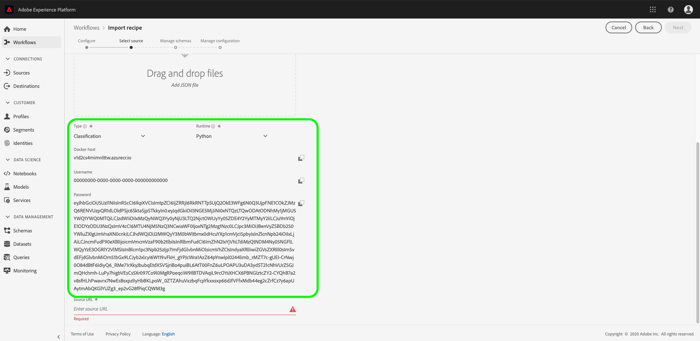

# Paketera källfiler i ett recept

I den här självstudiekursen finns anvisningar om hur du kan paketera de angivna källfilerna för butiksförsäljning i en arkivfil, som kan användas för att skapa ett recept i Adobe Experience Platform [!DNL Data Science Workspace] genom att följa arbetsflödet för receptimport antingen i användargränssnittet eller med API:t.

Koncept att förstå:

- **Recept**: Ett recept är en Adobe term för en modellspecifikation och är en behållare på den översta nivån som representerar en specifik maskininlärningsalgoritm, artificiell intelligens eller en kombination av algoritmer, bearbetningslogik och konfiguration som krävs för att skapa och köra en tränad modell och därmed bidra till att lösa specifika affärsproblem.
- **Källfiler**: Enskilda filer i projektet som innehåller logiken för ett recept.

## Förutsättningar

- [[!DNL Docker]](https://docs.docker.com/install/#supported-platforms)
- [[!DNL Python 3 and pip]](https://docs.conda.io/en/latest/miniconda.html)
- [[!DNL Scala]](https://www.scala-sbt.org/download.html?_ga=2.42231906.690987621.1558478883-2004067584.1558478883)
- [[!DNL Maven]](https://maven.apache.org/install.html)

## Recipe creation

Recipe-skapandet börjar med att paketera källfiler för att skapa en arkivfil. Källfiler definierar den maskininlärningslogik och de algoritmer som används för att lösa ett specifikt problem och skrivs antingen i [!DNL Python], R, PySpark eller Scala. De inbyggda arkivfilerna har formen av en Docker-bild. När den packade arkivfilen har skapats importeras den till [!DNL Data Science Workspace] för att skapa ett recept [i gränssnittet](./import-packaged-recipe-ui.md) eller [med API](./import-packaged-recipe-api.md).

### Dockerbaserad modellutveckling {#docker-based-model-authoring}

Med en Docker-bild kan utvecklare paketera ett program med alla delar som behövs, till exempel bibliotek och andra beroenden, och skicka ut det som ett paket.

Den inbyggda Docker-avbildningen överförs till Azure Container Registry med hjälp av autentiseringsuppgifter som du får när du skapar recept.

Logga in på [Adobe Experience Platform](https://platform.adobe.com) för att få dina autentiseringsuppgifter för Azure Container Registry. Navigera till **[!UICONTROL Workflows]** i den vänstra navigeringskolumnen. Välj **[!UICONTROL Import Recipe]** följt av att välja **[!UICONTROL Launch]**. Se skärmbilden nedan.


Sidan **[!UICONTROL Configure]** öppnas. Ange en lämplig **[!UICONTROL Recipe Name]**, t.ex.&quot;Retail Sales recept&quot;, och ange en beskrivning- eller dokumentations-URL om du vill. Klicka på **[!UICONTROL Next]** när du är klar.


Välj lämplig *körningsmiljö* och välj sedan **[!UICONTROL Classification]** för *Typ*. Dina autentiseringsuppgifter för Azure Container-registret genereras när de är klara.

>[!NOTE]
>
>*Type* är den klass av maskininlärningsproblem som receptet är utformat för och används efter utbildning för att skräddarsy utvärderingen av kursen.

>[!TIP]
>
>- För [!DNL Python]-recept väljer du **[!UICONTROL Python]**-miljön.
>- För R-recept väljer du **[!UICONTROL R]**-miljön.
>- För PySpark-recept väljer du **[!UICONTROL PySpark]**-miljön. En artefakttyp fylls i automatiskt.
>- För Scala-recept väljer du **[!UICONTROL Spark]**-miljön. En artefakttyp fylls i automatiskt.




Observera värdena för Docker-värd, användarnamn och lösenord. Dessa används för att skapa och överföra din [!DNL Docker]-bild i de arbetsflöden som beskrivs nedan.

>[!NOTE]
>
>Källwebbadressen anges när du har slutfört stegen som beskrivs nedan. Konfigurationsfilen förklaras i följande självstudier som finns i [nästa steg](#next-steps).

### Paketera källfilerna

Börja med att hämta exempelkodbasen som finns i <a href="https://github.com/adobe/experience-platform-dsw-reference" target="_blank">Experience Platform Data Science Workspace Reference</a>-databasen.

- [Skapa Python Docker-bild](#python-docker)
- [Bygg R Docker-bild](#r-docker)
- [Skapa PySpark Docker-bild](#pyspark-docker)
- [Bygg Scala (Spark) Docker-bild](#scala-docker)

### Skapa [!DNL Python] dockningsbild {#python-docker}

Om du inte har gjort det klonar du [!DNL GitHub]-databasen på din lokala dator med följande kommando:

```shell
git clone https://github.com/adobe/experience-platform-dsw-reference.git
```

Navigera till katalogen `experience-platform-dsw-reference/recipes/python/retail`. Här hittar du skripten `login.sh` och `build.sh` som används för att logga in i Docker och för att skapa [!DNL Python Docker]-avbildningen. Om du har dina [Docker-uppgifter](#docker-based-model-authoring) klara anger du följande kommandon i ordning:

```BASH
# for logging in to Docker
./login.sh
 
# for building Docker image
./build.sh
```

Observera att när du kör inloggningsskriptet måste du ange Docker-värden, användarnamn och lösenord. När du bygger måste du ange Docker-värden och en versionstagg för bygget.

När byggskriptet är klart får du en URL för Docker-källfilen i konsolutdata. I det här exemplet ser det ut ungefär så här:

```BASH
# URL format: 
{DOCKER_HOST}/ml-retailsales-python:{VERSION_TAG}
```

Kopiera denna URL och gå vidare till [nästa steg](#next-steps).

### Skapa R [!DNL Docker]-bild {#r-docker}

Om du inte har gjort det klonar du [!DNL GitHub]-databasen på din lokala dator med följande kommando:

```BASH
git clone https://github.com/adobe/experience-platform-dsw-reference.git
```

Navigera till katalogen `experience-platform-dsw-reference/recipes/R/Retail - GradientBoosting` i din klonade databas. Här hittar du filerna `login.sh` och `build.sh` som du använder för att logga in i Docker och för att skapa R Docker-bilden. Om du har dina [Docker-uppgifter](#docker-based-model-authoring) klara anger du följande kommandon i ordning:

```BASH
# for logging in to Docker
./login.sh
 
# for build Docker image
./build.sh
```

Observera att när du kör inloggningsskriptet måste du ange Docker-värden, användarnamn och lösenord. När du bygger måste du ange Docker-värden och en versionstagg för bygget.

När byggskriptet är klart får du en URL för Docker-källfilen i konsolutdata. I det här exemplet ser det ut ungefär så här:

```BASH
# URL format: 
{DOCKER_HOST}/ml-retail-r:{VERSION_TAG}
```

Kopiera denna URL och gå vidare till [nästa steg](#next-steps).

### Skapa PySpark-dockningsbild {#pyspark-docker}

Börja med att klona [!DNL GitHub]-databasen på din lokala dator med följande kommando:

```shell
git clone https://github.com/adobe/experience-platform-dsw-reference.git
```

Navigera till katalogen `experience-platform-dsw-reference/recipes/pyspark/retail`. Skripten `login.sh` och `build.sh` finns här och används för att logga in på Docker och för att skapa Docker-bilden. Om du har dina [Docker-uppgifter](#docker-based-model-authoring) klara anger du följande kommandon i ordning:

```BASH
# for logging in to Docker
./login.sh
 
# for building Docker image
./build.sh
```

Observera att när du kör inloggningsskriptet måste du ange Docker-värden, användarnamn och lösenord. När du bygger måste du ange Docker-värden och en versionstagg för bygget.

När byggskriptet är klart får du en URL för Docker-källfilen i konsolutdata. I det här exemplet ser det ut ungefär så här:

```BASH
# URL format: 
{DOCKER_HOST}/ml-retailsales-pyspark:{VERSION_TAG}
```

Kopiera denna URL och gå vidare till [nästa steg](#next-steps).

### Skapa Scala Docker-bild {#scala-docker}

Börja med att klona [!DNL GitHub]-databasen till ditt lokala system med följande kommando i terminalen:

```shell
git clone https://github.com/adobe/experience-platform-dsw-reference.git
```

Gå sedan till katalogen `experience-platform-dsw-reference/recipes/scala` där du kan hitta skripten `login.sh` och `build.sh`. Dessa skript används för att logga in på Docker och skapa Docker-bilden. Om du har dina [Docker-uppgifter](#docker-based-model-authoring) klara anger du följande kommandon för att avsluta i ordning:

```BASH
# for logging in to Docker
./login.sh
 
# for building Docker image
./build.sh
```

>[!TIP]
>
>Om du får ett behörighetsfel när du försöker logga in på Docker med `login.sh`-skriptet kan du försöka med kommandot `bash login.sh`.

När du kör inloggningsskriptet måste du ange Docker-värden, användarnamn och lösenord. När du bygger måste du ange Docker-värden och en versionstagg för bygget.

När byggskriptet är klart får du en URL för Docker-källfilen i konsolutdata. I det här exemplet ser det ut ungefär så här:

```BASH
# URL format: 
{DOCKER_HOST}/ml-retailsales-spark:{VERSION_TAG}
```

Kopiera denna URL och gå vidare till [nästa steg](#next-steps).

## Nästa steg {#next-steps}

Den här självstudien gick över till att paketera källfiler i en Recept, vilket är det steg som krävs för att importera en Recept till [!DNL Data Science Workspace]. Du bör nu ha en Docker-avbildning i Azure Container Registry tillsammans med motsvarande bild-URL. Nu kan du börja självstudiekursen om hur du importerar ett paketerat recept till [!DNL Data Science Workspace]. Välj en av självstudielänkarna nedan för att komma igång:

- [Importera en paketerad mottagare i användargränssnittet](./import-packaged-recipe-ui.md)
- [Importera en paketerad mottagare med API:t](./import-packaged-recipe-api.md)