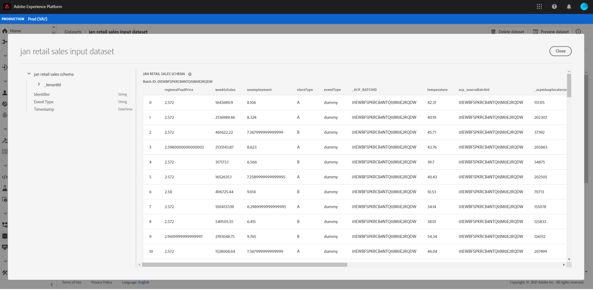

# Förhandsgranska försäljningsschema och datauppsättning för återförsäljning

När bootstrap-skriptet från självstudiekursen [för försäljning och datauppsättningen](./create-retails-sales-dataset.md) har slutförts. Utdatamodeller och datauppsättningar kan visas på [!DNL Experience Platform]. Följ stegen nedan för att visa scheman och datauppsättningar:

Välj fliken **[!UICONTROL Schemas]** i den vänstra navigeringen och sök efter det inmatningsschema som har skapats av bootstrap-skriptet. Schemats namn motsvarar det som definierades i `config.yaml` från föregående steg. Visa schemainformationen och dess komposition genom att klicka på den.

Välj fliken **[!UICONTROL Datasets]** i den vänstra navigeringen och öppna den indatamängd som skapades genom att markera datauppsättningens namn. Namnet på datauppsättningen motsvarar det som definierades i `config.yaml` från föregående steg.

Välj **[!UICONTROL Preview Dataset]** längst upp till höger om du vill förhandsgranska en delmängd av datauppsättningen.

## Nästa steg

Du har nu importerat exempeldata för butiksförsäljning till [!DNL Experience Platform] med det angivna bootstrap-skriptet.

Så här fortsätter du att arbeta med inkapslade data:
- [Analysera dina data med Jupyter Notebooks](../jupyterlab/analyze-your-data.md)
   - Använd Jupyter-anteckningsböcker i [!DNL Data Science Workspace] för att få tillgång till, utforska, visualisera och förstå dina data.
- [Paketera källfiler i en mottagare](./package-source-files-recipe.md)
   - Följ den här självstudiekursen för att lära dig hur du kan ta med din egen modell till [!DNL Data Science Workspace] genom att paketera källfiler i en importerbar Recipe-fil.