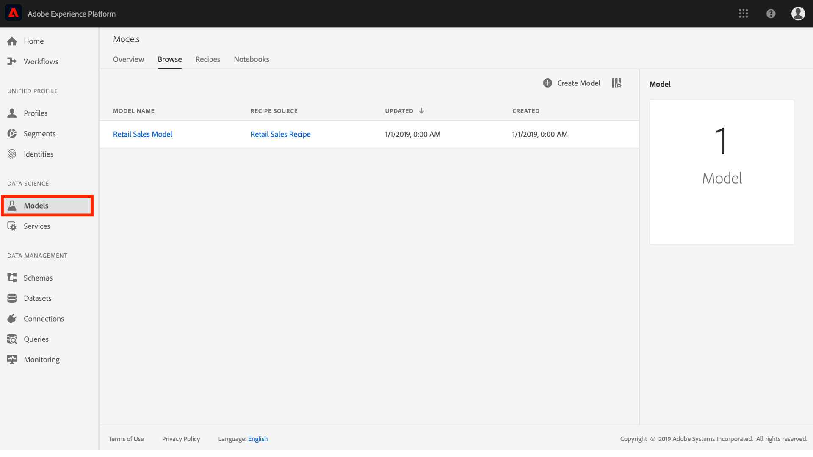
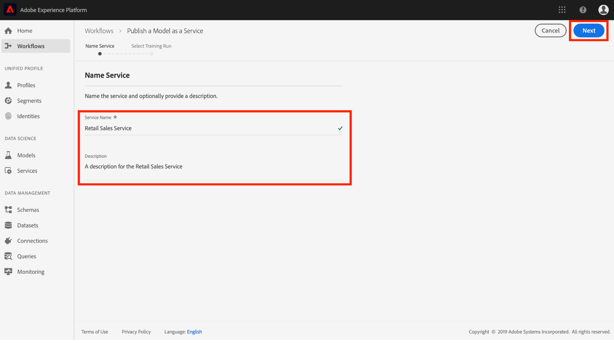

# Publicera en modell som en tjänst i gränssnittet för datavetenskapen

Med Adobe Experience Platform Data Science Workspace kan du publicera din utbildade och utvärderade modell som en tjänst, vilket gör att användare i IMS-organisationen kan få sina data poäng utan att behöva skapa egna modeller.

## Komma igång

Du måste ha tillgång till [!DNL Experience Platform] för att kunna slutföra den här självstudiekursen. Om du inte har tillgång till en IMS-organisation i [!DNL Experience Platform], ska du tala med systemadministratören innan du fortsätter.

Den här självstudiekursen kräver en befintlig modell med en lyckad utbildning. Om du inte har någon publicerbar modell följer du [tåget och utvärderar en modell i självstudiekursen för användargränssnittet](./train-evaluate-model-ui.md) innan du fortsätter.

Om du föredrar att publicera en modell med hjälp av API:er för Sensei Machine Learning finns i [API-självstudiekursen](./publish-model-service-api.md).

## Publicera en modell {#publish-a-model}

1. I Adobe Experience Platform klickar du på länken **[!UICONTROL Models]** i den vänstra navigeringskolumnen för att visa alla befintliga modeller. Sök efter och klicka på namnet på modellen som ska publiceras som en tjänst.
   
2. Klicka på **[!UICONTROL Publish]** uppe till höger på sidan Modellöversikt för att starta en process för att skapa en tjänst.
   
3. Ange ett önskat namn för tjänsten och ange eventuellt en servicebeskrivning. Klicka på **[!UICONTROL Next]** när du är klar.
   
4. Alla framgångsrika kurser för modellerna listas. Den nya tjänsten ärver utbildnings- och poängkonfigurationer från den valda kursen.
   
5. Klicka på **[!UICONTROL Finish]** för att skapa tjänsten och dirigera om till **[!UICONTROL Service Gallery]** för att visa alla tillgängliga tjänster, inklusive den nya tjänsten.
   

## Poäng med en tjänst {#access-a-service}

1. I Adobe Experience Platform klickar du på fliken **[!UICONTROL Services]** i den vänstra navigeringskolumnen för att komma åt **[!UICONTROL Service Gallery]**. Leta reda på den tjänst du vill använda och klicka på **[!UICONTROL Score]**.
   
2. Välj en lämplig indatauppsättning för poängkörningen och klicka sedan på **[!UICONTROL Next]**.
   
3. Välj en lämplig datauppsättning för poängresultatet och klicka sedan på **[!UICONTROL Next]**.
   
4. När en tjänst skapas ärver den standardpoängkonfigurationer. Du kan granska dessa konfigurationer och justera dem efter behov genom att dubbelklicka på värdena. När du är nöjd med konfigurationerna klickar du på **[!UICONTROL Finish]** för att påbörja poängkörningen.
   
5. Information om det nya bedömningsjobbet och dess förlopp visas på sidan **Översikt** för tjänsten. När jobbet har slutförts uppdateras **[!UICONTROL Most Recent]**-huvudet i **[!UICONTROL Scoring]**-behållaren.
   

## Nästa steg {#next-steps}

Genom att följa den här självstudiekursen har du publicerat en modell som en tillgänglig tjänst och betygsatt data med den nya tjänsten via [!UICONTROL Service Gallery]. Fortsätt till nästa självstudiekurs för att lära dig hur du kan [schemalägga automatiserad utbildning och poängsättning för en tjänst](./schedule-models-ui.md).
