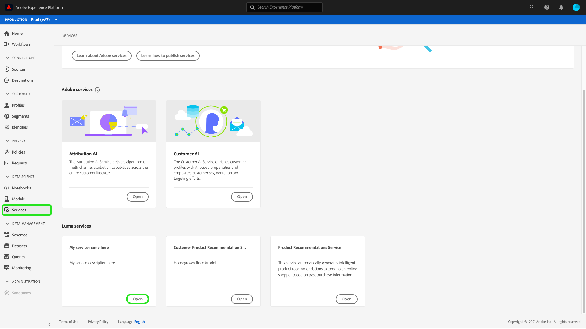
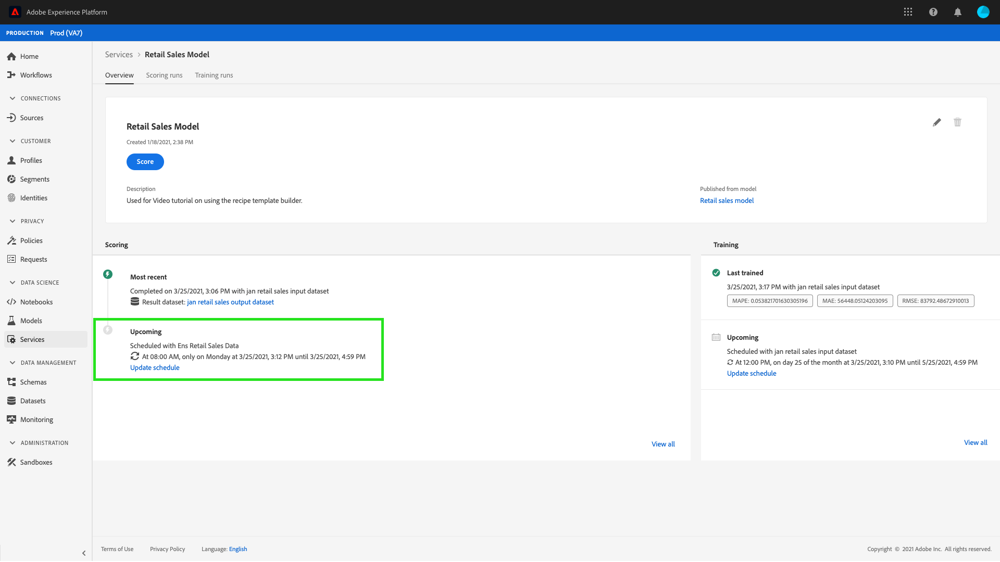

# Schemalägg en modell i användargränssnittet för datavetenskapen i Workspace

>[!NOTE]
>
>Data Science Workspace finns inte längre att köpa.
>
>Denna dokumentation är avsedd för befintliga kunder med tidigare tillstånd till Data Science Workspace.

Med Adobe Experience Platform [!DNL Data Science Workspace] kan du konfigurera schemalagda poängsättnings- och utbildningar för en maskininlärningstjänst. Genom att automatisera utbildnings- och poängprocessen kan du behålla och förbättra en tjänsts effektivitet genom att hålla jämna steg med era datamönster.

I den här självstudiekursen går du igenom stegen för att konfigurera utbildnings- och poängsättningsscheman för en befintlig tjänst via [!UICONTROL Service Gallery]. Den delas in i följande huvudavsnitt:

- [Konfigurera schemalagd poängsättning](#configure-scheduled-scoring)
- [Konfigurera schemalagd utbildning](#configure-scheduled-training)

## Komma igång

Du måste ha tillgång till [!DNL Experience Platform] för att kunna slutföra den här självstudiekursen. Om du inte har åtkomst till en organisation i [!DNL Experience Platform], ska du tala med systemadministratören innan du fortsätter.

Den här självstudiekursen kräver en befintlig tjänst. Om du inte har någon tillgänglig tjänst att arbeta med kan du skapa en genom att följa självstudiekursen för [publicering av en modell som en tjänst](./publish-model-service-ui.md).

## Konfigurera schemalagd poängsättning {#configure-scheduled-scoring}

Modellpoäng kan konfigureras till en automatiserad process på schemalagd basis. När en tjänst har skapats följer du stegen nedan för att konfigurera och tillämpa ett poängschema:

I Adobe Experience Platform väljer du fliken **[!UICONTROL Services]** i den vänstra navigeringskolumnen för att komma åt **[!DNL Service Gallery]**. Hitta den tjänst som du vill schemalägga poängsättningen för och välj **[!UICONTROL Open]** för att visa sidan **[!UICONTROL Overview]**.

På sidan Översikt visas tjänstens poänginformation. Klicka på länken **[!UICONTROL Update Schedule]** om du vill konfigurera ett poängschema.

Konfigurera frekvens, startdatum, slutdatum, indatamängd och utdatamängd för poängsättningsschemat. När du är nöjd med konfigurationerna väljer du **[!UICONTROL Create]** för att uppdatera tjänstens poängschema.

Det uppdaterade poängschemat visas på tjänstens **[!UICONTROL Overview]**-sida.

## Konfigurera schemalagd utbildning {#configure-scheduled-training}

Om du konfigurerar schemalagd utbildning för en tjänst uppdateras maskininlärningsmodellen till de senaste datamönstren. När en schemalagd utbildningskörning är avslutad används den resulterande tränade modellen för att driva tjänsten fram till nästa schemalagda utbildningskurs.

När du har skapat en tjänst följer du stegen nedan för att konfigurera och tillämpa ett utbildningsschema:

I Adobe Experience Platform väljer du fliken **[!UICONTROL Services]** i den vänstra navigeringskolumnen för att komma åt **[!UICONTROL Service Gallery]**. Hitta den tjänst som du vill schemalägga utbildning för och välj **[!UICONTROL Open]** för att visa sidan **[!UICONTROL Overview]**.

Översikt visar tjänstens utbildningsinformation. Klicka på länken **[!UICONTROL Update Schedule]** om du vill konfigurera ett utbildningsschema.

Konfigurera frekvens, startdatum, slutdatum och indatamängd som används för utbildningens schema. När du är nöjd med konfigurationerna väljer du **[!UICONTROL Create]** för att uppdatera tjänstens utbildningsschema.

Det uppdaterade utbildningsschemat visas på tjänstens **[!UICONTROL Overview]**-sida.

## Nästa steg

Genom att följa den här självstudiekursen har du schemalagt automatiserad utbildning och poängsättning för en tjänst och slutfört arbetsflödet för självstudiekursen [!DNL Data Science Workspace]. Om du inte redan har gjort det kan du överväga att [starta om självstudiekursen](./create-retails-sales-dataset.md) och följa API-arbetsflödet för att skapa, utbilda, poängsätta och publicera en modell.
