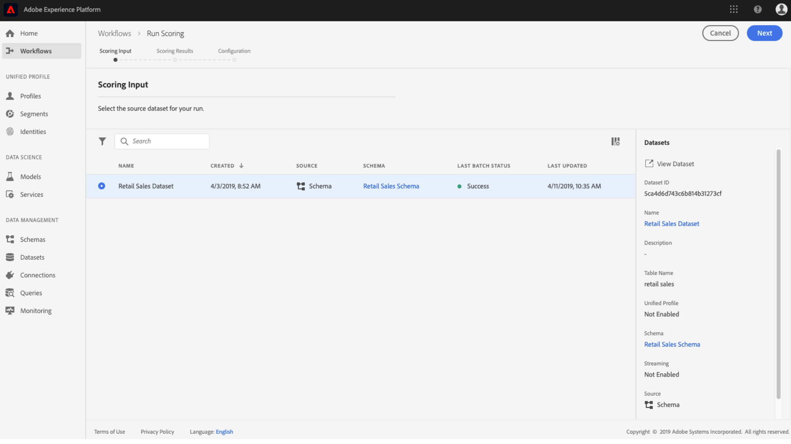

# Visa en modell i gränssnittet för datavetenskapen

Du kan göra poängsättningen i Adobe Experience Platform [!DNL Data Science Workspace] genom att mata in indata i en befintlig utbildad modell. Resultat av poängsättningen lagras och kan visas i en angiven utdatamängd som en ny grupp.

I den här självstudiekursen visas de steg som krävs för att göra en modell i [!DNL Data Science Workspace]-användargränssnittet.

## Komma igång

Du måste ha tillgång till [!DNL Experience Platform] för att kunna slutföra den här självstudiekursen. Om du inte har tillgång till en IMS-organisation i [!DNL Experience Platform], ska du tala med systemadministratören innan du fortsätter.

Den här självstudiekursen kräver en utbildad modell. Om du inte har någon tränad modell ska du följa självstudiekursen [och utvärdera en modell i användargränssnittet](./train-evaluate-model-ui.md) innan du fortsätter.

## Skapa en ny poängkörning

En bedömningsrunda skapas med optimerade konfigurationer från en tidigare slutförd och utvärderad utbildningskurs. Uppsättningen optimala konfigurationer för en modell bestäms vanligtvis genom att man granskar utvärderingsvärden för utbildningskörning.

1. Hitta den bästa kursen för att använda dess konfigurationer för poängsättning. Öppna önskad utbildningskurs genom att klicka på namnet.

2. Klicka på knappen **[!UICONTROL Score]** längst upp till höger på skärmen på fliken Utbildningskörning **[!UICONTROL Evaluation]**. Detta startar ett nytt **Kör poängsättning**-arbetsflöde.
   

3. Markera datamängden för indataskal och klicka på **[!UICONTROL Next]**.
   

4. Välj datauppsättningen för resultaträkning, det här är den dedikerade utdatamängden där poängsättningsresultaten lagras. Bekräfta ditt val och klicka på **[!UICONTROL Next]**.
   

5. I det sista steget i arbetsflödet uppmanas du att konfigurera din poängkörning. Dessa konfigurationer används av modellen för poängkörningen.
Observera att du inte kan ta bort ärvda parametrar som angavs när modellen skapades. Du kan redigera eller återställa icke ärvda parametrar genom att dubbelklicka på värdet eller klicka på återställningsikonen när du håller markören över posten.
   
Granska och bekräfta poängkonfigurationerna och klicka för  **[!UICONTROL Finish]**  att skapa och köra poängkörningen. Du dirigeras till fliken **[!UICONTROL Scoring Runs]** och den nya poängkörningen visar en status.
   
I en bedömningsrunda visas någon av följande fyra statusvärden: Väntande, Fullständigt, Misslyckades eller Körs och uppdateras automatiskt. Fortsätt till nästa steg om statusen är antingen Slutförd eller Misslyckad.

## Visa poängresultat

1. Hitta den utbildningskörning som användes för poängsättningen och klicka på namnet för att visa sidan **[!UICONTROL Evaluation]**.

2. Klicka på fliken **[!UICONTROL Scoring Runs]** längst upp på sidan där du utvärderar utbildningskörningen för att visa en lista över befintliga poängserier. Klicka på poänglistan för att visa informationen i den högra kolumnen.
   

3. Om den valda poängkörningen har statusen Slutförd eller Misslyckad, är länken **[!UICONTROL View Activity Logs]** som finns i den högra kolumnen aktiv. Klicka på länken för att visa eller hämta körningsloggarna. Om en poängkörning misslyckades kan körningsloggarna ge användbar information för att fastställa orsaken till felet.
   

4. Klicka på länken **[!UICONTROL Preview Scoring Results Dataset]** i den högra kolumnen. Du kan se en förhandsvisning av utdata från poängkörningen.
   

5. Klicka på länken **[!UICONTROL Scoring Results Dataset]** som finns i den högra kolumnen för att få en komplett uppsättning poäng.

## Nästa steg

I den här självstudiekursen gick du igenom stegen för att få fram data med hjälp av en tränad modell i [!DNL Data Science Workspace]. Följ självstudiekursen om att [publicera en modell som en tjänst i användargränssnittet](./publish-model-service-ui.md) så att användare i organisationen kan få poäng på data genom att ge enkel åtkomst till en maskininlärningstjänst.
