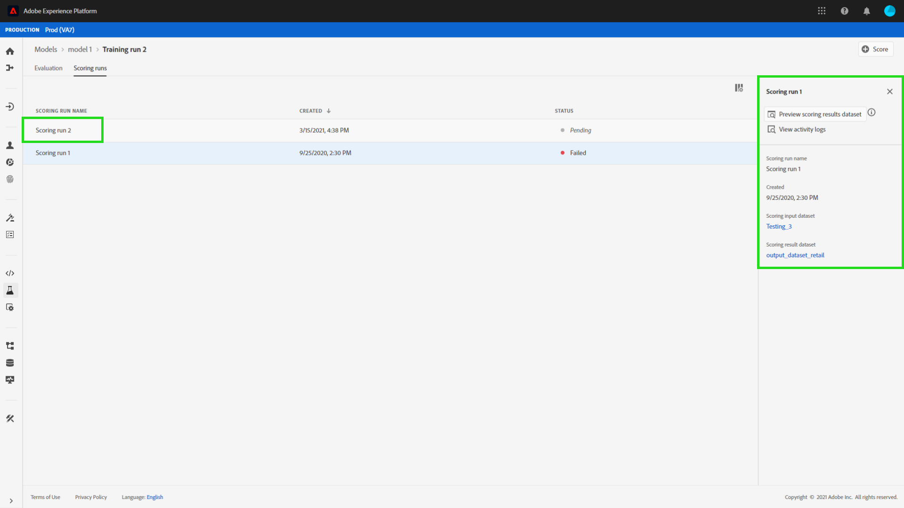

# Visa en modell i gränssnittet för datavetenskapen

Du kan göra poängsättningen i Adobe Experience Platform [!DNL Data Science Workspace] genom att mata in indata i en befintlig utbildad modell. Resultat av poängsättningen lagras och kan visas i en angiven utdatamängd som en ny grupp.

I den här självstudiekursen visas de steg som krävs för att göra en modell i [!DNL Data Science Workspace]-användargränssnittet.

## Komma igång

Du måste ha tillgång till [!DNL Experience Platform] för att kunna slutföra den här självstudiekursen. Om du inte har tillgång till en IMS-organisation i [!DNL Experience Platform], ska du tala med systemadministratören innan du fortsätter.

Den här självstudiekursen kräver en utbildad modell. Om du inte har någon tränad modell ska du följa självstudiekursen [och utvärdera en modell i användargränssnittet](./train-evaluate-model-ui.md) innan du fortsätter.

## Skapa en ny poängkörning

En bedömningsrunda skapas med optimerade konfigurationer från en tidigare slutförd och utvärderad utbildningskurs. Uppsättningen optimala konfigurationer för en modell bestäms vanligtvis genom att man granskar utvärderingsvärden för utbildningskörning.

Hitta den bästa kursen för att använda dess konfigurationer för poängsättning. Öppna sedan kursen genom att markera hyperlänken som är kopplad till namnet.

På fliken **[!UICONTROL Evaluation]** väljer du **[!UICONTROL Score]** längst upp till höger på skärmen. Ett nytt bedömningsarbetsflöde börjar.

Markera datamängden för indataskal och välj **[!UICONTROL Next]**.

Välj datauppsättningen för resultaträkning, det här är den dedikerade utdatamängden där poängsättningsresultaten lagras. Bekräfta ditt val och välj **[!UICONTROL Next]**.

I det sista steget i arbetsflödet uppmanas du att konfigurera din poängkörning. Dessa konfigurationer används av modellen för poängkörningen.
Observera att du inte kan ta bort ärvda parametrar som angavs när modellerna skapades. Du kan redigera eller återställa icke ärvda parametrar genom att dubbelklicka på värdet eller välja återställningsikonen när du håller markören över posten.

Granska och bekräfta poängkonfigurationerna och välj **[!UICONTROL Finish]** för att skapa och köra poängkörningen. Du dirigeras till fliken **[!UICONTROL Scoring Runs]** och den nya poängkörningen med statusen **[!UICONTROL Pending]** visas.

En bedömningskörning kan visas med någon av följande statusar:
- Väntande
- Slutförd
- Misslyckades
- Körs

Status uppdateras automatiskt. Fortsätt till nästa steg om statusen är **[!UICONTROL Complete]** eller **[!UICONTROL Failed]**.

## Visa poängresultat

Om du vill visa poängresultat börjar du med att välja en utbildningskurs.

Du omdirigeras till sidan **[!UICONTROL Evaluation]** för kurserna. Långt upp på sidan för utvärdering av utbildningskörning väljer du fliken **[!UICONTROL Scoring Runs]** för att visa en lista över befintliga poängsättningar.

Välj sedan en poängkörning för att visa körningsinformationen.

Om den valda poängkörningen har statusen Slutförd eller Misslyckad är länken **[!UICONTROL View Activity Logs]** tillgänglig. Om en poängkörning misslyckas kan körningsloggarna ge användbar information för att fastställa orsaken till felet. Om du vill hämta körningsloggarna väljer du **[!UICONTROL View Activity Logs]**.

**[!UICONTROL View activity logs]**-drivrutinen visas. Välj en URL för att automatiskt hämta de associerade loggarna.

Du kan också visa dina poängresultat genom att välja **[!UICONTROL Preview scoring results dataset]**.

En förhandsgranskning av utdatamängden tillhandahålls.

För den fullständiga uppsättningen poängresultat väljer du länken **[!UICONTROL Scoring Results Dataset]** som finns i den högra kolumnen.

## Nästa steg

I den här självstudiekursen gick du igenom stegen för att få fram data med hjälp av en tränad modell i [!DNL Data Science Workspace]. Följ självstudiekursen om att [publicera en modell som en tjänst i användargränssnittet](./publish-model-service-ui.md) så att användare i organisationen kan få poäng på data genom att ge enkel åtkomst till en maskininlärningstjänst.
