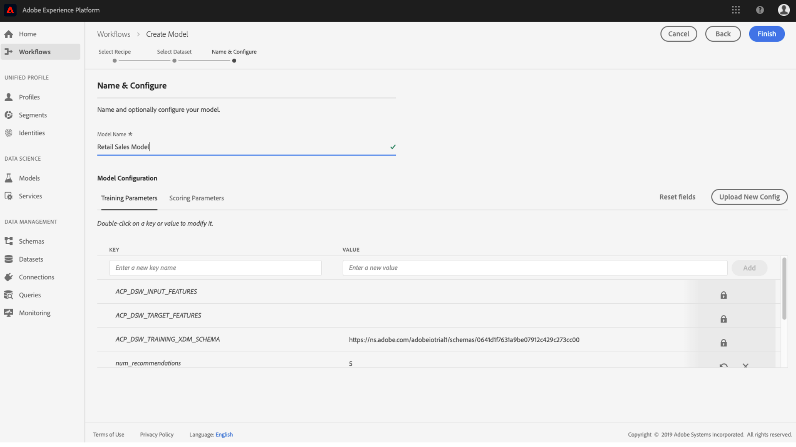
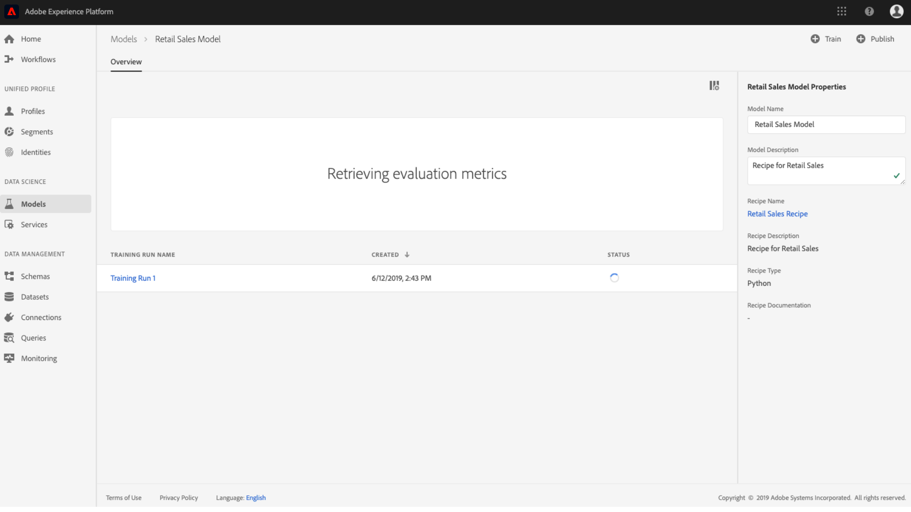

# Utbildning och utvärdering av modell (UI)

I Adobe Experience Platform Data Science Workspace skapas en maskininlärningsmodell genom att en befintlig Recipe som är lämplig för modellens avsikt läggs till. Modellen är sedan utbildad och utvärderad för att optimera dess driftseffektivitet och effektivitet genom att finjustera de tillhörande hyperparametrarna. Recept kan återanvändas, vilket innebär att flera modeller kan skapas och skräddarsys för specifika syften med en enda Recept.

Den här självstudiekursen går igenom stegen för att skapa, utbilda och utvärdera en modell.

## Komma igång

Du måste ha tillgång till den här självstudiekursen för att kunna slutföra den [!DNL Experience Platform]. Om du inte har tillgång till en IMS-organisation i [!DNL Experience Platform]kontaktar du systemadministratören innan du fortsätter.

Den här självstudiekursen kräver en befintlig recept. Om du inte har någon recept följer du [Importera en paketerad recept i](./import-packaged-recipe-ui.md) självstudiekursen innan du fortsätter.

## Skapa en modell

1. I Adobe Experience Platform klickar du på den **[!UICONTROL Models]** länk som finns i den vänstra navigeringskolumnen för att visa alla befintliga modeller. Klicka **[!UICONTROL Create Model]** uppe till höger på sidan när du vill skapa en modell.
   

2. Bläddra igenom listan med befintliga recept, sök efter och välj den mottagare som ska användas för att skapa modellen och klicka på **[!UICONTROL Next]**.
   

3. Välj en lämplig indatauppsättning och klicka på **[!UICONTROL Next]**. Detta anger standarddatauppsättningen för inmatningsutbildning för modellen.
   

4. Ange ett namn för modellen och granska standardmodellkonfigurationerna. Standardkonfigurationer tillämpades när Recept skapades, granska och ändra konfigurationsvärdena genom att dubbelklicka på värdena. Om du vill skapa en ny uppsättning konfigurationer klickar du på **[!UICONTROL Upload New Config]** och drar en JSON-fil som innehåller modellkonfigurationer till webbläsarfönstret. Klicka **[!UICONTROL Finish]** för att skapa modellen.

   >[!NOTE]
   >
   >Konfigurationer är unika och specifika för den avsedda mottagaren, vilket innebär att konfigurationer för butiksförsäljningsreceptet inte fungerar för produktmottagaren för Recommendations. I [referensavsnittet](#reference) finns en lista över konfigurationer för butiksförsäljning.

   

## Skapa en utbildningskörning

1. I Adobe Experience Platform klickar du på den **[!UICONTROL Models]** länk som finns i den vänstra navigeringskolumnen för att visa alla befintliga modeller. Sök och klicka på namnet på den modell som ska tränas.
   

2. Alla befintliga kurser med deras aktuella utbildningsstatus listas. För modeller som skapats med [!DNL Data Science Workspace] användargränssnittet genereras och körs en utbildningskörning automatiskt med standardkonfigurationer och datauppsättningen för inmatningsutbildning.
   

3. Skapa en ny kurs genom att klicka **[!UICONTROL Train]** nära överst till höger på sidan Modellöversikt.
   

4. Välj indatauppsättning för utbildning för utbildningskörningen och klicka på **[!UICONTROL Next]**.
   

5. Standardkonfigurationer som tillhandahålls när modellen skapas visas, ändra och ändra dem därefter genom att dubbelklicka på värdena. Klicka **[!UICONTROL Finish]** för att skapa och genomföra kursen.

   >[!NOTE]
   >
   >Konfigurationer är unika och specifika för den avsedda mottagaren, vilket innebär att konfigurationer för butiksförsäljningsreceptet inte fungerar för produktmottagaren för Recommendations. I [referensavsnittet](#reference) finns en lista över konfigurationer för butiksförsäljning.

   

## Utvärdera modellen

1. I Adobe Experience Platform klickar du på den **[!UICONTROL Models]** länk som finns i den vänstra navigeringskolumnen för att visa alla befintliga modeller. Sök och klicka på namnet på den modell som ska utvärderas.
   

2. Alla befintliga kurser med deras aktuella utbildningsstatus listas. Om du har flera färdiga kurser kan du jämföra utvärderingsmätningar för olika utbildningar i modellutvärderingsdiagrammet. Välj ett utvärderingsmått i listrutan ovanför diagrammet.

   MAPE-mätvärdet (Meean Absolute Percent Error) anger noggrannheten som en procentandel av felet. Detta används för att identifiera de mest högpresterande experterna. Ju lägre värde, desto bättre.

   

   Precisionsmåttet beskriver procentandelen relevanta instanser jämfört med det totala antalet *hämtade* instanser. Precision kan ses som sannolikheten att ett slumpmässigt valt resultat blir korrekt.
   

   Klicka på en särskild övning för att se mer information om den. Detta kan göras även innan körningen har slutförts. På detaljsidan kan du se andra utvärderingsmått, konfigurationsparametrar och visualiseringar som är specifika för kursen. Du kan även hämta aktivitetsloggar för att se information om körningen. Loggar är särskilt användbara för misslyckade körningar för att se vad som gick fel.
   

3. Hyperparametrar kan inte tränas och en modell måste optimeras genom att olika kombinationer av hyperparametrar testas. Upprepa denna modellutbildning och utvärderingsprocess tills du har nått en optimerad modell.

## Nästa steg

Den här självstudiekursen gick igenom hur du skapar, utbilda och utvärderar en modell i [!DNL Data Science Workspace]. När du har kommit fram till en optimerad modell kan du använda den utbildade modellen för att generera insikter genom att följa [Score a Model i självstudiekursen för användargränssnittet](./score-model-ui.md) .

## Referens {#reference}

### Detaljhandelsförsäljningens mottagarkonfigurationer

Hyperparametrar bestämmer modellens utbildningsbeteende, och om du ändrar hyperparametrar påverkas modellens precision och precision:

| Hyperparameter | Beskrivning | Rekommenderat intervall |
--- | --- | ---
| learning_rate | Inlärningsgraden minskar bidraget från varje träd med learning_rate. Det finns en kompromiss mellan learning_rate och n_estimators. | 0.1 | [2 - 10] / antal skattare |
| n_estimators | Antalet förstärkningssteg som ska utföras. Ökning av övertoningar är relativt robust för överpassning, så ett stort tal ger vanligtvis bättre prestanda. | 100 | 100 - 1000 |
| max_depth | Maximalt djup för de enskilda regressionsberäknarna. Det maximala djupet begränsar antalet noder i trädet. Finjustera den här parametern för bästa prestanda. det bästa värdet beror på interaktionen mellan indatavariablerna. | 3 | 4 - 10 |

Ytterligare parametrar bestämmer modellens tekniska egenskaper:

| Parameternyckel | Typ | Beskrivning |
| ----- | ----- | ----- |
| `ACP_DSW_INPUT_FEATURES` | Sträng | Lista med kommaavgränsade inmatningsschemaattribut. |
| `ACP_DSW_TARGET_FEATURES` | Sträng | Lista med kommaseparerade utdataschemaattribut. |
| `ACP_DSW_FEATURE_UPDATE_SUPPORT` | Boolean | Avgör om in- och utdatafunktionerna kan ändras |
| `tenantId` | Sträng | Detta ID garanterar att de resurser du skapar namnges korrekt och finns i IMS-organisationen. [Följ stegen här](../../xdm/api/getting-started.md#know-your-tenant_id) för att hitta ditt klient-ID. |
| `ACP_DSW_TRAINING_XDM_SCHEMA` | Sträng | Det indatarema som används för utbildning av en modell. |
| `evaluation.labelColumn` | Sträng | Kolumnetikett för utvärderingsvisualiseringar. |
| `evaluation.metrics` | Sträng | Kommaavgränsad lista med mätvärden som ska användas för att utvärdera en modell. |
| `ACP_DSW_SCORING_RESULTS_XDM_SCHEMA` | Sträng | Utdatamodeller som används för att klassificera en modell. |