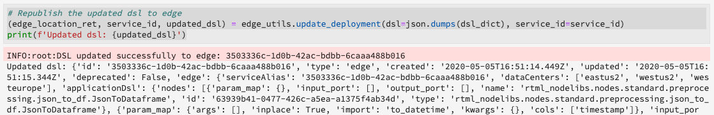

# Användarhandbok för maskininlärning i realtid (Alpha)

>[!IMPORTANT]
>
>Maskininlärning i realtid är inte tillgängligt för alla användare ännu. Den här funktionen är alfabet och testas fortfarande. Dokumentet kan komma att ändras.

I följande guide beskrivs de steg som krävs för att skapa ett Machine Learning-program i realtid. Med den Adobe-medföljande mallen för bärbara datorer från Python täcker den här guiden in utbildning av en modell, skapa en DSL, publicera DSL på Edge och betygsätta begäran. **[!UICONTROL Real-time ML]** När du implementerar din maskininlärningsmodell i realtid förväntas du ändra mallen så att den passar datauppsättningens behov.

## Skapa en Machine Learning-anteckningsbok i realtid

I Adobe Experience Platform-gränssnittet väljer du **[!UICONTROL Notebooks]** inom *datavetenskap*. Välj sedan **[!UICONTROL JupyterLab]** och tillåt lite tid för att läsa in miljön.


Startkartan visas [!DNL JupyterLab] . Bläddra ned till Maskinininlärning i *realtid* och välj **[!UICONTROL Real-time ML]** anteckningsbok. En mall öppnas som innehåller exempel på anteckningsboksceller med en exempeldatauppsättning.


## Importera och identifiera noder

Börja med att importera alla nödvändiga paket för modellen. Kontrollera att alla paket som du planerar att använda för nodredigering importeras.

>[!NOTE]
>
>Listan över importer kan variera beroende på vilken modell du vill skapa. Listan kommer att ändras när nya noder läggs till över tid. En fullständig lista över tillgängliga noder finns i referenshandboken [för](./node-reference.md) noder.

```python
from pprint import pprint
import pandas as pd
import numpy as np
import json
import uuid
from shutil import copyfile
from pathlib import Path
from datetime import date, datetime, timedelta
from platform_sdk.dataset_reader import DatasetReader

from rtml_nodelibs.nodes.standard.preprocessing.json_to_df import JsonToDataframe
from rtml_sdk.edge.utils import EdgeUtils
from rtml_sdk.graph.utils import GraphBuilder
from rtml_nodelibs.nodes.standard.ml.onnx import ONNXNode
from rtml_nodelibs.core.nodefactory import NodeFactory as nf
from rtml_nodelibs.nodes.standard.preprocessing.pandasnode import Pandas
from rtml_nodelibs.nodes.standard.preprocessing.one_hot_encoder import OneHotEncoder
from rtml_nodelibs.nodes.standard.ml.artifact_utils import ModelUpload
from rtml_nodelibs.core.nodefactory import NodeFactory as nf
from rtml_nodelibs.core.datamsg import DataMsg
```

I följande kodcell skrivs en lista över tillgängliga noder ut.

```python
# Discover Nodes
pprint(nf.discover_nodes())
```


## Utbilda en maskininlärningsmodell i realtid

Med något av följande alternativ skriver du [!DNL Python] kod för att läsa, bearbeta och analysera data. Därefter måste du utbilda din egen ML-modell, serialisera den i ONNX-format och sedan överföra den till Machine Learning-modellagringsplatsen i realtid.

- [Utbilda din egen modell i JupyterLab-anteckningsböcker](#training-your-own-model)
- [Överför din egen förutbildade ONNX-modell till JupyterLab-anteckningsböcker](#pre-trained-model-upload)

### Utbilda en egen modell {#training-your-own-model}

Börja med att läsa in dina utbildningsdata.

>[!NOTE]
>
>I **realtids-ML** -mallen hämtas data för [bilförsäkrings-CSV](https://github.com/adobe/experience-platform-dsw-reference/tree/master/datasets/insurance) från [!DNL Github].


Om du vill använda en datauppsättning inifrån Adobe Experience Platform avkommenterar du cellen nedan. Därefter måste du ersätta `DATASET_ID` med rätt värde.


Om du vill få åtkomst till en datauppsättning i din [!DNL JupyterLab] anteckningsbok väljer du fliken **Data** i den vänstra navigeringen i [!DNL JupyterLab]. The *[!UICONTROL Datasets]* and *[!UICONTROL Schemas]* directories appear. Markera **[!UICONTROL Datasets]** och högerklicka och välj sedan det **[!UICONTROL Explore Data in Notebook]** alternativ på den nedrullningsbara menyn som finns i den datauppsättning som du vill använda. En körbar kodpost visas längst ned i anteckningsboken. Den här cellen har din `dataset_id`.


När du är klar högerklickar du och tar bort cellen som du skapade längst ned i anteckningsboken.

### Utbildningsegenskaper

Använd den mall som anges för att ändra någon av utbildningsegenskaperna i `config_properties`.

```python
config_properties = {
    "train_records_limit":1000000,
    "n_estimators": "80",
    "max_depth": "5",
    "ten_id": "_experienceplatform"  
}
```

### Förbered din modell

När du använder *[!UICONTROL Real-time ML]* mallen måste du analysera, förbearbeta, utbilda och utvärdera din ML-modell. Detta görs genom att tillämpa dataomvandlingar och bygga upp en utbildningsväg.

**Dataomvandlingar**

Cellen *[!UICONTROL Real-time ML]* Dataomvandlingar ** för mallar måste ändras för att fungera med din egen datauppsättning. Vanligtvis innebär detta att byta namn på kolumner, datasammanslagning och datainsamling/funktionsteknik.

>[!NOTE]
>
>Följande exempel har konverterats för läsbarhetsändamål med `[ ... ]`. Visa och expandera avsnittet om dataomvandlingar i *realtid av ML* -mallar för hela kodcellen.

```python
df1.rename(columns = {config_properties['ten_id']+'.identification.ecid' : 'ecid',
                     [ ... ]}, inplace=True)
df1 = df1[['ecid', 'km', 'cartype', 'age', 'gender', 'carbrand', 'leasing', 'city', 
       'country', 'nationality', 'primaryuser', 'purchase', 'pricequote', 'timestamp']]
print("df1 shape 1", df1.shape)
#########################################
# Data Rollup
######################################### 
df1['timestamp'] = pd.to_datetime(df1.timestamp)
df1['hour'] = df1['timestamp'].dt.hour.astype(int)
df1['dayofweek'] = df1['timestamp'].dt.dayofweek

df1.loc[(df1['purchase'] == 'yes'), 'purchase'] = 1
df1.purchase.fillna(0, inplace=True)
df1['purchase'] = df1['purchase'].astype(int)

[ ... ]

print("df1 shape 2", df1.shape)

#########################################
# Data Preparation/Feature Engineering
#########################################      

df1['carbrand'] = df1['carbrand'].str.lower()
df1['country'] = df1['country'].str.lower()
df1.loc[(df1['carbrand'] == 'vw'), 'carbrand'] = 'volkswagen'

[ ... ]

df1['age'].fillna(df1['age'].median(), inplace=True)
df1['gender'].fillna('notgiven', inplace=True)

[ ... ]

df1['city'] = df1.groupby('country')['city'].transform(lambda x : x.fillna(x.mode()))
df1.dropna(subset = ['pricequote'], inplace=True)
print("df1 shape 3", df1.shape)
print(df1)

#grouping
grouping_cols = ['carbrand', 'cartype', 'city', 'country']

for col in grouping_cols:
    df_idx = pd.DataFrame(df1[col].value_counts().head(6))

    def grouping(x):
        if x in df_idx.index:
            return x
        else:
            return "Others"
    df1[col] = df1[col].apply(lambda x: grouping(x))

def age(x):
    if x < 20:
        return "u20"
    elif x > 19 and x < 29:
    [ ... ]
    else: 
        return "Others"

df1['age'] = df1['age'].astype(int)
df1['age_bucket'] = df1['age'].apply(lambda x: age(x))

df_final = df1[['hour', 'dayofweek','age_bucket', 'gender', 'city',  
   'country', 'carbrand', 'cartype', 'leasing', 'pricequote', 'purchase']]
print("df final", df_final.shape)

cat_cols = ['age_bucket', 'gender', 'city', 'dayofweek', 'country', 'carbrand', 'cartype', 'leasing']
df_final = pd.get_dummies(df_final, columns = cat_cols)
```

Kör den angivna cellen för att se ett exempelresultat. Utdatatabellen som returneras från datauppsättningen returnerar de ändringar som du har definierat. `carinsurancedataset.csv`


**Utbildningsförlopp**

Sedan måste ni skapa en utbildningsstrategi. Det här kommer att se ut ungefär som andra utbildningslösningar förutom att du behöver konvertera och generera en ONNX-fil.

Ändra mallen med hjälp av dataomformningarna som definierats i föregående cell. Följande kod är markerad nedan och används för att generera en ONNX-fil i ditt funktionsflöde. Visa XML-mallen för *realtid* för den fullständiga pipeline-kodcellen.

```python
#for generating onnx
def generate_onnx_resources(self):        
    install_dir = os.path.expanduser('~/my-workspace')
    print("Generating Onnx")
        
    from skl2onnx import convert_sklearn
    from skl2onnx.common.data_types import FloatTensorType
        
    # ONNX-ification
    initial_type = [('float_input', FloatTensorType([None, self.feature_len]))]

    print("Converting Model to Onnx")
    onx = convert_sklearn(self.model, initial_types=initial_type)
             
    with open("model.onnx", "wb") as f:
        f.write(onx.SerializeToString())
            
    print("Model onnx created")
```

När du är klar med ditt utbildningsarbete och har ändrat dina data genom dataomvandlingar använder du följande cell för att genomföra kursen.

```python
model = train(config_properties, df_final)
```

### Generera och ladda upp en ONNX-modell

När du har avslutat en utbildning måste du generera en ONNX-modell och överföra den tränade modellen till Machine Learning-modellagringsplatsen i realtid. När du har kört följande celler visas ONNX-modellen i den vänstra listen bredvid alla dina andra bärbara datorer.

```python
import os
import skl2onnx, subprocess

model.generate_onnx_resources()
```

>[!NOTE]
>
>Ändra `model_path` strängvärdet (`model.onnx`) för att ändra namnet på modellen.

```python
model_path = "model.onnx"
```

>[!NOTE]
>
>Följande cell är inte redigerbar eller borttagbar och krävs för att Machine Learning-programmet i realtid ska fungera.

```python
model = ModelUpload(params={'model_path': model_path})
msg_model = model.process(None, 1)
model_id = msg_model.model['model_id']
 
print("Model ID : ", model_id)
```


### Överför din egen förutbildade ONNX-modell {#pre-trained-model-upload}

Använd överföringsknappen i [!DNL JupyterLab] bärbara datorer för att överföra den förtränade ONNX-modellen till [!DNL Data Science Workspace] anteckningsboksmiljön.


Därefter ändrar du strängvärdet i XML `model_path` -anteckningsboken i ** realtid så att det matchar ONNX-modellnamnet. När du är klar kör du cellen *Set model path* och kör sedan cellen *Upload your model to RTML Model Store* . Din modellplats och modell-ID returneras båda i svaret när det lyckas.


## Skapa domänspecifikt språk (DSL)

I det här avsnittet beskrivs hur du skapar en DSL. Du kommer att skapa noderna som innehåller eventuell förbearbetning av data tillsammans med ONNX-noden. Därefter skapas ett DSL-diagram med noder och kanter. Kanter ansluter noder med tuppelbaserat format (node_1, node_2). Diagrammet bör inte ha några cykler.

>[!IMPORTANT]
>
>Det är obligatoriskt att använda ONNX-noden. Utan ONNX-noden kommer programmet att misslyckas.

### Skapa noder

>[!NOTE]
>
> Det är troligt att du har flera noder baserat på vilken typ av data som används. I följande exempel visas bara en enda nod i *realtids-ML* -mallen. Se *avsnittet XML* -mallar för *nodredigering* i realtid för hela kodcellen.

Noden Pandor nedan använder `"import": "map"` för att importera metodnamnet som en sträng i parametrarna, följt av att parametrarna anges som en mappningsfunktion. Exemplet nedan gör detta med `{'arg': {'dataLayerNull': 'notgiven', 'no': 'no', 'yes': 'yes', 'notgiven': 'notgiven'}}`. När kartan är på plats kan du ange `inplace` som `True` eller `False`. Ange `inplace` som `True` eller `False` baserat på om du vill använda omformningen eller inte. Som standard `"inplace": False` skapas en ny kolumn. Stöd för att ange ett nytt kolumnnamn ställs in för att läggas till i en senare version. Den sista raden `cols` kan vara ett kolumnnamn eller en lista med kolumner. Ange kolumnerna som du vill använda omformningen på. I det här exemplet `leasing` anges. Mer information om tillgängliga noder och hur du använder dem finns i [nodreferensguiden](./node-reference.md).

```python
# Renaming leasing column using Pandas Node
leasing_mapper_node = Pandas(params={'import': 'map',
                                'kwargs': {'arg': {
                                    'dataLayerNull': 'notgiven', 
                                    'no': 'no', 
                                    'yes': 'yes', 
                                    'notgiven': 'notgiven'}},
                                'inplace': True,
                                'cols': 'leasing'})
```

### Skapa DSL-diagrammet

När dina noder har skapats är nästa steg att kedja ihop noderna för att skapa ett diagram.

Börja med att lista alla noder som är en del av diagrammet genom att skapa en array.

```python
nodes = [json_df_node, 
        to_datetime_node,
        hour_node,
        dayofweek_node,
        age_fillna_node,
        carbrand_fillna_node,
        country_fillna_node,
        cartype_primary_nationality_km_fillna_node,
        carbrand_mapper_node,
        cartype_mapper_node,
        country_mapper_node,
        gender_mapper_node,
        leasing_mapper_node,
        age_to_int_node,
        age_bins_node,
        dummies_node, 
        onnx_node]
```

Koppla sedan noderna med kanter. Varje tuppel är en [!DNL Edge] anslutning.

>[!TIP]
>
> Eftersom noderna är linjärt beroende av varandra (varje nod är beroende av föregående nods utdata) kan du skapa länkar med en enkel Python-listförståelse. Lägg till egna anslutningar om en nod är beroende av flera indata.

```python
edges = [(nodes[i], nodes[i+1]) for i in range(len(nodes)-1)]
```

Skapa diagrammet när noderna är anslutna. Cellen nedan är obligatorisk och kan inte redigeras eller tas bort.

```python
dsl = GraphBuilder.generate_dsl(nodes=nodes, edges=edges)
pprint(json.loads(dsl))
```

När det är klart returneras ett `edge` objekt som innehåller alla noder och de parametrar som mappades till dem.


## Publicera på kant (nav)

>[!NOTE]
>
>Maskininlärning i realtid distribueras tillfälligt till och hanteras av Adobe Experience Platform Hub. Mer information finns i översiktsavsnittet om maskininlärningsarkitektur i [realtid](./home.md#architecture).

Nu när du har skapat ett DSL-diagram kan du distribuera diagrammet till [!DNL Edge].

>[!IMPORTANT]
>
>Publicera inte [!DNL Edge] ofta. Detta kan innebära att [!DNL Edge] noderna överbelastas. Du bör inte publicera samma modell flera gånger.

```python
edge_utils = EdgeUtils()
(edge_location, service_id) = edge_utils.publish_to_edge(dsl=dsl)
print(f'Edge Location: {edge_location}')
print(f'Service ID: {service_id}')
```

### Uppdatera din DSL och återpublicera på Edge (tillval)

Om du inte behöver uppdatera din DSL kan du hoppa över [poängsättningen](#scoring).

>[!NOTE]
>
>Följande celler krävs bara om du vill uppdatera en befintlig DSL som har publicerats till Edge.

Dina modeller kommer troligen att fortsätta utvecklas. I stället för att skapa en helt ny tjänst går det att uppdatera en befintlig tjänst med den nya modellen. Du kan definiera en nod som du vill uppdatera, tilldela den ett nytt ID och sedan överföra den nya DSL-filen till [!DNL Edge]servern igen.

I exemplet nedan uppdateras nod 0 med ett nytt ID.

```python
# Update the id of Node 0 with a random uuid.

dsl_dict = json.loads(dsl)
print(f"ID of Node 0 in current DSL: {dsl_dict['edge']['applicationDsl']['nodes'][0]['id']}")

new_node_id = str(uuid.uuid4())
print(f'Updated Node ID: {new_node_id}')

dsl_dict['edge']['applicationDsl']['nodes'][0]['id'] = new_node_id
```


När du har uppdaterat nod-ID:t kan du publicera en uppdaterad DSL på nytt på Edge.

```python
# Republish the updated DSL to Edge
(edge_location_ret, service_id, updated_dsl) = edge_utils.update_deployment(dsl=json.dumps(dsl_dict), service_id=service_id)
print(f'Updated dsl: {updated_dsl}')
```

Du får tillbaka den uppdaterade DSL:en.



## Poäng {#scoring}

Efter publicering till [!DNL Edge]utförs poängsättningen av en POST från en klient. Vanligtvis kan detta göras från ett klientprogram som behöver ML-poäng. Du kan också göra det från Postman. I mallen används *[!UICONTROL Real-time ML]* EdgeUtils för att demonstrera den här processen.

>[!NOTE]
>
>Det krävs en liten bearbetningstid innan poängsättningen börjar.

```python
# Wait for the app to come up
import time
time.sleep(20)
```

Med samma schema som användes i utbildningen genereras exempelbedömningsdata. Dessa data används för att skapa en bedömningsdataram som sedan konverteras till en bedömningsordlista. Visa XML-mallen för *realtid* för hela kodcellen.


### Poäng mot Edge-slutpunkten

Använd följande cell i *realtids-ML* -mallen för att göra poäng mot din [!DNL Edge] tjänst.


När poängsättningen är klar returneras [!DNL Edge] URL:en, nyttolasten och resultatet från [!DNL Edge] resultaträkningen.

## Visa dina distribuerade program från [!DNL Edge]

Om du vill generera en lista över dina distribuerade program på [!DNL Edge]servern kör du följande kodcell. Den här cellen kan inte redigeras eller tas bort.

```python
services = edge_utils.list_deployed_services()
print(services)
```

Svaret som returneras är en array med dina distribuerade tjänster.

```json
[
    {
        "created": "2020-05-25T19:18:52.731Z",
        "deprecated": false,
        "id": "40eq76c0-1c6f-427a-8f8f-54y9cdf041b7",
        "type": "edge",
        "updated": "2020-05-25T19:18:52.731Z"
    }
]
```

## Ta bort ett distribuerat program- eller tjänste-ID från [!DNL Edge] (valfritt)

>[!CAUTION]
>
>Den här cellen används för att ta bort ditt distribuerade Edge-program. Använd inte följande cell om du inte behöver ta bort ett distribuerat [!DNL Edge] program.

```python
if edge_utils.delete_from_edge(service_id=service_id):
    print(f"Deleted service id {service_id} successfully")
else:
    print(f"Failed to delete service id {service_id}")
```

## Nästa steg

Genom att följa självstudiekursen ovan har du fått utbildning i och överfört en ONNX-modell till Machine Learning-modellagringsplatsen i realtid. Dessutom har du fått poäng och driftsatt din maskininlärningsmodell i realtid. Om du vill veta mer om de noder som är tillgängliga för modellredigering kan du gå till [nodreferensguiden](./node-reference.md).