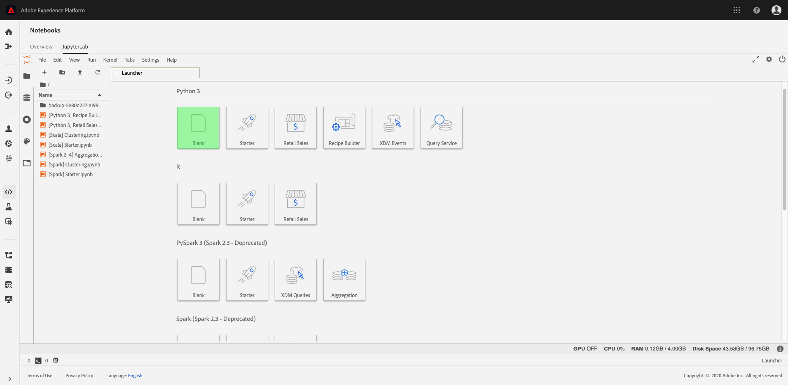
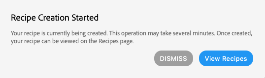

# Utbilda en modell för maskininlärning i realtid

>[!IMPORTANT]
>Maskininlärning i realtid är inte tillgängligt för alla användare ännu. Den här funktionen är alfabet och testas fortfarande. Dokumentet kan komma att ändras.

Det här dokumentet innehåller en självstudiekurs för att överföra en ONNX-modell till Machine Learning-modellagringsplatsen i realtid.

Med något av följande alternativ skriver du python-kod för att läsa, förbearbeta och analysera data. Därefter måste du utbilda din egen ML-modell, serialisera den i ONNX-format och slutligen överföra den till Machine Learning-modellagringsplatsen i realtid. Dessutom får du i slutet av självstudiekursen ett modell-ID som identifierar den tränade modellen för användning i [självstudiekursen](./scoring-ml-model.md).

* [Utbilda en modell med en Python-anteckningsbok](#training-model-python-notebook)
* [Utbilda en modell med din egen ONNX-modell](#train-using-own-onnx-model)
* [Utbilda en modell med mallen för receptframtagning](#train-using-recipe-builder)
* [Utbilda en modell med arbetsflödet för recept på datavetenskap](#recipe-workflow-train-model)


## Tåla en modell med en Python-anteckningsbok {#training-model-python-notebook}

I användargränssnittet för Adobe Experience Platform väljer du **[!UICONTROL Notebooks]** inom *datavetenskap*. Välj sedan **[!UICONTROL JupyterLab]** och tillåt lite tid för att läsa in miljön.


Börja med att välja den **tomma bärbara Python 3-datorn** inifrån JupyterLab-startprogrammet.



### Åtkomstdata {#access-data}

Välj sedan den datauppsättning som du vill använda. Om du vill få åtkomst till en datauppsättning i JupyterLab-anteckningsboken väljer du fliken **Data** till vänster i JupyterLab. Katalogerna *Dataset* och *Scheman* visas. Markera **[!UICONTROL Datasets]** och högerklicka och välj sedan det **[!UICONTROL Explore Data in Notebook]** alternativ på den nedrullningsbara menyn som finns i den datauppsättning som du vill använda. En körbar kodpost visas i anteckningsboken.


### Förbered din modell

Använd följande mall för att analysera, förbearbeta, utbilda och utvärdera din ML-modell. Använd skärmbilderna nedan om du vill se ett fullständigt exempel:

```python
from sklearn import svm, metrics
from sklearn.model_selection import train_test_split


data = df[input_columns]
target = df[target_column]
# Create a classifier: a support vector classifier
classifier = svm.SVC(gamma=0.001)

# Split data into train and test subsets
X_train, X_test, y_train, y_test = train_test_split(
    data, target, test_size=0.5, shuffle=False)

# We train the classifier
classifier.fit(X_train, y_train)

# Now do predictions
predicted = classifier.predict(X_test)


print("Classification report for classifier %s:\n%s\n"
      % (classifier, metrics.classification_report(y_test, predicted)))
disp = metrics.plot_confusion_matrix(classifier, X_test, y_test)
disp.figure_.suptitle("Confusion Matrix")
print("Confusion matrix:\n%s" % disp.confusion_matrix)
```

>[!NOTE]
>I exemplet nedan används biblioteket för att lära sig metoder i stället för att data från en inkapslad Adobe Experience Platform-datauppsättning läses in.

scikit-

**Utdata**


### Överför din modell

När du har slutfört föregående steg måste du serialisera modellen till ett ONNX-format och överföra den till Machine Learning-butiken i realtid. Detta returnerar det `model_id` som används i [nästa självstudiekurs](#next-steps).

Använd följande mall för att konvertera till ONNX och överföra datauppsättningen:

```python
from rtml_nodelibs.nodes.standard.ml.artifact_utils
import ModelUpload
from rtml_nodelibs.core.nodefactory
import NodeFactory as nf
from skl2onnx.common.data_types
import FloatTensorType
from skl2onnx
import convert_sklearn

########## Save sklearn model in ONNX format at model_path ##########
inputs = [('features', FloatTensorType([None, X_train.shape[1]]))]
model_onnx = convert_sklearn(classifier, 'ScikitLearnModel', inputs)

model_path = "model.onnx"
os.environ["ONNX_MODEL_PATH"] = model_path

with open(model_path, "wb") as f:
  f.write(model_onnx.SerializeToString())

  ########## Upload the model from model_path to RTML model store ##########
  model = ModelUpload(params = {
    'model_path': model_path
  })

msg_model = model.process(None, 1)

model_id = msg_model.model['model_id']

print("Model ID : ", model_id)
```

**Svar**


När du har fått ditt meddelande `model_id`kopierar du det och fortsätter till [nästa steg](#next-steps).


## Utbilda en modell med din egen ONNX-modell {#train-using-own-onnx-model}

I användargränssnittet för Adobe Experience Platform väljer du **[!UICONTROL Notebooks]** inom *datavetenskap*. Välj sedan **[!UICONTROL JupyterLab]** och tillåt lite tid för att läsa in miljön.


Använd knappen för överföring i JupyterLab-anteckningsböcker för att överföra ONNX-modellen till anteckningsboksmiljön för Data Science Workspace.


Skapa sedan en ny tom anteckningsbok genom att välja den tomma anteckningsboksikonen under Python 3 i JupyterLab-startprogrammet.


I den tomma anteckningsboken kopierar och klistrar du in följande:

>[!NOTE]
> Var noga med att ange koden `model_path` för ONNX-modellen som du överförde.

```python
from rtml_nodelibs.nodes.standard.ml.artifact_utils import ModelUpload
from rtml_nodelibs.core.nodefactory import NodeFactory as nf
 
model_path = <path/to/onnx_model>
########## Upload the model from model_path to RTML model store ##########
model = ModelUpload(params={'model_path': model_path})
 
msg_model = model.process(None, 1)
 
model_id = msg_model.model['model_id']
 
print("Model ID : ", model_id)
```

När du har kört cellen ovan `model_id` returneras en. Kopiera det modell-ID som ska användas i [nästa självstudiekurs](#next-steps).

## Utbilda en modell med en fördefinierad receptmall {#train-using-recipe-builder}

I användargränssnittet för Adobe Experience Platform väljer du **[!UICONTROL Notebooks]** inom *datavetenskap*. Välj sedan **[!UICONTROL JupyterLab]** och tillåt lite tid för att läsa in miljön.


Följ sedan [självstudiekursen för att skapa ett recept med Jupyter-anteckningsböcker](../jupyterlab/create-a-recipe.md) . När du är klar måste du ändra filen pipeline.py för realtidstolkning för att kunna arbeta.

>[!NOTE]
>Mallen som tillhandahålls av Data Science Workspace måste ändras för att passa datauppsättningen.

Se till att du sparar modellen i ONNX-format och anger systemvariabeln till `ONNX_MODEL_PATH`. I exemplet nedan visas hur du ändrar pipelinefilen med mallen recept-builder.

```python
def train(configProperties, data):

  print("Train Start")

########## Extract fields from configProperties ##########
learning_rate = float(configProperties['learning_rate'])
n_estimators = int(configProperties['n_estimators'])
max_depth = int(configProperties['max_depth'])

########## Fit model ##########
X_train = data.drop('weeklySalesAhead', axis = 1).values
y_train = data['weeklySalesAhead'].values

seed = 1234
model = GradientBoostingRegressor(learning_rate = learning_rate,
  n_estimators = n_estimators,
  max_depth = max_depth,
  random_state = seed)

model.fit(X_train, y_train)

########## Save sklearn model in ONNX format at model_path ##########
inputs = [('features', FloatTensorType([None, X_train.shape[1]]))]
model_onnx = convert_sklearn(model, 'ScikitLearnModel', inputs)

model_path = "retail_sales_model.onnx"
os.environ["ONNX_MODEL_PATH"] = model_path

with open(model_path, "wb") as f:
  f.write(model_onnx.SerializeToString())

print("Train Complete")

return model
```

När du har ändrat filen pipeline.py kör **[!UICONTROL Training]** och **[!UICONTROL Scoring]**. När du är klar väljer du **[!UICONTROL Create Recipe]** knappen.


En namngivningsdialogruta visas. Ange namnet på ditt recept och välj **[!UICONTROL OK]**. En ny dialogruta visas med ett meddelande om att receptet har börjat skapas. Ge receptet lite tid att skapa.




När du har skapat ett recept kan du visa det genom att välja **[!UICONTROL View Recipes]** i den dialogruta som visas eller genom att navigera till **[!UICONTROL Models]** och sedan välja **[!UICONTROL Recipes]** i navigeringen längst upp till vänster. En lista över recept sorterade efter skapandedatum visas. Bekräfta att ditt nya recept är högst upp.


Välj recept. Sidan med recept-översikt visas. Välj i den övre högra navigeringen **[!UICONTROL Create Model]**.


Välj sedan en lämplig datauppsättning. Klicka sedan **[!UICONTROL Next]** i den övre högra navigeringen.


Konfigurationssidan öppnas. Ange ett namn för modellen och granska standardmodellkonfigurationerna. Standardkonfigurationer används när recepten skapas. Granska och ändra konfigurationsvärdena genom att dubbelklicka på värdena. Om du vill skapa en ny uppsättning konfigurationer klickar du på **[!UICONTROL Upload New Config]** och drar en JSON-fil som innehåller modellkonfigurationer till webbläsarfönstret. Välj **[!UICONTROL Finish]** för att skapa modellen.


När modellen är klar måste du vänta tills kursen är klar. När du är klar med en utbildning kan du välja den för att se informationen.

Välj en utbildningskurs. När du har valt det här alternativet visas en egenskapsdialogruta till höger. I den här dialogrutan väljer du **[!UICONTROL View Activity Logs]**.


Dialogrutan *Visa aktivitetsloggar* visas. Välj URL för *stderloggarna* för att hämta loggarna och se information om körningen.


Loggar är särskilt användbara för misslyckade körningar för att se vad som gick fel. Men i det här fallet söker du efter den `model-id` som motsvarar ONNX-modellen du gjorde. Kopiera modell-ID.

>[!NOTE]
>Du behöver inte köra ett poängjobb. Skalning av maskininlärningskanter i realtid beskrivs i [nästa steg](#next-steps).


## Utbilda en modell med arbetsflödet för recept på datavetenskap {#recipe-workflow-train-model}

Det här är den bästa metoden om du känner till Docker-, Git- och paketeringskod för Python. Med arbetsflödet Data Science Workspace får du större flexibilitet och frihet att skapa recept. Du kan dra igång en basskuggningsbild och bygga en egen dockningsmiljö, felsöka ditt recept enklare, klona färdiga recept som kan spelas upp med en Data Science Workspace-tjänst, schemalägga recepten och mycket mer.

### Skapa ett schema

Det första steget kräver att du har ett dataschema för datauppsättningen. Ett schema kan skapas via Adobe Experience Platform-gränssnittet eller API:erna för plattformen.

>[!NOTE]
>Om du redan har de data som du vill använda insamlade i Adobe Experience Platform går du vidare och [skapar ett Python-recept](#create-a-python-recipe).

* [Skapa ett schema med hjälp av självstudiekursen för schemaredigeraren](../../xdm/tutorials/create-schema-ui.md)
* [Skapa ett schema med API-självstudiekursen för schemaredigeraren](../../xdm/tutorials/create-schema-api.md)

### Infoga era data

Därefter måste du importera data med det schema som du nyss skapade. Detta kan du göra med API:t eller plattformsgränssnittet.

>[!NOTE]
>Om du redan har de data som du vill använda insamlade i Adobe Experience Platform går du vidare och [skapar ett Python-recept](#create-a-python-recipe).

* [Infoga data i användargränssnittet för Adobe Experience Platform](../../ingestion/tutorials/ingest-batch-data.md)
* [Infoga data i Adobe Experience Platform API, genomgång](../../ingestion/batch-ingestion/api-overview.md)

### Skapa ett Python-recept {#create-a-python-recipe}

Recipe-skapandet börjar med att paketera källfiler för att skapa en arkivfil. Källfiler definierar den maskininlärningslogik och de algoritmer som används för att lösa ett specifikt problem. Använd följande självstudiekurs för att skapa en Python Docker-bild.

* [Paketera källfiler i ett recept](../models-recipes/package-source-files-recipe.md)

För att slutföra nästa steg måste du ha en dockningsbild i ett Azure-behållarregister tillsammans med motsvarande bild-URL. Välj en av självstudielänkarna nedan för att slutföra skapandet av ett Python-recept:

* [Importera en paketerad mottagare i användargränssnittet](../models-recipes/import-packaged-recipe-ui.md)
* [Importera en paketerad mottagare med API:t](../models-recipes/import-packaged-recipe-api.md)

### Skapa en utbildningskurs

I Adobe Experience Platform Data Science Workspace skapas en maskininlärningsmodell genom att en befintlig Recipe som är lämplig för modellens avsikt läggs till. Modellen är sedan utbildad och utvärderad för att optimera dess driftseffektivitet och effektivitet genom att finjustera de tillhörande hyperparametrarna.

* [Utbilda och utvärdera en modell i användargränssnittet](../models-recipes/train-evaluate-model-ui.md)
* [Utbilda och utvärdera en modell i API:t](../models-recipes/train-evaluate-model-api.md)

>[!IMPORTANT]
>I filen pipeline.py för ditt recept sparar du modellen i ONNX-format i `model_path` och anger systemvariabeln till `ONNX_MODEL_PATH`. Körningen söker efter den här specifika miljövariabeln.

```python
def train(configProperties, data):
 
    print("Train Start")
 
    ########## Extract fields from configProperties ##########

    learning_rate = float(configProperties['learning_rate'])
    n_estimators = int(configProperties['n_estimators'])
    max_depth = int(configProperties['max_depth'])
 
 
    
    ########## Fit model ##########
    
    X_train = data.drop('weeklySalesAhead', axis=1).values
    y_train = data['weeklySalesAhead'].values
 
    seed = 1234
    model = GradientBoostingRegressor(learning_rate=learning_rate,
                                      n_estimators=n_estimators,
                                      max_depth=max_depth,
                                      random_state=seed)
 
    model.fit(X_train, y_train)
     
    ########## Save sklearn model in ONNX format at model_path ##########
    inputs = [('features', FloatTensorType([None, X_train.shape[1]]))]
    model_onnx = convert_sklearn(model, 'ScikitLearnModel', inputs)
 
    model_path = "retail_sales_model.onnx"
    os.environ["ONNX_MODEL_PATH"] = model_path
 
    with open(model_path, "wb") as f:
        f.write(model_onnx.SerializeToString())
 
    print("Train Complete")
 
    return model
```

När modellen är klar måste du vänta tills kursen är klar. När du är klar med en utbildning kan du välja den för att se informationen. Välj en utbildningskurs. När du har valt en egenskapsdialogruta till höger väljer du **[!UICONTROL View Activity Logs]**.


Dialogrutan *Visa aktivitetsloggar* visas. Välj URL för *stderloggarna* för att hämta loggarna och se information om körningen.


Loggar är särskilt användbara för misslyckade körningar för att se vad som gick fel. Men i det här fallet söker du efter den `model-id` som motsvarar ONNX-modellen du gjorde. Kopiera modell-ID.


Du behöver inte köra ett poängjobb i recept. Skalning av maskininlärningskanter i realtid beskrivs i [nästa självstudiekurs](#next-steps).

## Nästa steg {#next-steps}

Genom att följa en av självstudiekurserna ovan har du fått utbildning i och överfört en ONNX-modell till maskininlärningsmodellagringsplatsen i realtid och har en `model_id` som identifierar din modell. Fortsätt till nästa självstudiekurs för att lära dig hur du kan [använda din maskininlärningsmodell](./scoring-ml-model.md)i realtid.