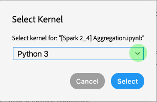
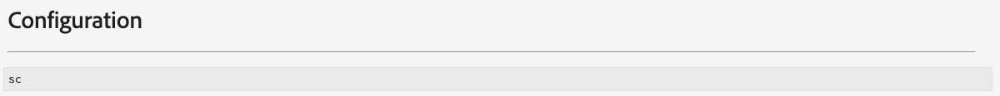
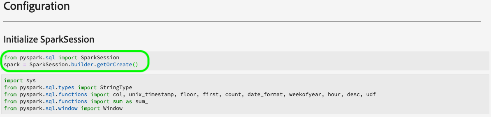
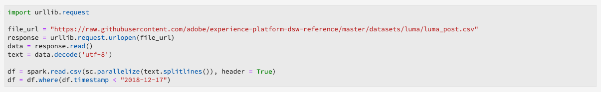
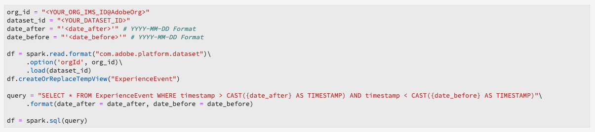
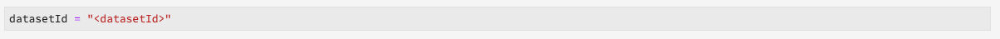
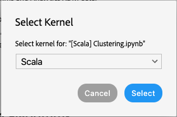
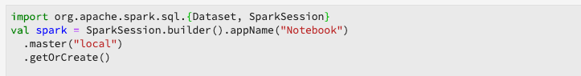
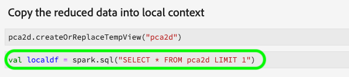

# Migreringsguider för mottagare och anteckningsböcker

>[!NOTE]
>Bärbara datorer och recept som använder [!DNL Python]/R påverkas inte. Migreringen gäller endast PySpark/[!DNL Spark] (2.3)-recept och anteckningsböcker.

Följande guider beskriver stegen och informationen som krävs för att migrera befintliga recept och anteckningsböcker.

- [Guider för mottagningsmigrering](#recipe-migration)
- [Migreringsguider för bärbara datorer](#notebook-migration)

## Guider för mottagningsmigrering {#recipe-migration}

Senaste ändringar som [!DNL Data Science Workspace] kräver att befintliga [!DNL Spark] och PySpark-recept uppdateras. Använd följande arbetsflöden för att underlätta övergången av dina recept.

- [Guide för Spark-migrering](#spark-migration-guide)
   - [Ändra hur du läser och skriver datauppsättningar](#read-write-recipe-spark)
   - [Hämta exempelreceptet](#download-sample-spark)
   - [Lägg till Docker-filen](#add-dockerfile-spark)
   - [Kontrollera beroenden](#change-dependencies-spark)
   - [Förbered dokumentationsskript](#prepare-docker-spark)
   - [skapa recept med Docker](#create-recipe-spark)
- [Migreringsguide för PySpark](#pyspark-migration-guide)
   - [Ändra hur du läser och skriver datauppsättningar](#pyspark-read-write)
   - [Hämta exempelreceptet](#pyspark-download-sample)
   - [Lägg till Docker-filen](#pyspark-add-dockerfile)
   - [Förbered dokumentationsskript](#pyspark-prepare-docker)
   - [skapa recept med Docker](#pyspark-create-recipe)

## [!DNL Spark] migreringsguide {#spark-migration-guide}

Mottagartefakten som genereras av byggstegen är nu en Docker-bild som innehåller den binära .jar-filen. Dessutom har syntaxen som används för att läsa och skriva datauppsättningar med [!DNL Platform] SDK ändrats och kräver att du ändrar din receptkod.

Följande video är utformad för att ytterligare underlätta förståelsen av de ändringar som krävs för [!DNL Spark] recept:

>[!VIDEO](https://video.tv.adobe.com/v/33243)

### Läsa och skriva datauppsättningar ([!DNL Spark]) {#read-write-recipe-spark}

Innan du skapar Docker-bilden ska du läsa exemplen för att läsa och skriva datauppsättningar i [!DNL Platform] SDK:n som finns i avsnitten nedan. Om du konverterar befintliga recept måste din [!DNL Platform] SDK-kod uppdateras.

#### Läs en datauppsättning

I det här avsnittet beskrivs de ändringar som behövs för att läsa en datauppsättning och i exemplet [helper.scala](https://github.com/adobe/experience-platform-dsw-reference/blob/master/recipes/scala/src/main/scala/com/adobe/platform/ml/helper/Helper.scala) , som tillhandahålls av Adobe, används.

**Gammalt sätt att läsa en datauppsättning**

```scala
 var df = sparkSession.read.format("com.adobe.platform.dataset")
    .option(DataSetOptions.orgId, orgId)
    .option(DataSetOptions.serviceToken, serviceToken)
    .option(DataSetOptions.userToken, userToken)
    .option(DataSetOptions.serviceApiKey, apiKey)
    .load(dataSetId)
```

**Nytt sätt att läsa en datauppsättning**

Med uppdateringarna av [!DNL Spark] recept måste ett antal värden läggas till och ändras. För det första används `DataSetOptions` inte längre. Ersätt `DataSetOptions` med `QSOption`. Dessutom krävs nya `option` parametrar. Både `QSOption.mode` och `QSOption.datasetId` behövs. Slutligen `orgId` och `serviceApiKey` måste ändras till `imsOrg` och `apiKey`. I följande exempel finns en jämförelse om hur du läser datauppsättningar:

```scala
import com.adobe.platform.query.QSOption
var df = sparkSession.read.format("com.adobe.platform.query")
  .option(QSOption.userToken", {userToken})
  .option(QSOption.serviceToken, {serviceToken})
  .option(QSOption.imsOrg, {orgId})
  .option(QSOption.apiKey, {apiKey})
  .option(QSOption.mode, "interactive")
  .option(QSOption.datasetId, {dataSetId})
  .load()
```

>[!TIP]
> Interaktivt läge ger timeout om frågor körs längre än 10 minuter. Om du vill importera mer än ett fåtal gigabyte bör du växla till gruppläge. Batchläget tar längre tid att starta men kan hantera större datauppsättningar.

#### Skriv till en datauppsättning

I det här avsnittet beskrivs de ändringar som behövs för att skriva en datauppsättning med hjälp av [exemplet ScoringDataSaver.scala](https://github.com/adobe/experience-platform-dsw-reference/blob/master/recipes/scala/src/main/scala/com/adobe/platform/ml/ScoringDataSaver.scala) , som tillhandahålls av Adobe.

**Gammalt sätt att skriva en datauppsättning**

```scala
df.write.format("com.adobe.platform.dataset")
    .option(DataSetOptions.orgId, orgId)
    .option(DataSetOptions.serviceToken, serviceToken)
    .option(DataSetOptions.userToken, userToken)
    .option(DataSetOptions.serviceApiKey, apiKey)
    .save(scoringResultsDataSetId)
```

**Nytt sätt att skriva en datauppsättning**

Med uppdateringarna av [!DNL Spark] recept måste ett antal värden läggas till och ändras. För det första används `DataSetOptions` inte längre. Ersätt `DataSetOptions` med `QSOption`. Dessutom krävs nya `option` parametrar. `QSOption.datasetId` behövs och ersätter behovet av att läsa in `{dataSetId}` i `.save()`. Slutligen `orgId` och `serviceApiKey` måste ändras till `imsOrg` och `apiKey`. Se följande exempel för en jämförelse om hur du skriver datauppsättningar:

```scala
import com.adobe.platform.query.QSOption
df.write.format("com.adobe.platform.query")
  .option(QSOption.userToken", {userToken})
  .option(QSOption.serviceToken, {serviceToken})
  .option(QSOption.imsOrg, {orgId})
  .option(QSOption.apiKey, {apiKey})
  .option(QSOption.datasetId, {dataSetId})
  .save()
```

### Paketera Docker-baserade källfiler ([!DNL Spark]) {#package-docker-spark}

Börja med att navigera till katalogen där receptet finns.

I följande avsnitt används det nya Scala Retail Sales-receptet som finns i [Data Science Workspace Public Github-databasen](https://github.com/adobe/experience-platform-dsw-reference).

### Hämta exempelrecept ([!DNL Spark]) {#download-sample-spark}

Exempelreceptet innehåller filer som behöver kopieras till ditt befintliga recept. Om du vill klona den offentliga Github som innehåller alla exempelrecept anger du följande i terminalen:

```BASH
git clone https://github.com/adobe/experience-platform-dsw-reference.git
```

Scala-receptet finns i följande katalog `experience-platform-dsw-reference/recipes/scala/retail`.

### Lägg till Dockerfile ([!DNL Spark]) {#add-dockerfile-spark}

En ny fil behövs i receptmappen för att det dockningsbaserade arbetsflödet ska kunna användas. Kopiera och klistra in Dockerfile från mappen recept som finns på `experience-platform-dsw-reference/recipes/scala/Dockerfile`. Du kan också kopiera och klistra in koden nedan i en ny fil med namnet `Dockerfile`.

>[!IMPORTANT]
> Beskrivningsfilen som visas nedan `ml-retail-sample-spark-*-jar-with-dependencies.jar` ska ersättas med namnet på mottagarens jar-fil.

```scala
FROM adobe/acp-dsw-ml-runtime-spark:0.0.1

COPY target/ml-retail-sample-spark-*-jar-with-dependencies.jar /application.jar
```

### Ändra beroenden ([!DNL Spark]) {#change-dependencies-spark}

Om du använder ett befintligt recept krävs ändringar för beroenden i filen pom.xml. Ändra beroende version av model-authoring-sdk till 2.0.0. Uppdatera sedan [!DNL Spark] versionen i PDF-filen till 2.4.3 och Scala till 2.11.12.

```json
<groupId>com.adobe.platform.ml</groupId>
<artifactId>authoring-sdk_2.11</artifactId>
<version>2.0.0</version>
<classifier>jar-with-dependencies</classifier>
```

### Förbered dina Docker-skript ([!DNL Spark]) {#prepare-docker-spark}

[!DNL Spark] I recept används inte längre binära artefakter, utan en Docker-bild måste skapas. Om du inte har gjort det [hämtar och installerar du Docker](https://www.docker.com/products/docker-desktop).

I det medföljande exemplet på Scala finns skripten `login.sh` och `build.sh` finns på `experience-platform-dsw-reference/recipes/scala/` . Kopiera och klistra in dessa filer i det befintliga receptet.

Mappstrukturen bör nu se ut ungefär som i följande exempel (nyligen tillagda filer markeras):


Nästa steg är att följa [paketets källfiler i en recept](./models-recipes/package-source-files-recipe.md) -självstudiekurs. I den här självstudiekursen finns ett avsnitt som beskriver hur du skapar en dockningsbild för ett Scala-recept (Spark). När du är klar får du tillgång till dockningsavbildningen i ett Azure-behållarregister tillsammans med motsvarande bild-URL.

### Skapa ett recept ([!DNL Spark]) {#create-recipe-spark}

För att kunna skapa ett recept måste du först slutföra självstudiekursen för [paketkällfiler](./models-recipes/package-source-files-recipe.md) och ha din webblänk för dcker-bilder klar. Du kan skapa ett recept med gränssnittet eller API:t.

Följ självstudiekursen [Importera ett paketerat recept (UI)](./models-recipes/import-packaged-recipe-ui.md) för Scala när du vill skapa ett recept med hjälp av användargränssnittet.

Följ självstudiekursen [Importera ett paketerat recept (API)](./models-recipes/import-packaged-recipe-api.md) för Scala när du vill skapa ett recept med API.

## Migreringsguide för PySpark {#pyspark-migration-guide}

Mottagartefakten som genereras av byggstegen är nu en Docker-bild som innehåller din .egg-binära fil. Dessutom har syntaxen som används för att läsa och skriva datauppsättningar med [!DNL Platform] SDK ändrats och kräver att du ändrar din receptkod.

Följande video är utformad för att ytterligare underlätta förståelsen av de ändringar som krävs för PySpark-recept:

>[!VIDEO](https://video.tv.adobe.com/v/33048?learn=on&quality=12)

### Läsa och skriva datauppsättningar (PySpark) {#pyspark-read-write}

Innan du skapar Docker-bilden ska du läsa exemplen för att läsa och skriva datauppsättningar i [!DNL Platform] SDK:n som finns i avsnitten nedan. Om du konverterar befintliga recept måste din [!DNL Platform] SDK-kod uppdateras.

#### Läs en datauppsättning

I det här avsnittet beskrivs de ändringar som behövs för att läsa en datauppsättning med hjälp av [help.py](https://github.com/adobe/experience-platform-dsw-reference/blob/master/recipes/pyspark/pysparkretailapp/helper.py) -exemplet som tillhandahålls av Adobe.

**Gammalt sätt att läsa en datauppsättning**

```python
dataset_options = get_dataset_options(spark.sparkContext)
pd = spark.read.format("com.adobe.platform.dataset") 
  .option(dataset_options.serviceToken(), service_token) 
  .option(dataset_options.userToken(), user_token) 
  .option(dataset_options.orgId(), org_id) 
  .option(dataset_options.serviceApiKey(), api_key)
  .load(dataset_id)
```

**Nytt sätt att läsa en datauppsättning**

Med uppdateringarna av [!DNL Spark] recept måste ett antal värden läggas till och ändras. För det första används `DataSetOptions` inte längre. Ersätt `DataSetOptions` med `qs_option`. Dessutom krävs nya `option` parametrar. Både `qs_option.mode` och `qs_option.datasetId` behövs. Slutligen `orgId` och `serviceApiKey` måste ändras till `imsOrg` och `apiKey`. I följande exempel finns en jämförelse om hur du läser datauppsättningar:

```python
qs_option = spark_context._jvm.com.adobe.platform.query.QSOption
pd = sparkSession.read.format("com.adobe.platform.query") 
  .option(qs_option.userToken, {userToken}) 
  .option(qs_option.serviceToken, {serviceToken}) 
  .option(qs_option.imsOrg, {orgId}) 
  .option(qs_option.apiKey, {apiKey}) 
  .option(qs_option.mode, "interactive") 
  .option(qs_option.datasetId, {dataSetId}) 
  .load()
```

>[!TIP]
> Interaktivt läge ger timeout om frågor körs längre än 10 minuter. Om du vill importera mer än ett fåtal gigabyte bör du växla till gruppläge. Batchläget tar längre tid att starta men kan hantera större datauppsättningar.

#### Skriv till en datauppsättning

I det här avsnittet beskrivs de ändringar som behövs för att skriva en datauppsättning med hjälp av [exemplet data_saver.py](https://github.com/adobe/experience-platform-dsw-reference/blob/master/recipes/pyspark/pysparkretailapp/data_saver.py) , som tillhandahålls av Adobe.

**Gammalt sätt att skriva en datauppsättning**

```python
df.write.format("com.adobe.platform.dataset")
  .option(DataSetOptions.orgId, orgId)
  .option(DataSetOptions.serviceToken, serviceToken)
  .option(DataSetOptions.userToken, userToken)
  .option(DataSetOptions.serviceApiKey, apiKey)
  .save(scoringResultsDataSetId)
```

**Nytt sätt att skriva en datauppsättning**

Med uppdateringarna av PySpark-recept måste ett antal värden läggas till och ändras. För det första används `DataSetOptions` inte längre. Ersätt `DataSetOptions` med `qs_option`. Dessutom krävs nya `option` parametrar.  `qs_option.datasetId` behövs och ersätter behovet av att läsa in `{dataSetId}` i `.save()` . Slutligen `orgId` och `serviceApiKey` måste ändras till `imsOrg` och `apiKey`. I följande exempel finns en jämförelse om hur du läser datauppsättningar:

```python
qs_option = spark_context._jvm.com.adobe.platform.query.QSOption
scored_df.write.format("com.adobe.platform.query") 
  .option(qs_option.userToken, {userToken}) 
  .option(qs_option.serviceToken, {serviceToken}) 
  .option(qs_option.imsOrg, {orgId}) 
  .option(qs_option.apiKey, {apiKey}) 
  .option(qs_option.datasetId, {dataSetId}) 
  .save()
```

### Paketera Docker-baserade källfiler (PySpark) {#pyspark-package-docker}

Börja med att navigera till katalogen där receptet finns.

I det här exemplet används det nya PySpark Retail Sales-receptet och finns i [Data Science Workspace Public Github-databasen](https://github.com/adobe/experience-platform-dsw-reference).

### Hämta exempelreceptet (PySpark) {#pyspark-download-sample}

Exempelreceptet innehåller filer som behöver kopieras till ditt befintliga recept. Om du vill klona den offentliga [!DNL Github] som innehåller alla exempelrecept anger du följande i terminalen.

```BASH
git clone https://github.com/adobe/experience-platform-dsw-reference.git
```

PySpark-receptet finns i följande katalog `experience-platform-dsw-reference/recipes/pyspark`.

### Lägg till Dockerfile (PySpark) {#pyspark-add-dockerfile}

En ny fil behövs i receptmappen för att det dockningsbaserade arbetsflödet ska kunna användas. Kopiera och klistra in Dockerfile från mappen recept som finns på `experience-platform-dsw-reference/recipes/pyspark/Dockerfile`. Du kan också kopiera och klistra in koden nedan och skapa en ny fil med namnet `Dockerfile`.

>[!IMPORTANT]
> Den exempeläggfil som visas nedan `pysparkretailapp-*.egg` bör ersättas med namnet på mottagarens äggfil.

```scala
FROM adobe/acp-dsw-ml-runtime-pyspark:0.0.1
RUN mkdir /recipe

COPY . /recipe

RUN cd /recipe && \
    ${PYTHON} setup.py clean install && \
    rm -rf /recipe

RUN cp /databricks/conda/envs/${DEFAULT_DATABRICKS_ROOT_CONDA_ENV}/lib/python3.6/site-packages/pysparkretailapp-*.egg /application.egg
```

### Förbered Docker-skript (PySpark) {#pyspark-prepare-docker}

PySpark-recept använder inte längre binära artefakter, utan kräver i stället att en Docker-bild skapas. Om du inte har gjort det hämtar och installerar du [Docker](https://www.docker.com/products/docker-desktop).

I det medföljande exempelreceptet för PySpark finns skripten `login.sh` och `build.sh` på `experience-platform-dsw-reference/recipes/pyspark` . Kopiera och klistra in dessa filer i det befintliga receptet.

Mappstrukturen bör nu se ut ungefär som i följande exempel (nyligen tillagda filer markeras):


Ditt recept är nu klart att byggas med en Docker-bild. Nästa steg är att följa [paketets källfiler i en recept](./models-recipes/package-source-files-recipe.md) -självstudiekurs. I den här självstudien finns ett avsnitt som beskriver hur du skapar en dockningsbild för ett PySpark-recept (Spark 2.4). När du är klar får du tillgång till dockningsavbildningen i ett Azure-behållarregister tillsammans med motsvarande bild-URL.

### Skapa ett recept (PySpark) {#pyspark-create-recipe}

För att kunna skapa ett recept måste du först slutföra självstudiekursen för [paketkällfiler](./models-recipes/package-source-files-recipe.md) och ha din webblänk för dcker-bilder klar. Du kan skapa ett recept med gränssnittet eller API:t.

Följ självstudiekursen [Importera ett paketerat recept (UI)](./models-recipes/import-packaged-recipe-ui.md) för PySpark för att skapa ett recept med hjälp av användargränssnittet.

Följ självstudiekursen [Importera ett paketerat recept (API)](./models-recipes/import-packaged-recipe-api.md) för PySpark för att skapa ett recept med API.

## Migreringsguider för bärbara datorer {#notebook-migration}

De senaste ändringarna av [!DNL JupyterLab] bärbara datorer kräver att du uppdaterar dina befintliga bärbara PySpark- och [!DNL Spark] 2.3-datorer till 2.4. Den här ändringen [!DNL JupyterLab Launcher] har uppdaterats med nya startanteckningsböcker. Om du vill få en stegvis guide om hur du konverterar anteckningsböcker väljer du en av följande guider:

- [Migreringsguide för PySpark 2.3 till 2.4](#pyspark-notebook-migration)
- [Flyttningsguide för Spark 2.3 till Spark 2.4 (Scala)](#spark-notebook-migration)

Följande video är utformad för att ytterligare underlätta förståelsen av de ändringar som krävs för [!DNL JupyterLab Notebooks]:

>[!VIDEO](https://video.tv.adobe.com/v/33444?quality=12&learn=on)

## Guide för migrering av bärbara datorer från PySpark 2.3 till 2.4 {#pyspark-notebook-migration}

I och med introduktionen av PySpark 2.4 till [!DNL JupyterLab Notebooks]använder nya [!DNL Python] bärbara datorer med PySpark 2.4 nu [!DNL Python] 3-kärnan i stället för PySpark 3-kärnan. Detta innebär att befintlig kod som körs på PySpark 2.3 inte stöds i PySpark 2.4.

>[!IMPORTANT]
>
>PySpark 2.3 är föråldrad och inställd på att tas bort i en senare version. Alla befintliga exempel ska ersättas med PySpark 2.4-exempel.

Om du vill konvertera dina befintliga bärbara PySpark 3 ([!DNL Spark] 2.3)-datorer till [!DNL Spark] 2.4 följer du de exempel som beskrivs nedan:

### Kernel

PySpark 3 ([!DNL Spark] 2.4) bärbara datorer använder Python 3 Kernel i stället för den borttagna PySpark-kernel som används i PySpark 3 (Spark 2.3 - utgått) bärbara datorer.

Om du vill bekräfta eller ändra kerneln i [!DNL JupyterLab] användargränssnittet markerar du kernelknappen som finns i det övre högra navigeringsfältet i anteckningsboken. Om du använder en av de fördefinierade bärbara startdatorerna är kärnan förvald. I exemplet nedan används startprogrammet för den bärbara datorn PySpark 3 ([!DNL Spark] 2.4) *Aggregation* .


När du väljer listrutan öppnas en lista med tillgängliga kärnor.




För bärbara datorer med PySpark 3 ([!DNL Spark] 2.4) väljer du Python 3-kärnan och bekräftar genom att klicka på **Välj** .


## Initierar sparkSession

Alla [!DNL Spark] 2.4 anteckningsböcker kräver att du initierar sessionen med den nya mallkoden.

<table>
  <th>Anteckningsbok</th>
  <th>PySpark 3 ([!DNL Spark] 2.3 - borttagen)</th>
  <th>PySpark 3 ([!DNL Spark] 2.4)</th>
  <tr>
  <th>Kernel</th>
  <td align="center">PySpark 3</td>
  <td align="center">Python 3</td>
  </tr>
  <tr>
  <th>Code</th>
  <td>
  <pre class="JSON language-JSON hljs">
  [!DNL spark]
</pre>
  </td>
  <td>
  <pre class="JSON language-JSON hljs">
från pyspark.sql importera SparkSessionSpark = SparkSession.builder.getOrCreate()
</pre>
  </td>
  </tr>
</table>

Följande bilder visar skillnaderna i konfiguration för PySpark 2.3 och PySpark 2.4. I det här exemplet används de *startanteckningsböcker för aggregering* som finns i [!DNL JupyterLab Launcher].

**Konfigurationsexempel för 2.3 (utgått)**



**Konfigurationsexempel för 2.4**



## Använder magi med %dataset {#magic}

I och med introduktionen av [!DNL Spark] 2.4 medföljer `%dataset` anpassad magi för användning i nya bärbara datorer med PySpark 3 ([!DNL Spark] 2.4) ([!DNL Python] 3 kernel).

**Användning**

`%dataset {action} --datasetId {id} --dataFrame {df}`

**Beskrivning**

Ett anpassat [!DNL Data Science Workspace] magiskt kommando för att läsa eller skriva en datauppsättning från en [!DNL Python] bärbar dator ([!DNL Python] 3 kernel).

- **{action}**: Den typ av åtgärd som ska utföras på datauppsättningen. Två åtgärder är tillgängliga,&quot;read&quot; eller&quot;write&quot;.
- **—datasetId {id}**: Används för att ange ID för datauppsättningen som ska läsas eller skrivas. Detta är ett obligatoriskt argument.
- **—dataFrame {df}**: Pandornas dataram. Detta är ett obligatoriskt argument.
   - När åtgärden är &quot;read&quot; är {df} variabeln där resultaten av datauppläsningsåtgärden är tillgängliga.
   - När åtgärden är&quot;write&quot;, skrivs den här dataramen {df} till datauppsättningen.
- **—mode (valfritt)**: Tillåtna parametrar är&quot;batch&quot; och&quot;interactive&quot;. Som standard är läget inställt på &quot;interaktiv&quot;. Vi rekommenderar att du använder gruppläge när du läser stora mängder data.

**Exempel**

- **Läs exempel**: `%dataset read --datasetId 5e68141134492718af974841 --dataFrame pd0`
- **Exempel** på skrivning: `%dataset write --datasetId 5e68141134492718af974842 --dataFrame pd0`

## Läsa in i en databildruta i LocalContext

I och med introduktionen av [!DNL Spark] 2.4 medföljer [`%dataset`](#magic) specialgjord magi. Följande exempel visar de viktigaste skillnaderna vid inläsning av dataramar i bärbara datorer med PySpark ([!DNL Spark] 2.3) och PySpark ([!DNL Spark] 2.4):

**Använda PySpark 3 ([!DNL Spark]2.3 - utgått) - PySpark 3 Kernel**

```python
dataset_options = sc._jvm.com.adobe.platform.dataset.DataSetOptions
pd0 = spark.read.format("com.adobe.platform.dataset")
  .option(dataset_options.orgId(), "310C6D375BA5248F0A494212@AdobeOrg")
  .load("5e68141134492718af974844")
```

**Använda PySpark 3 ([!DNL Spark]2.4) - Python 3 Kernel**

```python
%dataset read --datasetId 5e68141134492718af974844 --dataFrame pd0
```

| Element | Beskrivning |
| ------- | ----------- |
| pd0 | Namnet på pandas-dataframe-objektet som ska användas eller skapas. |
| [%dataset](#magic) | Skräddarsydd magi för dataåtkomst med [!DNL Python] tre kärnor. |

Följande bilder visar de viktigaste skillnaderna i inläsning av data för PySpark 2.3 och PySpark 2.4. I det här exemplet används de *startanteckningsböcker för aggregering* som finns i [!DNL JupyterLab Launcher].

**Läser in data i PySpark 2.3 (Luma dataset) - borttagen**



**Läsa in data i PySpark 2.4 (Luma dataset)**

Med PySpark 3 (Spark 2.4) `sc = spark.sparkContext` definieras inläsningen.


**Läser in[!DNL Experience Cloud Platform]data i PySpark 2.3 - borttagen**



**Läsa in[!DNL Experience Cloud Platform]data i PySpark 2.4**

Med PySpark 3 ([!DNL Spark] 2.4) behöver du inte längre definiera `org_id` och `dataset_id` inte längre. Dessutom `df = spark.read.format` har ersatts med en egen magi [`%dataset`](#magic) som underlättar läsning och skrivning av datauppsättningar.


| Element | description |
| ------- | ----------- |
| [%dataset](#magic) | Skräddarsydd magi för dataåtkomst med [!DNL Python] tre kärnor. |

>[!TIP]
>
>—mode kan anges till `interactive` eller `batch`. Standardvärdet för —mode är `interactive`. Du bör använda `batch` läget när du läser stora mängder data.

## Skapa en lokal dataram

Med PySpark 3 ([!DNL Spark] 2.4) stöds inte längre `%%` sparkmagic. Följande åtgärder kan inte längre användas:

- `%%help`
- `%%info`
- `%%cleanup`
- `%%delete`
- `%%configure`
- `%%local`

I följande tabell visas de ändringar som behövs för att konvertera `%%sql` sparkmagic-frågor:

<table>
  <th>Anteckningsbok</th>
  <th>PySpark 3 ([!DNL Spark] 2.3 - borttagen)</th>
  <th>PySpark 3 ([!DNL Spark] 2.4)</th>
  <tr>
  <th>Kernel</th>
  <td align="center">PySpark 3</td>
  <td align="center">[!DNL Python] 3</td>
  </tr>
  <tr>
  <th>Code</th>
      <td>
         <pre class="JSON language-JSON hljs">%%sql -o dfselect * från sparkdf
</pre>
         <pre class="JSON language-JSON hljs"> %%sql -o df -n limitselect * från sparkdf
</pre>
         <pre class="JSON language-JSON hljs">%%sql -o df -qselect * från sparkdf
</pre>
         <pre class="JSON language-JSON hljs"> %%sql -o df -r fractionvälj * från sparkdf
</pre>
      </td>
      <td>
         <pre class="JSON language-JSON hljs">
df = spark.sql('''' SELECT * FROM sparkdf'''')
</pre>
         <pre class="JSON language-JSON hljs">
df = spark.sql('''' SELECT * FROM sparkdf LIMIT limit''')
</pre>
         <pre class="JSON language-JSON hljs">
df = spark.sql('''' SELECT * FROM sparkdf LIMIT limit''')
</pre>
         <pre class="JSON language-JSON hljs">
sample_df = df.sample(fraction)
</pre>
      </td>
   </tr>
</table>

>[!TIP]
>
>Du kan också ange ett valfritt dirigeringsexempel, t.ex. ett booleskt värde med Ersättning, ett dubbelt bråk eller ett långt startvärde.

Följande bilder visar de viktigaste skillnaderna när det gäller att skapa en lokal dataram i PySpark 2.3 och PySpark 2.4. I det här exemplet används de *startanteckningsböcker för aggregering* som finns i [!DNL JupyterLab Launcher].

**Skapa lokal dataram PySpark 2.3 - inaktuell**


**Skapa lokal dataram PySpark 2.4**

Med PySpark 3 ([!DNL Spark] 2.4) stöds inte längre `%%sql` Sparkmagic och har ersatts med följande:


## Skriv till en datauppsättning

I och med introduktionen av [!DNL Spark] 2.4 medföljer [`%dataset`](#magic) anpassad magi som gör skrivandet av datauppsättningar renare. Om du vill skriva till en datauppsättning använder du följande [!DNL Spark] 2.4-exempel:

**Använda PySpark 3 ([!DNL Spark]2.3 - utgått) - PySpark 3 Kernel**

```python
userToken = spark.sparkContext.getConf().get("spark.yarn.appMasterEnv.USER_TOKEN")
serviceToken = spark.sparkContext.getConf().get("spark.yarn.appMasterEnv.SERVICE_TOKEN")
serviceApiKey = spark.sparkContext.getConf().get("spark.yarn.appMasterEnv.SERVICE_API_KEY")

dataset_options = sc._jvm.com.adobe.platform.dataset.DataSetOptions

pd0.write.format("com.adobe.platform.dataset")
  .option(dataset_options.orgId(), "310C6D375BA5248F0A494212@AdobeOrg")
  .option(dataset_options.userToken(), userToken)
  .option(dataset_options.serviceToken(), serviceToken)
  .option(dataset_options.serviceApiKey(), serviceApiKey)
  .save("5e68141134492718af974844")
```

**Använda PySpark 3 ([!DNL Spark]2.4) -[!DNL Python]3 Kernel**

```python
%dataset write --datasetId 5e68141134492718af974844 --dataFrame pd0
pd0.describe()
pd0.show(10, False)
```

| Element | description |
| ------- | ----------- |
| pd0 | Namnet på pandas-dataframe-objektet som ska användas eller skapas. |
| [%dataset](#magic) | Skräddarsydd magi för dataåtkomst med [!DNL Python] tre kärnor. |

>[!TIP]
>
>—mode kan anges till `interactive` eller `batch`. Standardvärdet för —mode är `interactive`. Du bör använda `batch` läget när du läser stora mängder data.

I följande bilder markeras de viktigaste skillnaderna när du skriver data tillbaka till [!DNL Platform] i PySpark 2.3 och PySpark 2.4. I det här exemplet används de *startanteckningsböcker för aggregering* som finns i [!DNL JupyterLab Launcher].

**Skriver tillbaka data till[!DNL Platform]PySpark 2.3 - borttagen**


**Skriva tillbaka data till[!DNL Platform]PySpark 2.4**

Med PySpark 3 ([!DNL Spark] 2.4) tar den `%dataset` anpassade magin bort behovet av att definiera värden som `userToken`, `serviceToken`, `serviceApiKey`och `.option`. Dessutom behöver du inte längre `orgId` definiera.



## [!DNL Spark] Migreringshandbok för bärbara datorer från 2.3 till [!DNL Spark] 2.4 (Scala) {#spark-notebook-migration}

I och med introduktionen av [!DNL Spark] 2.4 till [!DNL JupyterLab Notebooks]använder befintliga [!DNL Spark] ([!DNL Spark] 2.3) bärbara datorer nu Scala-kernel i stället för [!DNL Spark] kernel. Detta innebär att befintlig kod som körs [!DNL Spark] ([!DNL Spark] 2.3) inte stöds i Scala ([!DNL Spark] 2.4). Dessutom bör alla nya [!DNL Spark] bärbara datorer använda Scala ([!DNL Spark] 2.4) i [!DNL JupyterLab Launcher].

>[!IMPORTANT]
>
>[!DNL Spark] ([!DNL Spark] 2.3) är borttagen och inställd på att tas bort i en senare version. Alla befintliga exempel ska ersättas med Scala-exempel ([!DNL Spark] 2.4).

Om du vill konvertera dina befintliga [!DNL Spark] ([!DNL Spark] 2.3) bärbara datorer till Scala ([!DNL Spark] 2.4) följer du de exempel som beskrivs nedan:

## Kernel

Scala (Spark 2.4) bärbara datorer använder Scala Kernel i stället för den [!DNL Spark] kernel som används i [!DNL Spark] ([!DNL Spark] 2.3 - borttagen) bärbara datorer.

Om du vill bekräfta eller ändra kerneln i [!DNL JupyterLab] användargränssnittet markerar du kernelknappen som finns i det övre högra navigeringsfältet i anteckningsboken. Kryssrutan *Välj* kanal visas. Om du använder en av de fördefinierade bärbara startdatorerna är kärnan förvald. I exemplet nedan används anteckningsboken Scala *Clustering* i [!DNL JupyterLab Launcher].


När du väljer listrutan öppnas en lista med tillgängliga kärnor.


För Scala-anteckningsböcker (Spark 2.4) väljer du Scala-kernel och bekräftar genom att klicka på knappen **Välj** .



## Initierar SparkSession {#initialize-sparksession-scala}

Alla Scala ([!DNL Spark] 2.4) anteckningsböcker kräver att du initierar sessionen med följande standardkod:

<table>
  <th>Anteckningsbok</th>
  <th>Spark ([!DNL Spark] 2.3 - inaktuell)</th>
  <th>Scala ([!DNL Spark] 2.4)</th>
  <tr>
  <th>Kernel</th>
  <td align="center">[!DNL Spark]</td>
  <td align="center">Scala</td>
  </tr>
  <tr>
  <th>kod</th>
  <td align="center">
  ingen kod krävs
  </td>
  <td>
  <pre class="JSON language-JSON hljs">
importera org.apache.spark.sql.{ SparkSession } val spark = SparkSession.builder() .överordnad("local") .getOrCreate()
</pre>
  </td>
  </tr>
</table>

Scala-bilden ([!DNL Spark] 2.4) nedan visar den största skillnaden när det gäller att initiera sparkSession med [!DNL Spark] 2.3- [!DNL Spark] kärnan och [!DNL Spark] 2.4-scenkärnan. I det här exemplet används de *klusterstartanteckningsböcker* som finns i [!DNL JupyterLab Launcher].

**[!DNL Spark]([!DNL Spark]2.3 - borttagen)**

[!DNL Spark] ([!DNL Spark] 2.3 - inaktuell) använder [!DNL Spark] kärnan och därför behövde du inte definiera [!DNL Spark].

**Scala ([!DNL Spark]2.4)**

Om du använder [!DNL Spark] 2.4 med Scala-kernel måste du definiera `val spark` och importera `SparkSesson` för att kunna läsa eller skriva:



## Frågedata

Med Scala ([!DNL Spark] 2.4) stöds inte längre `%%` sparkmagic. Följande åtgärder kan inte längre användas:

- `%%help`
- `%%info`
- `%%cleanup`
- `%%delete`
- `%%configure`
- `%%local`

I följande tabell visas de ändringar som behövs för att konvertera `%%sql` sparkmagic-frågor:

<table>
  <th>Anteckningsbok</th>
  <th>[!DNL Spark] ([!DNL Spark] 2.3 - borttagen)</th>
  <th>Scala ([!DNL Spark] 2.4)</th>
  <tr>
  <th>Kernel</th>
  <td align="center">[!DNL Spark]</td>
  <td align="center">Scala</td>
  </tr>
  <tr>
  <th>kod</th>
    <td>
       <pre class="JSON language-JSON hljs">
%%sql -o dfselect * från sparkdf
</pre>
         <pre class="JSON language-JSON hljs">
%%sql -o df -n limitselect * från sparkdf
</pre>
         <pre class="JSON language-JSON hljs">
%%sql -o df -qselect * från sparkdf
</pre>
         <pre class="JSON language-JSON hljs">
%%sql -o df -r fractionvälj * från sparkdf
</pre>
      </td>
      <td>
         <pre class="JSON language-JSON hljs">
val df = spark.sql('''' SELECT * FROM sparkdf'''')
</pre>
         <pre class="JSON language-JSON hljs">
val df = spark.sql(''''' SELECT * FROM sparkdf LIMIT limit'''')
</pre>
         <pre class="JSON language-JSON hljs">
val df = spark.sql(''''' SELECT * FROM sparkdf LIMIT limit'''')
</pre>
         <pre class="JSON language-JSON hljs">
val sample_df = df.sample(fraction) </pre>
      </td>
   </tr>
</table>

Scala-bilden ([!DNL Spark] 2.4) nedan visar de viktigaste skillnaderna när det gäller att skapa frågor med [!DNL Spark] 2.3- [!DNL Spark] kernel och Spark 2.4 Scala-kernel. I det här exemplet används de *klusterstartanteckningsböcker* som finns i [!DNL JupyterLab Launcher].

**[!DNL Spark]([!DNL Spark]2.3 - borttagen)**

Den [!DNL Spark] ([!DNL Spark] 2.3 - borttagen) bärbara datorn använder [!DNL Spark] kernel. Kerneln [!DNL Spark] stöder och använder `%%sql` sparkmagic.


**Scala ([!DNL Spark]2.4)**

Scalkärnan stöder inte längre `%%sql` sparkmagic. Befintlig sparkmagic-kod måste konverteras.



## Läs en datauppsättning {#notebook-read-dataset-spark}

I [!DNL Spark] 2.3 behövde du definiera variabler för `option` värden som används för att läsa data eller använda råvärdena i kodcellen. I Scala kan du använda `sys.env("PYDASDK_IMS_USER_TOKEN")` för att deklarera och returnera ett värde, vilket eliminerar behovet av att definiera variabler som `var userToken`. I exemplet Scala (Spark 2.4) nedan `sys.env` används för att definiera och returnera alla värden som behövs för att läsa en datauppsättning.

**Använder[!DNL Spark]([!DNL Spark]2.3 - inaktuellt) -[!DNL Spark]Kernel**

```scala
import com.adobe.platform.dataset.DataSetOptions
var df1 = spark.read.format("com.adobe.platform.dataset")
  .option(DataSetOptions.orgId, "310C6D375BA5248F0A494212@AdobeOrg")
  .option(DataSetOptions.batchId, "dbe154d3-197a-4e6c-80f8-9b7025eea2b9")
  .load("5e68141134492718af974844")
```

**Använda Scala ([!DNL Spark]2.4) - Scala Kernel**

```scala
import org.apache.spark.sql.{Dataset, SparkSession}
val spark = SparkSession.builder().master("local").getOrCreate()
val df1 = spark.read.format("com.adobe.platform.query")
  .option("user-token", sys.env("PYDASDK_IMS_USER_TOKEN"))
  .option("ims-org", sys.env("IMS_ORG_ID"))
  .option("api-key", sys.env("PYDASDK_IMS_CLIENT_ID"))
  .option("service-token", sys.env("PYDASDK_IMS_SERVICE_TOKEN"))
  .option("mode", "interactive")
  .option("dataset-id", "5e68141134492718af974844")
  .load()
```

| element | description |
| ------- | ----------- |
| df1 | En variabel som representerar den Pandas-dataram som används för att läsa och skriva data. |
| user-token | Din användartoken som hämtas automatiskt med `sys.env("PYDASDK_IMS_USER_TOKEN")`. |
| service-token | Din tjänsttoken som hämtas automatiskt med `sys.env("PYDASDK_IMS_SERVICE_TOKEN")`. |
| ims-org | Ditt ims-org-id som hämtas automatiskt med `sys.env("IMS_ORG_ID")`. |
| api-key | Din API-nyckel som hämtas automatiskt med `sys.env("PYDASDK_IMS_CLIENT_ID")`. |

Bilderna nedan visar de viktigaste skillnaderna i inläsning av data med [!DNL Spark] 2.3 och [!DNL Spark] 2.4. I det här exemplet används de *klusterstartanteckningsböcker* som finns i [!DNL JupyterLab Launcher].

**[!DNL Spark]([!DNL Spark]2.3 - borttagen)**

Den [!DNL Spark] ([!DNL Spark] 2.3 - borttagen) bärbara datorn använder [!DNL Spark] kernel. I följande två celler visas ett exempel på hur datauppsättningen med ett angivet datauppsättnings-ID läses in i datumintervallet (2019-3-21, 2019-3-29).


**Scala ([!DNL Spark]2.4)**

Scala ([!DNL Spark] 2.4)-anteckningsboken använder Scala-kernel som kräver fler värden vid konfiguration, vilket markeras i den första kodcellen. Dessutom `var mdata` kräver fler `option` värden att fyllas i. I den här anteckningsboken inkluderas den tidigare nämnda koden för [initiering av SparkSession](#initialize-sparksession-scala) i `var mdata` -kodcellen.


>[!TIP]
>
>I Scala kan du använda `sys.env()` för att deklarera och returnera ett värde inifrån `option`. Detta eliminerar behovet av att definiera variabler om du vet att de bara kommer att användas en gång. Följande exempel tar `val userToken` i exemplet ovan och deklarerar det textbundet i `option`:
> `.option("user-token", sys.env("PYDASDK_IMS_USER_TOKEN"))`

## Skriv till en datauppsättning

På samma sätt som när du [läser en datauppsättning](#notebook-read-dataset-spark)kräver skrivning till en datauppsättning ytterligare `option` värden som beskrivs i exemplet nedan. I Scala kan du använda `sys.env("PYDASDK_IMS_USER_TOKEN")` för att deklarera och returnera ett värde, vilket eliminerar behovet av att definiera variabler som `var userToken`. I exemplet Scala nedan `sys.env` används för att definiera och returnera alla värden som behövs för att skriva till en datauppsättning.

**Använder[!DNL Spark]([!DNL Spark]2.3 - inaktuellt) -[!DNL Spark]Kernel**

```scala
import com.adobe.platform.dataset.DataSetOptions

var userToken = spark.sparkContext.getConf.getOption("spark.yarn.appMasterEnv.USER_TOKEN").get
var serviceToken = spark.sparkContext.getConf.getOption("spark.yarn.appMasterEnv.SERVICE_TOKEN").get
var serviceApiKey = spark.sparkContext.getConf.getOption("spark.yarn.appMasterEnv.SERVICE_API_KEY").get

df1.write.format("com.adobe.platform.dataset")
  .option(DataSetOptions.orgId, "310C6D375BA5248F0A494212@AdobeOrg")
  .option(DataSetOptions.userToken, userToken)
  .option(DataSetOptions.serviceToken, serviceToken)
  .option(DataSetOptions.serviceApiKey, serviceApiKey)
  .save("5e68141134492718af974844")
```

**Använda Scala ([!DNL Spark]2.4) - Scala Kernel**

```scala
import org.apache.spark.sql.{Dataset, SparkSession}

val spark = SparkSession.builder().master("local").getOrCreate()

df1.write.format("com.adobe.platform.query")
  .option("user-token", sys.env("PYDASDK_IMS_USER_TOKEN"))
  .option("service-token", sys.env("PYDASDK_IMS_SERVICE_TOKEN"))
  .option("ims-org", sys.env("IMS_ORG_ID"))
  .option("api-key", sys.env("PYDASDK_IMS_CLIENT_ID"))
  .option("mode", "interactive")
  .option("dataset-id", "5e68141134492718af974844")
  .save()
```

| element | description |
| ------- | ----------- |
| df1 | En variabel som representerar den Pandas-dataram som används för att läsa och skriva data. |
| user-token | Din användartoken som hämtas automatiskt med `sys.env("PYDASDK_IMS_USER_TOKEN")`. |
| service-token | Din tjänsttoken som hämtas automatiskt med `sys.env("PYDASDK_IMS_SERVICE_TOKEN")`. |
| ims-org | Ditt ims-org-id som hämtas automatiskt med `sys.env("IMS_ORG_ID")`. |
| api-key | Din API-nyckel som hämtas automatiskt med `sys.env("PYDASDK_IMS_CLIENT_ID")`. |