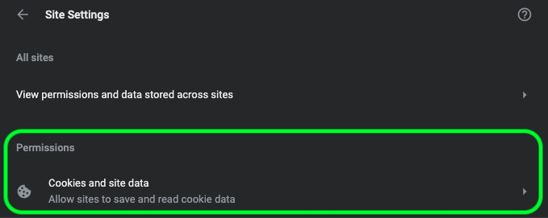
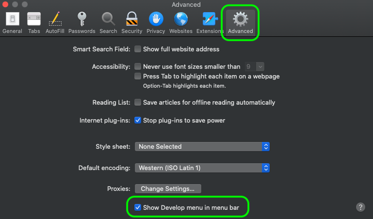

# [!DNL Data Science Workspace] felsökningsguide

Det här dokumentet innehåller svar på vanliga frågor om Adobe Experience Platform [!DNL Data Science Workspace]. Mer information och felsökning om API: [!DNL Platform] er i allmänhet finns i felsökningsguiden för [Adobe Experience Platform API](../landing/troubleshooting.md).

## [!DNL JupyterLab] miljön läses inte in i [!DNL Google Chrome]

>[!IMPORTANT]
>
>Problemet har åtgärdats men kan fortfarande finnas i webbläsaren Google Chrome 80.x. Kontrollera att webbläsaren Chrome är uppdaterad.

I webbläsarversionen 80.x blockeras alla cookies från tredje part som standard. [!DNL Google Chrome] Den här profilen kan förhindra [!DNL JupyterLab] inläsning inom Adobe Experience Platform.

Så här åtgärdar du problemet:

Navigera till det övre högra hörnet i din [!DNL Chrome] webbläsare och välj **Inställningar** (du kan också kopiera och klistra in &quot;chrome://settings/&quot; i adressfältet). Bläddra sedan längst ned på sidan och klicka på listrutan **Avancerat** .


Avsnittet *Sekretess och säkerhet* visas. Klicka sedan på **Webbplatsinställningar** följt av **cookies och webbplatsdata**.




Slutligen växlar du Blockera cookies från tredje part till AV.


>[!NOTE]
>
>Du kan även inaktivera cookies från tredje part och lägga till [*.]ds.adobe.net till tillåtelselista.

Gå till&quot;chrome://flags/&quot; i adressfältet. Sök efter och inaktivera flaggan *&quot;SameSite som standard-cookies&quot;* med hjälp av listrutan till höger.


Efter steg 2 uppmanas du att starta om webbläsaren. När du har startat om bör du vara tillgänglig [!DNL Jupyterlab] .

## Varför kan jag inte komma åt [!DNL JupyterLab] i Safari?

Safari inaktiverar cookies från tredje part som standard i Safari &lt; 12. Eftersom instansen av den virtuella datorn finns på en annan domän än den överordnade bildrutan kräver Adobe Experience Platform för närvarande att cookies från tredje part aktiveras. [!DNL Jupyter] Aktivera cookies från tredje part eller byt till en annan webbläsare, till exempel [!DNL Google Chrome].

För Safari 12 måste du växla din användaragent till &quot;[!DNL Chrome]&quot; eller &quot;[!DNL Firefox]&quot;. Om du vill byta användaragent startar du med *Safari* -menyn och väljer **Inställningar**. Inställningsfönstret visas.


Välj **Avancerat** i inställningsfönstret i Safari. Markera sedan *Visa menyn Framkalla i menyraden* . Du kan stänga inställningsfönstret när det här steget är klart.



Välj sedan **Framkalla** i det övre navigeringsfältet. I listrutan *Framkalla* för du muspekaren över *användaragenten*. Du kan välja den **[!DNL Chrome]** - eller **[!DNL Firefox]** användaragentsträng som du vill använda.


## Varför visas ett 403-förbjudet meddelande när jag försöker överföra eller ta bort en fil i [!DNL JupyterLab]?

Om din webbläsare är aktiverad med reklamblockerande program som [!DNL Ghostery] eller [!DNL AdBlock] Plus måste domänen &quot;\*.adobe.net&quot; tillåtas i varje annonsblockerande programvara för [!DNL JupyterLab] att fungera normalt. Detta beror på att [!DNL JupyterLab] virtuella datorer körs på en annan domän än [!DNL Experience Platform] domänen.

## Varför ser vissa delar av mitt utseende [!DNL Jupyter Notebook] förvrängda ut eller återges inte som kod?

Detta kan inträffa om cellen i fråga oavsiktligt ändras från &quot;Kod&quot; till &quot;Markering&quot;. När en kodcell är i fokus ändras celltypen till Markdown om du trycker på tangentkombinationen **ESC+M** . En cells typ kan ändras med listrutemätaren högst upp i anteckningsboken för de markerade cellerna. Om du vill ändra en celltyp till kod börjar du med att markera den cell som du vill ändra. Klicka sedan på listrutan som anger cellens aktuella typ och välj sedan &quot;Kod&quot;.


## Hur installerar jag anpassade [!DNL Python] bibliotek?

Kerneln [!DNL Python] är förinstallerad med många vanliga maskininlärningsbibliotek. Du kan dock installera ytterligare anpassade bibliotek genom att köra följande kommando i en kodcell:

```shell
!pip install {LIBRARY_NAME}
```

En fullständig lista över förinstallerade [!DNL Python] bibliotek finns i [bilagan till användarhandboken](./jupyterlab/overview.md#supported-libraries)för JupyterLab.

## Kan jag installera egna PySpark-bibliotek?

Tyvärr kan du inte installera fler bibliotek för PySpark-kärnan. Du kan dock kontakta kundtjänstrepresentanten på Adobe om du vill ha anpassade PySpark-bibliotek installerade.

En lista med förinstallerade PySpark-bibliotek finns i [bilagan till användarhandboken](./jupyterlab/overview.md#supported-libraries)för JupyterLab.

## Går det att konfigurera [!DNL Spark] klusterresurser för [!DNL JupyterLab] - [!DNL Spark] eller PySpark-kärnan?

Du kan konfigurera resurser genom att lägga till följande block i den första cellen i anteckningsboken:

```python
%%configure -f 
{
    "numExecutors": 10,
    "executorMemory": "8G",
    "executorCores":4,
    "driverMemory":"2G",
    "driverCores":2,
    "conf": {
        "spark.cores.max": "40"
    }
}
```

Mer information om konfiguration av [!DNL Spark] klusterresurser, inklusive en fullständig lista över konfigurerbara egenskaper, finns i [användarhandboken](./jupyterlab/overview.md#kernels)för JupyterLab.