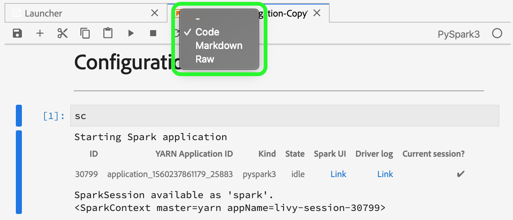

# Felsökningsguide för Data Science Workspace

Det här dokumentet innehåller svar på vanliga frågor om Adobe Experience Platform Data Science Workspace. Mer information och felsökning om plattforms-API:er i allmänhet finns i felsökningsguiden för [Adobe Experience Platform API](../landing/troubleshooting.md).

## JupyterLab-miljön läses inte in i Google Chrome

>[!IMPORTANT] Problemet har åtgärdats men kan fortfarande finnas i webbläsaren Google Chrome 80.x. Kontrollera att webbläsaren Chrome är uppdaterad.

Med webbläsaren Google Chrome version 80.x blockeras alla cookies från tredje part som standard. Den här profilen kan förhindra att JupyterLab läses in i Adobe Experience Platform.

Så här åtgärdar du problemet:

I webbläsaren Chrome går du till det övre högra hörnet och väljer **Inställningar** (du kan även kopiera och klistra in &quot;chrome://settings/&quot; i adressfältet). Bläddra sedan längst ned på sidan och klicka på listrutan **Avancerat** .


Avsnittet *Sekretess och säkerhet* visas. Klicka sedan på **Webbplatsinställningar** följt av **cookies och webbplatsdata**.


Slutligen växlar du Blockera cookies från tredje part till AV.


>[!NOTE] Du kan även inaktivera cookies från tredje part och lägga till [*.]ds.adobe.net till listan allow.

Gå till&quot;chrome://flags/&quot; i adressfältet. Sök efter och inaktivera flaggan *&quot;SameSite som standard-cookies&quot;* med hjälp av listrutan till höger.


Efter steg 2 uppmanas du att starta om webbläsaren. När du har startat om bör Jupyterlab vara tillgängligt.

## Varför kan jag inte komma åt JupyterLab i Safari?

Safari inaktiverar cookies från tredje part som standard i Safari &lt; 12. Eftersom instansen av den virtuella Jupyter-datorn finns på en annan domän än den överordnade bildrutan, kräver Adobe Experience Platform för närvarande att cookies från tredje part aktiveras. Aktivera cookies från tredje part eller byt till en annan webbläsare, till exempel Google Chrome.

För Safari 12 måste du växla din användaragent till Chrome eller Firefox. Om du vill byta användaragent startar du med *Safari* -menyn och väljer **Inställningar**. Inställningsfönstret visas.


Välj **Avancerat** i inställningsfönstret i Safari. Markera sedan *Visa menyn Framkalla i menyraden* . Du kan stänga inställningsfönstret när det här steget är klart.


Välj sedan **Framkalla** i det övre navigeringsfältet. I listrutan *Framkalla* för du muspekaren över *användaragenten*. Du kan välja den **Chrome** - eller **Firefox** -användaragentsträng som du vill använda.


## Varför visas ett 403-förbjudet meddelande när jag försöker överföra eller ta bort en fil i JupyterLab?

Om din webbläsare är aktiverad med annonseringsblockerande program som Ghostery eller AdBlock Plus, måste domänen &quot;\*.adobe.net&quot; tillåtas i alla annonseringsblockerande program för att JupyterLab ska fungera normalt. Detta beror på att virtuella JupyterLab-datorer körs på en annan domän än Experience Platform-domänen.

## Varför ser vissa delar av min bärbara Jupyter-dator skeva ut eller återges inte som kod?

Detta kan inträffa om cellen i fråga oavsiktligt ändras från &quot;Kod&quot; till &quot;Markering&quot;. När en kodcell är i fokus ändras celltypen till Markdown om du trycker på tangentkombinationen **ESC+M** . En cells typ kan ändras med listrutemätaren högst upp i anteckningsboken för de markerade cellerna. Om du vill ändra en celltyp till kod börjar du med att markera den cell som du vill ändra. Klicka sedan på listrutan som anger cellens aktuella typ och välj sedan &quot;Kod&quot;.



## Hur installerar jag anpassade Python-bibliotek?

Python-kärnan levereras förinstallerad med många populära maskininlärningsbibliotek. Du kan dock installera ytterligare anpassade bibliotek genom att köra följande kommando i en kodcell:

```shell
!pip install {LIBRARY_NAME}
```

En fullständig lista över förinstallerade Python-bibliotek finns i [bilagan till användarhandboken](./jupyterlab/overview.md#supported-libraries)för JupyterLab.

## Kan jag installera egna PySpark-bibliotek?

Tyvärr kan du inte installera fler bibliotek för PySpark-kärnan. Du kan dock kontakta Adobes kundtjänstrepresentant för att få anpassade PySpark-bibliotek installerade åt dig.

En lista med förinstallerade PySpark-bibliotek finns i [bilagan till användarhandboken](./jupyterlab/overview.md#supported-libraries)för JupyterLab.

## Är det möjligt att konfigurera Spark-klusterresurser för JupyterLab Spark- eller PySpark-kärnan?

Du kan konfigurera resurser genom att lägga till följande block i den första cellen i anteckningsboken:

```python
%%configure -f 
{
    "numExecutors": 10,
    "executorMemory": "8G",
    "executorCores":4,
    "driverMemory":"2G",
    "driverCores":2,
    "conf": {
        "spark.cores.max": "40"
    }
}
```

Mer information om konfigurationen av Spark-klusterresurser, inklusive en fullständig lista över konfigurerbara egenskaper, finns i användarhandboken för [JupyterLab](./jupyterlab/overview.md#kernels).