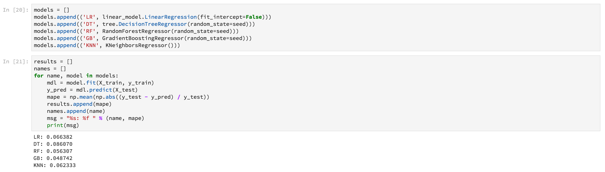

# [!DNL Data Science Workspace] genomgång

Det här dokumentet innehåller en genomgång för Adobe Experience Platform [!DNL Data Science Workspace]. I den här självstudiekursen beskrivs ett allmänt arbetsflöde för datavetare och hur de kan lösa ett problem med maskininlärning.

## Förutsättningar

- Ett registrerat Adobe ID-konto
   - Adobe ID-kontot måste ha lagts till i en organisation med tillgång till Adobe Experience Platform och [!DNL Data Science Workspace].

## Användningsexempel

En återförsäljare står inför många utmaningar när det gäller att vara konkurrenskraftiga på den nuvarande marknaden. En av detaljhandlarens främsta bekymmer är att besluta om den optimala prissättningen av en produkt och att förutse försäljningstrender. Med en korrekt prognosmodell skulle en återförsäljare kunna hitta förhållandet mellan efterfrågan och prispolitiken och fatta optimerade prissättningsbeslut för att maximera försäljningen och intäkterna.

## Datavetenskaparens lösning

En datavetare kan utnyttja den stora mängden historisk information som en återförsäljare tillhandahållit för att förutse framtida trender och optimera prissättningsbeslut. I den här genomgången används tidigare försäljningsdata för att utbilda en maskininlärningsmodell och modellen används för att förutse framtida försäljningstrender. Med detta kan ni generera insikter som hjälper er att få optimala prisförändringar.

Den här översikten speglar de steg en datavetare skulle gå igenom för att ta en datauppsättning och skapa en modell för att förutse försäljningen varje vecka. Den här självstudiekursen handlar om följande avsnitt i den exempel som finns på Adobe Experience Platform [!DNL Data Science Workspace]:

- [Inställningar](#setup)
- [Utforska data](#exploring-data)
- [Funktionskonstruktion](#feature-engineering)
- [Utbildning och verifiering](#training-and-verification)

### Anteckningsböcker i [!DNL Data Science Workspace]

I Adobe Experience Platform-användargränssnittet väljer du **[!UICONTROL Notebooks]** på **[!UICONTROL Data Science]** fliken så att du kommer till [!UICONTROL Notebooks] översiktssidan. På den här sidan väljer du fliken [!DNL JupyterLab] för att starta [!DNL JupyterLab] miljön. Standardstartsidan för [!DNL JupyterLab] är **[!UICONTROL Launcher]**.


I den här självstudien används [!DNL Python] 3 i [!DNL JupyterLab Notebooks] för att visa hur du får åtkomst till och utforskar data. På startsidan finns exempelanteckningsböcker. Exempelanteckningsboken **[!UICONTROL Retail Sales]** används i exemplen nedan.

### Inställningar {#setup}

När butiksförsäljningsjournalen är öppen är det första du bör göra att läsa in de bibliotek som krävs för ditt arbetsflöde. I följande lista visas en kort beskrivning av de bibliotek som används i exemplen i senare steg.

- **numpy**: Bibliotek för vetenskaplig datoranvändning med stöd för stora flerdimensionella matriser och matriser
- **pandor**: Bibliotek som innehåller datastrukturer och åtgärder som används för datamanipulering och -analys
- **matplotlib.pyplot**: Plotting library that provides a MATLAB-like experience when plotting
- **seaborn** : Högnivåbibliotek för visualisering av gränssnittsdata baserat på matplotlib
- **sklearn**: Maskinininlärningsbibliotek med funktioner för klassificering, regression, stöd för vektor- och klusteralgoritmer
- **varningar**: Bibliotek som kontrollerar varningsmeddelanden

### Utforska data {#exploring-data}

#### Läs in data

När biblioteken har lästs in kan du börja titta på data. I följande [!DNL Python] kod används pandas `DataFrame` datastruktur och funktionen [read_csv()](https://pandas.pydata.org/pandas-docs/stable/generated/pandas.read_csv.html#pandas.read_csv) för att läsa CSV-filen som finns [!DNL Github] i pandornas DataFrame:


Pandornas DataFrame-datastruktur är en tvådimensionell datastruktur med etiketter. Om du snabbt vill se datamåtten kan du använda `df.shape`. Detta returnerar en tuppel som representerar dimensionaliteten för DataFrame:


Slutligen kan du förhandsgranska hur data ser ut. Du kan använda `df.head(n)` för att visa de första `n` raderna i DataFrame:


#### Statistisk sammanfattning

Vi kan utnyttja [!DNL Python's] pandabiblioteket för att hämta datatypen för varje attribut. Utdata från följande anrop ger oss information om antalet poster och datatypen för var och en av kolumnerna:

```PYTHON
df.info()
```


Den här informationen är användbar eftersom du vet vilken datatyp varje kolumn har, så att vi kan veta hur vi ska behandla data.

Låt oss titta på den statistiska sammanfattningen. Endast de numeriska datatyperna visas så `date`, `storeType`och `isHoliday` kommer inte att skrivas ut:

```PYTHON
df.describe()
```


Då ser du att det finns 6 435 förekomster för varje egenskap. Dessutom ges statistiska uppgifter som medelvärde, standardavvikelse (std), min, max och interkvartilter. Detta ger oss information om avvikelsen för data. I nästa avsnitt går du igenom visualisering som fungerar tillsammans med den här informationen för att ge oss en fullständig förståelse för dina data.

Om du tittar på minimi- och maximivärdena för `store`ser du att det finns 45 unika lagringsplatser som data representerar. Det finns också `storeTypes` som skiljer ut vad en butik är. Du kan se hur distributionen av `storeTypes` genom att göra följande:


Det innebär att 22 butiker är av `storeType A` , 17 är `storeType B`och 6 är `storeType C`.

#### Visualisera data

Nu när du känner till dataramängdsvärdena vill du komplettera detta med visualiseringar för att göra det klarare och enklare att identifiera mönster. Dessa diagram är också användbara när du vill förmedla resultat till en viss målgrupp.

#### Univariata diagram

Univariata diagram är diagram av en enskild variabel. Ett vanligt unikt diagram som används för att visualisera dina data är lådor och morrdiagram.

Med hjälp av dina butiksdata från tidigare kan du generera box och whisker-fack för var och en av de 45 butikerna och deras försäljning varje vecka. Ritytan genereras med `seaborn.boxplot` funktionen.


En låda och en löpyta används för att visa datafördelningen. De yttre raderna i ritytan visar de övre och nedre kvartilarna medan rutan sträcker sig över interkvartilsintervallet. Linjen i rutan anger medianen. Alla datapunkter som är mer än 1,5 gånger den övre eller nedre kanten markeras som en cirkel. Dessa punkter betraktas som avvikelser.

Därefter kan du plotta veckoförsäljningen med tiden. Du visar bara utdata från den första butiken. Koden i den bärbara datorn genererar 6 ytor som motsvarar 6 av de 45 butikerna i vår datamängd.


I det här diagrammet kan du jämföra veckoförsäljningen under en tvåårsperiod. Det är lätt att se försäljningstoppar och dalmönster över tiden.

#### Multivariata diagram

Multivariata diagram används för att se interaktionen mellan variabler. Med visualiseringen kan datavetare se om det finns några samband eller mönster mellan variablerna. Ett vanligt multivariatdiagram är en korrelationsmatris. Med en korrelationsmatris kvantifieras beroenden mellan flera variabler med korrelationskoefficienten.

Med samma butiksdatauppsättning kan du generera en korrelationsmatris.


Observera diagonalen för de där bilderna nedåt i mitten. Detta visar att en variabel har en fullständig positiv korrelation när den jämförs med sig själv. Stark positiv korrelation kommer att ha en storlek närmare 1 medan svaga korrelationer kommer närmare 0. Negativ korrelation visas med en negativ koefficient som visar en omvänd trend.

### Funktionsteknik {#feature-engineering}

I det här avsnittet används funktionsteknik för att göra ändringar i din butiksuppsättning genom att utföra följande åtgärder:

- Lägg till vecka- och årskolumner
- Konvertera storeType till en indikatorvariabel
- Konvertera isHoliday till en numerisk variabel
- Förutspå varje veckaFörsäljning nästa vecka

#### Lägg till vecka- och årskolumner

Det aktuella datumformatet (`2010-02-05`) kan göra det svårt att skilja på data för varje vecka. Därför bör du konvertera datumet till att innehålla vecka och år.


Vecka och datum är följande:


#### Konvertera storeType till indikatorvariabel

Sedan vill du konvertera kolumnen storeType till kolumner som representerar varje `storeType`. Det finns tre lagringstyper (`A`, `B`, `C`) som du skapar tre nya kolumner från. Det värde som anges i var och en är ett booleskt värde där 1 anges beroende på vad som `storeType` var och `0` för de andra två kolumnerna.


Den aktuella `storeType` kolumnen tas bort.

#### Konvertera isHoliday till numerisk typ

Nästa ändring är att ändra det booleska värdet till en numerisk `isHoliday` representation.


#### Förutspå varje veckaFörsäljning nästa vecka

Nu vill du lägga till föregående och kommande veckoförsäljning till alla dina datauppsättningar. Du kan göra detta genom att förskjuta ditt `weeklySales`konto. Dessutom beräknas `weeklySales` skillnaden. Detta görs genom att subtrahera `weeklySales` med föregående veckas `weeklySales`.


Eftersom du förskjuter 45 datauppsättningar framåt och 45 datauppsättningar bakåt för att skapa nya kolumner har de första och sista 45 datapunkterna NaN-värden. `weeklySales` Du kan ta bort dessa punkter från datauppsättningen med hjälp av funktionen `df.dropna()` som tar bort alla rader som har NaN-värden.


En sammanfattning av datauppsättningen efter dina ändringar visas nedan:


### Utbildning och kontroll {#training-and-verification}

Nu är det dags att skapa några modeller av data och välja vilken modell som är bäst för att förutse framtida försäljning. Du kommer att utvärdera de fem följande algoritmerna:

- Linjär regression
- Beslutsträd
- Slumpmässig skog
- Övertoningsförstärkning
- K-grannar

#### Dela upp datauppsättningar till utbildnings- och testunderuppsättningar

Ni behöver ett sätt att veta hur korrekt er modell kommer att kunna förutse värden. Utvärderingen kan göras genom att en del av datauppsättningen tilldelas som validering och resten som utbildningsdata. Eftersom `weeklySalesAhead` är de faktiska framtida värdena för `weeklySales`kan du använda detta för att utvärdera hur exakt modellen är när värdet förutses. Delningen görs nedan:


Nu har du `X_train` och `y_train` för att förbereda modellerna och `X_test` och `y_test` för utvärdering senare.

#### Kontrollalgoritmer

I det här avsnittet deklarerar du alla algoritmer i en array med namnet `model`. Därefter itererar du igenom den här arrayen och för varje algoritm anger du dina utbildningsdata `model.fit()` som skapar en modell `mdl`. Med den här modellen kan ni förutse `weeklySalesAhead` era `X_test` data.



För poängsättningen tar du den genomsnittliga procentuella skillnaden mellan det förväntade värdet `weeklySalesAhead` och de faktiska värdena i `y_test` data. Eftersom du vill minimera skillnaden mellan din förutsägelse och det faktiska resultatet är Övertoningsstartregressorn den modell som ger bäst resultat.

#### Visualisera prognoser

Slutligen visualiserar ni er prognosmodell med de faktiska veckoförsäljningsvärdena. Den blå linjen representerar de faktiska siffrorna, medan den gröna representerar din förutsägelse med hjälp av Övertoningsboostring. Följande kod genererar 6 plot som representerar 6 av de 45 butikerna i din datamängd. Endast `Store 1` här:


## Nästa steg

Dokumentet innehöll ett allmänt arbetsflöde för datavetare för att lösa ett försäljningsproblem inom detaljhandeln. Sammanfattning:

- Läs in de bibliotek som krävs för arbetsflödet.
- När biblioteken har lästs in kan du börja titta på data med hjälp av statistiska sammanfattningar, visualiseringar och diagram.
- Sedan används funktionskonstruktion för att göra ändringar i din detaljhandelsdatamängd.
- Skapa slutligen modeller av data och välj vilken modell som är bäst för att förutse framtida försäljning.

När du är klar kan du börja med att läsa användarhandboken [för](./jupyterlab/overview.md) JupyterLab för en snabb översikt över anteckningsböcker i Adobe Experience Platform Data Science Workspace. Om du är intresserad av att lära dig mer om modeller och recept börjar du med att läsa självstudiekursen om [detaljhandelsförsäljning och datauppsättningar](./models-recipes/create-retails-sales-dataset.md) . I den här självstudiekursen får du hjälp med följande självstudiekurser för arbetsytan för datavetenskap som du kan visa på [sidan](../tutorials/data-science-workspace.md)med självstudiekurser för datavetenskap.