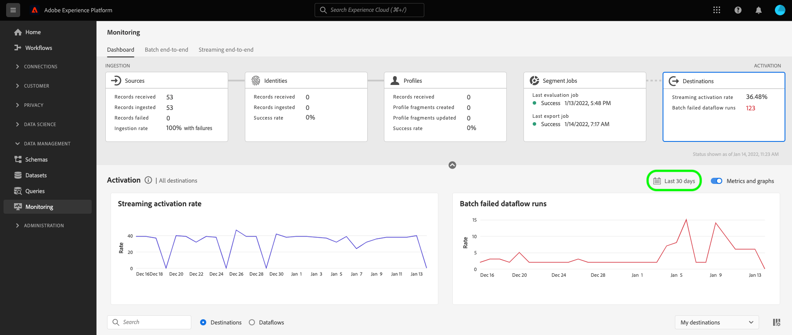
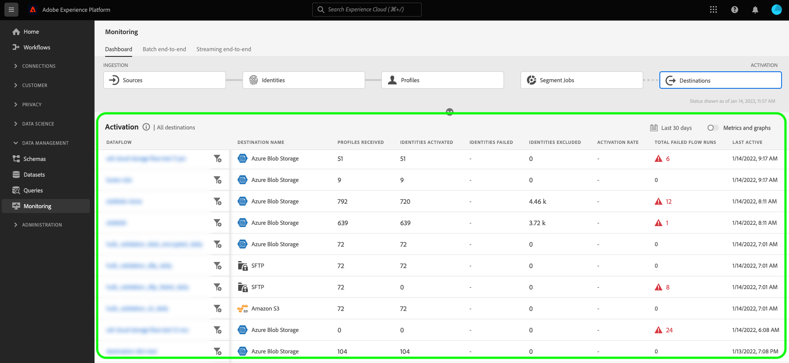

# Övervaka dataflöden för mål i användargränssnittet

Använd de olika destinationerna i Experience Platform-katalogen för att aktivera data från Platform till ett oändligt antal externa partner. Plattformen gör det enklare att spåra dataflödet till destinationerna genom att tillhandahålla genomskinlighet med dataflöden.

Kontrollpanelen ger dig en visuell representation av ett dataflödes resa, inklusive målet som data aktiveras till, vilken typ av data du visar, exporterade data per dataflöde och mycket annat.

I den här självstudiekursen finns anvisningar om hur du antingen kan övervaka dataflöden direkt på arbetsytan för mål eller använda kontrollpanelen för övervakning för att övervaka dataflöden för dina mål med hjälp av användargränssnittet i Experience Platform.

## Komma igång {#getting-started}

Handboken kräver en fungerande förståelse av följande komponenter i Adobe Experience Platform:

- [Dataflöden](../home.md): Dataflöden är en representation av datajobb som flyttar data mellan plattformar. Dataflöden är konfigurerade för olika tjänster, vilket hjälper dig att flytta data från källanslutningar till måldatauppsättningar, till [!DNL Identity] och [!DNL Profile] samt till [!DNL Destinations].
   - [Dataflöden körs](../../sources/notifications.md): Dataflöden är återkommande schemalagda jobb som baseras på frekvenskonfigurationen för valda dataflöden.
- [Destinationer](../../destinations/home.md): Destinationer är färdiga integreringar med vanliga program som möjliggör smidig aktivering av data från Platform för flerkanalskampanjer, e-postkampanjer, riktad reklam och många andra användningsfall.
- [Sandlådor](../../sandboxes/home.md): [!DNL Experience Platform] innehåller virtuella sandlådor som partitionerar en enskild [!DNL Platform]-instans till separata virtuella miljöer för att hjälpa till att utveckla och utveckla program för digitala upplevelser.

## Övervaka dataflöden på arbetsytan Destinationer {#monitor-dataflows-in-the-destinations-workspace}

Gå till fliken **[!UICONTROL Browse]** på arbetsytan **[!UICONTROL Destinations]** i plattformsgränssnittet och välj namnet på det mål som du vill visa.

En lista över befintliga dataflöden visas. På den här sidan finns en lista med visningsbara dataflöden, inklusive information om mål, användarnamn, antal dataflöden och status.

Se följande tabell för mer information om status:

| Status | Beskrivning |
| ------ | ----------- |
| Aktiverad | Statusen `Enabled` anger att ett dataflöde är aktivt och exporterar data enligt det schema som det tillhandahölls. |
| Handikappade | Statusen `Disabled` anger att ett dataflöde är inaktivt och inte exporterar några data. |
| Bearbetar | Statusen `Processing` anger att ett dataflöde ännu inte är aktivt. Denna status inträffar ofta omedelbart efter att ett nytt dataflöde har skapats. |
| Fel | Statusen `Error` indikerar att aktiveringsprocessen för ett dataflöde har avbrutits. |

### Dataflödeskörningar för direktuppspelningsmål {#dataflow-runs-for-streaming-destinations}

>[!CONTEXTUALHELP]
>id="platform_monitoring_dataflow_run_details_activation_streaming"
>title="Information om dataflödeskörning"
>abstract="Körningsinformationen för måldataflödet innehåller information om aktiveringsstatus för en målgrupp och mått från kundprofilen i realtid för att generera unika identiteter. Mer information finns i guiden för metriska definitioner."

>[!CONTEXTUALHELP]
>id="platform_monitoring_profiles_received_streaming"
>title="Mottagna profiler"
>abstract="Det totala antalet profiler som tagits emot i dataflödet. Det här värdet uppdateras var 60:e minut."

>[!CONTEXTUALHELP]
>id="platform_destinations_dataflow_identitiesactivated_streaming"
>title="Aktiverade identiteter"
>abstract="Antalet enskilda profilidentiteter har aktiverats för det valda målet. Det här måttet inkluderar identiteter som skapas, uppdateras och tas bort från exporterade målgrupper."

>[!CONTEXTUALHELP]
>id="platform_destinations_dataflow_identitiesexcluded_streaming"
>title="Undantagna identiteter"
>abstract="Antalet enskilda profilposter som har uteslutits från aktivering för den valda destinationen baserat på saknade attribut och godkännandefel."

>[!CONTEXTUALHELP]
>id="platform_destinations_dataflow_identitiesfailed_streaming"
>title="Identiteter misslyckades"
>abstract="Antalet enskilda profilidentiteter som misslyckades för det valda målet. Mer information finns i feldiagnostiken."

För direktuppspelningsmål innehåller fliken [!UICONTROL Dataflow runs] en timuppdatering för måttdata på dataflöden. Den mest framträdande statistiken är för identiteter.

Identiteter representerar olika aspekter av en profil. Om en profil till exempel innehåller både ett telefonnummer och en e-postadress har den profilen två identiteter.

En lista över enskilda körningar och deras specifika mått visas tillsammans med följande summor för identiteter:

- **[!UICONTROL Identities activated]**: Det totala antalet profilidentiteter som aktiverats för det valda målet. Det här måttet inkluderar identiteter som skapas, uppdateras och tas bort från exporterade målgrupper.
- **[!UICONTROL Identities excluded]**: Det totala antalet profilidentiteter som hoppas över för aktivering baserat på saknade attribut och godkännandeöverträdelse.
- **[!UICONTROL Identities failed]**: Det totala antalet profilidentiteter som inte har aktiverats till målet på grund av fel.

Varje enskild dataflödeskörning visar följande information:

- **[!UICONTROL Dataflow run start]**: Den tid som dataflödet körs från. För direktuppspelande dataflöden hämtar Experience Platform mätvärden som baseras på början av dataflödet, i form av timstatistik. För direktuppspelande dataflöde körs, och om ett dataflöde startas t.ex. 10:30 PM, visar måttet starttiden som 10:00 PM i gränssnittet.
- **[!UICONTROL Processing time]**: Den tid det tog för dataflödet att bearbeta.
   - För **[!UICONTROL completed]**-körningar visas alltid en timme i bearbetningstidens mått.
   - För dataflöden som fortfarande är i **[!UICONTROL processing]**-läge är fönstret för att hämta alla mått öppet i mer än en timme för att bearbeta alla mått som motsvarar dataflödeskörningen. Ett dataflöde som startades kl. 9.30 kan till exempel vara i ett bearbetningstillstånd i en timme och trettio minuter för att hämta och bearbeta alla mätvärden. När bearbetningsfönstret sedan stängs och dataflödets status uppdateras till **slutförd** ändras den visade bearbetningstiden till en timme.
- **[!UICONTROL Profiles received]**: Det totala antalet profiler som tagits emot i dataflödet.
- **[!UICONTROL Identities activated]**: Det totala antalet profilidentiteter som aktiverades till det valda målet som en del av dataflödeskörningen. Det här måttet inkluderar identiteter som skapas, uppdateras och tas bort från exporterade målgrupper.
- **[!UICONTROL Identities excluded]**: Det totala antalet profilidentiteter som har uteslutits från aktivering baserat på saknade attribut och brott mot medgivande.
- **[!UICONTROL Identities failed]** Det totala antalet profilidentiteter som inte har aktiverats till målet på grund av fel.
- **[!UICONTROL Activation rate]**: Procentandelen mottagna identiteter som antingen har aktiverats eller hoppats över. Följande formel visar hur det här värdet beräknas:
  
- **[!UICONTROL Status]**: Representerar det tillstånd som dataflödet är i: [!UICONTROL Completed] eller [!UICONTROL Processing]. [!UICONTROL Completed] betyder att alla identiteter för motsvarande dataflödeskörning exporterades inom en timme. [!UICONTROL Processing] betyder att dataflödeskörningen inte har slutförts än.

Om du vill visa information om en viss dataflödeskörning väljer du körningens starttid i listan.

Informationssidan för ett dataflöde innehåller ytterligare information, t.ex. antalet profiler som tagits emot, antalet aktiverade identiteter, antalet misslyckade identiteter och antalet utelämnade identiteter.

På informationssidan visas också en lista över misslyckade identiteter och identiteter som har utelämnats. Information om både misslyckade och utelämnade identiteter visas, inklusive felkod, antal identiteter och beskrivning. Som standard visas de misslyckade identiteterna i listan. Om du vill visa överhoppade identiteter väljer du alternativet **[!UICONTROL Identities excluded]**.

### Dataflödeskörningar för batchdestinationer {#dataflow-runs-for-batch-destinations}

>[!CONTEXTUALHELP]
>id="platform_monitoring_dataflow_run_details_activation"
>title="Information om dataflödeskörning"
>abstract="Körningsinformationen för måldataflödet innehåller information om aktiveringsstatus för en målgrupp och mått från kundprofilen i realtid för att generera unika identiteter. Mer information finns i guiden för metriska definitioner."
>additional-url="https://experienceleague.adobe.com/docs/experience-platform/dataflows/ui/monitor-destinations.html#dataflow-runs-for-streaming-destinations" text="Dataflödeskörningar för direktuppspelningsmål"

>[!CONTEXTUALHELP]
>id="platform_monitoring_profiles_received_batch"
>title="Mottagna profiler"
>abstract="Det totala antalet profiler som tagits emot i dataflödet. Det här värdet uppdateras var 60:e minut."

>[!CONTEXTUALHELP]
>id="platform_destinations_dataflow_identitiesactivated_batch"
>title="Aktiverade identiteter"
>abstract="Antalet enskilda profilidentiteter har aktiverats för det valda målet. Det här måttet inkluderar identiteter som skapas, uppdateras och tas bort från exporterade målgrupper."

>[!CONTEXTUALHELP]
>id="platform_destinations_dataflow_identitiesexcluded_batch"
>title="Undantagna identiteter"
>abstract="Antalet enskilda profilposter som har uteslutits från aktivering för den valda destinationen baserat på saknade attribut och godkännandefel."

För gruppmål innehåller fliken [!UICONTROL Dataflow runs] måttdata för dataflödets körningar. En lista över enskilda körningar och deras specifika mått visas tillsammans med följande summor för identiteter:

- **[!UICONTROL Identities activated]**: Det totala antalet profilidentiteter som aktiverats för det valda målet. Det här måttet inkluderar identiteter som skapas, uppdateras och tas bort från exporterade målgrupper.
- **[!UICONTROL Identities excluded]**: Antalet enskilda profilidentiteter som har uteslutits från aktivering för det valda målet, baserat på saknade attribut och godkännandefel.

Varje enskild dataflödeskörning visar följande information:

- **[!UICONTROL Dataflow run start]**: Den tid som dataflödet körs från.
- **[!UICONTROL Audience]**: Namnet på målgruppen som är associerad med varje dataflödeskörning.
- **[!UICONTROL Processing time]**: Den tid det tog att bearbeta dataflödet.
- **[!UICONTROL Profiles received]**: Det totala antalet profiler som tagits emot i dataflödet. Det här värdet uppdateras var 60:e minut.
- **[!UICONTROL Identities activated]**: Det totala antalet profilidentiteter som aktiverades till det valda målet som en del av dataflödeskörningen. Det här måttet inkluderar identiteter som skapas, uppdateras och tas bort från exporterade målgrupper.
- **[!UICONTROL Identities excluded]**: Det totala antalet profilidentiteter som har uteslutits från aktivering baserat på saknade attribut och brott mot medgivande.
- **[!UICONTROL Status]**: Representerar det tillstånd som dataflödet är i. Det kan vara ett av tre lägen: [!UICONTROL Success], [!UICONTROL Failed] och [!UICONTROL Processing]. [!UICONTROL Success] betyder att dataflödet är aktivt och exporterar data enligt angivet schema. [!UICONTROL Failed] betyder att aktiveringen av data har avbrutits på grund av fel. [!UICONTROL Processing] betyder att dataflödet ännu inte är aktivt och vanligtvis påträffas när ett nytt dataflöde skapas.

Om du vill visa information om ett specifikt dataflöde väljer du körningens starttid i listan.

>[!NOTE]
>
>Dataflödeskörningar genereras baserat på måldataflödets schemafrekvens. En separat dataflödeskörning görs för varje [sammanfogningsprincip](../../profile/merge-policies/overview.md) som tillämpas på en målgrupp.

På informationssidan för ett dataflöde visas mer specifik information om dataflödet, förutom informationen som visas i dataflödeslistan:

- **[!UICONTROL Size of data]**: Storleken på dataflödet som exporteras.
- **[!UICONTROL Total files]**: Det totala antalet filer som har exporterats i dataflödet.
- **[!UICONTROL Last updated]**: Den tidpunkt då dataflödeskörningen senast uppdaterades.

På informationssidan visas också en lista över misslyckade identiteter och identiteter som har utelämnats. Information om både de misslyckade och exkluderade identiteterna visas, inklusive felkoden och beskrivningen. Som standard visas de misslyckade identiteterna i listan. Om du vill visa utelämnade identiteter väljer du alternativet **[!UICONTROL Identities excluded]**.

## Kontrollpanel för målplatser {#monitoring-destinations-dashboard}

>[!NOTE]
>
>- Funktionen för målövervakning stöds för närvarande för alla mål i Experience Platform *förutom* för [Adobe Target](/help/destinations/catalog/personalization/adobe-target-connection.md) och [Anpassad ](/help/destinations/catalog/personalization/custom-personalization.md) -destinationer.
>- För [Amazon Kinesis](/help/destinations/catalog/cloud-storage/amazon-kinesis.md), [ Azure Event Hubs](/help/destinations/catalog/cloud-storage/azure-event-hubs.md) och [HTTP API](/help/destinations/catalog/streaming/http-destination.md) uppskattas mätvärdena för utelämnade, misslyckade och aktiverade identiteter. Högre volymer av aktiveringsdata leder till större noggrannhet i mätvärdena.

>[!CONTEXTUALHELP]
>id="platform_monitoring_activation"
>title="Aktivering"
>abstract="Målaktiveringsvyn innehåller information om aktiveringsstatus för en målgrupp och mått från kundprofilen i realtid för att generera unika identiteter."

Om du vill komma åt kontrollpanelen [!UICONTROL Monitoring] väljer du **[!UICONTROL Monitoring]** () i den vänstra navigeringen. Välj [!UICONTROL Destinations] på sidan [!UICONTROL Monitoring]. Kontrollpanelen [!UICONTROL Monitoring] innehåller mått och information om målkörningsjobb.

Använd kontrollpanelen [!UICONTROL Destinations] för att få en övergripande uppfattning om hälsotillståndet för dina aktiveringsflöden. Börja med att få samlade insikter om alla grupper och direktuppspelningsmål och fördjupa er sedan i detaljerade vyer för dataflöden, dataflöden och aktiverade målgrupper för en djupgående genomgång av era aktiveringsdata. Skärmarna på kontrollpanelen [!UICONTROL Monitoring] innehåller åtgärdbara insikter via mått och felbeskrivningar som hjälper dig att felsöka eventuella problem som kan uppstå i dina aktiveringsscenarier.

Du kan filtrera den visade informationen efter datatyp - kunder, konton (endast för Adobe Real-Time CDP B2B-utgåvan), potentiella kunder och kontoberikning. Läs mer om de här alternativen i [guiden för kontrollpanelen](/help/dataflows/ui/monitor.md#monitoring-dashboard-overview).

Mitten av kontrollpanelen är panelen [!UICONTROL Activation], som innehåller mått och diagram som visar data om aktiveringshastigheten för de data som exporteras till direktuppspelningsdestinationer, samt om det misslyckade batchdataflödet går till batchdestinationer.

Som standard innehåller de data som visas aktiveringsinformationen från de senaste 24 timmarna. Välj **[!UICONTROL Last 24 hours]** om du vill justera tidsramen för de poster som visas. De tillgängliga alternativen är **[!UICONTROL Last 24 hours]**, **[!UICONTROL Last 7 days]** och **[!UICONTROL Last 30 days]**. Du kan också välja datum i kalenderns popup-fönster som visas. När du har valt datum väljer du **[!UICONTROL Apply]** för att justera tidsramen för den information som visas.

>[!NOTE]
>
>På följande skärmbild visas aktiveringshastigheten och batchdataflödet under de senaste 30 dagarna i stället för under de senaste 24 timmarna. Du kan justera tidsramen genom att välja **[!UICONTROL Last 30 days]**.

Använd pilikonen () för att expandera eller stänga av korten högst upp på skärmen. Korten visar snabböversiktsinformation om aktiveringsdetaljer baserat på måltyp - direktuppspelning eller batch:

- **[!UICONTROL Streaming activation rate]**: Representerar procentandelen mottagna identiteter som antingen har aktiverats eller hoppats över. Formeln som används för att beräkna den här procentandelen beskrivs vidare ovan på den här sidan i avsnittet [Dataflöd för direktuppspelningsmål](#dataflow-runs-for-streaming-destinations).
- **[!UICONTROL Batch failed dataflow runs]**: Representerar antalet misslyckade dataflödeskörningar i det valda tidsintervallet.

Diagrammet **[!UICONTROL Activation]** visas som standard och du kan inaktivera det om du vill utöka listan med mål nedan. Markera växlingsknappen **[!UICONTROL Metrics and graphs]** om du vill inaktivera diagrammen.

På panelen **[!UICONTROL Activation]** visas en lista med mål som innehåller minst ett befintligt konto. Listan innehåller även information om mottagna profiler, aktiverade identiteter, misslyckade identiteter, utelämnade identiteter, aktiveringsfrekvens, totalt antal misslyckade dataflöden samt det senaste uppdateringsdatumet för dessa destinationer. Alla mått är inte tillgängliga för alla måltyper. Tabellen nedan visar de värden och den information som är tillgänglig per måltyp, direktuppspelning eller batch.

| Mått | Måltyp |
---------|----------|
| **[!UICONTROL Profiles received]** | Direktuppspelning och batch |
| **[!UICONTROL Identities activated]** | Direktuppspelning och batch |
| **[!UICONTROL Identities failed]** | Direktuppspelning |
| **[!UICONTROL Identities excluded]** | Direktuppspelning och batch |
| **[!UICONTROL Activation rate]** | Direktuppspelning |
| **[!UICONTROL Total failed dataflows]** | Grupp |
| **[!UICONTROL Last updated]** | Direktuppspelning och batch |

Du kan även filtrera listan över destinationer så att endast den valda destinationskategorin visas. Markera listrutan **[!UICONTROL My destinations]** och välj den [målkategori](/help/destinations/destination-types.md#categories) som du vill filtrera till.

Dessutom kan du ange ett mål i sökfältet för att isolera till ett enda mål. Om du vill visa målets dataflöden kan du markera filtret  bredvid det och visa en lista över de aktiva dataflödena.

Om du vill visa alla befintliga dataflöden för alla mål väljer du **[!UICONTROL Dataflows]**.

En lista över dataflöden visas, sorterad efter den senaste dataflödeskörningen. Du kan se ytterligare information om ett specifikt dataflöde genom att leta upp det mål som du vill övervaka, markera filtret  bredvid det och sedan välja filtret  bredvid det dataflöde som du vill ha mer information om.

När du har valt ett dataflöde för vidare kontroll innehåller informationssidan för dataflöde en växlingsknapp som gör att du kan se aktiverade data i dataflödet, uppdelade efter dataflödeskörningar eller målgrupper.

### Vy för körning av dataflöde {#dataflow-runs-view}

När **[!UICONTROL Dataflow runs]** har valts kan du se en lista över dataflödeskörningar för det valda dataflödet och mer information om varje körning.

>[!INFO]
>
>För dataflöden till direktuppspelningsmål delas ett dataflöde upp i timfönster. Varje timfönster genererar ett motsvarande ID för dataflödeskörning.
>
>För dataflöden till batchdestinationer har varje målgrupp ett motsvarande dataflöde som genereras baserat på målgruppens schemalagda aktiveringsfrekvens. Om du till exempel skapar en daglig schemalagd aktivering för fem målgrupper i samma måldataflöde, genereras fem separata dataflöden varje dag.

Använd växlingsknappen **[!UICONTROL Show failures only]** om du bara vill visa misslyckade körningar för ett dataflöde.

### Målgruppsvy {#segment-level-view}

När **[!UICONTROL Audiences]** är markerat visas en lista över de målgrupper som aktiverats för det valda dataflödet, inom det valda tidsintervallet. Den här skärmen innehåller information på målgruppsnivå om aktiverade identiteter, utelämnade identiteter samt status och tid för senaste dataflöde. Genom att granska mätvärdena för identiteter som har uteslutits och aktiverats kan ni verifiera om en målgrupp har aktiverats eller inte.

Du aktiverar till exempel en publik som heter&quot;Lojalitetsmedlemmar i Kalifornien&quot; till Amazon S3-destinationen&quot;Lojalitetsmedlemmar i Kalifornien&quot;. Låt oss anta att det finns 100 profiler i den valda målgruppen, men endast 80 av 100 profiler innehåller attribut för lojalitet-ID och du har definierat reglerna för exportmappning som `loyalty.id` krävs. I det här fallet, på en målgruppsnivå, ser du 80 identiteter aktiverade och 20 identiteter uteslutna.

>[!IMPORTANT]
>
>Observera de nuvarande begränsningarna för målgruppsstatistik:
>- Vyn på målgruppsnivå är för närvarande bara tillgänglig för batchmål.
>- Mått på målgruppsnivå registreras för att dataflödet ska kunna köras endast. De spelas inte in för misslyckade dataflödeskörningar och uteslutna poster.

I målgruppsnivåvyn sammanställs mätvärdena över flera dataflöden inom det valda tidsintervallet. Om det finns flera dataflödeskörningar kan du gå nedåt från målgruppsnivån för att se detaljerna för varje dataflödeskörning, filtrerade efter den valda målgruppen.
Använd filterknappen  för att gå ned i dataflödesvyn för varje målgrupp i dataflödet.

### Körningssida för dataflöde {#dataflow-runs-page}

På sidan för dataflöden visas information om dataflödets körningar, inklusive starttid för dataflöde, bearbetningstid, mottagna profiler, aktiverade identiteter, utelämnade identiteter, misslyckade identiteter, aktiveringsfrekvens och status.

När du går ned på dataflödets körningssida från vyn [på målgruppsnivå](#segment-level-view) kan du filtrera dataflödet med följande alternativ:

- **[!UICONTROL Dataflow runs with failed identities]**: För den valda målgruppen listas alla dataflödeskörningar som misslyckades för aktivering med det här alternativet. Information om varför identiteter i ett visst dataflöde misslyckades finns på [informationssidan för dataflödeskörning](#dataflow-run-details-page) för det dataflödet.
- **[!UICONTROL Dataflow runs with skipped identities]**: För den valda målgruppen listas alla dataflöden där vissa av identiteterna inte var helt aktiverade och vissa profiler hoppades över. Information om varför identiteter i en viss dataflödeskörning hoppades över finns på [informationssidan ](#dataflow-run-details-page) för dataflödeskörningen.
- **[!UICONTROL Dataflow runs with activated identities]**: För den valda målgruppen listas alla dataflödeskörningar som har identiteter som har aktiverats.

Om du vill visa mer information om en viss dataflödeskörning väljer du filtret  bredvid starttiden för dataflödeskörningen för att visa informationssidan för dataflödeskörningen.

### Detaljsida för dataflödeskörning {#dataflow-run-details-page}

På sidan med information om dataflödeskörning visas mer specifik information om dataflödet, förutom informationen som visas i listan över dataflödeskörningar:

- **[!UICONTROL Dataflow run ID]**: ID:t för dataflödet.
- **[!UICONTROL IMS org ID]**: Organisationen som dataflödet tillhör.
- **[!UICONTROL Last updated]**: Den tidpunkt då dataflödeskörningen senast uppdaterades.

På informationssidan finns också en växlingsknapp för att växla mellan körningsfel och målgrupper i dataflöden. Det här alternativet är bara tillgängligt för dataflöden som körs i batchmål.

Vyn för körningsfel i dataflödet visar en lista över misslyckade identiteter och identiteter som har utelämnats. Information om både misslyckade och utelämnade identiteter visas, inklusive felkod, antal identiteter och beskrivning. Som standard visas de misslyckade identiteterna i listan. Om du vill visa överhoppade identiteter väljer du alternativet **[!UICONTROL Identities excluded]**.

När **[!UICONTROL Audiences]** är markerat visas en lista över de målgrupper som aktiverats i den valda dataflödeskörningen. Den här skärmen innehåller information på målgruppsnivå om aktiverade identiteter, utelämnade identiteter samt status och tid för senaste dataflöde.

## Nästa steg {#next-steps}

Genom att följa den här guiden kan du nu övervaka dataflöden för både batch- och direktuppspelningsmål, inklusive all relevant information som bearbetningstid, aktiveringsfrekvens och status. Mer information om dataflöden i plattformen finns i [dataflödesöversikten](../home.md). Läs [målöversikten](../../destinations/home.md) om du vill veta mer om mål.