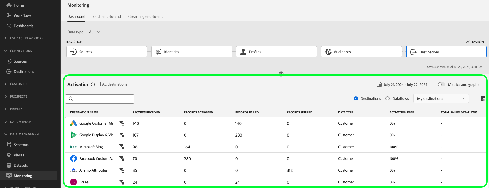

# Övervaka dataflöden för mål i användargränssnittet

Med destinationer kan ni aktivera data från Adobe Experience Platform för ett oändligt antal externa partner. Plattformen gör det enklare att spåra dataflödet till destinationerna genom att tillhandahålla genomskinlighet med dataflöden.

Kontrollpanelen ger dig en visuell representation av resan för ett dataflöde, inklusive målet som data aktiveras till. I den här självstudiekursen finns anvisningar om hur du antingen kan övervaka dataflöden direkt på arbetsytan för mål eller använda kontrollpanelen för övervakning för att övervaka dataflöden för dina mål med hjälp av användargränssnittet i Experience Platform.

## Komma igång {#getting-started}

Handboken kräver en fungerande förståelse av följande komponenter i Adobe Experience Platform:

- [Dataflöden](../home.md): Dataflöden är en representation av datajobb som flyttar data mellan plattformar. Dataflöden konfigureras över olika tjänster, vilket hjälper dig att flytta data från källanslutningar till måldatauppsättningar till [!DNL Identity] och [!DNL Profile]och till [!DNL Destinations].
   - [Dataflödeskörningar](../../sources/notifications.md): Dataflödeskörningar är återkommande schemalagda jobb som baseras på frekvenskonfigurationen för valda dataflöden.
- [Destinationer](../../destinations/home.md): Destinationer är färdiga integreringar med vanliga applikationer som möjliggör smidig aktivering av data från Platform för flerkanalskampanjer, e-postkampanjer, riktad annonsering och många andra användningsfall.
- [Sandlådor](../../sandboxes/home.md): [!DNL Experience Platform] innehåller virtuella sandlådor som partitionerar en enda [!DNL Platform] till separata virtuella miljöer för att utveckla och utveckla applikationer för digitala upplevelser.

## Övervaka dataflöden på arbetsytan Destinationer {#monitor-dataflows-in-the-destinations-workspace}

I **[!UICONTROL Destinations]** navigera till **[!UICONTROL Browse]** och välj namnet på ett mål som du vill visa.

En lista över befintliga dataflöden visas. På den här sidan finns en lista med visningsbara dataflöden, inklusive information om mål, användarnamn, antal dataflöden och status.

Se följande tabell för mer information om status:

| Status | Beskrivning |
| ------ | ----------- |
| Aktiverad | The `Enabled` status anger att ett dataflöde är aktivt och exporterar data enligt det schema som det angavs. |
| Handikappade | The `Disabled` status anger att ett dataflöde är inaktivt och inte exporterar några data. |
| Bearbetar | The `Processing` status anger att ett dataflöde ännu inte är aktivt. Denna status inträffar ofta omedelbart efter att ett nytt dataflöde har skapats. |
| Fel | The `Error` status anger att aktiveringsprocessen för ett dataflöde har avbrutits. |

### Dataflödeskörningar för direktuppspelningsmål {#dataflow-runs-for-streaming-destinations}

>[!CONTEXTUALHELP]
>id="platform_monitoring_dataflow_run_details_activation_streaming"
>title="Information om dataflödeskörning"
>abstract="Körningsinformationen för måldataflödet innehåller information om segmentets aktiveringsstatus och mått som hämtats från kundprofilen i realtid för att generera unika identiteter. Mer information finns i guiden för metriska definitioner."

>[!CONTEXTUALHELP]
>id="platform_monitoring_profiles_received_streaming"
>title="Mottagna profiler"
>abstract="Det totala antalet profiler som tagits emot i dataflödet. Det här värdet uppdateras var 60:e minut."

>[!CONTEXTUALHELP]
>id="platform_destinations_dataflow_identitiesactivated_streaming"
>title="Aktiverade identiteter"
>abstract="Antalet enskilda profilidentiteter har aktiverats för det valda målet. Det här måttet inkluderar identiteter som skapas, uppdateras och tas bort från exporterade segment."

>[!CONTEXTUALHELP]
>id="platform_destinations_dataflow_identitiesexcluded_streaming"
>title="Undantagna identiteter"
>abstract="Antalet enskilda profilposter som har uteslutits från aktivering för den valda destinationen baserat på saknade attribut och godkännandefel."

>[!CONTEXTUALHELP]
>id="platform_destinations_dataflow_identitiesfailed_streaming"
>title="Identiteter misslyckades"
>abstract="Antalet enskilda profilidentiteter som misslyckades för det valda målet. Mer information finns i feldiagnostiken."

För direktuppspelningsmål finns följande [!UICONTROL Dataflow runs] tillhandahåller en timuppdatering för mätdata på dina dataflöden. Den mest framträdande statistiken är för identiteter.

Identiteter representerar olika aspekter av en profil. Om en profil till exempel innehåller både ett telefonnummer och en e-postadress har den profilen två identiteter.

En lista över enskilda körningar och deras specifika mått visas tillsammans med följande summor för identiteter:

- **[!UICONTROL Identities activated]**: Det totala antalet profilidentiteter som aktiverats för det valda målet. Det här måttet inkluderar identiteter som skapas, uppdateras och tas bort från exporterade segment.
- **[!UICONTROL Identities excluded]**: Det totala antalet profilidentiteter som har hoppats över för aktivering baserat på saknade attribut och medgivandeöverträdelse.
- **[!UICONTROL Identities failed]**: Det totala antalet profilidentiteter som inte har aktiverats till målet på grund av fel.

Varje enskild dataflödeskörning visar följande information:

- **[!UICONTROL Dataflow run start]**: Den tid som dataflödet körs vid. För direktuppspelande dataflöden hämtar Experience Platform mätvärden som baseras på början av dataflödet, i form av timstatistik. För direktuppspelande dataflöde körs, och om ett dataflöde startades t.ex. 10:30 PM, visar måttet starttiden som 10:00 PM i gränssnittet.
- **[!UICONTROL Processing time]**: Den tid det tog för dataflödet att bearbeta.
   - För **[!UICONTROL completed]** körs visar körtidsmåttet alltid en timme.
   - För dataflöden som fortfarande körs i en **[!UICONTROL processing]** det fönster där alla mätvärden hämtas är öppet i mer än en timme för att bearbeta alla mätvärden som motsvarar dataflödeskörningen. Ett dataflöde som startades kl. 9.30 kan till exempel vara i ett bearbetningstillstånd i en timme och trettio minuter för att hämta och bearbeta alla mätvärden. När bearbetningsfönstret sedan stängs och dataflödets status uppdateras till **slutförd**, ändras den visade bearbetningstiden till en timme.
- **[!UICONTROL Profiles received]**: Det totala antalet profiler som tagits emot i dataflödet.
- **[!UICONTROL Identities activated]**: Det totala antalet profilidentiteter som aktiverats till det valda målet som en del av dataflödeskörningen. Det här måttet inkluderar identiteter som skapas, uppdateras och tas bort från exporterade segment.
- **[!UICONTROL Identities excluded]**: Det totala antalet profilidentiteter som har uteslutits från aktivering baserat på saknade attribut och brott mot medgivande.
- **[!UICONTROL Identities failed]** Det totala antalet profilidentiteter som inte har aktiverats till målet på grund av fel.
- **[!UICONTROL Activation rate]**: Procentandelen mottagna identiteter som antingen har aktiverats eller hoppats över. Följande formel visar hur det här värdet beräknas:
   
- **[!UICONTROL Status]**: Representerar läget för dataflödet: antingen [!UICONTROL Completed] eller [!UICONTROL Processing]. [!UICONTROL Completed] betyder att alla identiteter för motsvarande dataflödeskörning exporterades inom en timma. [!UICONTROL Processing] betyder att dataflödeskörningen inte har slutförts ännu.

Om du vill visa information om ett visst dataflöde väljer du körningens starttid i listan.

Informationssidan för ett dataflöde innehåller ytterligare information, t.ex. antalet profiler som tagits emot, antalet aktiverade identiteter, antalet misslyckade identiteter och antalet utelämnade identiteter.

På informationssidan visas också en lista över misslyckade identiteter och identiteter som har utelämnats. Information om både misslyckade och utelämnade identiteter visas, inklusive felkod, antal identiteter och beskrivning. Som standard visas de misslyckade identiteterna i listan. Om du vill visa överhoppade identiteter väljer du **[!UICONTROL Identities excluded]** växla.

### Dataflödeskörningar för batchmål {#dataflow-runs-for-batch-destinations}

>[!CONTEXTUALHELP]
>id="platform_monitoring_dataflow_run_details_activation"
>title="Information om dataflödeskörning"
>abstract="Körningsinformationen för måldataflödet innehåller information om segmentets aktiveringsstatus och mått som hämtats från kundprofilen i realtid för att generera unika identiteter. Mer information finns i guiden för metriska definitioner."
>additional-url="https://experienceleague.adobe.com/docs/experience-platform/dataflows/ui/monitor-destinations.html#dataflow-runs-for-streaming-destinations" text="Dataflödeskörningar för direktuppspelningsmål"

>[!CONTEXTUALHELP]
>id="platform_monitoring_profiles_received_batch"
>title="Mottagna profiler"
>abstract="Det totala antalet profiler som tagits emot i dataflödet. Det här värdet uppdateras var 60:e minut."

>[!CONTEXTUALHELP]
>id="platform_destinations_dataflow_identitiesactivated_batch"
>title="Aktiverade identiteter"
>abstract="Antalet enskilda profilidentiteter har aktiverats för det valda målet. Det här måttet inkluderar identiteter som skapas, uppdateras och tas bort från exporterade segment."

>[!CONTEXTUALHELP]
>id="platform_destinations_dataflow_identitiesexcluded_batch"
>title="Undantagna identiteter"
>abstract="Antalet enskilda profilposter som har uteslutits från aktivering för den valda destinationen baserat på saknade attribut och godkännandefel."

För batchdestinationer är [!UICONTROL Dataflow runs] -fliken innehåller mätdata för dina dataflödeskörningar. En lista över enskilda körningar och deras specifika mått visas tillsammans med följande summor för identiteter:

- **[!UICONTROL Identities activated]**: Det totala antalet profilidentiteter som aktiverats för det valda målet. Det här måttet inkluderar identiteter som skapas, uppdateras och tas bort från exporterade segment.
- **[!UICONTROL Identities excluded]**: Antalet individuella profilidentiteter som har uteslutits från aktivering för den valda destinationen, baserat på saknade attribut och medgivande.

Varje enskild dataflödeskörning visar följande information:

- **[!UICONTROL Dataflow run start]**: Den tid som dataflödet körs vid.
- **[!UICONTROL Segment]**: Namnet på det segment som är associerat med varje dataflödeskörning.
- **[!UICONTROL Processing time]**: Den tid det tog för dataflödet att bearbeta.
- **[!UICONTROL Profiles received]**: Det totala antalet profiler som tagits emot i dataflödet. Det här värdet uppdateras var 60:e minut.
- **[!UICONTROL Identities activated]**: Det totala antalet profilidentiteter som aktiverats till det valda målet som en del av dataflödeskörningen. Det här måttet inkluderar identiteter som skapas, uppdateras och tas bort från exporterade segment.
- **[!UICONTROL Identities excluded]**: Det totala antalet profilidentiteter som har uteslutits från aktivering baserat på saknade attribut och brott mot medgivande.
- **[!UICONTROL Status]**: Representerar det läge som dataflödet är i. Det kan vara ett av tre lägen: [!UICONTROL Success], [!UICONTROL Failed]och [!UICONTROL Processing]. [!UICONTROL Success] betyder att dataflödet är aktivt och exporterar data enligt angivet schema. [!UICONTROL Failed] innebär att aktiveringen av uppgifter har avbrutits på grund av fel. [!UICONTROL Processing] betyder att dataflödet ännu inte är aktivt och vanligtvis uppstår när ett nytt dataflöde skapas.

Om du vill visa information om ett specifikt dataflöde väljer du körningens starttid i listan.

>[!NOTE]
>
>Dataflödeskörningar genereras baserat på måldataflödets schemafrekvens. En separat dataflödeskörning görs för varje [sammanfogningsprincip](../../profile/merge-policies/overview.md) som används på ett segment.

På informationssidan för ett dataflöde visas mer specifik information om dataflödet, förutom informationen som visas i dataflödeslistan:

- **[!UICONTROL Size of data]**: Storleken på dataflödet som exporteras.
- **[!UICONTROL Total files]**: Det totala antalet filer som exporteras i dataflödet.
- **[!UICONTROL Last updated]**: Den tidpunkt då dataflödeskörningen senast uppdaterades.

På informationssidan visas också en lista över misslyckade identiteter och identiteter som har utelämnats. Information om både de misslyckade och exkluderade identiteterna visas, inklusive felkoden och beskrivningen. Som standard visas de misslyckade identiteterna i listan. Om du vill visa utelämnade identiteter väljer du **[!UICONTROL Identities excluded]** växla.

## Kontrollpanel för målplatser {#monitoring-destinations-dashboard}

>[!NOTE]
>
>- Funktionen för destinationsövervakning stöds för närvarande för alla destinationer i Experience Platform *utom* den [Adobe Target](/help/destinations/catalog/personalization/adobe-target-connection.md) och [Anpassad personalisering](/help/destinations/catalog/personalization/custom-personalization.md) destinationer.
>- För [Amazon Kinesis](/help/destinations/catalog/cloud-storage/amazon-kinesis.md), [Azure Event Hubs](/help/destinations/catalog/cloud-storage/azure-event-hubs.md)och [HTTP-API](/help/destinations/catalog/streaming/http-destination.md) utelämnade mål, identiteter visas inte för närvarande.

>[!CONTEXTUALHELP]
>id="platform_monitoring_activation"
>title="Aktivering"
>abstract="Målaktiveringsvyn innehåller information om segmentets aktiveringsstatus och mått från kundprofilen i realtid för att generera unika identiteter."

Så här öppnar du [!UICONTROL Monitoring] kontrollpanel, välja **[!UICONTROL Monitoring]** () i den vänstra navigeringen. På [!UICONTROL Monitoring] sida, markera [!UICONTROL Destinations]. The [!UICONTROL Monitoring] Kontrollpanelen innehåller mått och information om målkörningsjobb.

Använd [!UICONTROL Destinations] Instrumentpanel för att få en övergripande uppfattning om hur era aktiveringsflöden fungerar. Börja med att få samlade insikter om alla grupper och direktuppspelningsmål och fördjupa er sedan i detaljerade vyer för dataflöden, dataflöden och aktiverade segment för en djupgående genomgång av era aktiveringsdata. Skärmarna i [!UICONTROL Monitoring] Instrumentpanelen ger användbara insikter via mätvärden och felbeskrivningar som hjälper dig att felsöka problem som kan uppstå i dina aktiveringsscenarier.

Mitten av kontrollpanelen är [!UICONTROL Activation] som innehåller mätvärden och diagram som visar data om aktiveringshastigheten för de data som exporteras till direktuppspelningsdestinationer, samt om det misslyckade batchdataflödet går till batchdestinationer.

Som standard innehåller de data som visas aktiveringsinformationen från de senaste 24 timmarna. Välj **[!UICONTROL Last 24 hours]** för att justera tidsramen för de poster som visas. Tillgängliga alternativ inkluderar **[!UICONTROL Last 24 hours]**, **[!UICONTROL Last 7 days]** och **[!UICONTROL Last 30 days]**. Du kan också välja datum i kalenderns popup-fönster som visas. När du har valt datum väljer du **[!UICONTROL Apply]** för att justera tidsramen för den information som visas.

>[!NOTE]
>
>På följande skärmbild visas aktiveringshastigheten och batchdataflödet under de senaste 30 dagarna i stället för under de senaste 24 timmarna. Du kan justera tidsramen genom att markera **[!UICONTROL Last 30 days]**.

Använd pilikonen () för att expandera eller stänga av korten längst upp på skärmen, som visar snabbinformation om aktiveringsdetaljer baserat på måltyp - direktuppspelning eller batch:

- **[!UICONTROL Streaming activation rate]**: Representerar procentandelen mottagna identiteter som antingen har aktiverats eller hoppats över. Formeln som används för att beräkna den här procentandelen beskrivs vidare på den här sidan i [Dataflödeskörningar för direktuppspelningsmål](#dataflow-runs-for-streaming-destinations) -avsnitt.
- **[!UICONTROL Batch failed dataflow runs]**: Representerar antalet misslyckade dataflödeskörningar under det valda tidsintervallet.

The **[!UICONTROL Activation]** diagrammet visas som standard och du kan inaktivera det för att utöka listan med destinationer nedan. Välj **[!UICONTROL Metrics and graphs]** om du vill inaktivera diagrammen.

The **[!UICONTROL Activation]** På panelen visas en lista med mål som innehåller minst ett befintligt konto. Listan innehåller även information om mottagna profiler, aktiverade identiteter, misslyckade identiteter, utelämnade identiteter, aktiveringsfrekvens, totalt antal misslyckade dataflöden samt det senaste uppdateringsdatumet för dessa destinationer. Alla mått är inte tillgängliga för alla måltyper. Tabellen nedan visar vilka mätvärden som är tillgängliga per måltyp, direktuppspelning eller batch.

| Mått | Måltyp |
---------|----------|
| **[!UICONTROL Profiles received]** | Direktuppspelning och batch |
| **[!UICONTROL Identities activated]** | Direktuppspelning och batch |
| **[!UICONTROL Identities failed]** | Direktuppspelning |
| **[!UICONTROL Identities excluded]** | Direktuppspelning och batch |
| **[!UICONTROL Activation rate]** | Direktuppspelning |
| **[!UICONTROL Total failed dataflows]** | Grupp |
| **[!UICONTROL Last updated]** | Direktuppspelning och batch |

Du kan även filtrera listan över destinationer så att endast den valda destinationskategorin visas. Välj **[!UICONTROL My destinations]** och välj [destinationskategori](/help/destinations/destination-types.md#categories) som du vill filtrera till.

Dessutom kan du ange ett mål i sökfältet för att isolera till ett enda mål. Om du vill se målets dataflöden kan du välja filtret  bredvid den och se en lista över de aktiva dataflödena.

Om du vill visa alla befintliga dataflöden för alla mål väljer du **[!UICONTROL Dataflows]**.

En lista över dataflöden visas, sorterad efter den senaste dataflödeskörningen. Du kan se ytterligare information om ett specifikt dataflöde genom att leta reda på målet som du vill övervaka och välja filtret  bredvid den och därefter välja filtret  Förutom dataflödet vill du ha mer information om.

När du har valt ett dataflöde för vidare kontroll innehåller informationssidan för dataflöde en växlingsknapp som gör att du kan se aktiverade data i dataflödet, uppdelade efter dataflödeskörningar eller segment.

### Vy för körning av dataflöde {#dataflow-runs-view}

När **[!UICONTROL Dataflow runs]** när du har valt det här alternativet kan du se en lista med dataflödeskörningar för det valda dataflödet och mer information om varje körning.

>[!INFO]
>
>För dataflöden till direktuppspelningsmål delas ett dataflöde upp i timfönster. Varje timfönster genererar ett motsvarande ID för dataflödeskörning.
>
>För dataflöden till batchmål har varje segment en motsvarande dataflödeskörning som genereras baserat på den schemalagda frekvensen för segmentaktivering. Om du till exempel ställer in en daglig schemalagd aktivering för fem segment i samma måldataflöde, genereras fem separata dataflöden varje dag.

Använd **[!UICONTROL Show failures only]** växla till att endast visa misslyckade körningar för ett dataflöde.

### Vy på segmentnivå {#segment-level-view}

När **[!UICONTROL Segments]** när du har valt det här alternativet visas en lista över de segment som aktiverats för det valda dataflödet inom det valda tidsintervallet. Den här skärmen innehåller information på segmentnivå om aktiverade identiteter, utelämnade identiteter samt status och tid för det senaste dataflödet. Genom att granska mätvärdena för identiteter som har uteslutits och aktiverats kan du verifiera om ett segment har aktiverats eller inte.

Du aktiverar till exempel ett segment som heter&quot;Lojalitetsmedlemmar i Kalifornien&quot; till Amazon S3-destinationen&quot;Lojalitetsmedlemmar i Kalifornien&quot;. Anta att det finns 100 profiler i det valda segmentet, men endast 80 av 100 profiler innehåller attribut för lojalitet-ID och att du har definierat reglerna för exportmappning som `loyalty.id` krävs. I det här fallet kommer 80 identiteter att vara aktiverade och 20 identiteter uteslutna på en segmentnivå.

>[!IMPORTANT]
>
>Observera de nuvarande begränsningarna för segmentnivåstatistik:
>- Vyn på segmentnivå är för närvarande bara tillgänglig för gruppmål.
>- Mätvärden för segmentnivå registreras för att det ska gå att köra ett lyckat dataflöde. De spelas inte in för misslyckade dataflödeskörningar och uteslutna poster.

I segmentnivåvyn sammanställs mätvärdena över flera dataflöden inom det valda tidsintervallet. Om det finns flera dataflödeskörningar kan du gå nedåt från segmentnivån för att se hur varje dataflödeskörning har filtrerats efter det valda segmentet.
Använda filterknappen  för att gå ned i körningsvyn för dataflödet för varje segment i dataflödet.

### Körningssida för dataflöde {#dataflow-runs-page}

På sidan för dataflöden visas information om dataflödets körningar, inklusive starttid för dataflöde, bearbetningstid, mottagna profiler, aktiverade identiteter, utelämnade identiteter, misslyckade identiteter, aktiveringsfrekvens och status.

När du går ned på sidan med dataflöden körs sidan från [segmentnivåvy](#segment-level-view)har du möjlighet att filtrera dataflödet genom att välja mellan följande alternativ:

- **[!UICONTROL Dataflow runs with failed identities]**: För det valda segmentet listar det här alternativet alla dataflödeskörningar som inte kunde aktiveras. Information om varför identiteter i ett visst dataflöde misslyckades finns i [informationssida för dataflödeskörning](#dataflow-run-details-page) för det dataflödet.
- **[!UICONTROL Dataflow runs with skipped identities]**: För det valda segmentet listar det här alternativet alla dataflöden där vissa av identiteterna inte var helt aktiverade och vissa profiler hoppades över. Information om varför identiteter i ett visst dataflöde hoppades över finns i [informationssida för dataflödeskörning](#dataflow-run-details-page) för det dataflödet.
- **[!UICONTROL Dataflow runs with activated identities]**: För det valda segmentet listar det här alternativet alla dataflödeskörningar som har identiteter som har aktiverats.

Om du vill visa mer information om en viss dataflödeskörning väljer du filtret  bredvid starttiden för dataflödeskörningen för att se informationssidan för dataflödeskörningen.

### Detaljsida för dataflödeskörning {#dataflow-run-details-page}

På sidan med information om dataflödeskörning visas mer specifik information om dataflödet, förutom informationen som visas i listan över dataflödeskörningar:

- **[!UICONTROL Dataflow run ID]**: ID för dataflödet.
- **[!UICONTROL IMS org ID]**: Den IMS-organisation som dataflödet tillhör.
- **[!UICONTROL Last updated]**: Den tidpunkt då dataflödeskörningen senast uppdaterades.

På informationssidan kan du växla mellan körningsfel och segment i dataflöden. Det här alternativet är bara tillgängligt för dataflöden som körs i batchmål.

Vyn för körningsfel i dataflödet visar en lista över misslyckade identiteter och identiteter som har utelämnats. Information om både misslyckade och utelämnade identiteter visas, inklusive felkod, antal identiteter och beskrivning. Som standard visas de misslyckade identiteterna i listan. Om du vill visa överhoppade identiteter väljer du **[!UICONTROL Identities excluded]** växla.

När **[!UICONTROL Segments]** när du har valt det här alternativet visas en lista med de segment som aktiverats i det valda dataflödeskörningsflödet. Den här skärmen innehåller information på segmentnivå om aktiverade identiteter, utelämnade identiteter samt status och tid för det senaste dataflödet.

## Nästa steg {#next-steps}

Genom att följa den här guiden kan du nu övervaka dataflöden för både batch- och direktuppspelningsmål, inklusive all relevant information som bearbetningstid, aktiveringsfrekvens och status. Läs mer om dataflöden i plattformar i [dataflödesöversikt](../home.md). Läs mer om destinationer i [destinationer, översikt](../../destinations/home.md).