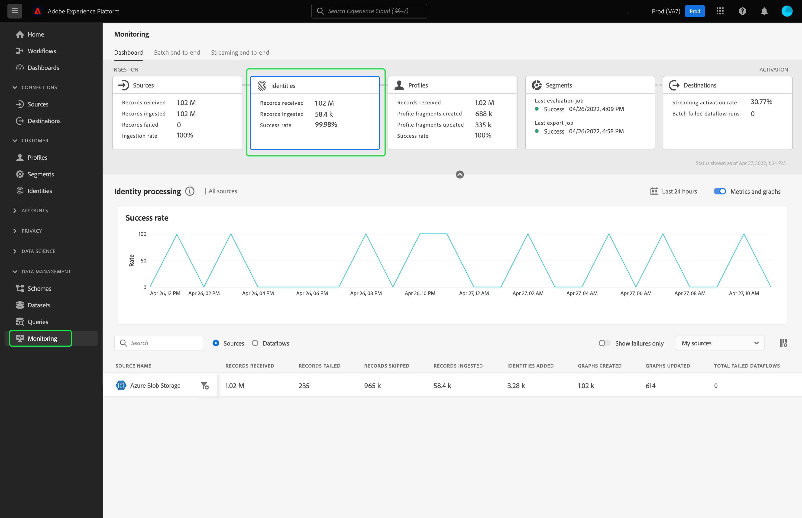

# Övervaka dataflöden för identiteter i användargränssnittet

Adobe Experience Platforms identitetstjänst ger dig en heltäckande bild av dina kunder och deras beteende genom att koppla samman identiteter mellan enheter och system så att du kan leverera effektiva, personliga digitala upplevelser i realtid.

Kontrollpanelen ger dig en visuell representation av dataaktiviteten inom identiteter, inklusive status för dina datas identiteter. I den här självstudiekursen finns anvisningar om hur du kan använda kontrollpanelen för att övervaka dina data med hjälp av Experience Platform användargränssnitt, så att du kan spåra status för identitetsbearbetning.

## Komma igång {#getting-started}

- [Dataflöden](../home.md): Dataflöden är en representation av datajobb som flyttar data mellan Experience Platform. Dataflöden är konfigurerade för olika tjänster, vilket hjälper dig att flytta data från källanslutningar till måldatauppsättningar, till [!DNL Identity] och [!DNL Profile] samt till [!DNL Destinations].
   - [Dataflöden körs](../../sources/notifications.md): Dataflöden är återkommande schemalagda jobb som baseras på frekvenskonfigurationen för valda dataflöden.
- [Identitetstjänst](../../identity-service/home.md): Få en bättre bild av enskilda kunder och deras beteende genom att skapa en bro mellan identiteter på olika enheter och system.
- [Sandlådor](../../sandboxes/home.md): [!DNL Experience Platform] innehåller virtuella sandlådor som partitionerar en enskild [!DNL Experience Platform]-instans till separata virtuella miljöer för att hjälpa till att utveckla och utveckla program för digitala upplevelser.

## Kontrollpanel för identiteter {#identity-metrics}

>[!CONTEXTUALHELP]
>id="platform_monitoring_identity_processing"
>title="Identitetsbearbetning"
>abstract="I vyn Identitetsbearbetning finns information om poster som har importerats till identitetstjänsten, inklusive antalet identiteter som har lagts till, diagram som har skapats och diagram som har uppdaterats. Läs måttdefinitionsguiden om du vill veta mer om mått och diagram."
>text="Learn more in documentation"

>[!CONTEXTUALHELP]
>id="platform_monitoring_dataflow_run_details_identity"
>title="Information om dataflödeskörning"
>abstract="På sidan med information om dataflödeskörning visas mer information om Identity-dataflödets körning, inklusive dess organisations-ID och dataflödes-ID."

Om du vill komma åt kontrollpanelen **[!UICONTROL Identities]** väljer du **[!UICONTROL Monitoring]** i den vänstra navigeringen. Välj **[!UICONTROL Identities]**-kortet på sidan **[!UICONTROL Monitoring]**.

På huvudkontrollpanelen **[!UICONTROL Identities]** visar **[!UICONTROL Identities]**-kortet information om det totala antalet mottagna poster, antalet inmatade poster samt antalet lyckade inspelningar.

Instrumentpanelen i sig innehåller statistik om identitetsbearbetning. Instrumentpanelen visar som standard information om identitetsbearbetning för organisationens källor de senaste 24 timmarna.

Sidan [!UICONTROL Identity processing] innehåller information om poster som har importerats till [!DNL Identity Service], inklusive antal identiteter som har lagts till, diagram som skapats och diagram som uppdaterats.

Följande mått är tillgängliga för den här instrumentpanelsvyn:

| Identitetsmått | Beskrivning |
| ---------------- | ----------- |
| **[!UICONTROL Records received]** | Antalet poster som tagits emot från datasjön. |
| **[!UICONTROL Records failed]** | Antalet poster som inte har importerats till Experience Platform på grund av datafel. |
| **[!UICONTROL Records skipped]** | Antalet poster som har importerats, men inte till [!DNL Identity Service], eftersom det bara fanns en identifierare i postraden. |
| **[!UICONTROL Records ingested]** | Antalet poster som har importerats till [!DNL Identity Service]. |
| **[!UICONTROL Identities added]** | Antalet nya nettoidentifierare som har lagts till i [!DNL Identity Service]. |
| **[!UICONTROL Graphs created]** | Antalet nya identitetsdiagram (netto) som har skapats i [!DNL Identity Service]. |
| **[!UICONTROL Graphs updated]** | Antalet befintliga identitetsdiagram som uppdaterats med nya kanter. |
| **[!UICONTROL Total failed dataflows]** | Antalet misslyckade dataflödeskörningar. |

Du kan välja filterikonen  bredvid källnamnet för att visa information om identitetsbearbetning för den valda källans dataflöden.

Du kan också välja **[!UICONTROL Dataflows]** på växlingsknappen för att visa information om identitetsbearbetning för organisationens dataflöden de senaste 24 timmarna.

Följande mått är tillgängliga för den här instrumentpanelsvyn:

| Mått | Beskrivning |
| -------| ----------- |
| **[!UICONTROL Dataflow]** | Dataflödets namn. |
| **[!UICONTROL Dataset]** | Namnet på datauppsättningen som dataflödet infogas i. |
| **[!UICONTROL Source name]** | Namnet på källan som dataflödet tillhör. |
| **[!UICONTROL Records received]** | Antalet poster som tagits emot från datasjön. |
| **[!UICONTROL Records failed]** | Antalet poster som inte har importerats till Experience Platform på grund av datafel. |
| **[!UICONTROL Records skipped]** | Antalet poster som har importerats, men inte till [!DNL Identity Service], eftersom det bara fanns en identifierare i postraden. |
| **[!UICONTROL Records ingested]** | Antalet poster som har importerats till [!DNL Identity Service]. |
| **[!UICONTROL Total records]** | Totalt antal poster, inklusive poster som misslyckats, poster som hoppats över, identiteter som lagts till och dubblerade poster. |
| **[!UICONTROL Identities added]** | Antalet nya nettoidentifierare som har lagts till i [!DNL Identity Service]. |
| **[!UICONTROL Graphs created]** | Antalet nya identitetsdiagram (netto) som har skapats i [!DNL Identity Service]. |
| **[!UICONTROL Graphs updated]** | Antalet befintliga identitetsdiagram som uppdaterats med nya kanter. |
| **[!UICONTROL Total failed dataflows]** | Antalet misslyckade dataflödeskörningar. |

Välj filterikonen  bredvid starttiden för dataflödeskörningen för att visa mer information om [!DNL Identity]-dataflödeskörningen.

På sidan [!UICONTROL Dataflow run details] visas mer information om [!DNL Identity]-dataflödets körning, inklusive dess organisations-ID och dataflödes-ID. På den här sidan visas även motsvarande felkod och felmeddelande från [!DNL Identity Service] om något fel skulle uppstå i importen.

Följande mått är tillgängliga för den här instrumentpanelsvyn:

| Mått | Beskrivning |
| -------| ----------- |
| **[!UICONTROL Records received]** | Antalet poster som tagits emot från datasjön. |
| **[!UICONTROL Records failed]** | Antalet poster som inte har importerats till Experience Platform på grund av datafel. |
| **[!UICONTROL Records skipped]** | Antalet poster som har importerats, men inte till [!DNL Identity Service], eftersom det bara fanns en identifierare i postraden. |
| **[!UICONTROL Records ingested]** | Antalet poster som har importerats till [!DNL Identity Service]. |
| **[!UICONTROL Identities added]** | Antalet nya nettoidentifierare som har lagts till i [!DNL Identity Service]. |
| **[!UICONTROL Graphs created]** | Antalet nya identitetsdiagram (netto) som har skapats i [!DNL Identity Service]. |
| **[!UICONTROL Graphs updated]** | Antalet befintliga identitetsdiagram som uppdaterats med nya kanter. |
| **[!UICONTROL Status]** | Definierar den övergripande statusen för ett dataflöde. Möjliga statusvärden är: <ul><li>`Success`: Anger att ett dataflöde är aktivt och att data hämtas enligt det schema som det tillhandahölls.</li><li>`Failed`: Anger att aktiveringsprocessen för ett dataflöde har avbrutits på grund av fel. </li><li>`Processing`: Anger att dataflödet ännu inte är aktivt. Denna status inträffar ofta omedelbart efter att ett nytt dataflöde har skapats.</li></ul> |
| **[!UICONTROL Dataflow run start]** | Det datum och den tidpunkt då dataflödet började köras. |
| **[!UICONTROL Last updated]** | Datum och tid då dataflödet senast uppdaterades. |
| **[!UICONTROL Error summary]** | Om dataflödeskörningen misslyckas visas en felkod och en sammanfattning av varför dataflödeskörningen misslyckades. |
| **[!UICONTROL Dataflow run ID]** | ID:t för dataflödeskörningen. |
| **[!UICONTROL IMS org ID]** | Organisations-ID som dataflödeskörningen tillhör. |

Dessutom kan du välja att växla för att visa de poster som misslyckades eller posterna som hoppats över. Felavsnittet innehåller information om felkoden och antalet poster som misslyckades eller uteslutits.
