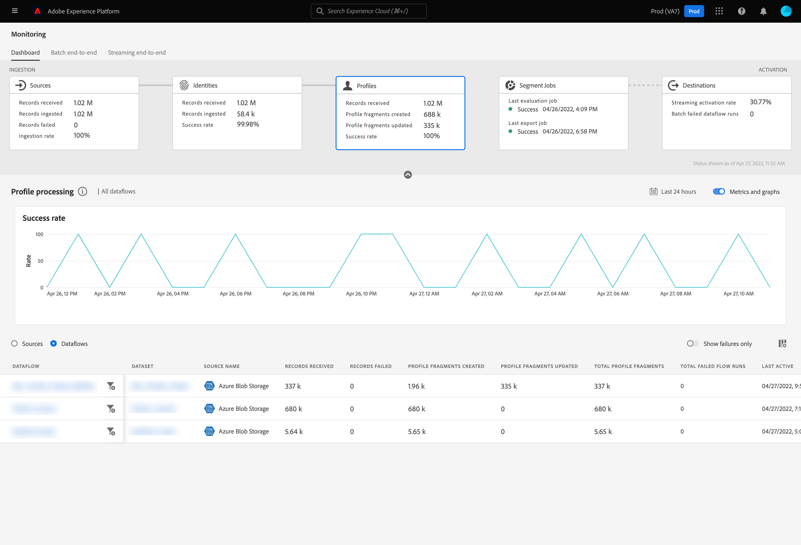
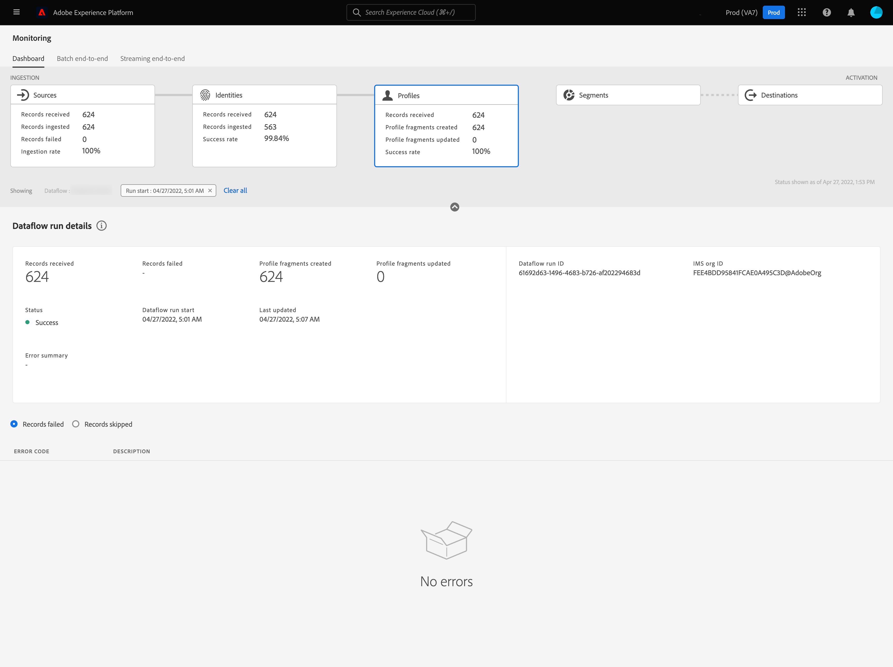

# Övervaka dataflöden för profiler i användargränssnittet

Med kundprofilen i realtid kan ni se en helhetsbild av varje enskild kund genom att kombinera data från flera kanaler, inklusive online, offline, CRM och tredje part. Med hjälp av profilen kan ni sammanställa kunddata i en enhetlig vy som ger ett användbart, tidsstämplat konto för varje kundinteraktion.

Kontrollpanelen ger dig en visuell representation av dataaktiviteten inom profilen, inklusive status för dataprofilerna. I den här självstudiekursen finns anvisningar om hur du kan använda kontrollpanelen för att övervaka dataprofiler med hjälp av Experience Platform användargränssnitt, så att du kan spåra status för profilbearbetning.

## Komma igång {#getting-started}

Handboken kräver en fungerande förståelse av följande komponenter i Adobe Experience Platform:

- [Dataflöden](../home.md): Dataflöden är en representation av datajobb som flyttar data mellan Experience Platform. Dataflöden är konfigurerade för olika tjänster, vilket hjälper dig att flytta data från källanslutningar till måldatauppsättningar, till [!DNL Identity] och [!DNL Profile] samt till [!DNL Destinations].
   - [Dataflöden körs](../../sources/notifications.md): Dataflöden är återkommande schemalagda jobb som baseras på frekvenskonfigurationen för valda dataflöden.
- [Kundprofil i realtid](../../profile/home.md): Tillhandahåller en enhetlig konsumentprofil i realtid baserad på aggregerade data från flera källor.
- [Sandlådor](../../sandboxes/home.md): [!DNL Experience Platform] innehåller virtuella sandlådor som partitionerar en enskild [!DNL Experience Platform]-instans till separata virtuella miljöer för att hjälpa till att utveckla och utveckla program för digitala upplevelser.

## Kontrollpanel för övervakningsprofiler {#profile-metrics}

>[!CONTEXTUALHELP]
>id="platform_monitoring_profile_processing"
>title="Profilbearbetning"
>abstract="Vyn för profilbearbetning innehåller information om poster som har importerats till profiltjänsten, inklusive antalet profilfragment som har skapats, uppdaterade profilfragment och det totala antalet profilfragment."
>text="Learn more in documentation"

>[!CONTEXTUALHELP]
>id="platform_monitoring_dataflow_run_details_profile"
>title="Information om dataflödeskörning"
>abstract="På sidan Information om dataflödeskörning visas mer information om hur profildataflödet körs, inklusive dess organisations-ID och dataflödes-ID."

Om du vill komma åt kontrollpanelen **[!UICONTROL Profiles]** väljer du **[!UICONTROL Monitoring]** i den vänstra navigeringen. Välj **[!UICONTROL Profiles]**-kortet på sidan **[!UICONTROL Monitoring]**.

På huvudkontrollpanelen **[!UICONTROL Profiles]** visar **[!UICONTROL Profiles]**-kortet information om det totala antalet mottagna poster, antalet profilfragment som skapats och uppdaterats samt antalet lyckade försök att skapa och uppdatera profilfragment.

Instrumentpanelen i sig innehåller statistik om profilbearbetning. Som standard visas information om profilbearbetning för organisationens källor under de senaste 24 timmarna på kontrollpanelen.

Sidan [!UICONTROL Profile processing] innehåller information om poster som har importerats till [!DNL Profile], inklusive antalet profilfragment som har skapats, uppdaterade profilfragment och det totala antalet profilfragment.

Följande mått är tillgängliga för den här instrumentpanelsvyn:

| Mått | Beskrivning |
| -------| ----------- |
| **[!UICONTROL Source name]** | Källans namn. |
| **[!UICONTROL Records received]** | Antalet poster som tagits emot från datasjön. |
| **[!UICONTROL Records failed]** | Antalet poster som har importerats, men inte till [!DNL Profile] på grund av fel. |
| **[!UICONTROL Profile fragments created]** | Antalet nya [!DNL Profile]-fragment som lagts till. |
| **[!UICONTROL Profile fragments updated]** | Antalet befintliga [!DNL Profile] fragment har uppdaterats. |
| **[!UICONTROL Total Profile fragments]** | Det totala antalet poster som skrivits till [!DNL Profile], inklusive alla befintliga [!DNL Profile] fragment som uppdaterats och nya [!DNL Profile] fragment som skapats. |
| **[!UICONTROL Total failed dataflows]** | Antalet misslyckade dataflödeskörningar. |

Du kan välja filterikonen  bredvid källnamnet om du vill visa information om profilbearbetning för den valda källans dataflöden.

Du kan också välja **[!UICONTROL Dataflows]** på växlingsknappen för att visa information om profilbearbetning för din organisations dataflöden de senaste 24 timmarna.

Följande mått är tillgängliga för den här instrumentpanelsvyn:

| Mått | Beskrivning |
| -------| ----------- |
| **[!UICONTROL Dataflow]** | Dataflödets namn. |
| **[!UICONTROL Dataset]** | Namnet på datauppsättningen som dataflödet infogas i. |
| **[!UICONTROL Source name]** | Namnet på källan som dataflödet tillhör. |
| **[!UICONTROL Records received**] | Antalet poster som tagits emot från datasjön. |
| **[!UICONTROL Records failed]** | Antalet poster som har importerats, men inte till [!DNL Profile] på grund av fel. |
| **[!UICONTROL Profile fragments created]** | Antalet nya [!DNL Profile]-fragment som lagts till. |
| **[!UICONTROL Profile fragments updated]** | Antalet befintliga [!DNL Profile] fragment har uppdaterats |
| **[!UICONTROL Total Profile fragments]** | Det totala antalet poster som skrivits till [!DNL Profile], inklusive alla befintliga [!DNL Profile] fragment som uppdaterats och nya [!DNL Profile] fragment som skapats. |
| **[!UICONTROL Total failed flow runs]** | Antalet misslyckade dataflödeskörningar. |
| **[!UICONTROL Last active]** | Tidsstämpeln som dataflödet senast kördes för. |

Välj filterikonen  bredvid starttiden för dataflödeskörningen för att visa mer information om [!DNL Profile]-dataflödeskörningen.

På sidan [!UICONTROL Dataflow run details] visas mer information om [!DNL Profile]-dataflödets körning, inklusive dess organisations-ID och dataflödes-ID. På den här sidan visas även motsvarande felkod och felmeddelande från [!DNL Profile] om något fel skulle uppstå i importen.

Följande mått är tillgängliga för den här instrumentpanelsvyn:

| Mått | Beskrivning |
| -------| ----------- |
| **[!UICONTROL Records received]** | Antalet poster som tagits emot från datasjön. |
| **[!UICONTROL Records failed]** | Antalet poster som har importerats, men inte till [!DNL Profile] på grund av fel. |
| **[!UICONTROL Profile fragments created]** | Antalet nya [!DNL Profile]-fragment som lagts till. |
| **[!UICONTROL Profile fragments updated]** | Antalet befintliga [!DNL Profile] fragment har uppdaterats. |
| **[!UICONTROL Status]** | Definierar den övergripande statusen för ett dataflöde. Möjliga statusvärden är: <ul><li>`Success`: Anger att ett dataflöde är aktivt och att data hämtas enligt det schema som det tillhandahölls.</li><li>`Failed`: Anger att aktiveringsprocessen för ett dataflöde har avbrutits på grund av fel. </li><li>`Processing`: Anger att dataflödet ännu inte är aktivt. Denna status inträffar ofta omedelbart efter att ett nytt dataflöde har skapats.</li></ul> |
| **[!UICONTROL Dataflow run start]** | Det datum och den tidpunkt då dataflödet började köras. |
| **[!UICONTROL Last updated]** | Datum och tid då dataflödet senast uppdaterades. |
| **[!UICONTROL Error summary]** | Om dataflödeskörningen misslyckas visas en felkod och en sammanfattning av varför dataflödeskörningen misslyckades. |
| **[!UICONTROL Dataflow run ID]** | ID:t för dataflödeskörningen. |
| **[!UICONTROL IMS org ID]** | Organisations-ID som dataflödeskörningen tillhör. |

Dessutom kan du välja att växla för att visa de poster som misslyckades eller posterna som hoppats över. Felavsnittet innehåller information om felkoden och antalet poster som misslyckades eller uteslutits.
