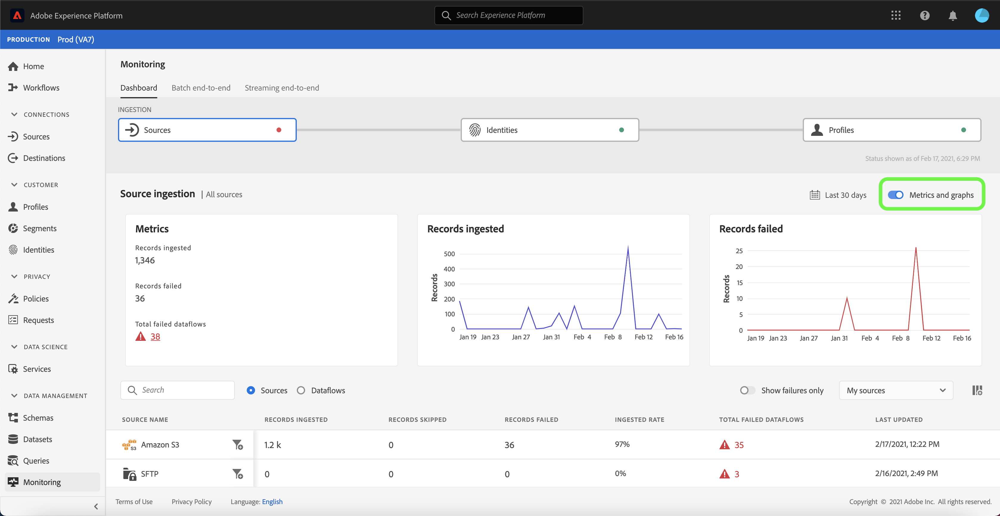
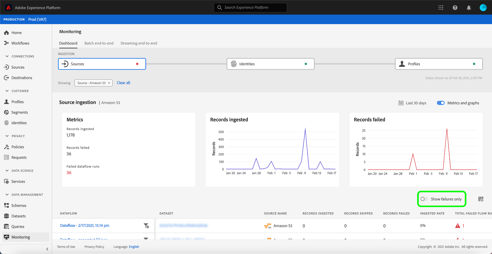
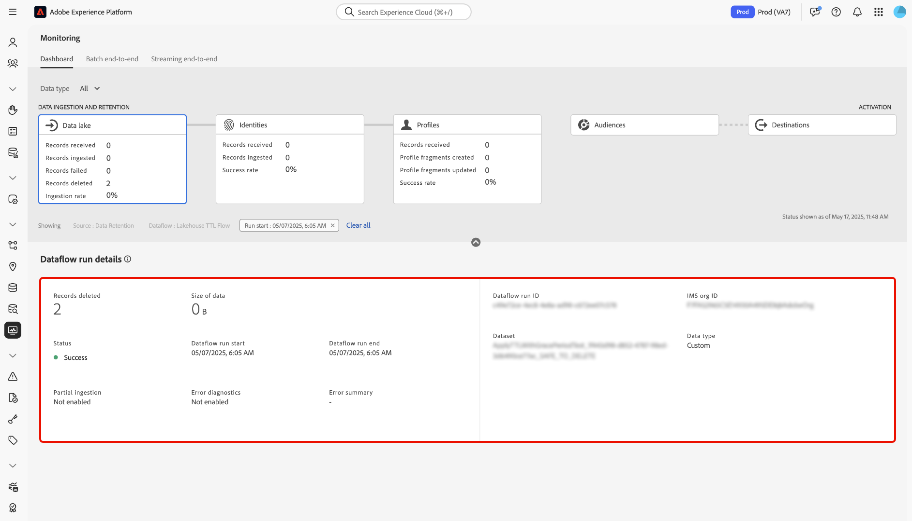
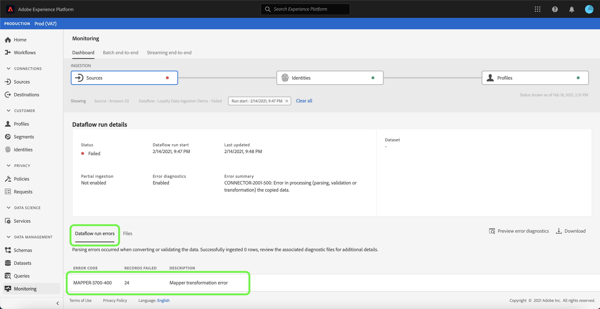

# Övervaka dataflöden för källor i användargränssnittet

I Adobe Experience Platform hämtas data från en mängd olika källor, som analyseras i Experience Platform och aktiveras till en mängd olika destinationer. Plattformen gör processen att spåra detta potentiellt icke-linjära dataflöde enklare genom att tillhandahålla genomskinlighet med dataflöden.

Kontrollpanelen ger dig en visuell representation av resan för ett dataflöde. Du kan använda en aggregerad övervakningsvy och navigera lodrätt från källnivån, till ett dataflöde och till ett dataflöde, så att du kan visa motsvarande mått som bidrar till ett dataflödes framgång eller fel. Du kan också använda kontrollpanelens kapacitet för övervakning över flera tjänster för att övervaka ett dataflödes resa från en källa, till [!DNL Identity Service] och till [!DNL Profile].

I den här självstudiekursen beskrivs hur du övervakar dataflödet med hjälp av både aggregerad övervakningsvy och övervakning mellan tjänster.

## Komma igång

Den här självstudiekursen kräver en fungerande förståelse av följande komponenter i Adobe Experience Platform:

* [Dataflöden](../home.md): Dataflöden är en representation av datajobb som flyttar data mellan plattformar. Dataflöden är konfigurerade för olika tjänster, vilket hjälper dig att flytta data från källanslutningar till måldatauppsättningar, till [!DNL Identity] och [!DNL Profile] och till [!DNL Destinations].
   * [Dataflödet körs](../../sources/notifications.md): Dataflödeskörningar är återkommande schemalagda jobb som baseras på frekvenskonfigurationen för valda dataflöden.
* [Källor](../../sources/home.md): Experience Platform tillåter att data kan hämtas från olika källor samtidigt som du kan strukturera, märka och förbättra inkommande data med hjälp av plattformstjänster.
* [Identitetstjänst](../../identity-service/home.md): Få en bättre bild av enskilda kunder och deras beteende genom att skapa en bro mellan identiteter på olika enheter och system.
* [Kundprofil](../../profile/home.md) i realtid: Ger en enhetlig konsumentprofil i realtid baserad på aggregerade data från flera källor.
* [Sandlådor](../../sandboxes/home.md): Experience Platform tillhandahåller virtuella sandlådor som partitionerar en enda plattformsinstans i separata virtuella miljöer för att utveckla och utveckla program för digitala upplevelser.

## Sammanställd övervakningsvy

I [Plattformsgränssnittet](https://platform.adobe.com) väljer du **[!UICONTROL Monitoring]** i den vänstra navigeringen för att komma åt kontrollpanelen [!UICONTROL Monitoring]. Kontrollpanelen [!UICONTROL Monitoring] innehåller mått och information om alla källdata, dataflöden, inklusive insikter om hur datatrafiken från en källa till [!DNL Identity Service] och till [!DNL Profile] fungerar.

I mitten av kontrollpanelen finns panelen [!UICONTROL Source ingestion], som innehåller mått och diagram som visar data för inmatade poster och poster som misslyckades.

Som standard innehåller de data som visas mängder av konsumtion från de senaste 24 timmarna. Välj **[!UICONTROL Last 24 hours]** om du vill justera tidsramen för de poster som visas.

Ett kalender-popup-fönster visas med alternativ för alternativa tidsramar för inmatning. Välj **[!UICONTROL Last 30 days]** och välj sedan **[!UICONTROL Apply]**

Diagrammen är aktiverade som standard och du kan inaktivera dem för att utöka listan med källor nedan. Markera alternativet **[!UICONTROL Metrics and graphs]** om du vill inaktivera diagrammen.

| Intag av källa | Beskrivning |
| ---------------- | ----------- |
| [!UICONTROL Records ingested ] | Det totala antalet poster som har importerats. |
| [!UICONTROL Records failed] | Det totala antalet poster som inte har importerats på grund av datafel. |
| [!UICONTROL Total failed dataflows] | Det totala antalet dataflöden med statusen `failed`. |

I listan över källinmatningar visas alla källor som innehåller minst ett befintligt konto. Listan innehåller även information om varje källas intag, antalet misslyckade poster och det totala antalet misslyckade dataflöden baserat på den tidsram som du tillämpade.

Om du vill sortera igenom listan med källor väljer du **[!UICONTROL My sources]** och väljer sedan önskad kategori i listrutan. Om du till exempel vill fokusera på molnlagring väljer du **[!UICONTROL Cloud storage]**

Om du vill visa alla befintliga dataflöden för alla källor väljer du **[!UICONTROL Dataflows]**.

Du kan också ange en källa i sökfältet för att isolera en källa. När du har identifierat källan väljer du filterikonen  bredvid den för att visa en lista över de aktiva dataflödena.

En lista över dataflöden visas. Om du vill begränsa listan och fokusera på dataflöden med fel väljer du **[!UICONTROL Show failures only]**.

Leta reda på det dataflöde som du vill övervaka och välj sedan filterikonen  bredvid den för att se mer information om körningsstatus.

På dataflödets körningssida visas information om startdatum, datastorlek, status samt behandlingstid för dataflödet. Markera filterikonen  bredvid starttiden för dataflödet för att visa information om dataflödets körning.

På sidan [!UICONTROL Dataflow run details] visas information om dataflödets metadata, status för partiellt inträde och felsammanfattning. Felsammanfattningen innehåller det specifika felet på den översta nivån som visar i vilket steg som inmatningsprocessen påträffade ett fel.

Bläddra nedåt om du vill se mer specifik information om felet.

Panelen [!UICONTROL Dataflow run errors] visar det specifika fel och den felkod som resulterade i att dataflödet inte kunde matas in. I det här scenariot uppstod ett transformeringsfel för mapparen, vilket resulterade i ett fel på 24 poster.

Välj **[!UICONTROL Files]** om du vill ha mer information.

Panelen [!UICONTROL Files] innehåller information om filens namn och sökväg.

Välj **[!UICONTROL Preview error diagnostics]** om du vill få en mer detaljerad representation av felet.

Fönstret [!UICONTROL Error diagnostics preview] visas med en förhandsgranskning av upp till 100 fel i dataflödet. Du kan välja **[!UICONTROL Download]** för att hämta ett skrivkommando, som sedan låter dig hämta feldiagnostiken.

När du är klar väljer du **[!UICONTROL Close]**

Du kan använda det synliga systemet i det övre huvudet för att navigera tillbaka till kontrollpanelen [!UICONTROL Monitoring]. Välj **[!UICONTROL Run start: 2/14/2021, 9:47 PM]** om du vill återgå till föregående sida och välj sedan **[!UICONTROL Dataflow: Loyalty Data Ingestion Demo - Failed]** om du vill återgå till dataflödessidan.

## Övervakning över flera tjänster

Den övre delen av kontrollpanelen innehåller en representation av inmatningsflödet från källnivån till [!DNL Identity Service] och till [!DNL Profile]. Varje cell innehåller en punktmarkör som anger att det finns fel som inträffade vid det aktuella intaget. En grön punkt innebär ett felfritt intag, medan en röd punkt betyder att ett fel uppstod i just det steget.

Leta reda på ett lyckat dataflöde på dataflödessidan och välj filterikonen  bredvid den för att visa information om dataflödets körning.

Sidan [!UICONTROL Source ingestion] innehåller information som bekräftar att dataflödet har importerats. Härifrån kan du börja övervaka ditt dataflödes resa från källnivå till [!DNL Identity Service] och sedan till [!DNL Profile].

Välj **[!UICONTROL Identities]** om du vill se intag på scenen [!UICONTROL Identities].

### [!DNL Identity] mått

Sidan [!UICONTROL Identity processing] innehåller information om poster som har importerats till [!DNL Identity Service], inklusive antal identiteter som har lagts till, diagram som skapats och diagram som uppdaterats.

Välj filterikonen  bredvid starttiden för dataflödeskörningen för att visa mer information om [!DNL Identity]-dataflödeskörningen.

| Identitetsmått | Beskrivning |
| ---------------- | ----------- |
| [!UICONTROL Records received] | Antalet poster som tagits emot från [!DNL Data Lake]. |
| [!UICONTROL Records failed] | Antalet poster som inte har importerats till plattformen på grund av datafel. |
| [!UICONTROL Records skipped] | Antalet poster som har importerats, men inte i [!DNL Identity Service] eftersom det bara fanns en identifierare i postraden. |
| [!UICONTROL Records ingested] | Antalet poster som har importerats till [!DNL Identity Service]. |
| [!UICONTROL Total records] | Totalt antal poster, inklusive poster som misslyckades, poster som hoppats över, [!DNL Identities] tillagda och dubblerade poster. |
| [!UICONTROL Identities added] | Antalet nya nettoidentifierare som lagts till i [!DNL Identity Service]. |
| [!UICONTROL Graphs created] | Antalet nya nettoidentitetsdiagram som skapats i [!DNL Identity Service]. |
| [!UICONTROL Graphs updated] | Antalet befintliga identitetsdiagram som uppdaterats med nya kanter. |
| [!UICONTROL Failed dataflow runs] | Antalet misslyckade dataflödeskörningar. |
| [!UICONTROL Processing time] | Tidsstämpeln från det att du har fått in det hela till det färdiga. |
| [!UICONTROL Status] | Definierar den övergripande statusen för ett dataflöde. Möjliga statusvärden är: <ul><li>`Success`: Anger att ett dataflöde är aktivt och att data hämtas enligt det schema som det tillhandahölls.</li><li>`Failed`: Anger att aktiveringsprocessen för ett dataflöde har avbrutits på grund av fel. </li><li>`Processing`: Anger att dataflödet ännu inte är aktivt. Denna status inträffar ofta omedelbart efter att ett nytt dataflöde har skapats.</li></ul> |

På sidan [!UICONTROL Dataflow run details] visas mer information om körningen av [!DNL Identity]-dataflödet, inklusive dess IMS Org ID och ID för dataflödeskörning. På den här sidan visas även motsvarande felkod och felmeddelande från [!DNL Identity Service] om något fel skulle uppstå i importen.

Välj **[!UICONTROL Run start: 2/14/2021, 9:47 PM]** om du vill gå tillbaka till föregående sida.

På sidan [!UICONTROL Identity processing] väljer du **[!UICONTROL Profiles]** om du vill visa status för registrering på scenen [!UICONTROL Profiles].

### [!DNL Profile] mått

Sidan [!UICONTROL Profile processing] innehåller information om poster som har importerats till [!DNL Profile], inklusive antalet profilfragment som har skapats, uppdaterade profilfragment och det totala antalet profilfragment.

Välj filterikonen  bredvid starttiden för dataflödeskörningen för att visa mer information om [!DNL Profile]-dataflödeskörningen.

| Profilmått | Beskrivning |
| --------------- | ----------- |
| [!UICONTROL Records received] | Antalet poster som tagits emot från [!DNL Data Lake]. |
| [!UICONTROL Records failed ] | Antalet poster som har importerats, men inte i [!DNL Profile] på grund av fel. |
| [!UICONTROL Profile fragments added] | Antalet nya [!DNL Profile]-fragment som lagts till. |
| [!UICONTROL Profile fragments updated] | Antalet befintliga [!DNL Profile] fragment har uppdaterats |
| [!UICONTROL Total Profile fragments] | Det totala antalet poster som har skrivits till [!DNL Profile], inklusive alla befintliga [!DNL Profile]-fragment som har uppdaterats och nya [!DNL Profile]-fragment som har skapats. |
| [!UICONTROL Failed dataflow runs] | Antalet misslyckade dataflödeskörningar. |
| [!UICONTROL Processing time] | Tidsstämpeln från det att du har fått in det hela till det färdiga. |
| [!UICONTROL Status] | Definierar den övergripande statusen för ett dataflöde. Möjliga statusvärden är: <ul><li>`Success`: Anger att ett dataflöde är aktivt och att data hämtas enligt det schema som det tillhandahölls.</li><li>`Failed`: Anger att aktiveringsprocessen för ett dataflöde har avbrutits på grund av fel. </li><li>`Processing`: Anger att dataflödet ännu inte är aktivt. Denna status inträffar ofta omedelbart efter att ett nytt dataflöde har skapats.</li></ul> |

På sidan [!UICONTROL Dataflow run details] visas mer information om körningen av [!DNL Profile]-dataflödet, inklusive dess IMS Org ID och ID för dataflödeskörning. På den här sidan visas även motsvarande felkod och felmeddelande från [!DNL Profile] om något fel skulle uppstå i importen.

## Nästa steg

Genom att följa den här självstudiekursen har du övervakat inmatningsdataflödet från källnivå till [!DNL Identity Service] och till [!DNL Profile] med kontrollpanelen **[!UICONTROL Monitoring]**. Du har också identifierat fel som bidrog till att dataflödena misslyckades under importen. Mer information finns i följande dokument:

* [Översikt över kundprofiler i realtid](../../profile/home.md)
* [Översikt över arbetsytan Datavetenskap](../../data-science-workspace/home.md)
