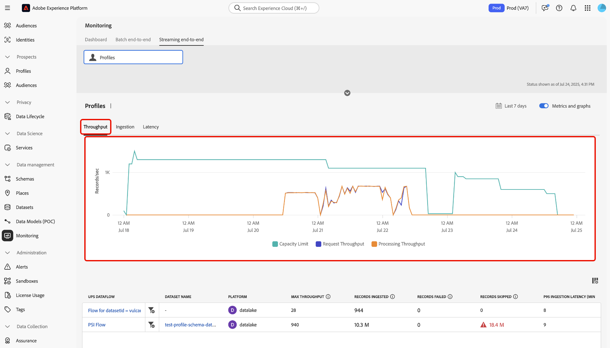
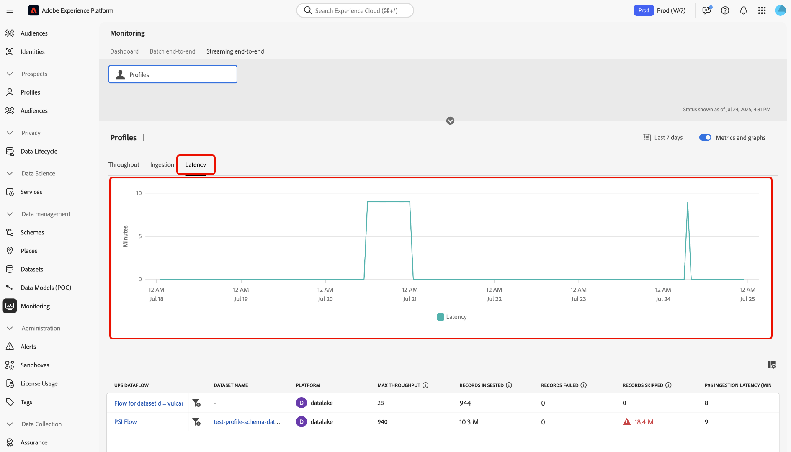

# Inmatning av direktuppspelningsprofil för bildskärm

Du kan använda kontrollpanelen för övervakning i Adobe Experience Platform-användargränssnittet för att utföra övervakning i realtid av inhämtning av direktuppspelningsprofiler inom din organisation. Använd den här funktionen för att få större genomskinlighet i genomströmning, fördröjning och mätvärden för datakvalitet som är relaterade till strömningsdata. Använd dessutom den här funktionen för förebyggande avisering och hämtning av åtgärdbara insikter för att identifiera potentiella kapacitetsöverträdelser och problem med dataintrång.

Läs följande guide om du vill lära dig hur du använder kontrollpanelen för att spåra frekvenser och mätvärden för direktuppspelningsprofilsmatningsjobb i organisationen.

## Kom igång

Handboken kräver en fungerande förståelse av följande komponenter i Experience Platform:

* [Dataflöden](../home.md): Dataflöden representerar datajobb som överför information mellan Experience Platform. De är konfigurerade för olika tjänster för att underlätta flyttning av data från källkopplingar till måldatauppsättningar, samt till identitetstjänst, kundprofil i realtid och destinationer.
* [Kundprofil i realtid](../../profile/home.md): Kundprofilen i realtid kombinerar data från flera källor - online, offline, CRM och tredje part - i en enda användbar vy av varje kund, vilket ger enhetliga och personaliserade upplevelser över alla kontaktytor.
* [Direktuppspelningsuppläsning](../../ingestion/streaming-ingestion/overview.md): Med direktuppspelningsuppläsning för Experience Platform kan användarna skicka data från klient- och serverenheter till Experience Platform i realtid.Med Experience Platform kan ni skapa samordnade, enhetliga och relevanta upplevelser genom att generera en kundprofil i realtid för var och en av era enskilda kunder. &#x200B;Direktuppspelning spelar en viktig roll när det gäller att skapa dessa profiler med så lite fördröjning som möjligt.
* [Kapacitet](../../landing/license-usage-and-guardrails/capacity.md): I Experience Platform kan du få reda på om din organisation har överskridit några av dina skyddsprofiler och du får information om hur du åtgärdar dessa problem.

>[!NOTE]
>
>Strömmande genomströmningskapacitet stöder upp till 1 500 inkommande händelser per sekund. Du kan köpa ytterligare strömningssegmentering för upp till 13 500 inkommande händelser per &#x200B;. Mer information finns i produktbeskrivningarna för [Real-Time CDP B2C Edition - Prime och Ultimate Packages](https://helpx.adobe.com/se/legal/product-descriptions/real-time-customer-data-platform-b2c-edition-prime-and-ultimate-packages.html).

## Övervakningsmått för inmatning av direktuppspelningsprofil {#streaming-profile-metrics}

>[!CONTEXTUALHELP]
>id="platform_monitoring_streaming_profile"
>title="Inmatning av direktuppspelningsprofil för bildskärm"
>abstract="Kontrollpanelen för direktuppspelningsprofiler visar information om genomströmning, ingångsfrekvens och fördröjning. Använd den här instrumentpanelen för att visa, förstå och analysera databearbetningsstatistik. av era strömningsprofiler till Experience Platform."
>text="Learn more in documentation"

>[!CONTEXTUALHELP]
>id="platform_monitoring_streaming_profile_request_throughput"
>title="Begär genomströmning"
>abstract="Detta mått representerar antalet händelser som kommer in i matningssystemet per sekund."
>text="Learn more in documentation"

>[!CONTEXTUALHELP]
>id="platform_monitoring_streaming_profile_processing_throughput"
>title="Bearbetningsflöde"
>abstract="Det här måttet visar antalet händelser som har importerats av systemet varje sekund."
>text="Learn more in documentation"

>[!CONTEXTUALHELP]
>id="platform_monitoring_streaming_profile_p95_ingestion_latency"
>title="P95-fördröjning vid förtäring"
>abstract="Detta mått mäter den 95:e percentilfördröjningen från det ögonblick en händelse anländer till Experience Platform när den kan hämtas till profilbutiken."
>text="Learn more in documentation"

>[!CONTEXTUALHELP]
>id="platform_monitoring_streaming_profile_max_throughput"
>title="Maximal genomströmning"
>abstract="Det här måttet representerar det maximala antalet inkommande begäranden per sekund som matas in i direktuppspelningsprofilen."
>text="Learn more in documentation"

>[!CONTEXTUALHELP]
>id="platform_monitoring_streaming_profile_records_ingested"
>title="Insamlade poster"
>abstract="Det här måttet representerar det totala antalet poster som har importerats till profilarkivet under ett konfigurerat tidsfönster."
>text="Learn more in documentation"

>[!CONTEXTUALHELP]
>id="platform_monitoring_streaming_profile_records_failed"
>title="Misslyckade poster"
>abstract="Det här måttet visar det totala antalet poster som misslyckades med inmatningen i profilarkivet inom ett konfigurerat tidsfönster på grund av fel."
>text="Learn more in documentation"

>[!CONTEXTUALHELP]
>id="platform_monitoring_streaming_profile_records_skipped"
>title="Överhoppade poster"
>abstract="Det här måttet representerar det totala antalet poster som släppts inom ett konfigurerat tidsfönster på grund av konfigurations- eller kapacitetsfel."
>text="Learn more in documentation"

>[!CONTEXTUALHELP]
>id="platform_monitoring_streaming_profile_error_details"
>title="Felinformation"
>abstract="Det här måttet representerar antalet misslyckade händelser på grund av fel."
>text="Learn more in documentation"

Använd mättabellen för information som är specifik för dina dataflöden. Se följande tabell för mer information om varje kolumn.

| Mått | Beskrivning | Dimensioner | Mätfrekvens |
| --- | --- | --- | --- |
| Begär genomströmning | Detta mått representerar antalet händelser som kommer in i matningssystemet per sekund. | Sandbox/Dataflow | Övervakning i realtid med datauppdatering var 60:e sekund. |
| Bearbetningsflöde | Det här måttet visar antalet händelser som har importerats av systemet varje sekund. | Sandbox/Dataflow | Övervakning i realtid med datauppdatering var 60:e sekund. |
| P95-fördröjning vid förtäring | Detta mått mäter den 95:e percentilfördröjningen från det ögonblick en händelse anländer till Experience Platform när den kan hämtas till profilbutiken. | Sandbox/Dataflow | Övervakning i realtid med datauppdatering var 60:e sekund. |
| Maximal genomströmning | Det här måttet representerar maximalt antal inkommande begäranden per sekund som matas in i direktuppspelningsprofilen | <ul><li>Sandbox/Dataflow</li><li>Dataflödeskörning</li></ul> |
| Insamlade poster | Det här måttet representerar det totala antalet poster som har importerats till profilarkivet under ett konfigurerat tidsfönster. | <ul><li>Sandbox/Dataflow</li><li>Dataflödeskörning</li></ul> | <ul><li>Sandbox/Dataflow: Realtidsövervakning med datauppdatering var 60:e sekund.</li><li>Dataflödeskörning: Grupperad på 15 minuter.</li></ul> |
| Misslyckade poster | Det här måttet visar det totala antalet poster som misslyckades med inmatningen i profilarkivet inom ett konfigurerat tidsfönster på grund av fel. | <ul><li>Sandbox/Dataflow</li><li>Dataflödeskörning</li></ul> | <ul><li>Sandbox/Dataflow: Realtidsövervakning med datauppdatering var 60:e sekund.</li><li>Dataflödeskörning: Grupperad på 15 minuter.</li></ul> |
| Överhoppade poster | Det här måttet representerar det totala antalet poster som släppts inom ett konfigurerat tidsfönster på grund av konfigurations- eller kapacitetsfel. | <ul><li>Sandbox/Dataflow</li><li>Dataflödeskörning</li></ul> | <ul><li>Sandbox/Dataflow: Realtidsövervakning med datauppdatering var 60:e sekund.</li><li>Dataflödeskörning: Grupperad på 15 minuter.</li></ul> |
| Felinformation | Det här måttet representerar antalet misslyckade händelser på grund av fel. | Dataflödeskörning | Grupperad i ett timfönster. |

{style="table-layout:auto"}

## Använd kontrollpanelen för övervakning av inmatning av direktuppspelningsprofiler

Om du vill få åtkomst till kontrollpanelen för direktuppspelningsprofilinmatning går du till Experience Platform-gränssnittet, väljer **[!UICONTROL Monitoring]** i den vänstra navigeringen och väljer sedan **[!UICONTROL Streaming end-to-end]**.

Mer information om måttkortet *[!UICONTROL Profile]* finns i panelens övre huvud. Använd den här skärmen för att visa information om inkapslade, misslyckade och hoppade över poster samt information om aktuell status för dataflöde och fördröjning för begäran.

Använd sedan gränssnittet för att visa detaljerad information om mätvärden för direktuppspelningsprofiler. Använd kalenderfunktionen för att växla mellan olika tidsramar. Du kan välja bland följande förkonfigurerade tidsfönster:

* [!UICONTROL Last 6 hours]
* [!UICONTROL Last 12 hours]
* [!UICONTROL Last 24 hours]
* [!UICONTROL Last 7 days]
* [!UICONTROL Last 30 days]

Du kan också konfigurera en egen tidsram manuellt med hjälp av kalendern.

Du kan använda tre olika mätkategorier på kontrollpanelen för inmatning av direktuppspelningsprofiler: [!UICONTROL Throughput], [!UICONTROL Ingestion] och [!UICONTROL Latency].

>[!BEGINTABS]

>[!TAB Genomflöde]

Välj **[!UICONTROL Throughput]** om du vill visa information om mängden data som bearbetas av Experience Platform under en konfigurerad tidsperiod. Se den här mätningen för att utvärdera systemets effektivitet och kapacitet.

* **[Kapacitet](../../landing/license-usage-and-guardrails/capacity.md)**: Den maximala mängden data som din sandlåda kan bearbeta under definierade villkor.
* **Begärangenomströmning**: Den hastighet med vilken händelser tas emot av matningssystemet, mätt i händelser per sekund.
* **Bearbetningsdataflöde**: Den hastighet med vilken systemet importerar och bearbetar inkommande händelsenyttolaster, mätt i händelser per sekund.

>[!TAB Inmatning]

**Inmatning**: Välj **[!UICONTROL Ingestion]** om du vill visa information om Inläggning-jobben i din sandlåda. Insumtionsjobben mäts i tre olika mätvärden.

* **Insamlade poster**: Det totala antalet poster som har skapats under en given tidsperiod. Det här måttet representerar lyckade datainmatningsprocesser i din sandlåda.
* **Poster hoppades över**: Det totala antalet poster som inte har importerats på grund av fel.
* **Poster hoppades över**: Det totala antalet poster som ignorerades på grund av överträdelse av kapacitetsbegränsningar.

>[!TAB Svarstid]

Välj **[!UICONTROL Latency]** om du vill visa information om hur lång tid det tar för Experience Platform att svara på en begäran eller slutföra en åtgärd inom en viss tidsperiod.

>[!ENDTABS]

### Använda dataflödets metrisk tabell

I dataflödestabellen listas alla aktiviteter för direktuppspelning med deras motsvarande uppsättning mätvärden för kundprofil i realtid. Varje dataflöde visas med motsvarande datauppsättning.

Om du närmar dig gränserna för din kapacitet på sandlådenivå kan du referera till kolumnen [!UICONTROL Max throughput] för att identifiera befintliga dataflöden som bidrar till dina förbrukningsfrekvenser. Läs avsnittet [best practices](#best-practices) om du vill ha mer information om bästa praxis för dataflödeshantering.

Om du vill övervaka data som importeras i ett specifikt dataflöde väljer du filterikonen  bredvid dataflödets namn.

Använd sedan gränssnittet för dataflödesmått för att välja den specifika flödeskörning som du vill inspektera. Välj filterikonen  bredvid en flödeskörningstips om du vill visa mätvärden som är specifika för den valda flödeskörningen.

Körningar av dataflöde representerar en instans av körning av dataflöde. Om ett dataflöde till exempel är schemalagt att köras varje timme kl. 9:00, 10:00 AM och 11:00 AM, har du tre instanser av en flödeskörning. Flödeskörningar är specifika för just din organisation.

Använd informationssidan för dataflödeskörning för att visa mått och information om den valda körningen.

## Bästa praxis för dataflödeshantering {#best-practices}

I följande avsnitt finns information om hur du bäst hanterar dataflöden och optimerar dataanvändningen på Experience Platform.

### Utvärdera och optimera dataflöden för direktuppspelning

För att säkerställa effektiv direktuppspelning ska du granska och justera dataflödena och bearbetningsstrategin:

* **Utvärdera aktuell användning**: Identifiera vilka dataflöden och datauppsättningar som bidrar mest till dataflödet.
* **Prioritera värdefulla data**: Alla data kanske inte behövs. Uteslut data som inte stöder dina användningsfall för att minska lagringsutrymmet och förbättra effektiviteten.
* **Optimera behandlingsläge**: Kontrollera om vissa data kan flyttas från direktuppspelning till batchinmatning. Reservera strömning för användningsfall som kräver låg latens, till exempel segmentering i realtid.

### Plan för kapacitet och säsongstrafik

Om din nuvarande gräns på **1 500 händelser per sekund** är otillräcklig bör du optimera din datastrategi eller öka din licenskapacitet:

* **Analysera datauppsättnings- och sandlådeanvändning**: Granska både aktuella och historiska data för att förstå hur trafik- och interaktionsströmmande segmenteringsgenomströmning sker.
* **Konto för säsongsvariation**: Identifiera trafiktoppar som styrs av återkommande marknadsföringskampanjer eller branschspecifika cykler.
* **Prognostisera framtida efterfrågan**: Uppskatta kommande trafik- och engagemangsvolymer baserat på tidigare säsongstrender, planerade kampanjer eller större händelser.

| Medverkande faktor | Vad det är | Inverkan på användningsfall | Bästa praxis |
| --- | --- | --- | --- |
| Konvertering från batch till direktuppspelning | Batcharbetsbelastningar som konverteras till strömning kan öka genomströmningen avsevärt, vilket påverkar prestanda och resursallokering. Du kan till exempel utföra en gruppprofilsuppdatering efter en händelse utan hastighetsbegränsningar. | Direktuppspelningsstrategier är inte nödvändiga för gruppanvändning när bearbetning med låg fördröjning inte krävs. | Utvärdera kraven för användningsfall. För utgående batchmarknadsföring bör du överväga att använda [batchingång](../../ingestion/batch-ingestion/overview.md) i stället för direktuppspelning för att hantera datainmatningen mer effektivt. |
| Onödig datainmatning | Inmatning av data som inte behövs för personalisering ökar genomströmningen utan att något mervärde läggs till, vilket slösar med resurser. Om du till exempel samlar in all analystrafik i profiler, oavsett relevans. | För mycket data som inte är relevanta skapar brus, vilket gör det svårare att identifiera viktiga datapunkter. Det kan också orsaka friktion när man definierar och hanterar målgrupper och profiler. | Importera endast data som behövs för dina användningsfall. Se till att du filtrerar bort onödiga data.<ul><li>**Adobe Analytics**: Använd [radnivåfiltrering](../../sources/tutorials/ui/create/adobe-applications/analytics.md#filtering-for-real-time-customer-profile) för att optimera dataanvändningen.</li><li>**Källor**: Använd [[!DNL Flow Service] API:t för att filtrera radnivådata](../../sources/tutorials/api/filter.md) för källor som stöds, som [!DNL Snowflake] och [!DNL Google BigQuery].</li></li>**Edge datastream**: Konfigurera [dynamiska datastreams](../../datastreams/configure-dynamic-datastream.md) för filtrering på radnivå av trafik som kommer in från WebSDK.</li></ul> |

{style="table-layout:auto"}

### Vanliga frågor och svar {#faq}

I det här avsnittet finns svar på vanliga frågor om övervakning av inmatning av strömningsprofiler.

#### Varför ser mina mätvärden olika ut på kontrollpanelerna Kapacitet och Övervakning för att få genomströmning av förfrågningar?

+++Svar

Kontrollpanelen [!UICONTROL Monitoring] visar realtidsvärden för inmatning och bearbetning. Dessa siffror är exakta mätvärden som registreras vid aktivitetstidpunkten. Omvänt använder kontrollpanelen [!UICONTROL Capacity] en utjämningsmekanism för beräkning av genomströmningskapacitet. Denna mekanism hjälper till att minska antalet korta toppar från att omedelbart räknas som överträdelser och säkerställer att kapacitetsvarningar fokuserar på kontinuerliga trender snarare än tillfälliga sprängningar.

På grund av utjämningsmekanismen kan du lägga märke till:

* Små toppar i [!UICONTROL Monitoring] som inte visas i [!UICONTROL Capacity].
* Något lägre värden i [!UICONTROL Capacity] jämfört med [!UICONTROL Monitoring] vid samma tidsstämpel.

De två kontrollpanelerna är korrekta, men har utformats för olika syften.

* [!UICONTROL Monitoring]: Detaljerad, omedelbar synlighet.
* [!UICONTROL Capacity]: Strategisk vy för att identifiera mönster för användning och överträdelser.

+++

## Nästa steg {#next-steps}

Genom att följa den här självstudiekursen lärde du dig att övervaka inmatningsjobb för direktuppspelningsprofiler i din organisation. I följande dokument finns mer information om hur du övervakar data för kundprofil i realtid.

* [Använd kontrollpanelen](./monitor.md).
* [Övervaka profildata](./monitor-profiles.md).
