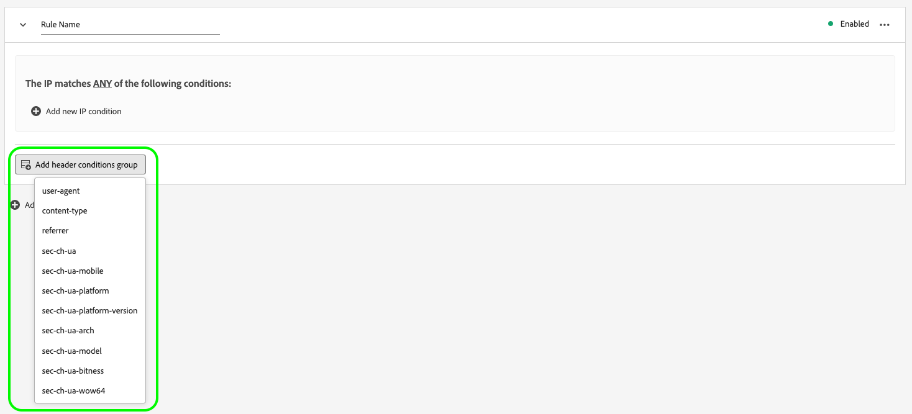
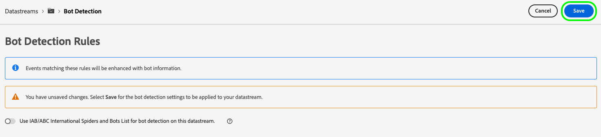
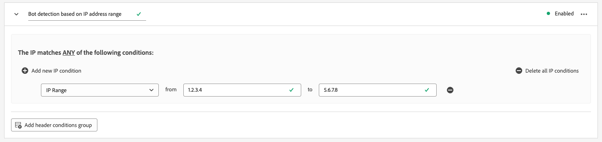
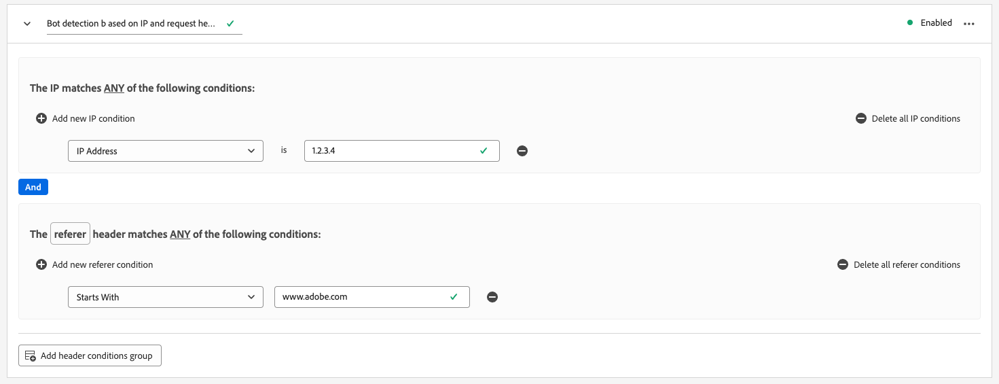

# Konfigurera objektidentifiering för datastreams

Trafik som härrör från icke-mänskliga enheter, som automatiserade program, webbskrapor, spindlar, skriptskannrar, kan göra det svårare att identifiera händelser som inträffar från mänskliga besökare. Den här typen av trafik kan påverka viktiga affärsvärden negativt, vilket leder till felaktig trafikrapportering.

Med punktidentifiering kan du identifiera händelser som genereras av [Web SDK](../web-sdk/home.md), [Mobile SDK](https://developer.adobe.com/client-sdks/home/) och [[!DNL Server API]](../server-api/overview.md) som om de genererats av kända spindlar och botar.

Genom att konfigurera robotidentifiering för dina datastreams kan du identifiera specifika IP-adresser, IP-intervall och begäranrubriker som du vill klassificera som båda händelser.

Identifiering av robottrafiken kan ge en mer exakt mätning av användaraktiviteten på er webbplats eller i mobilapplikationen.

När en begäran till Edge Network överensstämmer med någon av robotidentifieringsreglerna uppdateras XDM-schemat med en bockpoäng (alltid inställt på 1), vilket visas nedan.

```json
{
  "botDetection": {
    "score": 1
  }
}
```

Denna robotbedömning hjälper de lösningar som tar emot begäran att identifiera robottrafiken korrekt.

>[!IMPORTANT]
>
>Punktavkänning tar inte bort några robotförfrågningar. Det uppdaterar bara XDM-schemat med robotpoängen och vidarebefordrar händelsen till [datastream-tjänst](configure.md) som du har konfigurerat.
>
>Adobe lösningar kan hantera båda poängen på olika sätt. Adobe Analytics använder till exempel sin egen [filtreringstjänst för robotar](https://experienceleague.adobe.com/docs/analytics/admin/admin-tools/manage-report-suites/edit-report-suite/report-suite-general/bot-removal/bot-rules.html) och använder inte bakgrundsmusiken som angetts av Edge Network. De två tjänsterna använder samma [IAB-robotlista](https://www.iab.com/guidelines/iab-abc-international-spiders-bots-list/), så robotpoängen är identiska.

Det kan ta upp till 15 minuter att sprida regler för punktidentifiering över hela Edge Network efter att de har skapats.

## Förutsättningar {#prerequisites}

För att robotidentifiering ska fungera på din datastream måste du lägga till **[!UICONTROL Bot Detection Information]** fältgrupp till ditt schema. Se [XDM-schema](../xdm/ui/resources/schemas.md#add-field-groups) dokumentation som visar hur du lägger till fältgrupper i ett schema.

## Konfigurera objektidentifiering för datastreams {#configure}

Du kan konfigurera robotidentifiering när du har skapat en datastream-konfiguration. Läs dokumentationen om hur du [skapa och konfigurera ett datastream](configure.md)följer du instruktionerna nedan för att lägga till båda identifieringsfunktioner i ditt datastream.

Gå till datastreams-listan och välj den datastream som du vill lägga till robotidentifiering till.


På informationssidan för datastream väljer du **[!UICONTROL Bot Detection]** till höger.


The **[!UICONTROL Bot Detection Rules]** visas.


På sidan Regler för punktidentifiering kan du konfigurera robotidentifiering med följande funktioner:

* Använda [!DNL [IAB/ABC International Spiders and Bots List]](https://www.iab.com/guidelines/iab-abc-international-spiders-bots-list/).
* Skapa egna identifieringsregler för robotar.

### Använd listan IAB/ABC International Spiders and Bots {#iab-list}

The [IAB/ABC International Spiders and Bots List](https://www.iab.com/guidelines/iab-abc-international-spiders-bots-list/) är en tredjepartslista som är branschstandard och som hjälper dig att identifiera automatiserad trafik, som sökmotorer, övervakningsverktyg och annan icke-mänsklig trafik som du kanske inte vill visa i dina analysräkningar.

Så här konfigurerar du din datastream att använda [!DNL IAB/ABC International Spiders and Bots List], växlar **[!UICONTROL Use IAB/ABC International Spiders and Bots List for bot detection on this datastream]** väljer du sedan Spara för att använda inställningarna för identifiering av robotar på ditt datastam.


### Skapa identifieringsregler för robotar {#rules}

Förutom att använda [IAB/ABC International Spiders and Bots List](https://www.iab.com/guidelines/iab-abc-international-spiders-bots-list/)kan du definiera egna identifieringsregler för robotar för varje datastream.

Du kan skapa regler för robotidentifiering baserat på **IP-adresser** och **IP-adressintervall**.

Om du behöver mer detaljerade regler för robotidentifiering kan du kombinera IP-villkoren med villkoren för begärandehuvudet. Regler för punktidentifiering kan använda följande rubriker:

| HTTP-huvud | Beskrivning |
| --- | --- |
| `user-agent` | Ett huvud som gör att servrar och nätverkspartners kan identifiera programmet, operativsystemet, leverantören och/eller versionen för den begärande användaragenten. |
| `content-type` | Anger den ursprungliga medietypen för resursen (innan någon innehållskodning används för sändning). |
| `referer` | Identifierar adressen till webbsidan som resursen har begärts från. |
| `sec-ch-ua` | Tillhandahåller varumärket och en viktig version för varje varumärke som är kopplat till webbläsaren i en kommaseparerad lista. |
| `sec-ch-ua-mobile` | Anger om webbläsaren finns på en mobil enhet. Den kan också användas av en webbläsare på datorn för att ange en inställning för en mobilanvändarupplevelse. |
| `sec-ch-ua-platform` | Anger den plattform eller det operativsystem som användaragenten körs på. Exempel: &quot;Windows&quot; eller &quot;Android&quot;. |
| `sec-ch-ua-platform-version` | Anger den version av operativsystemet som användaragenten körs på. |
| `sec-ch-ua-arch` | Tillhandahåller användaragentens underliggande processorarkitektur, som ARM eller x86. |
| `sec-ch-ua-model` | Anger den enhetsmodell som webbläsaren körs på. |
| `sec-ch-ua-bitness` | Anger &quot;bitness&quot; för användaragentens underliggande processorarkitektur. Detta är storleken i bitar av ett heltal eller en minnesadress, vanligtvis 64 eller 32 bitar. |
| `sec-ch-ua-wow64` | Anger om en användaragentbinärfil körs i 32-bitarsläge i 64-bitars Windows. |

Följ stegen nedan för att skapa en regel för identifiering av robotar:

1. Välj **[!UICONTROL Add New Rule]**.

   

2. Ange ett namn för regeln i **[!UICONTROL Rule Name]** fält.

   

3. Välj **[!UICONTROL Add new IP condition]** om du vill lägga till en ny IP-baserad regel. Du kan definiera regeln efter IP-adress eller efter IP-adressintervall.

   

   

   >[!TIP]
   >
   >IP-villkoren baseras på en logisk `OR` operation. En begäran markeras som om den kommer från en robot om den matchar något av de IP-villkor som du har definierat.

4. Om du vill lägga till rubrikvillkor i regeln väljer du **[!UICONTROL Add header conditions group]** och markera sedan de rubriker som du vill att regeln ska använda.

   

   Lägg sedan till de villkor som ska användas för den valda rubriken.

   

5. När du har konfigurerat önskade regler för robotidentifiering väljer du **[!UICONTROL Save]** om du vill att reglerna ska tillämpas på din datastream.

   


## Exempel på regler för punktavkänning {#examples}

För att hjälpa dig komma igång med robotidentifiering kan du använda de exempel som beskrivs nedan för att skapa robotidentifieringsregler.

### Punktidentifiering baserad på en IP-adress {#one-ip}

Om du vill markera alla begäranden som kommer från en viss IP-adress som robottrafik skapar du en ny regel som utvärderar en enskild IP-adress, vilket visas i bilden nedan.


### Punktidentifiering baserad på två IP-adresser {#two-ip}

Om du vill markera alla begäranden som kommer från någon av de två specifika IP-adresserna som Båda-trafik skapar du en ny regel för robotidentifiering som utvärderar två IP-adresser, vilket visas i bilden nedan.


### Punktidentifiering baserad på ett intervall med IP-adresser {#range}

Om du vill markera alla begäranden som kommer från en viss IP-adress i ett visst intervall som robottrafik, skapar du en ny regel för identifiering av robotar som utvärderar ett helt IP-adressintervall, vilket visas i bilden nedan.



### Punktavkänning baserad på en IP-adress och ett begärandehuvud {#ip-header}

Om du vill markera alla begäranden som kommer från en viss IP-adress och som innehåller en viss begäranderubrik som båda trafik, skapar du en ny regel för identifiering av robotar enligt bilden nedan.

Den här regeln kontrollerar om begäran kommer från en viss IP-adress och om `referer` begäranhuvudet börjar med `www.adobe.com`.



### Punktavkänning baserad på flera villkor {#multiple-conditions}

Du kan skapa regler för identifiering av robotar baserat på:

* **Flera olika villkor**: Olika villkor utvärderas som logiska `AND` operation, vilket innebär att villkoren måste vara uppfyllda samtidigt för att begäran ska kunna identifieras som om den kommer från en robot.
* **Flera villkor av samma typ**: Villkor av samma typ utvärderas som logiska `OR` operation, vilket innebär att om något av villkoren är uppfyllt identifieras begäran som om den kommer från en robot.

Regeln som visas i bilden nedan identifierar en robotursprungsbegäran om följande villkor uppfylls:

Begäran kommer från någon av de två IP-adresserna, `referer` sidhuvud börjar med `www.adobe.com`och `sec-ch-ua-mobile` identifierar att begäran kommer från en webbläsare på datorn.


